# 使用詹金斯 CICD 在 Docker 中部署 Springboot 应用程序

> 原文：<https://medium.com/javarevisited/deploying-a-springboot-application-in-docker-using-jenkins-cicd-2489bfe752c3?source=collection_archive---------1----------------------->

一个自由式项目被用来生成 war 文件/使用运行在 EC2 服务器上的 docker 实例进行构建和部署。使用 Git 在中央存储库中维护代码，构建分三个阶段生成:

1.  部署应用程序的 war 文件是使用以 maven 为目标的清理和安装目标创建的。
2.  运行一个 CMD 脚本，该脚本将收集生成的 war 文件，然后将其推送到包含 [Docker](/javarevisited/why-and-how-to-learn-docker-and-kubernetes-1dcbe8679792) 安装的远程服务器，该服务器也将用于托管项目。
3.  使用 ssh 在远程服务器上执行一个 shell 脚本来创建 Docker 映像，部署它并将副本推送到 docker hub。

这个过程将在最后详细解释。

[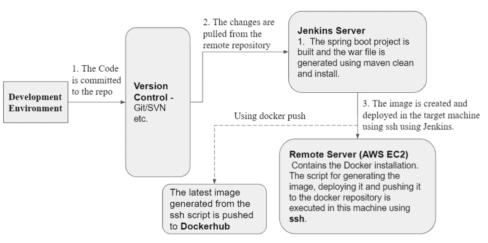](https://javarevisited.blogspot.com/2019/05/top-5-courses-to-learn-docker-and-kubernetes-for-devops.html)

**CICD 管道**

# 先决条件:

1.  一个单独的[詹金斯](/javarevisited/7-best-courses-to-learn-jenkins-and-ci-cd-for-devops-engineers-and-software-developers-df2de8fe38f3)服务器或詹金斯的本地安装。
2.  安装了 docker 且必须支持 ssh 连接的远程服务器。本例中使用了 Amazon Linux 的一个 [AWS EC2](/javarevisited/7-best-aws-ec2-amazon-elastic-compute-cloud-online-courses-for-beginners-in-2021-f7a1a55ea719?source=rss-bb36d8439904------2) 实例。
3.  Git Hub 帐户或任何其他版本控制工具来维护代码。

# 必需的设置:

## 设置 EC2 实例

1.在 AWS 控制台的 EC2 服务选项下，单击*启动实例*按钮。它将加载选项来创建一个新实例。选择所需的实例类型以及所需的存储和安全组。将有选项来选择不同类型的实例。本例中使用了具有 **t2.micro** 实例类型和 **8 GB** 根存储的 **Amazon Linux 2 AMI** 。

还修改了安全组，以提供对特定端口的访问。所需端口:

*   8080(这将由 docker 中运行的应用程序使用)
*   22(建立 **ssh** 连接)
*   8081(这可用于测试目的——可以使用此端口启动和测试 war 文件)

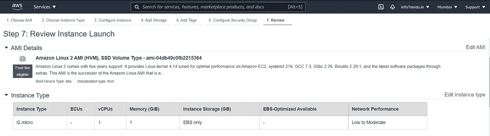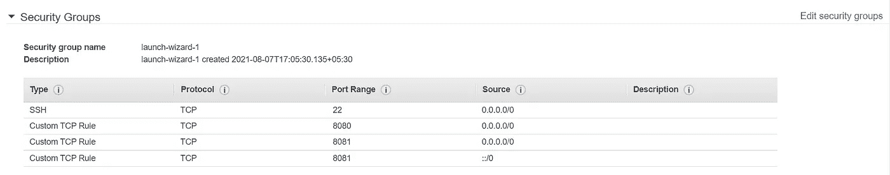

在创建实例时，我们将获得一个密钥对，可以用来连接到 [EC2 实例](https://javarevisited.blogspot.com/2020/08/top-5-courses-to-learn-amazon-aws-ec-2.html)。

2.**连接到实例:**我们可以使用 ssh 连接到实例，或者使用 **EC2 实例连接**。

[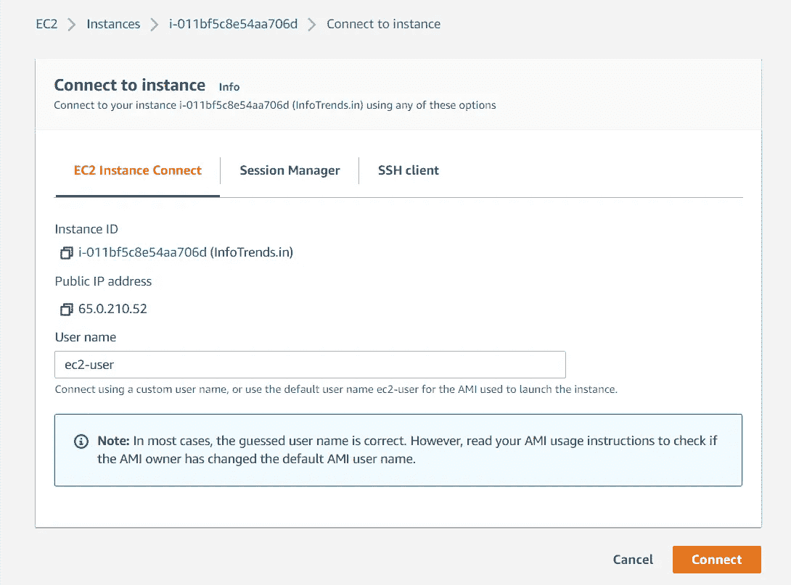](https://javarevisited.blogspot.com/2020/08/top-5-courses-to-learn-amazon-aws-ec-2.html)

远程服务器中为此项目维护的文件夹结构是:

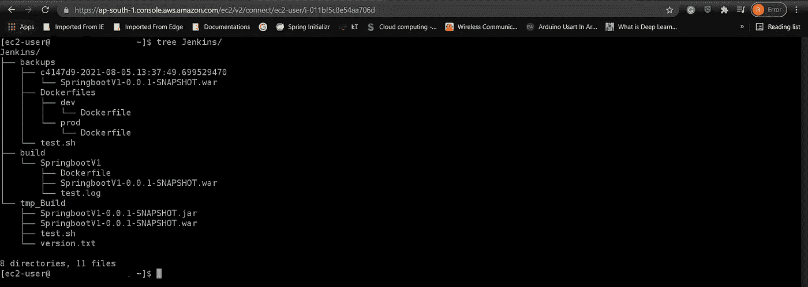

1.  **Jenkins/tmp _ Build:**war 文件在生成后最初会被移动到这个文件夹中。
2.  **Jenkins/build/spring boot v1:**这是 docker 图像将生成的位置。
3.  **Jenkins/backups:** 这将包含 war 文件，作为文件夹内的备份，以格式{ commit-id }-c {提交 id 的构建计数}-{备份日期&时间}命名

## 设置 Docker:

通过依次执行以下命令，可以将 [docker](/javarevisited/5-best-docker-courses-for-java-and-spring-boot-developers-bbf01c5e6542) 安装到 Amazon Linux 2 中。

*   使用 **sudo yum update -y** 更新软件包
*   Docker 可以用这个命令安装: **sudo amazon-linux-extras 安装 docker**
*   启动 docker 实例: **sudo 服务 docker 启动**
*   安装 docker 后， **ec2 用户**将无法使用 sudo 执行 docker 命令。必须执行以下命令，以提供对 ec2-user 的访问，从而运行 **docker** 命令:**sudo usermod-a-G docker ec2-user**
*   注销并使用 **ssh** 重新连接到实例，以使更改生效。尝试在获取*权限被拒绝*错误信息时重启系统。
*   您可以通过执行 **docker info** 来检查 [docker](/javarevisited/10-free-courses-to-learn-docker-and-devops-for-frontend-developers-691ac7652cee) 是否在系统中运行

[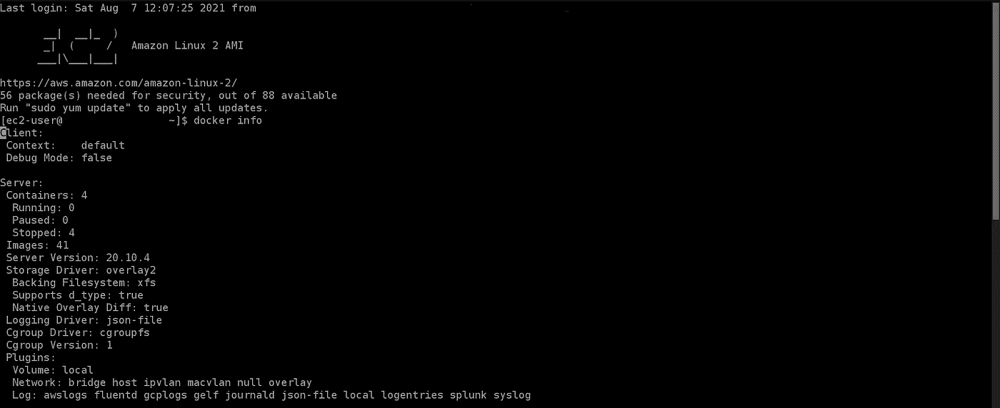](https://www.java67.com/2018/02/5-free-docker-courses-for-java-and-DevOps-engineers.html)

## Jenkins 安装和设置:

1.**安装詹金斯:**詹金斯战争文件可以从官方网站[https://www.jenkins.io/download/](https://www.jenkins.io/download/)下载。在使用单独的 Jenkins 服务器的情况下，可以使用 Tomcat 部署 war 文件。对于本地部署，可以使用命令启动它: **java -jar jenkins.war**

Jenkins 将在端口 8080 启动，并使用 URL[**http://localhost:8080/**](http://localhost:8080/)进行访问。它将提示您使用创建一个新的管理员凭据，然后安装建议的插件。

[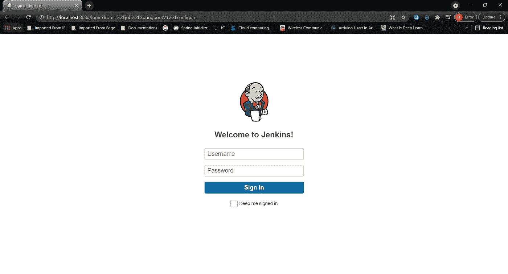](https://javarevisited.blogspot.com/2018/09/top-5-jenkins-courses-for-java-and-DevOps-Programmers.html)

2.**安装 ssh 插件并设置远程服务器的凭证:**安装 ssh 插件的路径:**仪表板> >管理 Jenkins > >管理插件> > SSH (** 在搜索栏中查找可用插件 **)**

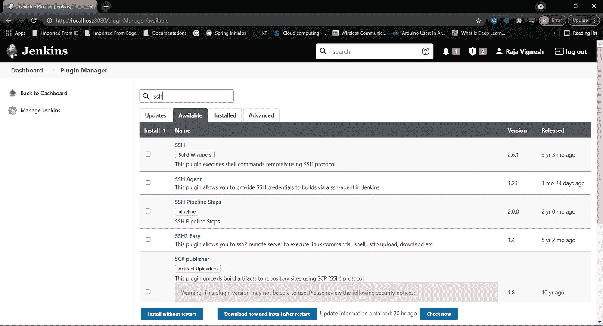

安装**通过 SSH 发布**(【https://plugins.jenkins.io/publish-over-ssh/】T2)。这可用于在远程服务器上执行脚本。

然后，可以在路径**仪表板> >管理詹金斯> >配置系统> >通过 SSH 发布**配置访问服务器的密钥

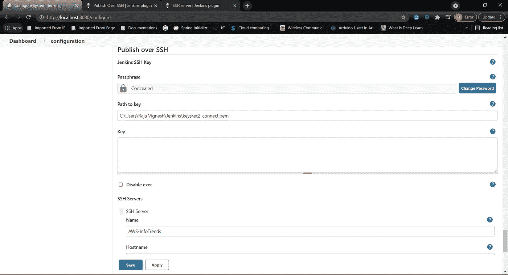

添加密码、密钥/密钥路径、主机名、用户名和远程目录。

## 集中式 Github Repo

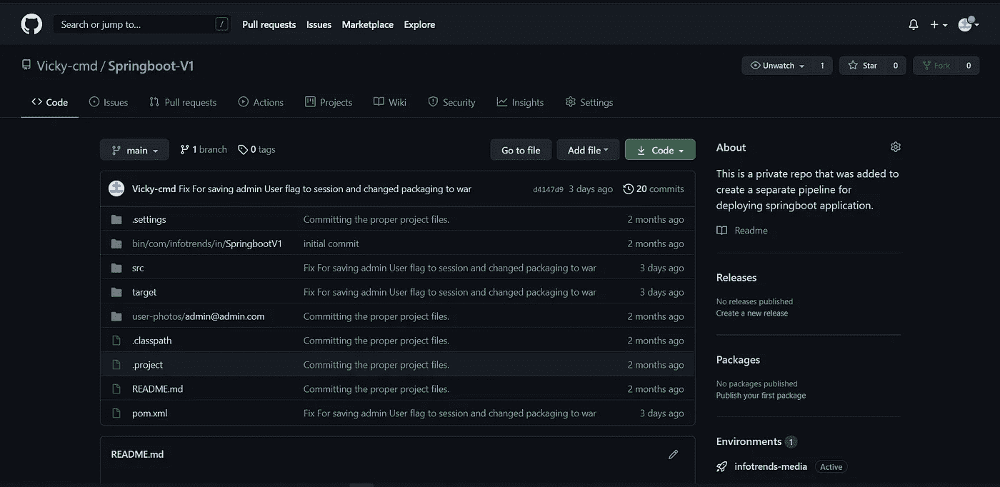

这里使用的项目存储在 GitHub repo @[https://github.com/Vicky-cmd/Springboot-V1](https://github.com/Vicky-cmd/Springboot-V1)中。

# 詹金斯·CICD 工作

1.  创建新的 Jenkins 自由式项目

**名称** : [跳靴 V1](http://localhost:8080/job/SpringbootV1/)

**项目类型**:自由式项目

在项目配置中，给出的 Git URL 以及身份验证，如果在源代码管理选项下的话。

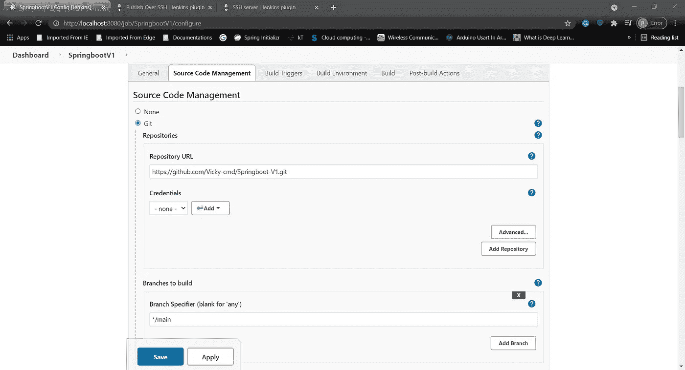

现在，构建过程分为三个阶段，配置在*构建*部分。它们是:

1.  首先，选择**调用顶级 Maven 目标**选项。将和 ***安装*** 目标作为输入给出。


这将从存储库中清除克隆的项目，然后创建 war 文件。执行的命令: [**mvn 清理**](https://javarevisited.blogspot.com/2017/06/10-maven-tips-java-developer-should-know.html)**&&**[**mvn 安装**](https://javarevisited.blogspot.com/2016/10/difference-between-mvn-install-release-and-deploy-in-Maven.html)

2.接下来，选择**执行窗口批处理命令**选项。这用于执行批处理文件，该文件将:

*   获取当前提交 id 并将其存储在 **version.txt** 中。
*   将构建(war)文件复制到一个公共文件夹中。
*   然后使用 **scp** 命令将 war 文件和 version.txt 文件移动到远程服务器。

使用的批处理文件是:

3 接下来，选择**通过 ssh 发送文件或执行命令**选项，通过 SSH 在远程服务器上执行脚本。

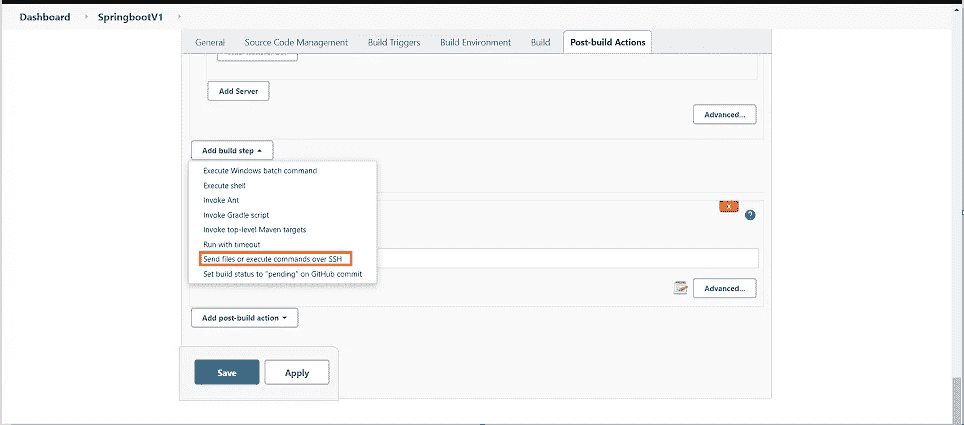

该脚本用于:

*   使用 version.txt 和当前日期时间中的提交 id 创建一个备份文件夹，并将 war 文件的副本移动到该文件夹中。
*   将 war 文件从临时位置复制到带有 Dockerfile 文件的构建位置
*   执行 **Docker Build** 命令，为项目创建一个名为 **infotrends** 的新图像。
*   使用 **docker 容器 stop** 和 **docker 容器 rm** 命令停止并删除当前运行的项目实例。
*   该映像被部署到一个同名的新 docker 容器中。

用于创建 docker 映像的 docker 文件是:

```
FROM adoptopenjdk/openjdk11:jre-11.0.6_10-alpine EXPOSE 8080:8081 
RUN addgroup -S spring && adduser -S spring -G spring 
USER spring:spring COPY SpringbootV1-0.0.1-SNAPSHOT.war SpringbootV1-0.0.1-SNAPSHOT.war ENTRYPOINT ["java","-jar","/SpringbootV1-0.0.1-SNAPSHOT.war"]
```

**docker ps** 命令可用于检查应用程序状态。

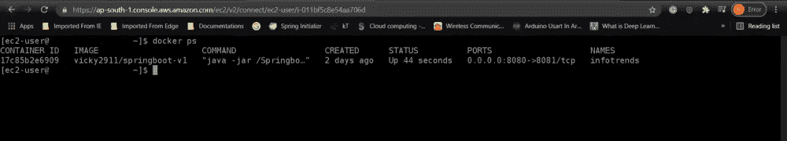

Docker 端口 8081 映射到服务器的 8080 端口。因此，我们将能够使用这个端口为请求提供服务——我们已经在 EC2 的安全规则的入站规则中打开了这个端口。

服务器现在将把来自这个端口的请求转发给 docker 实例内部运行的应用程序。

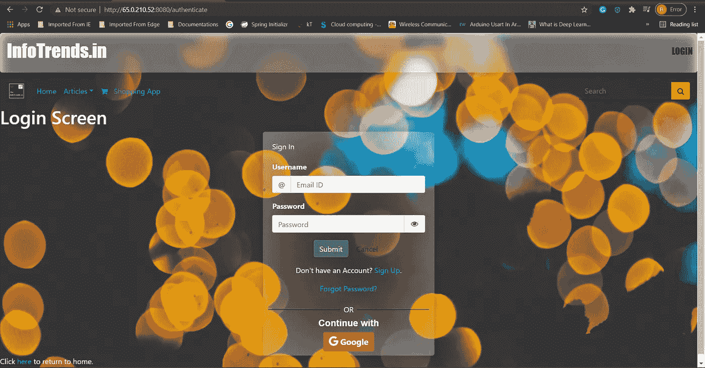