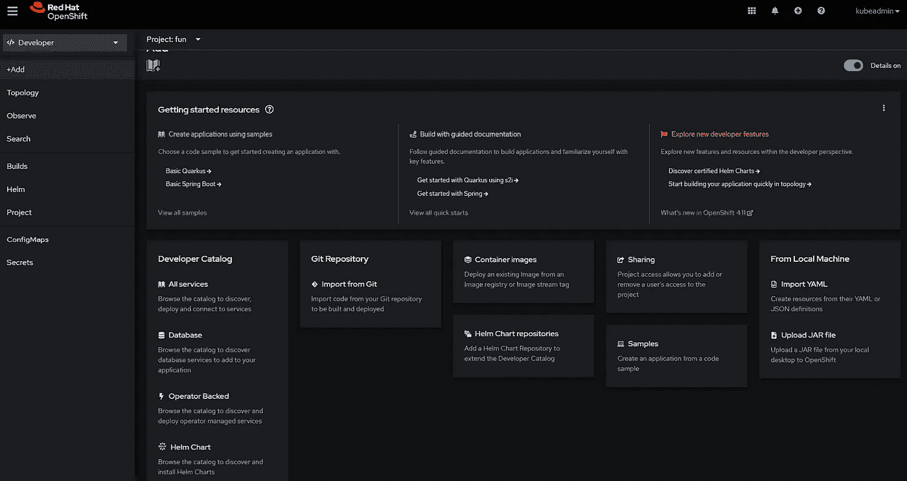
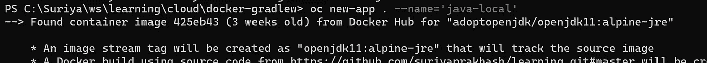
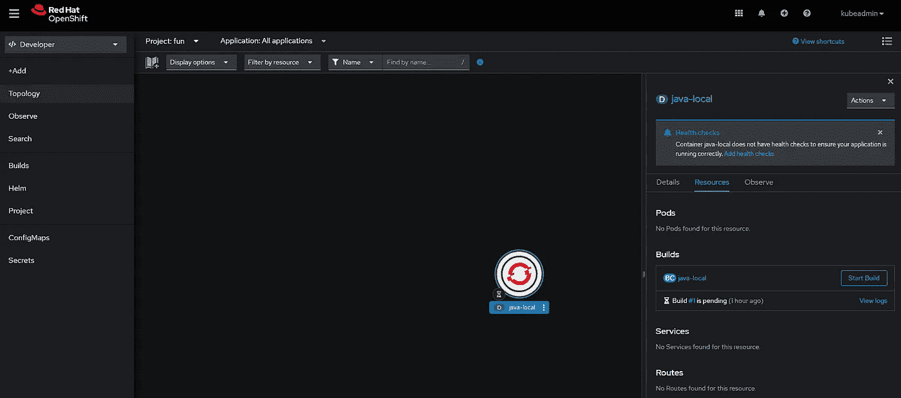
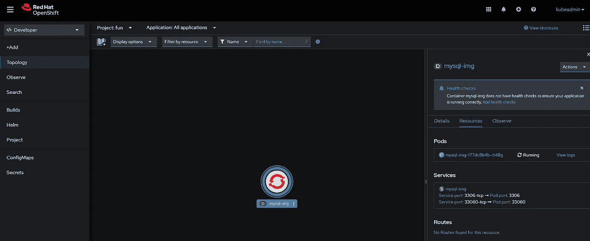
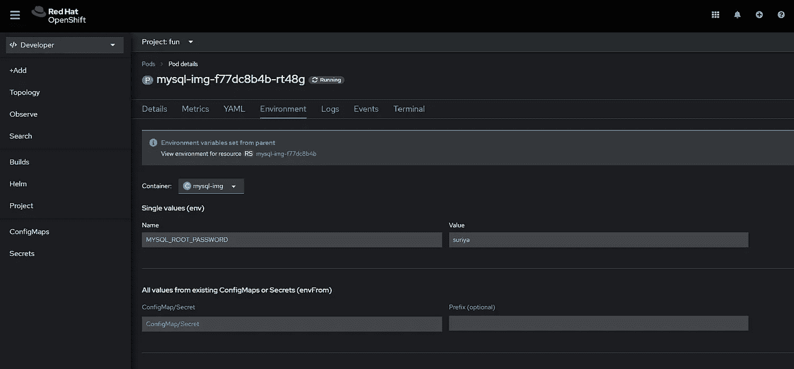
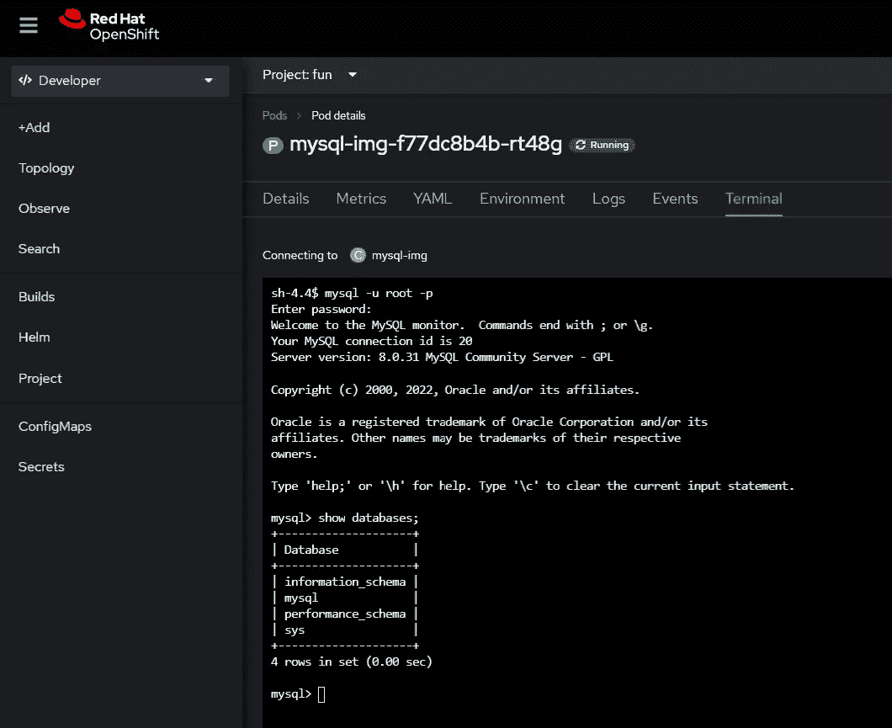
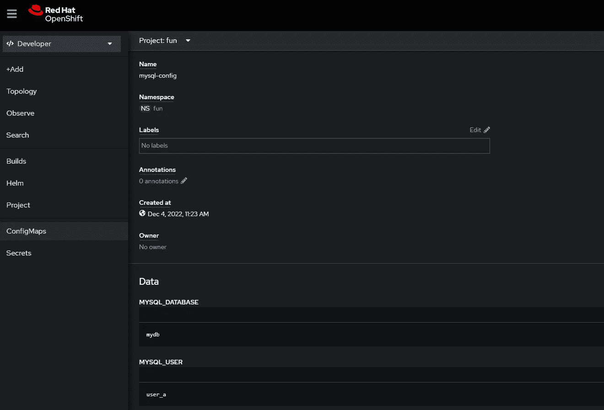
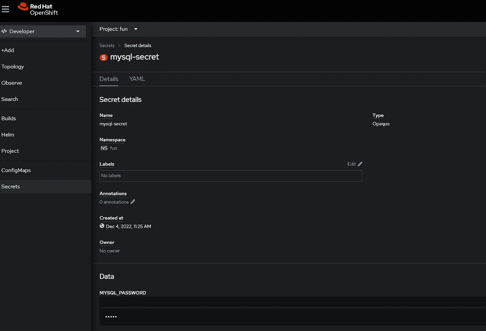
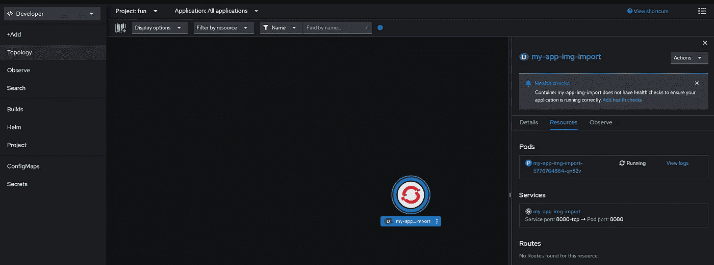

# 在 OpenShift 中部署的简单方法

> 原文：<https://medium.com/javarevisited/deploying-in-openshift-a42c6870cbb1?source=collection_archive---------4----------------------->

本地主机

OpenShift 是一个基于 Kubernetes 的基于云的容器编排平台。它提供了一个自助式平台来按需创建、修改和部署应用程序，从而加快开发和发布生命周期。

[](https://javarevisited.blogspot.com/2020/07/top-5-courses-to-learn-redhat-openshift.html)

**内容**

*   [为什么部署在 OpenShift](#6bf0) ？
*   [先决条件](#716c)
*   [部署应用程序的方式](#4109)
    - [来自源代码](#76e3)-
    -[来自图像库](#2560)-
    -[来自图像流](#c45b)

> 为什么在 OpenShift 中部署？

有一大堆[功能](https://www.redhat.com/en/technologies/cloud-computing/openshift/features)是 [OpenShift](/javarevisited/6-best-openshift-courses-for-beginners-and-experienced-developers-d124edd2baff) 开箱即用提供的，而不是在裸机上一个一个地带来。[这里是为什么应该选择 OpenShift 而不是 Kubernetes 的概述](https://www.redhat.com/en/technologies/cloud-computing/openshift/red-hat-openshift-kubernetes#openshift-vs-kubernetes)。

抛开理论不谈，让我们从开发人员的角度来看看一个基本的应用程序部署有多容易或多难。

> 先决条件

这篇文章假设读者已经，

*   暴露于[码头环境](https://www.docker.com/)
*   暴露于任何 eco 系统中的应用程序部署

> 部署应用程序的方法

如果你想在本地设置**打开**，查看以下帖子

<https://medium.suriyaprakhash.com/openshift-local-setup-a22130731bc2>  

将应用程序部署到 OpenShift 有多种方式。

*最简单的方法*是使用**控制台 UI** 来添加/移除资源/项目/应用程序。

[](https://javarevisited.blogspot.com/2022/05/docker-interview-questions-answers-for.html)

然而，在*现实世界*中，我们会使用某种**管道**来*部署*应用程序。其中，通过**自动化脚本**部署应用程序可能会派上用场。

因此，这里有三种简单的方法**将应用程序部署到 OpenShift 集群中，主要使用 ***命令行工具*** ，它可以成为管道脚本的一部分。**

*   来自源代码
*   来自图像存储库
*   来自图像流

> 来自源代码

代码既可以在**本地**中，也可以在**远程源代码**库中，比如 [Gitlab](https://about.gitlab.com/) 或 [GitHub](https://github.com/) 。

— **代码库**

```
oc new-app <github-url> --name='appname'
```

**—本地**

```
oc new-app . --name='java-local'
```



导航到本地文件系统中的代码路径，并运行上面的代码

[](https://javarevisited.blogspot.com/2019/05/top-5-courses-to-learn-docker-and-kubernetes-for-devops.html)

创建的部署

> 来自图像存储库

这将是最常见的首选基本方法。这提供了更多的控制，而不是从**源代码**中提取并使用 [OC 的**构建配置**](https://docs.openshift.com/container-platform/4.7/cicd/builds/understanding-buildconfigs.html) **，**。

让我们试着用一个强制的**环境**变量运行来自 [docker hub](https://hub.docker.com/_/mysql) 的 [mysql](https://www.mysql.com/) 镜像，

```
oc new-app --name=mysql-img \
    --image=mysql \
    --env=MYSQL_ROOT_PASSWORD=suriya
```



以下是上述**部署**的**吊舱**环境信息。



带有**MYSQL _ ROOT _ PASSWORD = suriya**变量的环境变量

这里，我们使用控制台对 docker 容器执行 **exec** ，



使用密码 **suriya** 作为 **root** 用户登录

现在，让我们创建一个新的用户**配置映射** *资源*

```
oc create configmap mysql-config \
    --from-literal=MYSQL_USER=user_a \
    --from-literal=MYSQL_DATABASE=mydb
```



**配置映射资源**显示创建的**文字**键值

```
oc create secret generic mysql-secret \
    --from-literal=MYSQL_PASSWORD=user_a_pass
```



**秘密资源**显示创建的秘密

现在，让我们将它设置为容器的**环境**变量，以便它对 mysql 可见，

```
oc set env deployment/mysql-img \
    --from=configmap/mysql-config \
    --from=secret/mysql-secret
```


终端显示 **mydb** 和**登录用户 **user_a****

> 来自图像流

对于这一部分，我们将使用我们的[私有映像库](https://medium.suriyaprakhash.com/private-docker-registry-adef3a6d2dee#311e)，类似于在本地机器上运行的 [docker hub](https://hub.docker.com/) 。

下面是运行本地图像存储库的步骤，

  

在构建 **docker 映像**并使用 **docker 构建**和 **docker 推送将其推送到[本地映像库](https://medium.suriyaprakhash.com/private-docker-registry-adef3a6d2dee#311e)之后。**运行以下**将图像从[本地图像库](https://medium.suriyaprakhash.com/private-docker-registry-adef3a6d2dee#311e)导入 *OpenShift 的* **内部图像流**。**

```
oc import-image my-app-img-import --from=192.168.128.1:5443/my-app \
    --reference-policy='Local' --confirm
```


通过控制台或 CLI 检查**图像流**

现在，运行 **new-app** 从图像流 ***my-app-img-import、*** 创建一个新的应用

```
oc new-app --image-stream=my-app-img-import
```



使用部署创建的新项目— **pod** 和**服务**

还有其他的*管理部署*的方法来促进**持续集成**和**部署**无缝，而不是在命令行中传递所有变量。

改天再来看看吧！

祝本地主机运行愉快！