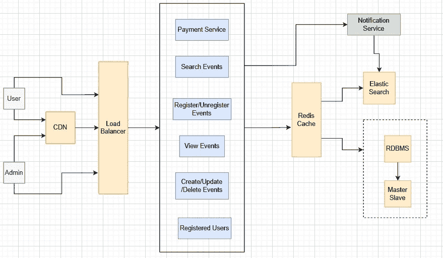

# 设计动漫展注册系统

> 原文：<https://medium.com/javarevisited/design-comic-con-registration-system-9ec1cf1bb0cc?source=collection_archive---------2----------------------->

Marjan Blan | @marjanblan 在 [Unsplash](https://unsplash.com?utm_source=medium&utm_medium=referral) 上的照片

通过这篇文章，我们将学习如何设计一个后端架构，帮助用户注册活动。过去，我们已经讨论过系统设计概念。我们将在这里使用这些概念，我们将学习更多的新概念。在继续之前，请先看看这些文章。

</javarevisited/deep-dive-into-elastic-search-702e501762b>  </nerd-for-tech/what-is-a-load-balancer-9af0517551dc>  </codex/caching-overview-cf9afaaedcff>  

## 问题陈述

多个前端体验(web & app)已经请求一项新服务，该服务将允许用户注册不同类型的动漫展现场活动，如动漫展万圣节、第一漫画联盟等。该服务预计将在统一许多不同的动漫展现场活动微型网站和应用程序的注册体验方面发挥重要作用，并帮助企业在当地市场集团管理的这些现场活动中获得更大的透明度。为动漫展活动服务设计一个后端解决方案，提供上述功能，为体验端提供注册功能，为管理前端提供 API，允许管理员创建活动、维护和提取参与者列表。设计提案应考虑服务的全球可用性，以及隐私和法律约束及其对用户个人信息存储的影响。

## 基本的理解力

每个动漫展现场活动地点都需要自己的服务器、数据库和网站。在现场没有任何服务器的情况下，很难建立这个系统。任何第三方应用程序/电影票应用程序都应该与动漫展的服务器协同工作，以获取座位可用性信息。

现在，让我们设计动漫展注册系统。

## 功能需求

1.  用户可以搜索/查看事件
2.  用户可以注册/取消注册事件
3.  管理员可以创建/查看/更新/删除事件
4.  管理员可以获得事件的注册用户列表
5.  支持多个城市和国家

## 非功能性需求

1.  高度并发和可用
2.  高度可扩展
3.  无延迟

## 用户和管理员角色

用户和管理员有不同的角色，可以使用 roles 参数来区分。

*   管理员可以创建/查看/更新/搜索/删除事件。管理员还可以获得事件的注册用户列表
*   用户可以注册/取消注册事件、搜索事件、查看事件。

## 关系数据库

我们在系统中使用关系数据库，因为我们需要结构化数据及其关系。关系数据库不可伸缩是一个神话。我们也可以扩展关系数据库。这里我们使用主从架构来扩展我们的 RDBMS。主数据库执行写操作，而拥有主数据库副本的其他从数据库将执行繁重的读操作。这将减少我们的数据库延迟。

*   用户数据库:uid(主键)，uname，联系人，电子邮件，预订的座位，eid(外键)
*   事件数据库:eid(主键)，姓名，位置，城市，国家，座位，费用
*   支付数据库:pid(主键)，eid(外键)，ispaid

## 贮藏

我们使用 Redis 作为大量读取数据的缓存层。Redis 还可以用作各种用途的锁，例如阻止票证。我们可以使用 redis 条目来查找用户试图使用特定 TTL(生存时间)预订的每个座位。

## 通知服务

通知服务是一个消息排队系统，如 Rabbitmq 或 Apache Kafka，用于执行异步任务，这些任务非常耗时，如发送短信/电子邮件/WhatsApp 消息，生成 PDF 格式的票据。此外，如果管理员创建、更新或删除事件，则通知服务将收到通知，更新的信息将添加到弹性搜索中，以便用户获得最新的更新事件信息。

## 负载平衡器

这种情况下我们可以用 Nginx 或者 Amazon 弹性负载均衡器。负载平衡器有助于维持服务器上的负载。负载平衡器使用各种技术来确定哪个服务器应该处理请求，以便服务器不会过载。

## 内容交付网络(CDN)

CDN 有助于在全球范围内维护这项服务。CDN 是一组地理上分布的服务器，它们协同工作，提供互联网内容的快速传送。请求的内容首先存储在源服务器上，然后根据需要复制并存储在其他地方。这使得应用程序高度可用，并有助于减少延迟。

## 用户将如何注册活动？

1.  用户将搜索动漫展活动。
2.  打开动漫展活动详情。
3.  用户使用 OAuth 为该事件注册他们的电子邮件 id。OAuth 用于授权网站或应用程序访问它们在其他网站上的信息，但不提供密码。
4.  现在，从缓存的事件数据库中获取可用座位的数量。
5.  现在，用户选择座位的数量，服务器应该在接下来的 10 分钟内锁定座位。用户应该在 10 分钟内付款，否则服务器将释放座位上的锁。
6.  使用支付选项检查发票，并通过网关支付。请求将被重定向到支付网关。
7.  一旦支付成功，就会生成一个唯一的 ID。
8.  如果用户选择了座位并支付了费用，但是座位不可用。那么整个事务将被还原。
9.  在活动数据库中更新可用座位的数量。
10.  用户将获得一张带有加密 QR 码的门票发票，活动的基本细节，活动地址，时间等
11.  一张票将被生成，并且只使用唯一的票 ID
12.  调用异步任务来发送短信、电子邮件和 WhatsApp 门票
13.  用户参加动漫展活动，活动经理扫描订票上的二维码。
14.  使用二维码扫描检索机票代码。

高层次设计

## REST APIs

*   /用户？eid=" <value>"返回事件的注册用户列表</value>
*   /返回所有城市的城市
*   /事件？city=" <value>"返回该城市的所有事件</value>
*   /地点？city=" <value>"返回该城市的所有位置</value>
*   /地点？city=" <value>"&eid=" <value>"返回此城市和此事件的所有地点</value></value>
*   /事件？city=" <value>"&location=" <value>"返回该城市和该地点的所有事件</value></value>

## 技术

*   后端服务器:Java，Spring Boot，Swagger，Hibernate
*   安全性:春季安全性
*   数据库:MySQL
*   服务器:Tomcat
*   缓存:Redis
*   通知:阿帕奇卡夫卡
*   部署:Docker
*   代码库:Git
*   负载平衡器:Nginx

这就是我将如何设计事件注册系统。请随时添加/审查设计，让我知道你将如何处理这样的问题。我会添加更多的系统设计文章，这样我们可以一起学习和设计系统。敬请关注。快乐学习！🎃