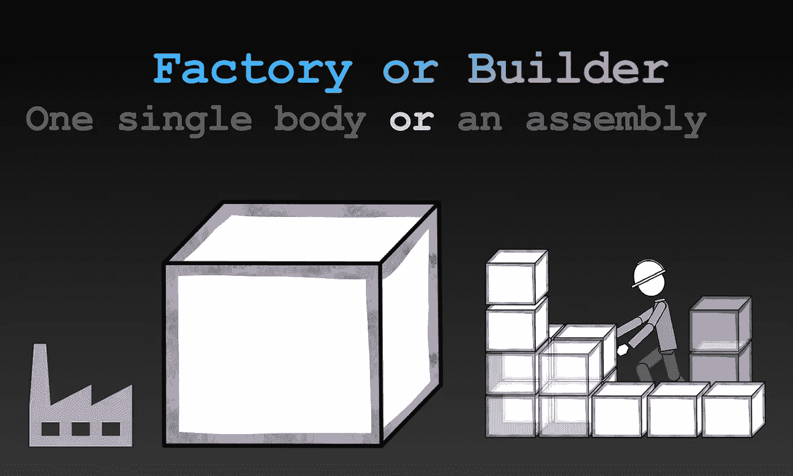
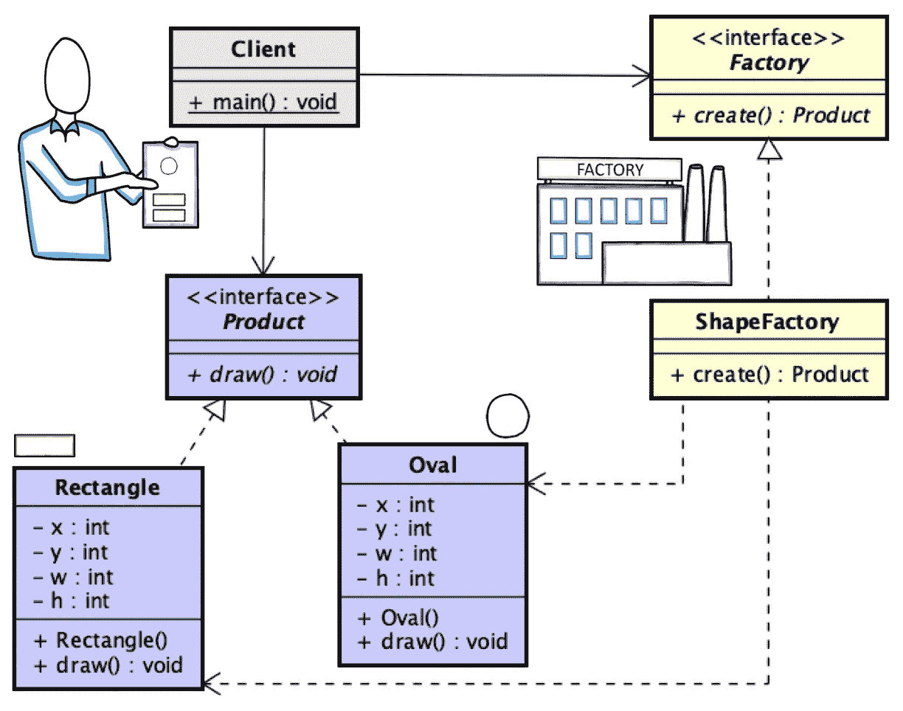
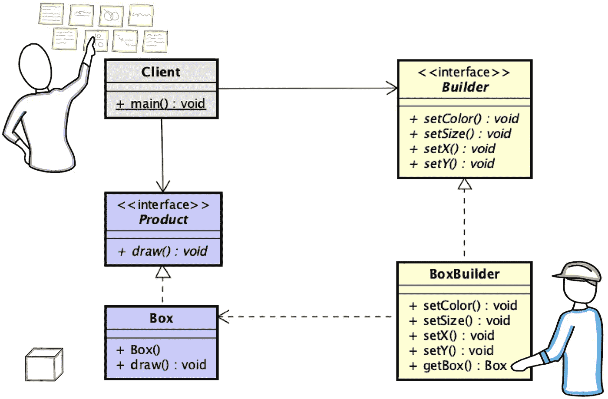

# 软件设计模式:简而言之的工厂和构建者

> 原文：<https://medium.com/javarevisited/design-patterns-101-factory-vs-builder-vs-fluent-builder-da2babf42113?source=collection_archive---------0----------------------->

我的学生经常问的一个问题是，在使用这些名称的软件设计模式方面，工厂和构建者之间有什么不同，如果有的话。此外，他们还询问了 GoF 模式中描述的构建器和所谓的 Fluent-builder 之间的区别，后者通常在调用管道中的方法时用在 [Java Stream API](/javarevisited/7-best-java-collections-and-stream-api-courses-for-beginners-in-2020-3ad18d52c38) 中。

它们是**创造模式**，适合特定情况的对象创造机制的模板。对象创建的基本形式(new 运算符调用构造函数)到处都会导致设计问题并增加复杂性。

记住，大规模编程和小规模编程是不一样的:在任何地方创建对象对你的学校作业都有用，但是它的伸缩性不好。将对象创建定位在一个地方作为一个实体或组件的责任是很重要的，例如在工厂或构建器中。如何选择这个或那个？各适合什么情况？让我们来谈谈他们中的每一个，他们的相似之处和不同之处。

# 工厂

工厂是用于创建其他对象的对象。工厂是构造函数的**包装器，也就是说，它被用来**在一个方法调用**中构建一个完整的对象。**

图一。工厂模式—创建形状(矩形和椭圆形)的工厂示例。

定义了两个接口来强制属性:**工厂**和**产品** *。*

*   **工厂**接口为需要新对象时调用的方法定义了签名。一个工厂可以生产一种或多种产品。因此，它可能有不同的方法，通常带有前缀 *create()* ，每种类型的产品一个方法，或者使用参数来指定要构造什么。工厂实现了这个接口。
*   **产品**接口没有定义任何具体内容。它将根据所解决的问题进行定制。产品实现这个接口。

a 类**客户**使用**工厂**并得到一个**产品**。注意，**客户端** 如何依赖于**工厂**和**产品**的接口，而不是这些接口的具体实现。这为多态性打开了一扇大门——**客户端**可以与**工厂**和**产品**的任何子(专门化)一起工作。

例如，用于绘制形状的软件可以使用能够创建圆形和矩形的工厂(特别是形状工厂)。其设计如图 1 所示。代码呢？从类图来看，这非常简单。让我们从上往下看。图 2、3、4 和 5 显示了一个类*客户机*的源代码，它使用*工厂*来创建*产品*对象，特别是椭圆和矩形对象。

图二。Client.java——利用工厂创造产品的主要方法

图 3。Factory.java——关键思想，工厂创造方法

图 4。Product.java——绘制方法是产品功能(它不是来自模式)

图 5。ShapeFactory.java——形状工厂的一个实现

如果你熟悉设计模式 [**Singleton**](/javarevisited/design-patterns-101-hello-singleton-2d3f227c7729) ，考虑一下组合和创建 Singleton-Factory 的可能性，也就是说，每当任何地方需要一个新的对象(产品)时，可以调用一个工厂实例。

# 建设者

构建器是对象的**包装器。当一个物体不能在一个单独的步骤**中生产时，使用**。构建器隔离了产品的内部表示和产品构建的步骤。使用构建器模式来避免产品具有多个构造器，每个构造器具有不同数量的参数，例如，作为一个为对象中的属性提供默认值的选项。**

图 6。构建器模式

***建造者**创造出**产品**，就像**工厂**所做的那样。但是现在，不是只有一个创建产品的请求，而是有几个对构建器中的方法的调用。每次电话都会给产品添加一个新的零件。当构建器被提供了所有需要的东西后，可以调用它的方法 *get()* 来用构建器之前收到的元素组装新产品。*

*图 6 显示了构建 *Box* 对象的 *BoxBuilder* 的设计。图 7、8 和 9 显示了我们新类的源代码。*

*图 7。Client.java——使用生成器创建产品的主要方法*

*图 8。Builder.java——任何想要实现生成器的类的契约*

*图 9。BoxBuilder.java——盒子的建造者*

*当获取每个属性的值是一个复杂的过程时，在客户端和构建者之间添加一个类是一个好主意，通常被标识为 Director，它可以是*客户端*的联系点，并负责创建、计算或收集数据(产品属性的值)。Director 可以有一个构建器实例，并将产品的装配委托给它。主管调用构建器中的方法，构建器一步一步地构建产品，为每一步提供所需的数据。*

# *流畅的建设者*

*Fluent 构建器的设计依赖于**方法链**。这样做的目的是提高代码的可读性。例如，当使用 Fluent Builder 时，图 7 中的代码会发生变化(变为图 10 所示的代码)。*

*图 10。Client.java——使用 fluent builder 创建产品的主要方法*

*注意第 6 到 9 行中的方法是如何链接的。我们需要什么来实现这一点？构建器中的一个简单更新:将返回类型从 void 替换为 Builder，并使方法返回 this(当前对象)。因此，在对 setter 方法的每次调用中，都返回构建器*的*对象。返回的 Builder 对象可以调用另一个 setter 方法，依此类推。实现这一点的代码如图 11 和 12 所示。*

*图 11。FluentBuilder.java——任何想要实现 Fuent 生成器的类的契约*

*图 9。BoxFluentBuilder.java——盒子物品的流畅建造者*

*这是一个非常简单的实现，但它表明了这个想法。*

*如果你熟悉[**Eclipse 建模框架**](https://www.eclipse.org/modeling/emf/) ，你会注意到工厂和单体模式的扩展使用。如果你读过 Java 中的[**函数式编程，我相信 Fluent-Builder 看起来很熟悉。而且，如果你有机会使用深度学习框架，比如**](/javarevisited/a-beginners-guide-to-functional-programming-with-java-5987101b3713)**[**Deep Learning 4j**](/mlearning-ai/neural-networks-getting-started-with-eclipse-deeplearning4j-897f3662832b)，你在创建神经网络时就已经注意到了 Fluent-Builder。***

*希望你喜欢阅读。请在下面留下您的评论或问题。*

*我经常写关于软件和人工智能的文章——如果你想阅读我未来的文章，那么请[给我一个关注](https://mscjaviergs.medium.com/?source=about_page-------------------------------------)、[订阅](https://mscjaviergs.medium.com/subscribe?source=about_page-------------------------------------)，或者对最近的一篇文章说*你好*。*