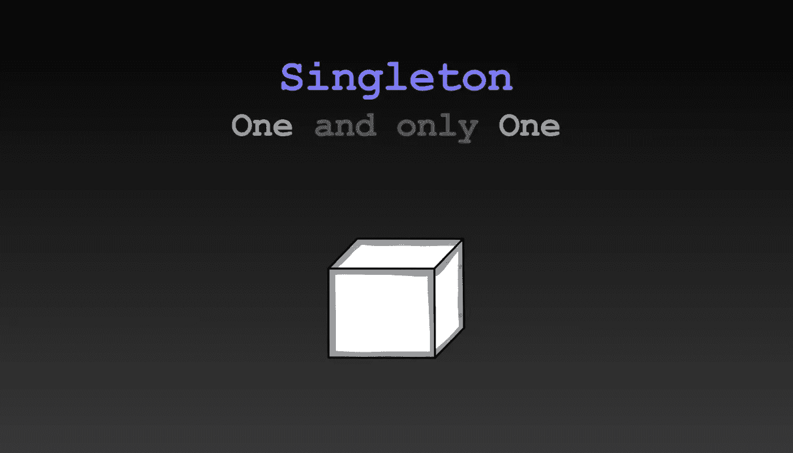
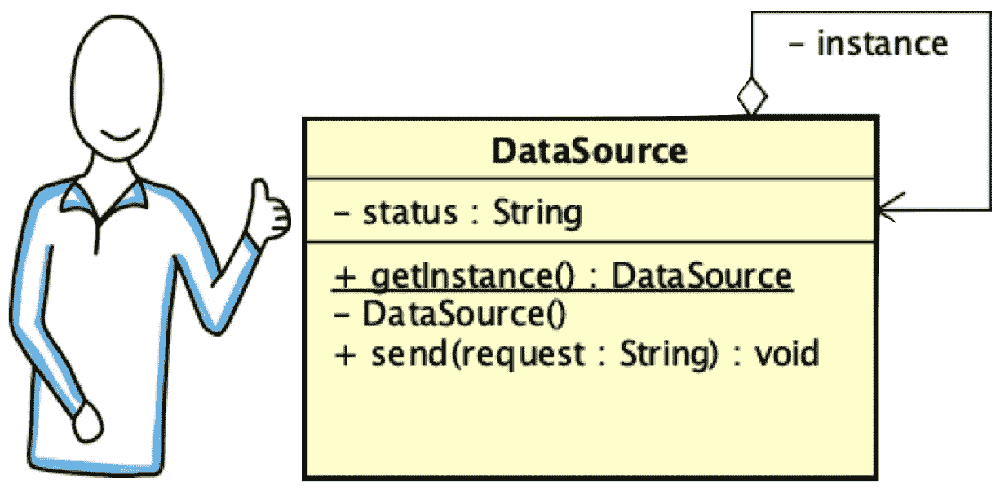

# 软件设计模式:简单地说，单一模式

> 原文：<https://medium.com/javarevisited/design-patterns-101-hello-singleton-2d3f227c7729?source=collection_archive---------1----------------------->



创造性设计模式为对象创建(类的实例化)提供了选项，因为有时，对象创建的基本形式可能会导致设计问题或增加设计的复杂性。创造性设计模式通过某种方式控制对象的创建来解决这个问题。它们由两个主导思想组成:第一个是封装关于系统使用哪些具体类的知识；第二个是隐藏这些具体类的实例是如何创建和组合的。单一模式是最常用的设计模式之一。这是第二个主导思想的例子:它隐藏了具体类的实例是如何创建的。

# 目标

Singleton 的目标是**确保一个类有且只有一个实例**(对象)。它用于向**提供对对象**的全局访问点。例如，日志记录、数据源访问、线程池、配置设置管理、连接实例等等。Singleton 有时与[工厂模式](/javarevisited/design-patterns-101-factory-vs-builder-vs-fluent-builder-da2babf42113)相结合，以保证整个系统中只存在一个工厂。

# 解决办法

我们如何确保只能存在一个实例？我们可以分三步走。我们来复习一下。

假设您有一个类 DataSource，它实现了从连接到您的计算机的硬件设备或远程服务器收集数据。我们的 DataSource 类可以如图 1 所示。没有什么特别的，只是一个和其他类一样的类——一个有属性和方法的类。

图一。DataSource.java——一个简单的班级

您不希望多个 DataSource 对象中的每个对象都创建自己的连接，从而导致多个对象争用访问权。让我们把它转换成单一数据源。

## 第一步。私人构造函数

首先，为了创建我们类的实例，其他类会调用构造函数，对吗？大概是这样的:

```
DataSource ds = new DataSource();
```

构造函数是公共的，因为通常我们希望其他类调用它们。创建单例的第一步是将访问修饰符从 *public* 改为 *private* (或 *protected)。*为什么？避免任何类创建实例。如果您将构造函数设为私有，则没有人能够创建类的实例。那么，我们是从能够创建 N 个对象发展到能够创建 0 个对象吗？是的，这是目前为止的重点。

## 第二步。静态公共方法

我们需要一个替换构造函数的方法，一个其他类可以用来请求实例的*公共*方法。特别是，我们需要一个无需创建类的对象就可以调用的方法(因为此时我们不能创建对象，我们只是使构造函数不可访问)。我们需要一个*静态*方法。这种方法在单例模式模板中被称为 *getInstance()* ，开发者通常保留这个名字。

方法 *getInstance()* 将从类中给我们一个新对象，就像构造函数一样。方法 *getInstance()* 应该是公共的(每个其他类都应该能够访问它)，应该是静态的(如前所述)，并且应该返回该类的一个实例(在我们的示例中，返回一个 DataSource)。该方法如下所示:

```
public static DataSource getInstance() {}
```

现在，方法的主体。请求数据源实例时有两种情况:

*   如果是第一次，那么创建一个新对象；否则，
*   只需返回第一次调用时创建的对象的引用。这似乎很容易实现。

```
public static DataSource getInstance() {
  if (instance == null)
    instance = new DataSource ();
  return instance;
}
```

等等，那个*实例*变量是什么？我们需要一个变量来知道我们是否已经创建了一个对象。

## 第三步。静态实例

实例变量需要是静态的，因为我们需要在静态方法中访问它。注意，我们在方法 *getInstance()内部调用构造函数。*构造函数不能从外部调用，但是类可以使用。

我们新的 *DataSource* 类应用了 Singleton 模式，如图 2 所示。注意:

*   第 2 行中的静态变量；
*   第 6 行的公共静态方法*getInstance()*；而且，
*   第 12 行中的私有构造函数。

图二。DataSource.java——实现单例模式

有了这些，在任何需要访问数据源的地方，我们都可以使用指令 *DataSource.getInstance()。我们可以将实例存储在一个局部变量中，也可以根据需要直接调用方法。例如:*

```
DataSource ds = DataSource.getInstance();
ds.send("Hello");
```

或者

```
DataSource.getInstance().send("Hello");
```

# 类图

Singleton 是少数不使用接口(或一组类)的设计模式之一。此外，还有一个名为 Singleton 的元素。类名应该是正在解决的问题的上下文中所需要的，比如在我们的示例 DataSource 中。



图 3。应用单例模式的 DataSource 类的类图:私有构造函数、getInstance()方法和同一类的静态实例

图 3 显示了单例模板(作为一个类图):

*   私人或受保护的**建造者**，
*   *静态属性*通常称为实例，而
*   **公共静态 *getInstance()* 方法**。

很简单但是很强大。然而，没有金锤。注意不要滥用这个工具。您不希望以面向对象语言中的过程化解决方案结束。

# 示例应用程序

在一些框架或库中有使用过单例模式的例子吗？是的。让我们回顾一些。

## java.util.logging.Logger

日志记录是在程序执行期间将日志消息写到中心位置的过程。日志允许您记录错误、警告和信息消息。 **Logger** 对象提供日志功能。例如:

```
import java.util.logging.Logger; 
public class Example { 
  public static void main(String[] args) { 
    // Create a Logger with class name Example 
    Logger logger = **Logger.getLogger**(Example.class.getName()); 
    // Call info method 
    logger.info("Hello!"); 
    logger.log(Level.*WARNING*, "Bye"); 
    } 
}
```

**记录器**是单例的，方法 *getLogger()* 提供了对**记录器** 实例的访问。

## java.awt.Desktop

**Desktop** 类提供对主机默认浏览器、电子邮件客户端和打印机等的访问。**桌面**的访问如下例所示:

```
import java.awt.Desktop; 
public class Example { 
  public static void main(String[] args) { 
    try { 
      URI uri = new URI("mscjaviergs.medium.com"); 
      Desktop d = **Desktop.getDesktop()**; 
      d.browse(uri); 
    }. catch (Exception e) { 
    }
  } 
}
```

**桌面**是单例的，方法 *getDesktop()* 提供对**桌面** 实例的访问。

注意 *getInstance()* 是模式模板中的名称，但是可以自定义，比如 *getDesktop()* 和 *getLogger()* 。

现在你有了大局。希望你喜欢阅读。请在下面留下您的评论或问题。