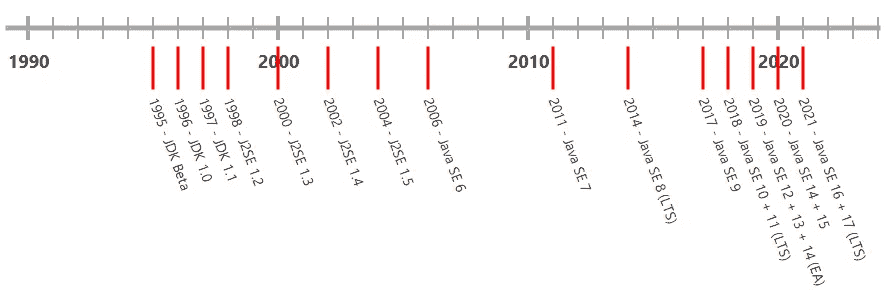
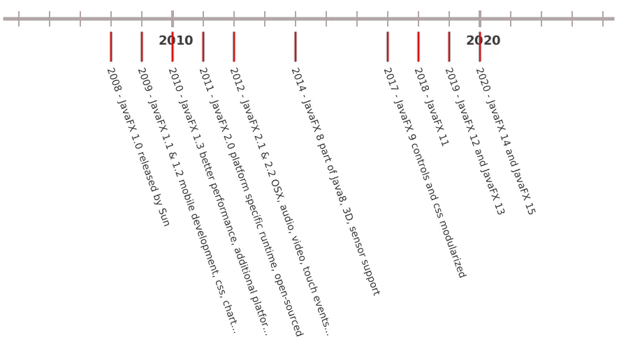
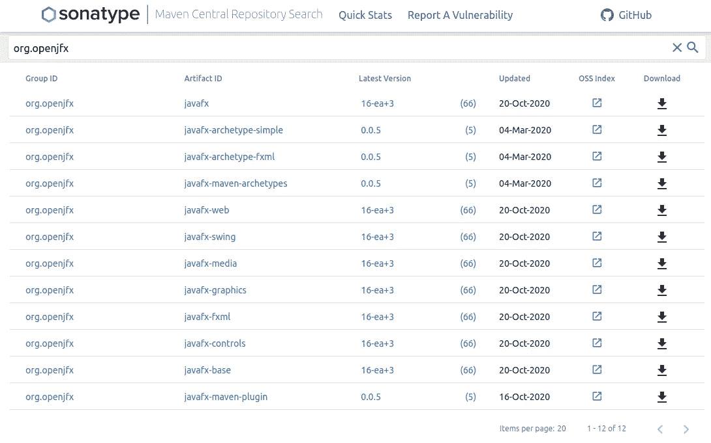

# OpenJDK 与 OpenJFX 发布周期的详细信息| foojay

> 原文：<https://medium.com/javarevisited/details-on-openjdk-vs-openjfx-release-cycles-foojay-ca386e450cd2?source=collection_archive---------1----------------------->

对 OpenJDK 和 OpenJFX 的发布周期以及它们之间的关系感到困惑？请继续阅读！

> 本帖最初分享于 [**foojay.io**](https://foojay.io/blog/openjdk-vs-openjfx-release-cycles/) **“一个 OpenJDK 的朋友的地方”**。更多 Java 相关新闻请关注 Twitter 上的 [@foojay2020](https://twitter.com/foojay2020) 。

# OpenJDK

从 2018 年开始，Java 改用 6 个月的发布周期。每个新版本都会带来新的已完成的特性，但也会“预览”那些尚未完成的特性。这些可以用标志 (` `java --enable-preview``)启用[，以允许开发人员开始试验它们，并向开发人员提供反馈以进一步改进它们，以便它们可以在下一个版本中可用。](https://mkyong.com/java/java-how-to-enable-the-preview-language-features/)

由于这个固定的时间表，新版本不再引起重大变化，而是提供了一个稳定的、可预测的、稳定的新特性流。

如果你不确定是否应该升级到新的 JDK 版本，请务必阅读"[提高生产力的现代 Java 玩具，从类型推理到文本块。使用旧版本 Java 平台的开发人员正在错失良机。Angie Jones 在 Oracle Java 杂志上发表的文章。](https://blogs.oracle.com/javamagazine/modern-java-toys-that-boost-productivity-from-type-inference-to-text-blocks)

# OpenJFX

过去，JavaFX 一直与 Oracle JDK 捆绑在一起(直到 JDK 11)，但它始终是一个独立的项目，名为 [openjfx.io](https://openjfx.io/) ，其[源代码在 GitHub](https://github.com/openjdk/jfx) 上。Gluon 构建并发布 OpenJFX 版本，遵循相同的 6 个月发布周期。

你可以在 [Maven 中央储存库](https://search.maven.org/search?q=org.openjfx)或者[胶子网站](https://gluonhq.com/products/javafx/)上找到它们。

从版本 11 开始，OpenJFX 的所有变化都可以在这里找到。

# OpenJDK 和 OpenJFX 版本之间的关系

到目前为止，OpenJFX 版本不需要特定的 OpenJDK 版本。这意味着您可以将 OpenJDK 11 与 OpenJFX 15 结合使用。

目前，OpenJFX 中还没有需要新 JDK 特性(文本块、记录等)的计划特性或变化，因此 OpenJFX 的下一个版本很可能仍然兼容 JDK 11。

# 结论

是的，OpenJDK 和 OpenJFX 在每年的发布数量上是一致的(2x ),并且遵循相同的主要版本编号(当前版本是 15，下一个版本将是 16)。

不，他们不是“绑在一起”，走自己的路。

*上面的时间轴是一个小型 JavaFX 应用程序的截图，它是我的书《* [*树莓 Pi 上的 Java 入门*](https://webtechie.be/books/) *》的一部分。GitHub* *上有* [*源码。*](https://github.com/FDelporte/JavaOnRaspberryPi/tree/master/Chapter_04_Java/javafx-timeline)

*原载于 2020 年 10 月 29 日*[*https://foojay . io*](https://foojay.io/blog/openjdk-vs-openjfx-release-cycles/)*。*