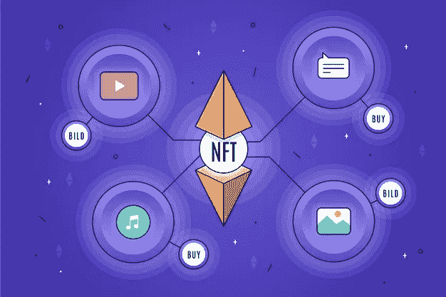
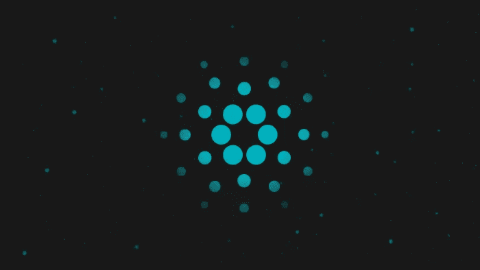

# 在卡尔达诺区块链开发 NFT 市场

> 原文：<https://medium.com/javarevisited/develop-nft-marketplace-on-cardano-blockchain-6b538aedde68?source=collection_archive---------2----------------------->

不断发展的区块链技术为企业和企业家展现了各种收入增长机会。这些广泛的机会最终导致区块链在主要行业的大规模采用，以及区块链用例的更高多样性。区块链的一个普遍使用案例是 NFTs。

不可替代的令牌(NFT)为密码爱好者、投资者和艺术家带来了绝佳的机会。NFT 是资产的令牌化版本，代表并验证任何数字资产的所有权。

NFT 可以包括虚拟艺术、数字签名、推文、社交媒体帖子，甚至可以通过 NFT 转换为数字内容和标记的物理资产。NFTs 大受欢迎，使其成为一个新的贸易实体，奢侈品牌和名人开始投资其中。由于 NFT 是一种资产形式，他们需要一个虚拟市场，叫做 NFT 市场，人们可以在那里买卖 NFT。以太坊、索拉纳、币安和卡尔达诺等受欢迎的区块链提供了一个开放的区块链生态系统来发展 NFT 市场。这篇文章将解释如何在 Cardano 上开发 NFT 市场。

## **什么是 NFT 市场？**

[NFT 市场](https://www.leewayhertz.com/nft-marketplace/)是一个分散化的平台，NFT 的创造者和投资者可以在这里一起买卖 NFT。这些 NFT 创作者大多是艺术家、音乐作曲家、游戏创作者、品牌和有影响力的人。相比之下，投资者是密码交易员、艺术品收藏家和游戏玩家。在区块链的推动下，NFT 的市场是开放和分散的。它允许艺术家通过将非功能性交易记录到防篡改的公共账本中来将他们的作品货币化。NFT 市场如此有利可图的特点继续吸引着密码爱好者。此外，NFT 市场通过为用户提供进入一级和二级市场的途径而变得流行起来。这意味着一个 NFT 创作者可以证明他的 NFT 所有权。与此同时，即使所有权发生变化，而且非专利技术在二级市场上交易，他也能获得版税。

## **卡达诺区块链是什么？**

Cardano 是第三代区块链平台，解决了第一代区块链比特币和第二代区块链以太坊的问题。它实现了高可扩展性、可持续性和互操作性，以提供更快的交易和更长的确认时间。凭借这些能力，卡尔达诺有潜力吸引密码爱好者。
在卡达诺开发 NFT 市场有什么好处？

尽管相对较新，卡尔达诺还是成为最受欢迎的区块链之一。

***在 NFT 市场发展的背景下，它提供了以下好处:***
【NFT 市场的流量增加会降低系统性能，但 Cardano 通过解决带宽和数据存储问题实现了高可扩展性。
·Cardano 的股权证明共识机制节能高效，能够以合理的价格提供高速交易。
Cardano 降低了每个节点的带宽要求。它使用一种叫做 RINA 的技术将主网络分成不同的子网。
·区块链熟练地维护着卡尔达诺 NFT 的所有权记录，包括起源和历史。
Cardano 使用修剪、压缩和分区等技术来消除数据存储问题。
·Cardano 通过对下注于未饱和池的玩家给予更多奖励来确保整个网络的高安全性。因此，它避免了 51%的攻击。此外，新的文献和及时的安全分析进一步提高了生态系统的安全性。
·通过实现高可扩展性和技术灵活属性(它使用普路托斯和马洛等智能合同平台)，Cardano 以最低的交易成本提供高吞吐量。

## **如何在卡尔达诺建立一个 NFT 市场？**

拥有自己的卡达诺 NFT 市场有很多好处。它允许你为数字创作者和购买者提供一个高度可扩展的分散平台。此外，还有一个利用一级和二级 NFT 市场的机会。按照给定的步骤在卡达诺建立你的 NFT 市场。
定义市场的目标利基

建立 NFT 市场的第一步是确定它的目标市场。你可以从流行的利基中选择一个合适的利基，如数字艺术家、游戏爱好者、视频音频作曲家或集体用户。
设置先决条件

要在卡达诺区块链开发你的市场，你首先需要建立一个卡达诺节点来获得所有权。除了这个先决条件，开发人员必须了解 Cardano 的命令行界面和 Cardano 支持的开发语言。

**定义用户角色**

在开发 NFT 市场的 UI 之前，您需要定义用户角色。它帮助你为 NFT 的创造者和 NFT 的购买者提供最好的用户体验。

**UI 设计**

你的 NFT 市场的 UI 界面定义了用户体验，所以它应该根据买卖双方的便利来设计。

**智能合同创建、审计和集成**

下一步是创建一个智能合同，向买卖双方详细说明 NFT 市场的规则，并将智能合同代码存储在 Cardano 网络中。Cardano 允许使用三种编程语言开发智能合约；马洛，普路托斯和哈斯克尔。每种语言都有独特的属性。因此，用户可以根据自己的需求选择这些程序中的任何一个，并创建智能合同。

**钱包整合**

像其他区块链一样，卡达诺也有自己的代币，叫做阿达。每个 Cardano 用户，无论是买家还是卖家，都需要将他们的 Nami 钱包集成到平台上来执行交易。此外，参与国际贸易或处理海外客户的用户必须集成多加密钱包，以接受多种令牌的支付。请注意，钱包只包含交易细节，不包含 NFT 文件。由于文件已经存储在区块链，通过指出文件所有者的确切位置，它进一步有助于验证 NFT 买方和卖方的身份

**功能整合**

卡尔达诺 NFT 市场支持一系列功能。虽然整合必须具备的市场功能，如店面，钱包整合，投标选项，搜索过滤器是必要的，使市场功能，没有功能集成的上限。像任何软件一样，你可以选择通过创新的特性来改善市场的用户界面。

**客户端测试**

为了确保代码构造正确，您需要在 Cardano 的多个测试网上运行基于属性的测试。一旦测试完成，就把它发布到主网上，让大众参与进来。在客户端测试期间严格优化平台。

**NFT 存储解决方案**

需要一个强大的 NFT 存储解决方案来存储离线 NFT 数据。虽然有许多 [NFT 存储解决方案](https://www.leewayhertz.com/nft-storage-solution/)可用，但 IPFS 是市场所有者通过分散技术存储数据使用最多的解决方案。

## **结论**

NFT 市场对数字创作者、投资者和 NFT 市场所有者同样有利。市场所有者通过收取挂牌费和煤气费来创收。同样，非功能性交易的买方和卖方通过买卖非功能性交易来增加利润。简而言之，NFT 市场为用户提供了巨大的机会。

如果你计划利用 NFT 市场的好处，探索 NFT 空间，这是执行你的想法的权利，因为 NFTs 正在蓬勃发展。为此，你可以在卡尔达诺或你想要的区块链开发你自己的 [NFT 市场。或者，您可以联系专业的 NFT 市场开发公司，根据您的具体需求开发一流的 NFT 市场。](https://www.leewayhertz.com/cardano-nft-marketplace-development/)