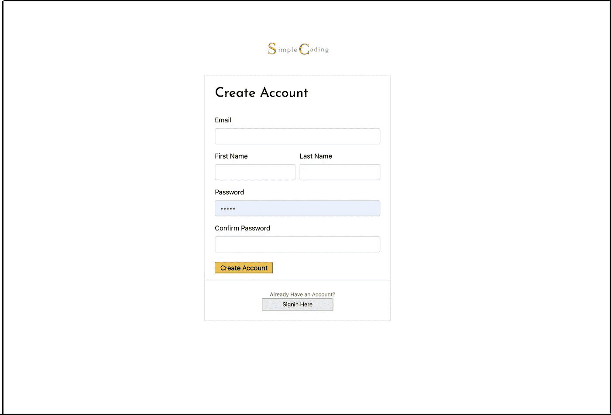

# 使用 Java 和 Spring Boot 开发电子商务应用程序的注册和登录

> 原文：<https://medium.com/javarevisited/develop-signup-and-login-for-e-commerce-app-using-java-and-spring-boot-651f4aad6293?source=collection_archive---------1----------------------->

## 在本教程中，我们将为我们的应用程序构建后端认证。

# 读者注意

虽然我已经构建了整个应用程序并编写了一系列的[教程](/javarevisited/lets-develop-an-ecommerce-application-from-scratch-using-java-and-spring-6dfac6ce5a9f)，这些教程相当受欢迎并在我非常自豪的 google result 中名列前茅，(比…