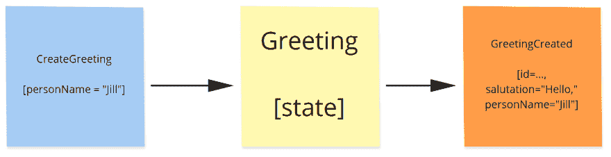
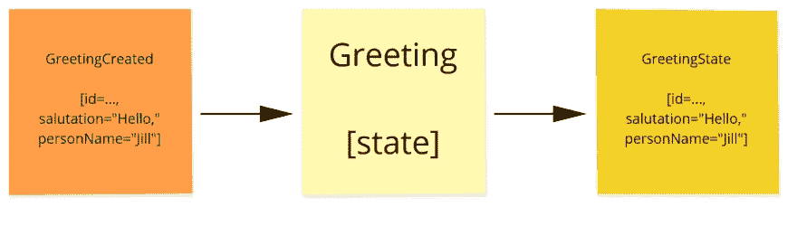
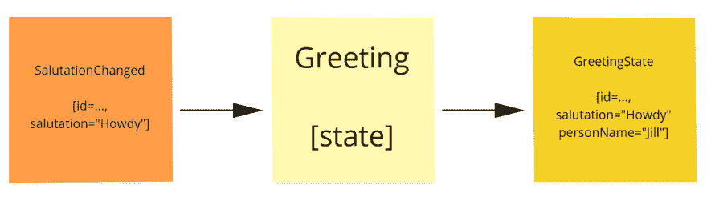

# 如何使 Java 中的事件源更容易

> 原文：<https://medium.com/javarevisited/developer-friendly-event-sourcing-fd87f99cdb0b?source=collection_archive---------3----------------------->


事件源是关于持久化事件，而不仅仅是当前状态。事件源有助于审计，以及分析或重建以前的系统状态以进行业务分析。

让我们更详细地看一下:每次您对应用程序状态进行更改时，您都将更改记录为一个事件。

您可以回放从录像开始到特定时间的事件。那么您已经重新创建了当时应用程序的状态。通过将事件合并到不同的数据结构中，您可以提供特定于用户的状态视图(“查询模型”)。

想象一下购物车:典型的电子商务应用程序只会在用户结账时存储购物车的状态。如果您想知道用户删除了哪些购物车商品，以优化购买流程，该怎么办？这时存储每个事件就变得有用了，例如*shoppingcartitem removed*。

# 一个 Hello World 示例

在本例中，用户向后端发送一个 POST HTTP 请求，其中包含一个 *CreateGreeting* 命令的数据。这个命令包含要问候的人的名字。后端将命令转换成一个 *GreetingCreated* 事件。这个事件包含来自命令的人名，以及一个默认的称呼( *Hello，*):



事件还包含您在中间看到的实体的 id:使用命令并产生事件的实体`Greeting`。这样，这个实体的状态可以在以后重建。

通过产生事件，`Greeting`实体已经接受了有效的命令，并且事件将其记录为事实。该事件现在存储在日志中，例如存储器中的关系数据库或 NoSQL 数据库。

到目前为止，`Greeting`实体的状态还没有改变。
为了改变状态，`Greeting`将事件和当前状态作为输入，并产生 state 类的一个新实例:



`GreetingState`的对象是不可变的。`Greeting`应用事件后，用新状态替换旧状态。

如果您想稍后更改 Jill 的问候语的称呼，该怎么办？这可以通过一个`ChangeSalutation`命令来完成。如果在请求 URL 中对 Jill 的`Greeting`实体的 id 进行编码，命令处理如下所示:


请注意，该事件仅捕获与即将发生的变更相关的信息。它不需要捕获`GreetingState`中的所有信息。

应用`SalutationChanged`事件如下所示:



有趣的是:`Greeting`从事件中获取称呼，并将其与当前状态中的`personName`相结合，产生新的状态。

# 实施问题

我在这里看到的问题是。当构建基于事件的应用程序时，有一个陡峭的学习曲线。你不仅需要适应这种看待国家的新方式。您还需要了解事件源库/框架的详细信息。

我想改变这一切。我创建了存在图书馆。它旨在尽可能降低技术复杂性。可以在 [Github](https://github.com/bertilmuth/being) 上找到。它处于发展的早期阶段，所以我非常感谢反馈。

# 命令和事件处理代码

当您使用 Being 时，您需要定义命令处理程序:实体使用哪种类型的命令，以及它产生哪个(哪些)事件作为对每个命令的反应。

您还需要定义事件处理程序:对于每种事件类型，创建哪个新的实体状态作为对它的反应。

下面显示的`Greeting`实体的行为有以下[代码](https://github.com/bertilmuth/being-samples/blob/main/greetings/src/main/java/org/requirementsascode/being/samples/greeting/model/Greeting.java):

除了定义了`Greeting`起始状态的`initialState()`方法之外，这应该看起来很熟悉。

第一个命令处理程序使用一个包含要问候的人的名字的`CreateGreeting`命令，并产生一个`GreetingCreated`事件。

但是用户也可以通过`ChangeSalutation`命令改变称呼。此命令只包含称呼的新文本，不包含人名。人员由实体的 id`state.id`标识。

命令处理程序和事件处理程序都可以使用实体的当前状态。所以当应用一个`SalutationChanged`事件时，人名不是取自事件，而是取自实体的当前状态:`(event,state) -> new GreetingState(state.id, event.salutation, state.personName)`。

# 问候语实体的状态代码

下面是代表实体状态的`GreetingState`类的代码:

如您所见，state 类的对象是不可变的。

# 命令和事件的代码

命令是简单的 POJOs，如下例所示:

实体的命令实现了一个公共接口，如示例中的`GreetingCommand`，它可能是空的:

```
public interface GreetingCommand {
}
```

为命令提供公共接口的原因是类型安全。使用这个命令接口作为实体类的第一个类型参数，如上所示。

每个事件类必须是`IdentifiedDomainEvent`的子类:

Being 基于强大的 [VLINGO XOOM](https://docs.vlingo.io/) 平台，该平台定义了`IdentifiedDomainEvent`超类。

# 结论

除了我上面展示的内容，您还需要定义 HTTP 请求处理程序。“T5”网站解释了如何做到这一点。

如果你觉得这个话题有趣，我想邀请你去看一看。我非常感谢你的反馈。
在评论中留言，访问 [Gitter 社区](https://gitter.im/requirementsascode/community)或在 Twitter 上联系 [me](https://twitter.com/BertilMuth) 。