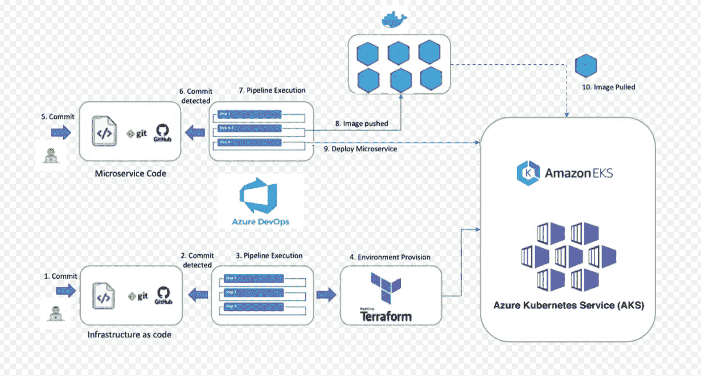
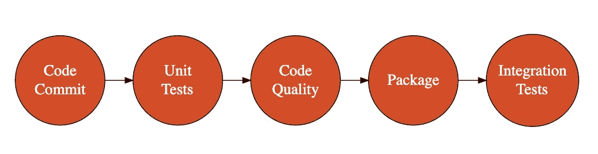
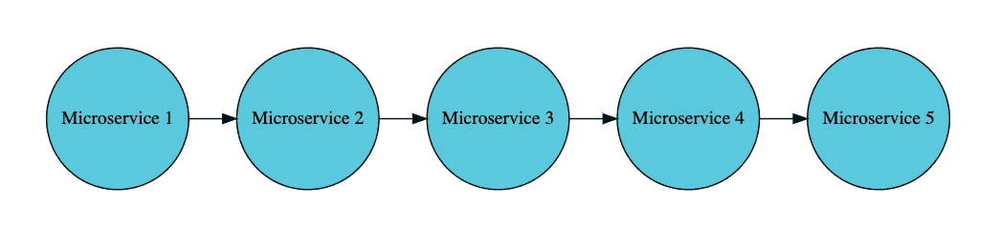
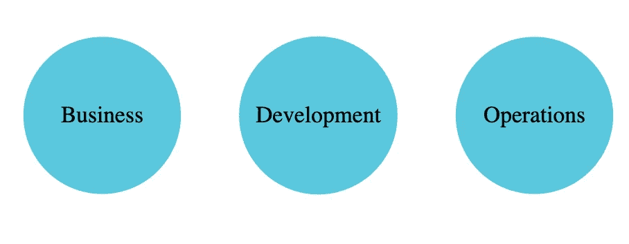
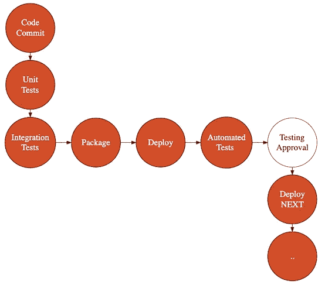
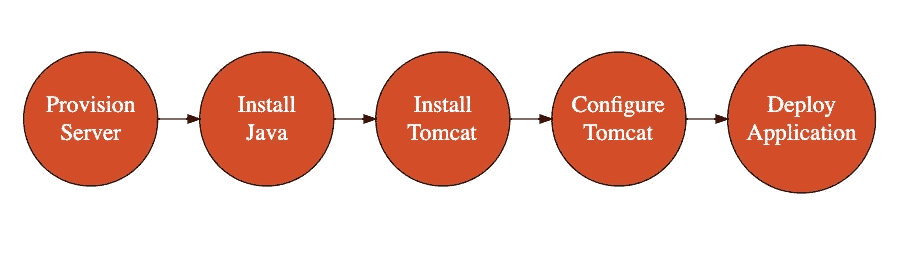
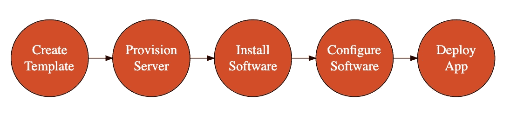
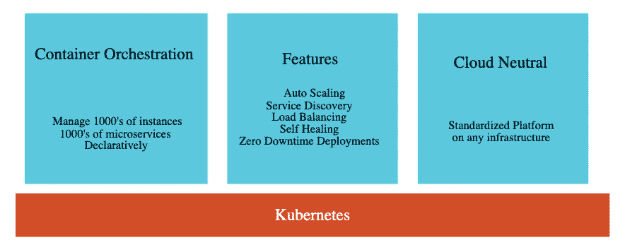
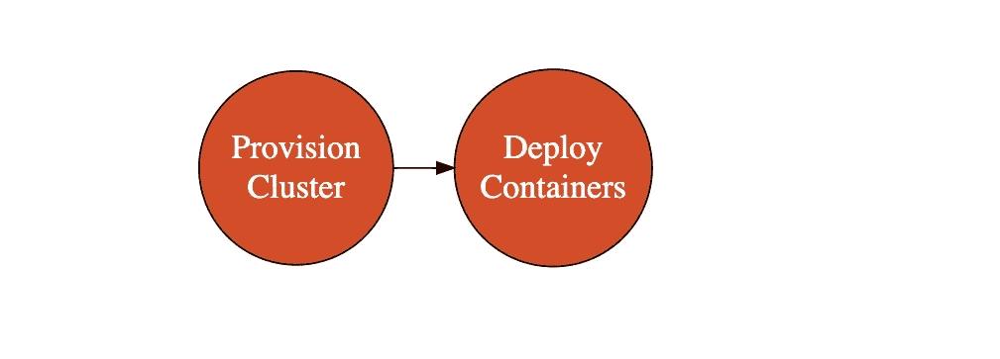

# DevOps 教程|带有 Docker、Kubernetes 和 Azure DevOps 的 DevOps

> 原文：<https://medium.com/javarevisited/devops-tutorial-devops-with-docker-kubernetes-and-azure-devops-3cd16966d023?source=collection_archive---------0----------------------->

在本文中，我们将注意力集中在 DevOps 上。

DevOps 是什么？和敏捷有什么不同？有哪些流行的 DevOps 工具？Docker，Kubernetes，Azure DevOps 在 DevOps 中的作用是什么？让我们从一个简单的用例开始。

# 你会学到的

*   DevOps 是什么？
*   我们为什么需要 DevOps？
*   DevOps 和敏捷有什么不同？
*   有哪些重要的 DevOps 工具？
*   Docker 如何帮助 DevOps？
*   Kubernetes 如何帮助 DevOps？
*   Azure DevOps 如何帮助 DevOps？
*   什么是持续集成，持续交付？
*   什么是作为代码的基础设施？
*   Terraform 和 Ansible 如何帮助 DevOps？

# 免费课程—10 步学会

*   [10 步学会 Docker](https://links.in28minutes.com/in28minutes-10steps-docker)
*   [十步学会 Kubernetes](https://links.in28minutes.com/in28minutes-10steps-k8s)
*   [10 步学会 AWS](https://links.in28minutes.com/in28minutes-10steps-aws-beanstalk)

这些都是快速入门的好方法，但是你需要一个全面深入的课程，你还应该查阅一下 [**Master DevOps with Docker，Kubernetes，以及 Azure DevOps**](https://click.linksynergy.com/deeplink?id=JVFxdTr9V80&mid=39197&murl=https%3A%2F%2Fwww.udemy.com%2Fcourse%2Fdevops-with-docker-kubernetes-and-azure-devops%2F) **。**目前可以打折买到。

# DevOps 是什么？

正如大多数关于软件开发的流行词一样，DevOps 没有公认的定义。

定义各不相同，从简单的，像这两个，到复杂的，持续一整页书的定义。

> **DevOps** 是**文化哲学、实践和工具**的组合，它**提高了**组织以**高速**交付应用和服务的能力——亚马逊网络服务(AWS)
> 
> **DevOps** 是一个组织内的**协作和多学科的**努力，以**自动连续交付**新的软件版本，同时**保证**它们的**正确性和可靠性**——devo PS 概念和挑战的调查——L Leite

**与其试图定义 DevOps** ，不如让我们了解一下软件开发是如何进化到 DevOps 的。

# 瀑布模型

软件开发的最初几十年是以瀑布模型为中心的。

瀑布模型处理软件开发的方式与你处理房地产项目的方式相同——例如，建造一座惊人的桥。

您将分多个阶段构建软件，这些阶段可以持续几周到几个月的时间。

在大多数瀑布项目中，企业需要几个月的时间才能看到应用程序的工作版本。

# 构建优秀软件的关键要素

在瀑布模型中工作了几十年后，我们理解了开发优秀软件的一些关键要素:

*   沟通
*   反馈
*   自动化

## 沟通的重要性

软件开发是一项涉及多种技能的多学科工作。

人与人之间的交流对于软件项目的成功至关重要。

在瀑布模型中，我们试图通过准备 1000 页关于需求、设计、架构和部署的文档来加强沟通。

但是，经过一段时间，我们明白了

*   加强团队内部沟通的最好方法是让团队团结起来。在同一个团队中获得多种技能。
*   跨职能团队——拥有广泛的技能——工作非常出色。

## 早期反馈的重要性

快速获得反馈很重要。构建优秀的软件就是要获得快速的反馈。

> 我们正在构建一个满足业务期望的应用程序吗？

你不能等几个月才得到反馈。你会想尽快知道。

> 如果您的应用程序部署到生产环境中，会有问题吗？

几个月后你就不想知道了。你想尽早发现它。

我们越早发现问题，就越容易解决它。

我们发现最好的软件团队是为了快速反馈而构建的。对于我正在做的任何事情，我想尽早知道我是否做对了。

## 自动化的重要性

自动化至关重要。软件开发涉及广泛的活动。手动操作既慢又容易出错。我们明白，始终寻找引入自动化的机会至关重要。

理解了开发优秀软件的关键要素之后，让我们看看我们是如何进化到[敏捷](https://javarevisited.blogspot.com/2018/01/top-5-free-agile-courses-for-programmers.html#axzz5QneAh3Kg)和[开发运维](/@javinpaul/10-free-courses-to-learn-docker-and-devops-for-frontend-developers-691ac7652cee)的。

# 进化到敏捷

敏捷是通过增强团队之间的交流、获得反馈和引入自动化来实现我们的学习的第一步。

敏捷将业务和开发团队整合到一个团队中，这个团队致力于在称为 sprints 的小迭代中构建优秀的软件。

敏捷不是在开发的每个阶段花费数周或数月时间，而是专注于在几天内，有时是在同一天内，通过开发周期完成被称为用户故事的小需求。

## 敏捷是如何增强团队之间的交流的？

敏捷将业务和开发团队聚集在一起。业务负责定义要构建什么？有什么要求？开发负责构建满足需求的产品。当我说开发时，我包括所有从事设计、编码、测试和包装你的软件的人。

在敏捷中，来自业务的代表，称为产品所有者，总是与团队在一起，团队清楚地理解业务目标。当开发团队没有很好地理解需求，并且走在一条错误的道路上时，产品负责人会帮助他们进行路线修正，并保持在正确的道路上。

> 结果:团队构建的最终产品是企业想要的。

另一个重要因素是敏捷团队拥有跨职能的技能——编码技能——前端、API 和数据库、测试技能和业务技能。这增强了人们之间的交流，他们必须一起工作来构建优秀的软件。

## 敏捷和自动化

敏捷团队关注的自动化领域是什么？

软件产品可能有各种各样的缺陷。

*   功能缺陷意味着产品不能按预期工作。
*   技术缺陷使得软件的维护变得困难。比如代码质量问题。

一般来说，敏捷团队关注于使用自动化来尽早发现技术和功能缺陷。

敏捷团队关注自动化测试。编写优秀的单元测试来测试你的方法和类。编写优秀的集成测试来测试您的模块和应用程序。敏捷团队也广泛关注代码质量。像 SONAR 这样的工具被用来评估应用程序的代码质量。

如果你有很好的自动化测试和代码质量检查，这就足够了吗？您会希望尽可能频繁地运行它们。敏捷团队关注持续集成。您承诺进行版本控制。您的单元测试、自动化测试和代码质量检查是在一个连续的集成管道中自动执行的。早期敏捷时期最流行的 CI/CD 工具是 Jenkins。

## 敏捷是如何促进即时反馈的？

最重要的因素是，企业不需要等待数月才能看到最终产品。在每个 sprint 的结尾，产品被演示给所有涉众，包括架构和业务团队。在为下一个 sprint 确定用户故事的优先级时，所有的反馈都被采纳了。结果:团队构建的最终产品是企业想要的。

另一个能够实现即时反馈的重要因素是持续集成。假设我将一些代码提交到版本控制中。30 分钟内，如果我的代码导致单元测试失败或集成测试失败，我会得到反馈。如果我的代码不符合代码质量标准或者在单元测试中没有足够的代码覆盖率，我会得到反馈。

敏捷成功了吗？是的。毫无疑问。通过专注于改善业务和开发团队之间的交流，以及专注于尽早发现各种缺陷，敏捷将软件开发带到了下一个层次。

就我个人而言，在敏捷模型中与一些令人惊奇的团队一起工作有一段美好的经历。对我来说，软件工程代表了构建软件从需求到实际应用的所有努力，这是第一次像编程一样令人愉快。

但是，进化停止了吗？没有。

新的挑战出现了。

# 微服务架构的发展

我们开始转向微服务架构，并开始构建许多小型 API，而不是构建大型整体应用程序。

新的挑战是什么？

运营变得更加重要。你不是一个月发布一次，而是每周发布数百次小型微服务。跨微服务调试问题并了解微服务发生了什么变得非常重要。

是时候用一个新的软件开发术语了。DevOps。Btw，如果你想了解更多关于微服务的知识，那么你也可以看看这些课程[用 Spring Boot 和 Spring Cloud](https://javarevisited.blogspot.com/2018/02/top-5-spring-microservices-courses-with-spring-boot-and-spring-cloud.html) 学习 Java 中的微服务:

</javarevisited/top-5-courses-to-learn-microservices-in-java-and-spring-framework-e9fed1ba804d>  

# DevOps 的出现

DevOps 的重点是什么？

DevOps 的重点是加强开发和运营团队之间的沟通。

*   我们如何让部署变得更容易？
*   我们如何让开发团队更容易看到运营团队的工作？

## DevOps 是如何增强团队之间的沟通的？

DevOps 拉近了运营团队与开发团队的距离。

*   在更成熟的企业中，开发和运营团队作为一个团队工作。他们开始分享共同的目标，两个团队都开始理解另一个团队面临的挑战。
*   在处于 DevOps 发展早期阶段的企业中，来自运营团队的代表可以参与冲刺阶段——站立和回顾。

## DevOps 团队关注哪些自动化领域？

除了敏捷的重点领域——持续集成和测试自动化，DevOps 团队还专注于帮助自动化运营团队的几项活动——供应服务器、在服务器上配置软件、部署应用程序和监控生产环境。一些关键术语是持续部署、持续交付和基础设施即代码。

持续部署就是在测试环境中持续部署新版本的软件。在更成熟的组织中，如谷歌、脸书，持续交付有助于持续地将软件部署到生产中——可能每天数百个生产部署。

基础设施即代码就是像对待应用程序代码一样对待基础设施。您可以使用配置以自动化的方式创建您的基础设施—服务器、负载平衡器和数据库。您可以对您的基础架构进行版本控制，这样您就可以跟踪一段时间内基础架构的变化。

## DevOps 是如何推广即时反馈的？

DevOps 将运营和开发团队聚集在一起。因为运营和开发是同一个团队的一部分，所以整个团队都了解与运营和开发相关的挑战。

*   任何操作问题都会很快引起开发人员的注意。
*   在将软件投入使用以引起运营团队的早期关注方面是否存在任何挑战。

DevOps 鼓励持续集成、持续交付和基础设施即代码。

*   由于连续交付，如果我做了可能破坏测试或试运行环境的代码更改或配置更改，我会在几个小时内知道。
*   由于基础设施是代码，开发人员可以自行调配环境、部署代码并自行发现问题，无需运营团队的任何帮助。

虽然我们说敏捷和 DevOps 是两件不同的事情，但实际上，DevOps 的含义并没有公认的定义。

我认为敏捷和开发运维是帮助我们改进如何构建优秀软件的两个阶段。他们并不互相竞争，但他们一起帮助我们构建令人惊叹的软件产品。

就我而言，敏捷和 DevOps 的目标是做一些事情

*   促进业务、开发和运营团队之间的沟通和反馈
*   通过自动化缓解棘手问题。在本课程的这个奇妙旅程中，我们将讨论单元测试、集成测试、代码质量检查、持续集成、持续交付、基础设施即代码以及通过容器化实现标准化。

# 德沃普斯的故事

这里有一个惊人的故事:

你是团队中的明星开发人员，你需要快速解决问题。你去一个 GitHub 库！

您快速签出项目。

你很快就创造了你的本地环境。

你做出改变。你测试一下。您更新单元和自动化测试。

你犯了。

您会收到一封电子邮件，说它已部署到 QA。

一些集成测试会自动运行。

您的 QA 团队收到一封请求批准的电子邮件。他们进行人工测试并批准。

您的代码将在几分钟内投入生产。

你可能认为这是一个理想的场景。但是，你知道这就是网飞、亚马逊和谷歌等创新企业日复一日发生的事情吗？

这是 DevOps 的故事。

# DevOps =开发+运营

DevOps 是软件开发的自然演变。DevOps 不仅仅是一个工具，一个框架或者仅仅是自动化。它是所有这些的组合。

DevOps 专注于人员、流程和产品。DevOps 的人员方面都是关于文化和创造一个伟大的心态。促进开放沟通和重视快速反馈的文化。重视高质量软件的文化。

敏捷有助于弥合业务和开发团队之间的差距。开发团队了解业务的优先级，并与业务合作，首先交付提供最大价值的故事。然而，开发和运营团队并不一致。

他们有不同的目标。

> 开发团队的目标是将尽可能多的新特性投入生产。
> 
> 运营团队的目标是尽可能保持生产环境的稳定。

如您所见，如果将产品投入生产很困难，那么开发人员和运营人员是不一致的。

> DevOps 旨在让开发和运营团队拥有共同的目标。

开发团队与运营团队合作，了解并解决运营挑战。运营团队是 scrum 团队的一部分，了解正在开发的特性。

> 我们如何使这成为可能？
> 
> 打破开发和运营之间的壁垒！

## 将开发和运营结合在一起—选项 1

在成熟的开发运营企业中，开发和运营作为同一个 scrum 团队的一部分工作，并分担彼此的责任。

## 将开发和运营结合在一起—选项 2

然而，如果您处于 DevOps 发展的早期阶段，您如何让 Dev 和 Ops 拥有共同的目标并一起工作呢？

以下是你可以做的一些事情:

*   你可以从让开发团队分担运营团队的部分职责开始。例如，开发团队可以在生产部署后的第一周负责新版本。这有助于开发团队了解运营部门在发布新版本时所面临的挑战，并帮助他们一起找到更好的解决方案。
*   你可以做的另一件事是让运营团队的代表参与 Scrum 活动。让他们参与团队的站立和回顾。
*   接下来您可以做的事情是让开发团队更清楚地看到运营团队所面临的挑战。当您在运营中面临任何挑战时，让开发团队成为解决方案团队的一部分。

无论你采取哪种方式，都要找到打破藩篱的方法，让开发和运营团队团结起来。

自动化带来了另一个有趣的选择。通过将基础设施用作代码并支持开发人员的自我配置，您可以创建一种运营和开发团队能够理解的通用语言——代码。在接下来的几个步骤中会有更多的介绍。

# DevOps 用例

考虑下图:

这张图片展示了两个简单的工作流程

*   第一:基础设施代码使用 Terraform 和 Azure DevOps 来提供 Kubernetes 集群
*   第二:持续部署微服务，使用 Azure DevOps 为微服务构建 Docker 映像并将其部署到 Kubernetes 集群中

这听起来复杂吗？

让我们把它分解开来，试着去理解它们。

让我们从第二点开始—首先是连续部署。

## 第二:devo PS Azure devo PS 和 Jenkins 的持续部署

如果不经常运行，那么拥有伟大的测试和代码质量检查有什么用呢？

如果不经常部署软件，部署自动化有什么用？

一旦开发人员将代码提交到版本控制系统中，就会执行以下步骤:

*   单元测试
*   代码质量检查
*   集成测试
*   应用程序打包—构建应用程序的可部署版本。工具— Maven、Gradle、Docker
*   应用程序部署—将新应用程序或新版本的应用程序投入使用。
*   给测试团队发一封电子邮件来测试应用程序。

一旦得到测试团队的批准，应用程序就会立即部署到下一个环境中。

这称为持续部署。如果您持续地部署到生产环境，这被称为持续交付。

最流行的 CI-CD 工具是 Azure DevOps 和 Jenkins

## 第一:DevOps 基础设施作为 Terraform 的代码

过去，我们常常手动创建环境和部署应用程序。

每次创建服务器时，都需要手动完成。如果呢？

*   Java 版本需要更新
*   需要应用安全补丁

你手动操作。

这样的结果是什么？

*   出错的可能性很高。
*   复制环境很困难。

## 基础设施作为代码

将基础设施视为代码—将基础设施视为应用程序代码

以下是将基础设施作为代码时需要理解的一些重要事项

*   基础设施团队专注于增值工作(而不是日常工作)
*   更少的错误和从故障中快速恢复
*   服务器保持一致(避免配置偏差)

最流行的 IaC 工具是 Ansible 和 Terraform。

IaC 中通常包括以下步骤

*   从模板中调配服务器(通过云实现)
*   安装软件
*   配置软件

服务器供应

通常，配置工具用于配置服务器，并使新服务器具备网络功能。最流行的供应工具是 CloudFormation 和 Terraform。

使用 Terraform，您可以供应服务器和其余的基础设施，如负载平衡器、数据库、网络配置等。您可以使用使用 Packer 和 AMI (Amazon 机器映像)等工具创建的预创建映像来创建服务器。

结构管理

配置管理工具用于

*   安装软件
*   配置软件

流行的配置管理工具有 Chef、Puppet、Ansible 和 SaltStack。这些设计用于在现有服务器上安装和管理软件。

# Docker 和 Kubernetes 在 DevOps 中的作用

DevOps 中 [Docker](/@javinpaul/10-free-courses-to-learn-docker-and-devops-for-frontend-developers-691ac7652cee) 和 [Kubernetes](https://javarevisited.blogspot.com/2019/01/top-5-free-kubernetes-courses-for-DevOps-Engineer.html) 的作用是什么？

在微服务领域，一些微服务可能是用 Java 构建的，一些是用 Python 构建的，一些是用 JavaScript 构建的。

不同的微服务将有不同的方式来构建应用程序并将它们部署到服务器。

这使得运营团队的工作变得困难。

我们如何以相似的方式部署多种类型的应用程序？输入集装箱和码头。

使用 Docker，您可以构建微服务的映像——不管它们的语言是 Java、Python 还是 JavaScript。您可以在任何基础设施上以同样的方式运行这些映像。

这简化了操作。

Kubernetes 通过帮助编排不同类型的容器并将它们部署到集群中来增加这一点。

Kubernetes 还提供

*   服务发现
*   负载平衡
*   集中式配置

Docker 和 Kubernetes 让 DevOps 变得简单。

如果你想了解更多关于 Docker 和 Kubernetes 的知识，你也可以看看这个课程列表。

<https://javarevisited.blogspot.com/2019/05/top-5-courses-to-learn-docker-and-kubernetes-for-devops.html>  

# 重要的 DevOps 指标

以下是一些重要的 DevOps 指标，您可以在一段时间内进行跟踪和改进。

*   部署频率—应用程序部署到生产环境的频率是多少？
*   上市时间——一个特性从编码到生产需要多长时间？
*   新版本的失败率——有多少版本失败了？
*   修复的准备时间——您需要多长时间进行生产修复并将其发布到生产环境中？
*   平均恢复时间—从重大问题中恢复您的生产环境需要多长时间？

# DevOps 最佳实践

以下是 DevOps 的一些最佳实践

*   标准化
*   具有跨职能技能的团队
*   关注文化
*   自动化，自动化和..
*   不变的基础设施
*   开发产品平价
*   版本控制一切
*   自我供应

# DevOps 成熟信号

您如何衡量 DevOps 实现的成熟度？

这里有一些要问的重要问题。

## 发展

*   每次提交都会触发自动化测试和自动化代码质量检查吗？
*   您的代码是否持续交付到产品中？
*   你使用结对编程吗？
*   你用 TDD 和 BDD 吗？
*   你有许多可重复使用的模块吗？
*   开发团队可以自我配置环境吗？
*   将快速修复交付生产需要多长时间？

## 试验

*   你的测试是完全自动化的吗？有高质量的产品化的测试数据吗？
*   当自动化测试失败时，您的构建会失败吗？
*   你的测试周期小吗？
*   你有自动 NFR 测试吗？

## 部署

*   你有开发产品平价吗？
*   你使用 A/B 测试吗？
*   您使用金丝雀部署吗？
*   你能按一下按钮就部署吗？
*   你能点击一个按钮就回滚吗？
*   您能否通过点击一个按钮来调配和释放基础架构？
*   您的基础架构是否使用 IAC 和版本控制？

## 监视

*   团队是否使用集中监控系统？
*   开发团队可以通过点击按钮来访问日志吗？
*   如果生产中出现问题，团队会收到自动警报吗？

## 团队和流程

*   团队是否希望持续改进？
*   团队是否拥有业务、开发和运营所需的所有技能？
*   团队是否跟踪关键的 DevOps 指标并对其进行改进？
*   你们是否有利用本地发现并利用它们进行全球改进的文化？

# DevOps 转型最佳实践

*   领导认同至关重要
*   涉及前期成本
*   设置 Coe 以帮助团队
*   选择正确的应用和团队
*   从小处着手
*   分享学习(时事通讯、交流、Coe)
*   鼓励具有探索和自动化思维的人
*   认可 DevOps 团队

# 在您离开之前—我们令人惊叹的 DevOps 课程

如果你喜欢这篇文章，你会喜欢我们关于 DevOps 的课程

*   200 多个视频。
*   20 多个小时。
*   6 DevOps 工具——Docker、Kubernetes、Azure DevOps、Jenkins、Terraform 和 Ansible。
*   3 种不同的云— AWS、Azure 和谷歌云。

可以在这里报名参加课程—[**Docker、Kubernetes、Azure DevOps**T3【大师 devo PS】](https://click.linksynergy.com/deeplink?id=JVFxdTr9V80&mid=39197&murl=https%3A%2F%2Fwww.udemy.com%2Fcourse%2Fdevops-with-docker-kubernetes-and-azure-devops%2F)

