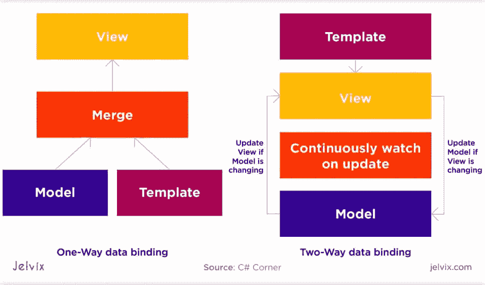
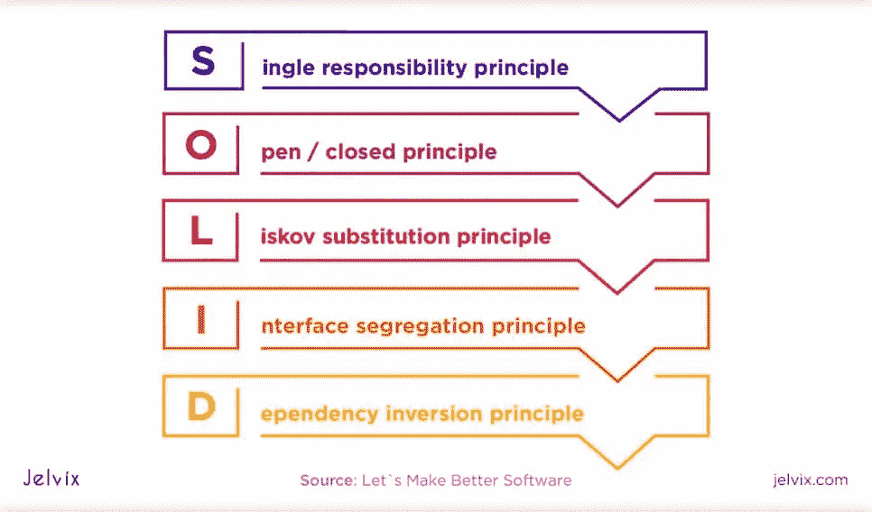
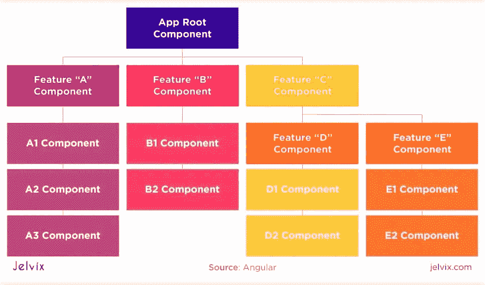
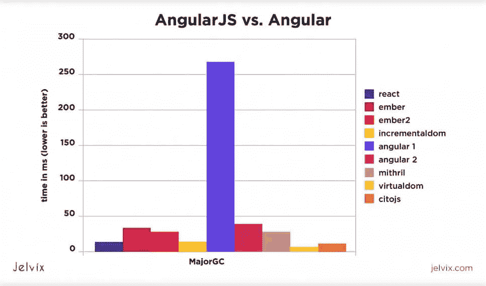
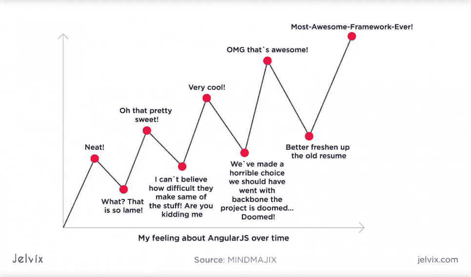
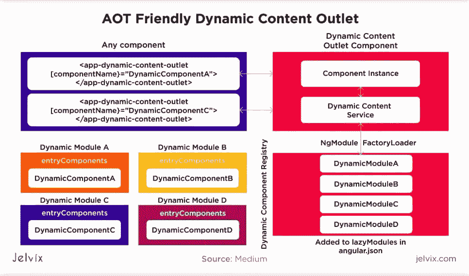
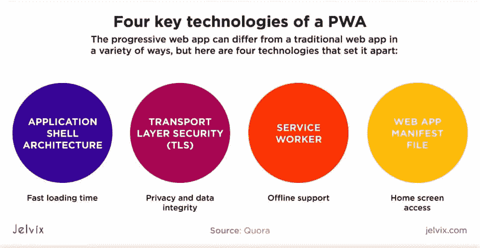
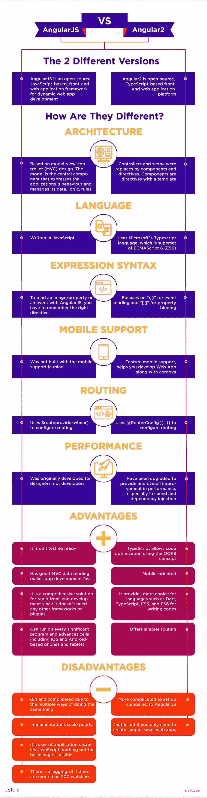

# 角度与角度的区别

> 原文：<https://medium.com/javarevisited/difference-between-angularjs-vs-angular-4ca72ac9b4d2?source=collection_archive---------2----------------------->

如今，web 框架一直在变化和发展。它们适应技术、浏览器要求和市场需求的变化。也许，没有一个 JS 框架像 Angular 那样欣然接受 JavaScript 的变化。自从 2009 年第一个版本 AngularJS 发布以来，这个工具就出现了。

现在有两种主要类型的 AngularJS vs Angular 2。所有这些工具的目的本质上都是一样的:让前端开发更容易，帮助用结构组织代码库和应用程序。

所有这些框架都有略微不同的功能和用例。是使用旧版本的 Angular 还是迁移到更新版本取决于项目的质量。那么，【AngularJS 和 AngularJS 有什么区别呢？

# 所有版本的 Angular

让我们从框架的每个版本的简要概述开始。了解 AngularJS vs Angular 背后的目的和关键技术将有助于您进行比较并获得清晰的图片。

**安古拉吉斯是什么？**

[AngularJS](https://angularjs.org/) 是一个用于 web 前端开发的开源框架。这个与 Angular 2 的主要区别在于，它基于纯 JavaScript，没有[类型脚本](https://jelvix.com/blog/typescript-vs-javascript)。对于模板，AngularJS 使用 HTML 属性。

**什么是棱角分明？**

当你看到一个名字 Angular 后面没有“JS”的时候，它指的是 Angular 2。两个框架都基于 JavaScript 的超集 [Typescript](https://www.typescriptlang.org/) 。Typescript 的主要目的是通过编辑静态类型，集成附加工具和 [IDE](https://jelvix.com/blog/best-javascript-ides) ，使 JS 编码更快，从而方便开发过程。

# AngularJS 与 Angular 的发展过程的差异

我们认为，发展进程是最大的分歧所在。我们决定分享我们使用每个框架的经验，并强调 AngularJS 和 Angular 之间的主要区别。

## 语言

所有这些框架都使用了 [JavaScript](/javarevisited/10-best-online-courses-to-learn-javascript-in-2020-af5ed0801645) ，但是主要的区别是 Angular 2 在顶层也使用了 [Typescript](/@javinpaul/7-best-courses-to-learn-typescript-in-depth-58439e1ce729) 。它是 JS 的一个超集，引入了静态类型，实时捕捉错误，并扩展了内置的文档特性。这里我们对两者进行了全面的比较，所以现在，让我们只关注本质上的区别。

AngularJS 使用一种动态类型的语言和浏览器处理的语言 JavaScript。用户可以随时(动态地)引入新的变量及其类型，而不必拘泥于预定义的类别。 [JavaScript](/javarevisited/12-free-courses-to-learn-javascript-and-es6-for-beginners-and-experienced-developers-aa35874c9a32) 直接在浏览器中处理，不需要编译成二进制代码。这有助于高响应性和交互性。

Angular 2 使用了 [Typescript](/javarevisited/top-10-free-typescript-courses-to-learn-online-best-of-lot-44bce9da41d1) ，这起初似乎是许多开发者的一个障碍。实际上，对 Typescript 的支持与其说是一个问题，不如说是一个优势。毕竟，它仍然是 JS，只是有几个额外的好处:

*   静态类型化:开发人员可以在整个项目中以同样有组织的方式为变量设置类型和维护代码。它适用于大型团队和复杂的基础设施。
*   **不需要到处使用 JS 文档**:在 JS 中查找 bug 和文档代码，需要编写注释，连接 [JS 文档](https://jsdoc.app/)。代码库变得沉重和难以阅读。在 Typescript 中，您可以编写简单的注释，比基本的 JS 提供更多的信息，但没有 docs 那么笨重。
*   **许多与 ide 的额外集成**。Typescript 支持[静态类型语言](https://en.wikipedia.org/wiki/Category:Statically_typed_programming_languages)的 ide，比如 [Java](/javarevisited/10-books-java-developers-should-read-in-2020-e6222f25cc72) 和 [C#](/javarevisited/5-best-c-c-sharp-programming-courses-for-beginners-in-2020-494f7afc7a5c) 。您有更多的工具和集成可供选择。

许多开发人员开始使用 Angular 2 是因为 Typescript 的最原生支持。它是 JS 的一个改进版本(尽管它确实有缺点，我们将在后面讨论)。

## 编码发生器

要开始使用 [Angular](https://dev.to/javinpaul/10-books-tutorials-and-courses-to-learn-angular-in-2019-2m0l) ，您需要创建文件结构、设置模板、部署和测试流程，并执行许多其他定制。这就是[自动代码生成器](https://angular.io/guide/schematics)真正有用的地方——有一个工具为你做这些准备是很方便的。

Angular.js 是一个相当固执己见的框架。整个项目期间的代码库应该适合预定义的模块。您需要为每个组件分配类型。在开发的早期阶段，当团队还没有意识到他们的最终目标时，就必须做出很多决定。

AngularJS 解决了这个问题，但让开发人员选择自己的模块系统，并在开发过程中进行更改，这导致了更高的灵活性和开发速度。与 AngularJS 不同，它附带了一个命令行工具。要启动一个项目，开发者只需要回答一个新的 app-name 命令。

## 组件与控制器

AngularJS 有[控制器](https://docs.angularjs.org/guide/controller)——包含元素的业务逻辑的组件。开发人员可以使用它们来定义功能的状态，并设置交互式响应。

Angular 2 没有控制器，只有[组件](https://angular.io/guide/architecture-components)。每个组件都有一个设计其状态和功能的文件:用于执行、模板、样式和单元测试。

每个组件都有一个特定的分配属性，每个属性都有其数组。方法定义属性对特定用户交互(例如，单击)的反应方式。组件通过编辑[类型脚本](https://javarevisited.blogspot.com/2018/07/top-5-courses-to-learn-typescript.html)参数属性来响应动作。

## 双向装订

AngularJS 吸引了许多团队，因为它可以根据状态的变化自动更新应用程序视图。这个过程也被称为[双向绑定](https://docs.angularjs.org/tutorial/step_06)，因为代码库是双向更新的。Angular 2，改变了它的绑定逻辑。现在，大多数指令执行单向绑定。让我们检查一下这两种类型，看看它们各自的优点和区别。

**单向绑定**是仅从视图到组件或从组件到视图更新数据的过程，而不是同时更新。通常，它用于设置属性、类和样式。开发人员可以编辑视图元素，而不会影响状态。

**双向绑定**用于响应用户交互(事件)。因为视图中的变化会影响组件，反之亦然，所以双向绑定是为应用程序项目设置动态接口的一种简单方法。你可以根据用户正在做的事情快速调整界面，并且同时执行。

在 [Angular 2](/javarevisited/top-10-angular-books-and-courses-for-beginners-and-experienced-web-developers-best-of-lot-9a2dae87f04c?source=collection_home---4------1-----------------------) 中，双向绑定变得更加难以执行。它不再是一个内置的过程，因为您需要手动创建指令。另一方面，单向绑定允许使用更有组织和更好隔离的代码库。

# 坚实的发展

[SOLID](https://en.wikipedia.org/wiki/SOLID) 是首字母缩写，代表软件开发的五个原则。SOLID 方法的目标是通过建立和遵循五个关键的开发标准来交付一个干净的、有组织的代码:

*   **单一责任**:一个班负责一个动作；
*   **打开/关闭**:该类可以被其他组件使用，但不能被它们改变；
*   **利斯科夫替换原则**:类可以被子组件替换。子类共享父类的特征；
*   **接口分离**:当类在一定条件下工作时，那些“承诺”应该被分成更小的部分。这样，一个大的条件被分割成了微元素，使得代码更加灵活。
*   **依赖倒置**:类可以被定义为改变或避免改变，这取决于它们的功能有多具体。班级的承诺越具体，改变的概率应该越小。

Angular 2 使用了 [Typescript](https://www.java67.com/2018/05/top-5-free-typescript-courses-to-learn.html) ，这是 JS 的一个子集，允许你抽象组件并移除不必要的依赖。开发人员可以使用接口来分离组件，甚至可以单独运行和测试它们。

## 表单验证

虽然 Angular 一般用 Typescript，但是验证形式和 AngularJS 没什么区别。以模板为基础，用 [JavaScript](/hackernoon/10-websites-to-learn-javascript-for-beginners-31e13bbdbb5c) 执行。然而，creators 也为更灵活的定制启用了一组额外的特性。开发人员可以创建一组动态规则，制作可重用的验证器，管理访问设置，监督和管理流程。

[表单验证](https://angular.io/guide/form-validation)变得更加安全和直观。现在，开发人员对用户如何与表单交互有了更多的了解，也有了更多改善这种体验的选择。

## 按指定路线发送

[Routing](https://angular.io/tutorial/toh-pt5) 用于管理用户在应用程序中的操作，编辑访问设置，并定义用户在任何操作后将看到页面的哪个部分。当它们在应用程序中移动时，页面的元素可以根据交互改变它们的位置和状态。这主要用在单页面应用程序中，JS 只是上传现有页面，而不是重新加载页面。因此，动态更新对于实现流畅的应用程序功能至关重要。

为了实际执行，团队使用[角路由器](https://angular.io/api/router)。通过创建一个路由应用程序，开发人员可以控制页面上的导航，并解释用户的操作。

这些是 AngularJS 和 Angular 在语法和开发过程方面的一些关键区别。总的来说，这个过程变得简单多了。具有静态类型和实时垃圾收集的 Typescript 允许交付更干净的代码库。

表单验证等流程的可选定制选项允许开发人员获得更多关于用户行为的信息，并使软件适应更多场景。

# 角度与角度的性能

在开始 Angular 开发或从 AngularJS 升级您的代码库之前，您可能需要了解另一个方面——性能的变化。从旧版本切换到新版本会如何影响速度、可靠性和用户体验？让我们来看看。

## 速度

AngularJS 和 Angular 都非常快。AngularJS 代码库更小，因为它没有任何附加的子集和文档，这在某种程度上有助于更快的执行速度。然而，它只对不使用 JS.docs 的团队有效——很多开发人员都使用。

如果你坚持用文档或 JS 代码，那么 Angular 和它的 Typescript 将是一个更好的选择。Typescript 比 JS 文档简洁得多，不需要定制，最终性能也快得多。最重要的是，您获得了更干净的代码库，这意味着您避免了可能导致性能延迟的错误。

因此，即使 AngularJS 在技术上应该更快(由于较小的代码库和双向绑定)，Angular 可能是专注于详细培训代码的团队的更好选择。

## 依赖注入

Angular 为开发人员提供了设计一个模型的可能性，该模型将为特定的依赖关系创建实例。您可以设计一个负责注入的服务，而不是让每个组件创建自己的依赖项。代码越大，过程就变得越混乱。

[依赖注入](https://angular.io/guide/dependency-injection)允许控制许多类的依赖和微调。组件可以使用同一个依赖实例，而不必总是重写它。这是一种更快、更轻、更干净的方法。

## 代码库大小

分析框架性能时要考虑的另一个重要因素是代码库的大小。这不是主要因素——最终，代码的质量更重要，但是一般来说，代码越小，运行得越好。

JavaScript 在大小上比 Typescript 有优势。它很简短，没有额外的内置文档。如果你是一个人或者和一个小团队一起工作，使用 JavaScript 会更舒服。

然而，新的 AngularJS 版本使用 Typescript，尽管它使代码更容易理解，并增加了代码的大小。开发的进程和应用的速度都略有下降。然而，如果我们只看规模的话，还有其他因素会过度补偿这个问题，比如集成和定制的 ide。

# 学习和生态系统

切换到 Angular 2 的主要问题是学习 Typescript。有了 JS，事情就简单多了。它是目前最流行的软件开发语言。生态系统是巨大的——有许多免费的教育资源和优秀的文档。

另一方面，Typescript 在最流行的开发语言 [Red Monk 的排名](https://redmonk.com/sogrady/2020/02/28/language-rankings-1-20/)中排名第 9。两者受欢迎程度的差异显而易见。

然而，对于熟悉 JS 的开发人员来说，学习 Typescript 应该不是什么大问题。尽管 Typescript 经常被视为一种独立的语言，但它在技术上仍然是基于 JS 的，所以很多东西是相同的。

就生态系统而言，AngularJS 在它还在运行的时候可能是一个更好的选择。然而，现在官方对该版本的支持已经抓住了，通过与旧版本合作，你实际上是在将自己从生态系统中切割出来。我们可能再也看不到 AngularJS 的任何更新了。

# 优点和缺点

如果您已经使用过 AngularJS，并且正在考虑将您的代码迁移到新版本，您可能会对各自框架的优缺点感兴趣，所以让我们来看看 Angular 和 AngularJS 之间的区别。

## **棱角分明的 JS**

**优点**

*   简单的单元测试:AngularJS 团队一直为框架的编写考虑到了测试而感到自豪，这样就没有理由不再运行单元测试了。开发人员可以注入对 XHR 请求的依赖，将它们从整个 DOM 中分离出来，并逐个测试组件。这个特性在 Angular 中也存在。
*   **快速 MVC 控制** : AngularJS 允许同时更新视图和控制器，提高开发速度。
*   **HTML 的直观使用:**AngularJS 的目的之一就是将 HTML 用于动态视图以及静态文件。与其他解决方案不同，AngularJS 没有将 HTML 从动态开发中移除，而是为其开发了一个工具包。
*   **学习曲线短:** AngularJS 对于熟悉 [JavaScript 和 HTML](https://www.w3schools.com/html/html_scripts.asp) 的开发者来说很容易学会。因为这些是 web 开发人员的基本能力，所以对大多数用户来说不是问题。框架本身的逻辑非常直观。受欢迎程度:AngularJS 是最受欢迎的框架之一，还有 Vue 和 React。

然而，如果你使用过 AngularJS，你肯定会注意到一些不便之处。我们在比较中部分地谈到了它们，所以让我们回顾一下要点并增加一些新的要点。

**缺点**

*   **太多的方法**:尽管框架总体上很简单，但许多开发人员在选择正确的做事方式方面存在问题。Angular 提供了太多的变化。
*   **缩放问题**:随着代码库越来越大，错误也越来越多。对于许多 AngularJS 开发者来说，处理大项目中的依赖关系是一个严肃的问题。
*   **如果 AngularJS 应用程序的用户禁用了 JavaScript，则除了基本页面**之外，什么也看不到。
*   如果实时有超过 200 个开发者，就会有一个滞后的 UI。

# 用例

Angular 的用例与 AngularJS 非常相似。所有需要交互性、快速性能和动态页面重载的项目肯定会从使用 Angular 中受益。在我们看来，Typescript 的出现进一步扩大了 Angular 的范围，使它非常适合雄心勃勃的项目。

## 1.企业网络应用

使用可选的静态类型和 Angular 实时捕获 bug 的能力有助于企业避免关键问题。这对于在医疗保健、金融和运输等行业运营的公司尤其重要。

一个小小的错误就可能导致大规模的停机，并造成巨大的声誉损失。这样，如果你使用 JavaScript，你将不得不到处应用 js 文档，只是为了避免这些问题。

Jsdocs 会对性能产生负面影响，因为代码库变得巨大且难以阅读。仔细检查大型开发团队中每个成员留下的明确文档并不是一件容易的事情。

Typescript 和 Angular 使得与大型团队合作变得更加容易，允许提供更好的性能和更快的工作速度。

## 2.动态应用

Angular 主要是为单页应用程序开发的，现在仍然是市场上的最佳选择。它速度快，变化快，并对用户的动作做出反应。这也是 [MVP 开发](https://jelvix.com/blog/what-is-an-mvp-and-why-should-you-build-one)的一个流行选项 Angular 的另一个常见用例。

当然，具有默认双向绑定的 AngularJS 可能更有吸引力，但是 Angular 也有自己的优势——比如高度改进的依赖注入。不必更新每个组件是一个巨大的优势。

## 3.渐进式网络应用(PWAs)

[渐进式网络应用](https://en.wikipedia.org/wiki/Progressive_web_application)是一个相对较新的趋势，但它们很可能是网络开发中的下一件大事。渐进式 web 应用程序的感觉和外观都像移动应用程序，但它可以通过浏览器访问，无需下载或安装。在我们的[网站架构指南](https://jelvix.com/blog/guide-to-web-application-architecture)中有更多关于它们的内容——请随意查看。

Angular 是 PWA 开发的一个很好的选择，因为团队非常积极地拥抱这项技术。Angular 是第一批认真对待这种架构的框架之一，并根据 PWAs 调整了他们的更新。

# 结论

我们可以这样来结束 AngularJS 和 Angular 的比较:Angular 作为最新版本，具有 AngularJS 的许多优点，但同时又有新的额外功能。在我们看来，使用 Typescript 是一个巨大的优势。它高效、信息量大，非常适合大型团队的合作。

如果您正在考虑迁移 AngularJS 代码，最好现在就做。延迟迁移对您的软件或团队没有好处，因为您不会处于生态系统变化的循环中。

如果你有问题，你可以联系我们的 [Angular 开发者](https://jelvix.com/technologies/javascript-development)，他们会带你了解项目的细节。从 AngularJS 和 Angular 的早期开始，我们就有使用它们的经验，所以我们有很多关于它们的语法和生态系统的东西可以分享。

*最初发表于*[*【https://jelvix.com】*](https://jelvix.com/blog/angularjs-vs-angular)*。*