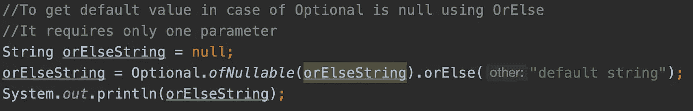
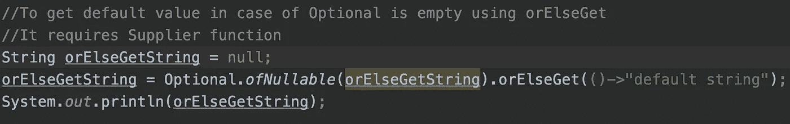
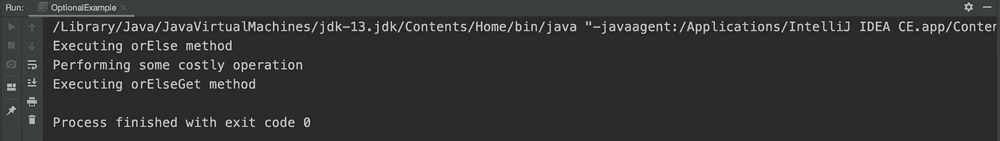

# Java 8 可选类 orElse 和 orElseGet 方法的区别。

> 原文：<https://medium.com/javarevisited/difference-between-java-8-optional-class-orelse-and-orelseget-methods-3698fefa72ed?source=collection_archive---------4----------------------->

读者们好，

Java 8 引入了许多新特性，如 Lambda 表达式、方法引用、函数接口、流 API、默认方法等，使开发人员的生活变得更加轻松。其中最重要的是选修课。它为表示可选值而不是空引用提供了类型级的解决方案。高效使用 Optional 可以帮助[避免 Java](https://javarevisited.blogspot.com/2013/05/ava-tips-and-best-practices-to-avoid-nullpointerexception-program-application.html) 中的 NullPointerException。

optional 类附带了两个有用的方法 **orElse** 和 **orElseGet，**，如果 Optional 为空，则返回默认值。

*   OrElse 方法—它接受一个参数，该参数是 Optional 为 null 时要返回的值。这里 orElse 也可以接受 null 作为结果默认值，尽管从 orElse 方法返回 null 并不是一个好的做法。

*   OrElseGet 方法—它接受一个参数，该参数是当 Optional 为 null 时返回值的供应商函数。这里需要注意的一点是，当 Optional 为 null 并且 Supplier 函数也为 null 时，就会抛出 NullPointerException。在内部，它使用 supplier.get()方法来获取值，很明显，如果一个供应商为空，那么它将导致 NPE(在 Java 中不应该有一个[空检查](https://javarevisited.blogspot.com/2016/01/how-to-check-if-string-is-not-null-and-empty-in-java-example.html)用于这个方法:P)

很明显，在空可选的情况下，这两种方法都有助于获得默认值，但是这两种方法有什么不同，什么时候使用哪一种呢？

在性能方面有很大的区别。无论 Optional 是否为 null 都将执行 orElse 方法，但是 orElseGet 方法只有在 [Optional 为 null](https://javarevisited.blogspot.com/2017/04/10-examples-of-optional-in-java-8.html#axzz6ccm5KWKs) 时才会执行。当默认值提供程序函数是一个开销很大的操作时，这种行为很有用。

上面的程序将生成下面的输出。很明显，在使用[或](https://www.java67.com/2018/06/java-8-optional-example-ispresent-orElse-get.html)方法的情况下，当 Optional 不为空时，避免了高成本的操作。

这就是 orElse 和 orElseGet 方法的区别。

谢谢你的时间和快乐的学习！