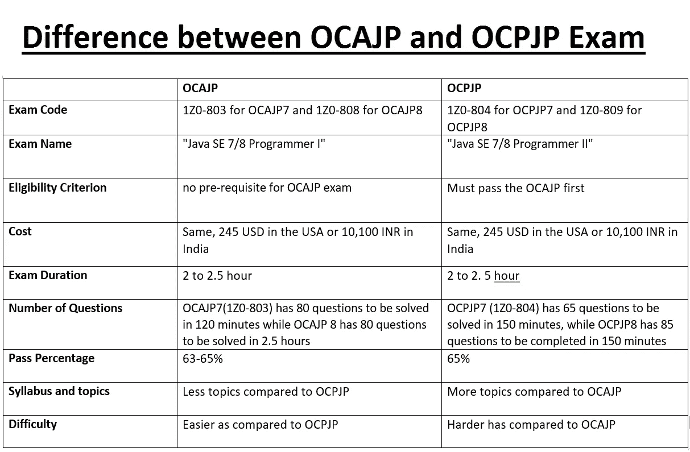
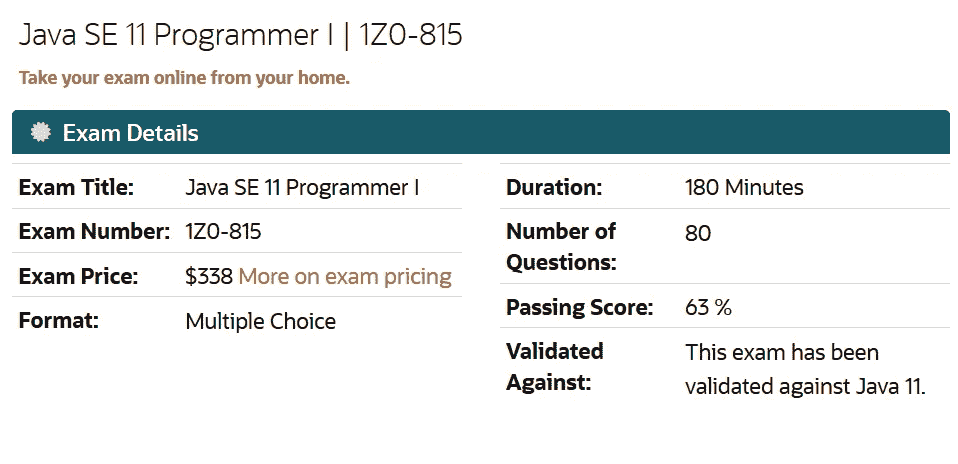
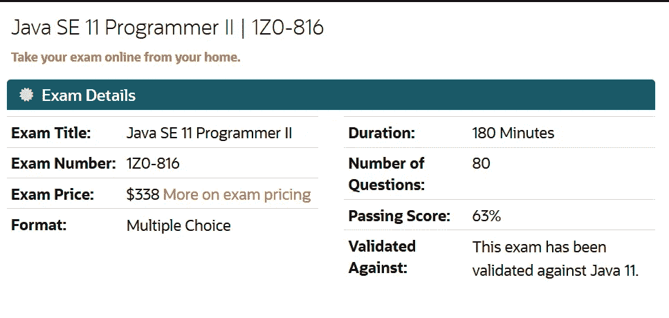
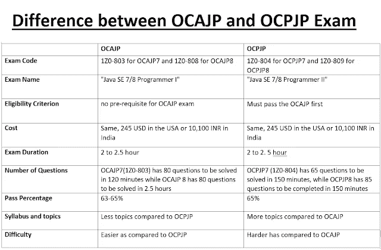

# OCAJP 和 OCPJP Java 程序员认证考试的区别

> 原文：<https://medium.com/javarevisited/difference-between-ocajp-and-ocpjp-certification-exams-for-java-programmers-1c91632c9a3d?source=collection_archive---------0----------------------->

image_credit — Whizlabs

早些时候，Sun Microsystems 负责 Java，流行的 Java 认证被称为“Sun 认证 Java 程序员”或“SCJP ”,当时只有一个考试，你需要通过才能成为认证 Java 开发人员，但当甲骨文在 2010 年接管 Sun Microsystems 时，SCJP 走了，OCAJP 和 T2 和 OCPJP 诞生了。

由于 Oracle 已经有了针对数据库管理的认证，如 OCA(代表 Oracle certified associates)和 OCP(代表 Oracle Certified Professional ),因此它引入了新的 Java 认证来匹配现有的层次结构，它们在 Java 世界中被称为 OCAJP 和 OCPJP。

**【OCAJP】是一个助理级别的考试**，表明你对 Java 编程语言及其特性有一个基本的了解，但是 OCPJP 是一个专业级别的考试，表明开发人员不仅熟悉 Java 基础知识，而且很好地理解 Java API 和在现实世界中构建 Java 应用程序所需的各种其他关键 Java 概念，如 JDBC、NIO、Java 8 特性和新的日期和时间 API。

简而言之，OCAJP 是基础(准)水平的 Java 考试，而 OCPJP 是更高水平的考试(专业水平)，但要记住的关键一点是，它们是两个独立的考试，你需要通过这两个考试才能成为认证 Java 开发人员。

目前有两种版本的 OCAJP 和 OCPJP 考试，如 OCAJP 11 (1Z0- 815)和 OCPJP 11(1z 0-816)成为 Java SE 11 认证程序员，OCAJP 8(1z 0-808)和 OCPJP 8(1z 0-809)成为 Java SE 8 认证开发人员。

要记住的最重要的事情是，如果你只是通过了 OCAJP 11 级或 OCAJP 8 级考试，你就不能成为一名认证开发人员，你必须成对通过，例如 OCAJP 11 + OCPJP 11 或 OCAJP8 + OCAPJP8。即使你通过了 OCAJP 8 级考试，你也不能参加 OCPJP 11 级考试，因为你没有通过 1z 0–808。

顺便说一下，如果您正在准备 Java SE 11 认证(Oracle Java 认证的最新版本)，并且正在寻找资源，那么我强烈建议您查看由 Tim Buchalaka 及其团队在 Udemy 上开设的 [**Oracle Java 认证—通过 Java 11 SE 1z 0–815 考试**](https://click.linksynergy.com/deeplink?id=JVFxdTr9V80&mid=39197&murl=https%3A%2F%2Fwww.udemy.com%2Fcourse%2Foracle-java-11-programmer-exam-1z0815%2F) 课程。它涵盖了所有考试主题，包括模块。

 [## Oracle Java 认证—通过 Java 11 SE 1z 0–815 考试

### 结果出来了！真正的学生，就像您一样，正在利用本课程通过 Oracle Java 认证考试。这里…

udemy.com](https://click.linksynergy.com/deeplink?id=JVFxdTr9V80&mid=39197&murl=https%3A%2F%2Fwww.udemy.com%2Fcourse%2Foracle-java-11-programmer-exam-1z0815%2F) 

# OCAJP 和 OCPJP 认证的区别

正如我所说的，尽管 OCAJP 和 OCPJP 是 Java 核心考试，但它们是两种不同的考试，因此它们有不同的考试代码、教学大纲、资格标准和难度。我们很快会比较它们，但这是你需要记住的。

## 1.**考试代码**

两者都有不同的考试代码，一般来说，OCAJP 的考试代码比相应的 OCPJP 考试代码低，如 Java SE 11，OCAJP 11 的考试代码为 1z 0–815，而 OCPJP 11 的考试代码为 1z 0–816。类似地，对于 Java SE 8 认证，OCAJP8 的代码为 1z 0–808，而 OCPJP 8 的代码为 1z 0–809。

## 2.**考试名称**

正如我告诉你的，两者是不同的考试。OCAJP 通常被称为程序员 I 认证，OCPJP 通常被称为 OCPJP 8 认证。例如，OCAJP 11 被称为“Java SE11 程序员 I”，OCPJP 11 被称为“Java SE 11 程序员 II”，类似地，OCAJP 8 被称为“Java SE 8 程序员 I”，OCPJP 8 被称为“Java SE 8 程序员 II”

## 3.**合格标准**

OCAJP 考试没有先决条件。任何人都可以这样做，即使你不是计算机科学毕业生、大学辍学生、代码营学生、自由撰稿人或自学程序员，你也可以参加 OCAJP 考试。但是对于 OCPJP 考试，你必须首先通过 OCAJP 考试。最重要的是，只有通过了 OCAJP 和 OCPJP 的考试，你才能成为认证 Java 开发人员。

## **4。成本**

令人惊讶的是，大多数 Java 认证的费用是一样的。比如 OCAJP 11，OPJP 11，OCAPJ8，OCPJP8 的费用在美国都是 **245 美元**，在印度都是**10100 印度卢比**。费用因国家而异，例如在英国大约是 155 GPB，在加拿大和澳大利亚大约是 336 加拿大元和 336 澳大利亚元，在瑞士大约是 248 瑞士法郎。

## **5。考试持续时间**

通常，OCAJP 和 OCPJP 的考试持续时间为 2.5 小时或 150 分钟，但 OCAJP 11 或 1z 0–815 考试为 3 小时。

## 6.**问题数量**

不同的考试有不同数量的问题，如 OCAJP 8 有 80 个问题需要在 2.5 小时内解决，OCPJP8 有 85 个问题需要在 150 分钟内完成。但是，从 Java SE 11 认证来看，OCAJP 11 和 OCPJP 11 有相同数量的问题需要在相同的时间内解决。例如，Z0-815 有 80 个问题需要在 180 分钟内解决，而 1z 0-816 有 80 个问题需要在 180 分钟内解决。同样的，

## **7。通过率**

通常，通过率在 65%左右，但是 OCAJP 11 号的通过率是 63%。

## 8.**教学大纲和主题**

不同的考试大纲和考试题目是不同的。您可以在 OCAJP 11、OCPJP 11、OCAJP8 和 OCPJP8 的相关部分查看每个考试的确切主题。一般来说，OCA 考试包含的题目较少，OCP 包含的题目较多，1z 0–804 和 1z 0–809 也不例外。

我建议参加 [**Oracle Java SE 8 认证— OCAJP 预备课程**](https://click.linksynergy.com/deeplink?id=JVFxdTr9V80&mid=39197&murl=https%3A%2F%2Fwww.udemy.com%2Fcourse%2Fwhizlabs_ocajp8%2F) ，以及 Udemy 针对 OCAJP 考试的在线课程，它会让你很好地了解 Java 编程语言的基本特性。

 [## Oracle Java SE 8 认证- OCAJP 预备课程

### Whizlabs 是全球在线培训提供商的先驱。我们提供以下方面的在线认证培训…

udemy.com](https://click.linksynergy.com/deeplink?id=JVFxdTr9V80&mid=39197&murl=https%3A%2F%2Fwww.udemy.com%2Fcourse%2Fwhizlabs_ocajp8%2F) 

# ocajp 7(1z 0–803)与 ocpjp 7(1z 0–804)

以下是 OCAJP 7 级和 OCPJP 7 级考试之间一些有用的区别

考试编号:1z 0–803
考试名称: **Java SE 7 程序员 I**
时长:120 分钟
题数:80
及格分数:63%
验证对照:Java SE 7
格式:多选
考试价格:CHF 238

**资源**
[1z 0–803 考试大纲或考试题目](https://education.oracle.com/pls/web_prod-plq-dad/db_pages.getpage?page_id=5001&get_params=p_exam_id:1Z0-803)
[1Z0 1z 0–804
考试题目: **Java SE 7 程序员 II**时长:150 分钟
题量:65
及格分数:65%
验证针对:Java SE 7。
格式:多选
考试价格:瑞士法郎 238 更多关于考试定价

**资源**](http://www.java67.com/2016/07/3-best-books-to-prepare-ocajp-7-1z0-803.html) [1Z0–804 考试大纲](https://education.oracle.com/pls/web_prod-plq-dad/db_pages.getpage?page_id=5001&get_params=p_exam_id:1Z0-804)
[1Z0–804 书籍](http://www.java67.com/2016/07/top-5-ocpjp7-books-for-1z0-804-and-1z0-certification.html)
[1Z0–804 转储](http://www.shareasale.com/r.cfm?B=492800&U=880419&M=43514&urllink=)
[1Z0–804 免费模拟考试](http://www.java67.com/2017/08/ocajp7-mock-exams-oracle-certified-Java-SE-7-Programmer-Certification-Sample-Questions.html)
[1Z0–804 考试](http://javarevisited.blogspot.sg/2017/07/entuware-or-whizlabs-which-exam-simulator-best-for-java-certification.html#axzz4wnwcAqB6)

# ocajp 8(1z 0–808)与 ocpjp 8(1z 0–809)

以下是 Java 中 OCAJP 8 和 OCPJP 8 认证考试的一些重要区别

**考试编号:1z 0–808**
考试名称:Java SE 8 程序员 I
持续时间:150
问题数量:80
及格分数:65%
查看及格分数政策
验证依据:
本考试是为 Java SE 8 版本编写的。
考试价格:CHF 238

**资源:**
[1z 0–808 考试大纲](https://education.oracle.com/pls/web_prod-plq-dad/db_pages.getpage?page_id=5001&get_params=p_exam_id:1Z0-808)
[1z 0–808 书籍](http://www.java67.com/2017/05/top-5-books-for-ocajp8-and-ocpjp8-Java-8-certification-exam.html)
[1z 0–808 转储](http://shrsl.com/?g0ce)
[1z 0–808 免费模拟考试](http://javarevisited.blogspot.sg/2015/11/5-free-ocajp8-ocpjp8-mock-exams-and-practice-questions.html#axzz4wnwcAqB6)
[1z 0–808 考试模拟器](http://www.java67.com/2017/03/top-10-ocajp-and-ocpjp-exam-simulators.html)

格式:多项选择
考试价格:CHF 238

**资源:**
[1z 0–809 考试大纲](https://education.oracle.com/pls/web_prod-plq-dad/db_pages.getpage?page_id=5001&get_params=p_exam_id:1Z0-809)
[1z 0–809 书籍](http://javarevisited.blogspot.sg/2016/10/top-2-books-for-ocpjp8-certification-1Z0-809-810-813.html)
[1z 0–809 转储](http://shrsl.com/?g0cb)
[1z 0–809 免费模拟考试](http://www.java67.com/2017/05/10-free-java-8-certification-sample-questions-OCAJP8-OCPJP8-Mock-Exams.html)
[1z 0–809 考试模拟器您可以随时通过参加 1z 0–810 或 1z 0–0813 考试来提升自己。参见](http://javarevisited.blogspot.sg/2016/11/top-5-java-8-practice-test-and-exam-simulators-best-OCAJP-OCAPJP.html#axzz4wnwcAqB6)[这篇](http://javarevisited.blogspot.sg/2017/01/difference-between-ocpjp-8-upgrade-exams-1Z0-813-1Z0-810.html)文章，了解更多关于你应该参加哪种 Java 认证考试的信息。

以下是 OCAJP 和 OCPJP 认证考试之间的区别:

这就是 OCAJP 和 OCPJP 考试的差异。这种差异适用于 OCAJP 7 比 OCPJP 7，以及 OCAJP 8 比 OCPJP 8。题目、费用或其他考试细节可能因时间而异，但专业水平和资格标准将保持不变，直到甲骨文决定取消它。

【OCAJP】是副科级考试，比 OCPJP 容易，是专业级考试。

虽然你必须通过 OCAJP 和 OCPJP 的考试才能成为一名认证的 Java 开发人员，比如成为一名 Java SE 8 认证的程序员，但是你必须通过 ocajp 8(1z 0–808)和 ocpjp 8(1z 0–809)的考试。

一些**对 Java 认证有志者有用的文章**
[Java 认证对工作和事业有帮助吗？](http://javarevisited.blogspot.sg/2014/01/does-java-certifications-like-scjp-ocjp-ocpjp-helps-carrer-job-interviews.html#axzz4wnufQwMV)
[应该考哪个 Java 8 认证？1z 0–808 还是 1z 0–810？](http://javarevisited.blogspot.sg/2017/05/which-java-8-certification-should-you-take-1Z0-808-809-810-813-OCAJP-OCPJP.html#axzz4wnalvxO2)
[准备 Oracle Java 认证的 5 个技巧](http://javarevisited.blogspot.sg/2016/12/5-tips-to-prepare-for-oracle-java-certifications-OCAJP-OCPJP-exams.html) [为什么要成为 Java 认证？甲骨文认证专家挣得多吗？](http://javarevisited.blogspot.sg/2014/01/why-java-certifications-are-good-for.html#axzz4wnufQwMV)
[什么时候成为 Java 认证 Pr](http://javarevisited.blogspot.sg/2015/07/good-time-to-become-java-certified-programmer-discount.html)
[OCAJP 7 或者 OCAJP 8？应该考哪个 Java 认证？](http://www.java67.com/2015/07/ocajp-7-or-ocajp-8-which-java-certification-should-I-take.html)
[Java 认证 7 大实践考试及课程](/javarevisited/top-7-practice-tests-and-mock-exams-to-prepare-for-oracles-java-certifications-ocajp-and-ocpjp-36502d4ca061)
[5 大春季专业认证资源](/javarevisited/top-5-spring-professional-certification-exam-resources-for-java-developers-3ef9fa42fe13)
[如何破解 Oracle 的 Java 认证](/javarevisited/java-certifications-how-to-crack-it-practical-tips-to-prepare-ocajp-and-ocpjp-exams-538f6fe36b37)
[7 大最佳课程破解 Java SE 8 认证](/javarevisited/7-best-online-courses-to-prepare-for-oracles-java-se-8-certification-ocajp-8-and-ocpjp-8-2fd0d6779a9e)
[Java SE 11 认证我最喜欢的书籍和学习指南](/javarevisited/5-best-books-courses-and-practice-tests-to-crack-java-se-11-certification-ocajp-11-1z0-815-6c861d6d147f)

感谢您阅读本文。如果你喜欢这个教程，请与你的朋友和同事分享。如果您有任何问题或反馈，请留言。

***P. S. —*** 如果您正在准备 Java SE 11 认证(Oracle 最新的 Java 认证)并在寻找资源，那么我强烈推荐您在 Udemy 上查看由 Tim Buchalaka 及其团队开设的 [**Oracle Java 认证—通过 Java 11 SE 1z 0–815 考试**](https://click.linksynergy.com/deeplink?id=JVFxdTr9V80&mid=39197&murl=https%3A%2F%2Fwww.udemy.com%2Fcourse%2Foracle-java-11-programmer-exam-1z0815%2F) 课程。它涵盖了所有考试主题，包括模块。

 [## Oracle Java 认证-通过 Java 11 SE 1Z0-815 考试

### 结果出来了！真正的学生，就像您一样，正在利用本课程通过 Oracle Java 认证考试。这里…

udemy.com](https://click.linksynergy.com/deeplink?id=JVFxdTr9V80&mid=39197&murl=https%3A%2F%2Fwww.udemy.com%2Fcourse%2Foracle-java-11-programmer-exam-1z0815%2F)