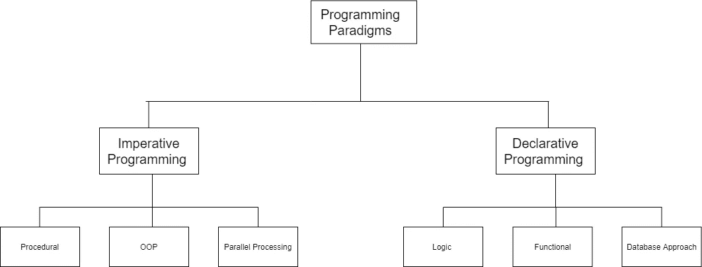

# 命令式编程和声明式编程的区别

> 原文：<https://medium.com/javarevisited/differences-between-imperative-programming-and-declarative-programming-fff6c63d8c1c?source=collection_archive---------1----------------------->

詹姆斯·哈里逊在 [Unsplash](https://unsplash.com/@jstrippa) 上拍摄的照片

## 编程范例简介。

众所周知，开发人员使用各种不同的编程语言，他们在编程时都遵循一个重要的原则，那就是他们遵循的方法或策略。

这可以简单地定义为范例。编程范式是一种方法或策略，使用所有可用的工具，按照特定的方法来完成特定的任务或解决任何类型的问题。

## 命令式编程

这是一个程序员指导**如何**完成所需任务或目标的范例。

这是基于冯·诺依曼架构的，包含改变程序状态的赋值语句，从而最终在程序结束时存储结果。

这描述了计算的控制流，允许用户对编译器做出决定和命令。

这又进一步分为 3 类，即过程化编程范例、[面向对象编程](/swlh/5-free-object-oriented-programming-online-courses-for-programmers-156afd0a3a73)和并行处理方法。

## 声明式编程

在这种范式中，程序员解释期望输出背后的逻辑(计算逻辑),而不是关注如何实际完成它。

这主要集中在需要做什么上，而不是应该如何做，这将详细说明代码是如何工作的。在这种情况下，编译器可以做出决定。

这也被进一步分为 3 个主要类别，即逻辑编程范例、[功能编程](/javarevisited/5-best-java-functional-programming-books-for-beginners-and-experienced-programmers-4daecd159756)和数据库处理方法。

命令式编程和声明式编程的主要区别在于，命令式编程侧重于**如何做**而声明式编程侧重于**做什么**。

我希望这篇简短的文章对编程范例以及命令式编程和声明式编程之间的差异的简要介绍能够帮助您更好、更清晰地理解所讨论的主题。请随时对以上内容提供反馈，并关注与此相关的更多文章。