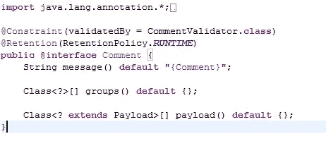
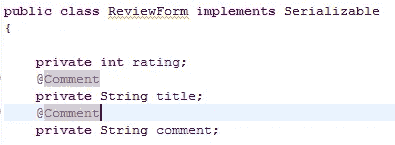
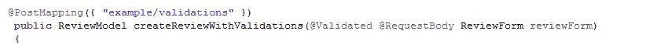
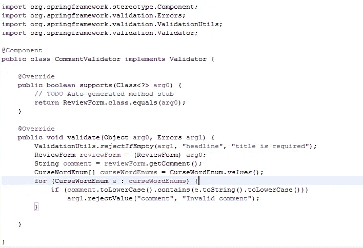
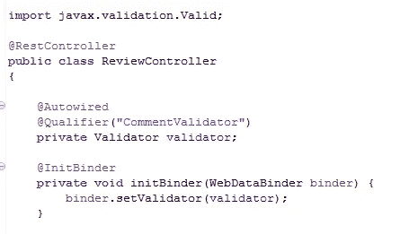
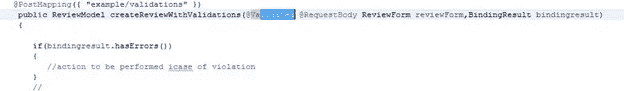
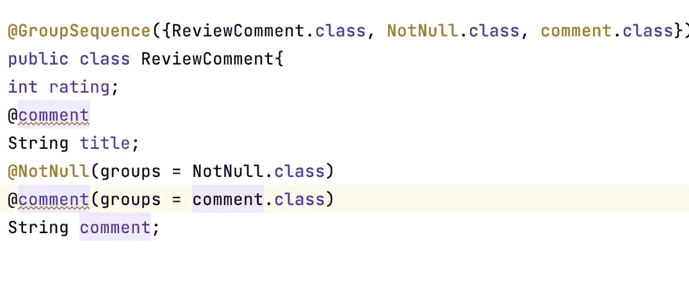

# 春天和 Spring Boot 不同类别的验证

> 原文：<https://medium.com/javarevisited/different-categories-of-validations-8e0a0b78d34c?source=collection_archive---------0----------------------->

有两种类型的约束验证可用于保证模型类遵守所述约束。

**使用 Spring 验证器的字段级验证**

**使用 Spring 验证器的类级验证**

这两种方法都有自己独特的优势。

# **使用 spring 验证器的字段级验证**

Spring 验证使我们能够定义自己的定制约束。一种方法是创建注释。

然后，模型类的字段将用这些注释进行注释，以确保它们遵守所述约束。

这种方法的突出特点是，这些注释可以在任何其他模型类上重用，从而使我们能够创建可重用的代码

它还需要比替代方法更少的配置。

**使用 spring 验证器进行字段级验证的步骤**

1.定义自定义注释

2.为自定义批注定义约束验证器类

3.使用自定义注释对模型类字段进行注释

4.用@Validated 注释控制器方法中的参数

**定义自定义注释:**

定义注释类似于声明接口。关键字 Interface 只是在前面加上了@

**Public @ interface 评论**

定制注释用**元注释进行注释。**

有几个元注释可以用来注释自定义注释。为了前任。
@已记录、@目标、@继承、@约束、@保留。

@Documented 是让表示用这个注释的任何东西都将是正在使用的文档工具(JavaDoc)的公共 API 的一部分。

@Target 指示该注释是用于 getter/setter 方法上的字段，还是用于类等。

@Inherited 表示该注释将被任何子类继承。

然而，这里我们将使用那些绝对强制的。

@ Constraint——它用于指定实现注释验证逻辑的类。

@Retention-表示信息将保留多长时间。这必须是要检查的验证的运行时。

注释可以有方法。但是不允许有方法参数。

此外，这些方法可以有默认值。

这些方法的返回类型限于原语、字符串、枚举、注释或这些类型的数组。

 [## 学习 Java 和 Spring 框架中微服务的 7 大课程

### 微服务是软件开发领域的新术语，尤其是在 Java 方面，但它已经在实践中…

medium.com](/javarevisited/top-5-courses-to-learn-microservices-in-java-and-spring-framework-e9fed1ba804d) 

# **定义约束验证器**

现在让我们看看验证器类。

validator 类实现 ConstraintValidator 接口。

initialize 方法可用于启动任何资源或建立任何连接。isValid 方法是所有奇迹发生的地方。这是我们确保没有违规发生的地方。在违反的情况下，它返回假，否则为真。

在这里，我们检查注释字符串是否包含 enum curseWords 中指定的任何值。如果是，则意味着发生了违规，因此返回 false。如果注释不包含枚举 curseWords 的任何值，则该方法返回 true。

如果 isValid 方法返回 true，则执行流程保持不变。然而，如果验证失败，spring 会抛出一个异常。

 [## 我最喜欢的深入学习 Java 的免费课程

### 我的免费课程列表深入学习 Java 从核心 Java 到多线程到 JDBC 到合集，什么都有…

medium.com](/javarevisited/10-free-courses-to-learn-java-in-2019-22d1f33a3915) 

# **标注模型类字段**

下一步是在模型类中用定制的注释对字段进行注释。

**在控制器**中标注参数

# **使用 Spring 验证器的类级验证**

这种类型的验证允许我们通过将适用于类的所有字段的约束组合在一起来验证模型类和表单数据。

这里我们没有用定制注释来注释模型类字段，而是在控制器(@Initbinder)中设置验证器来启动验证过程。此外，验证是特定于模型类的，其可重用性受到严格限制。

然而，它允许我们将场景特定的定制验证捆绑在一起。当定制比可重用性更受青睐时，它是理想的。

**使用 Spring 验证器进行类级验证的步骤**

1.定义验证器类

2.在控制器中配置验证器

3.用@Validated 注释控制器中的模型类参数

# **定义验证器类**

ReviewCommentValidator 类实现验证器接口。然后，该类中定义的 validate 方法检查是否有任何违规。org . spring framework . validation . validation utils 的实用程序类提供了一些常用的约束。

validate 方法将在 error 对象中违反约束的情况下遇到的错误放在一起，然后将 error 对象绑定到控制器处理程序方法中的 BindingResult 参数。如果没有配置 BindingResult 参数，则抛出弹簧`MethodArgumentNotValidException`

值得一提的是，CommentValidator 的支持方法应该被覆盖，否则 spring 将抛出“Java . lang . illegalstateexception:Validator 的无效目标”异常。

 [## 2020 年 Java 程序员该学什么？

### 2020 年 Java 程序员可以学习的有用工具、技术、框架和库

medium.com](/javarevisited/what-java-programmers-should-learn-in-2020-648050533c83) 

# **在控制器中配置验证器**

用@InitBinder 方法注释的方法设置验证器实例(已经在控制器中自动连接)。这里我们使用一个通用接口引用变量，并使用`@Qualifier`注释指定要使用的具体实现。

但是这里有一个陷阱。我们一次只能在控制器中指定一个验证器，这限制了我们用不同的约束来验证不同模型的能力。

**在控制器**中标注模型类参数

这里讨论了几种减轻这种限制的方法[https://medium . com/Java re visited/multiple-validations-using-spring-validation-aee 5d 89 f 0e 79](/javarevisited/multiple-validations-using-spring-validation-aee5d89f0e79)

注释定义中的每个方法都有其意义和用途。让我们详细看看注释声明中的每个方法及其用法。

**消息:**该方法返回的默认值是违反约束时使用的错误消息

**groups:** 只有当我们在一个字段上有多个约束注释，并且我们想要指定这些验证必须执行的顺序时，才注意到这个方法的重要性。

例如，假设我们有一个想要使用自定义验证器进行验证的字段，但是在此之前，我们想要对该字段执行空值检查，并且只有当@NotNull 验证返回 true 时才继续进行自定义验证。

这可以通过以下方式实现

1 .用@GroupSequence 注释来注释模型类，然后是必须验证约束的顺序

2.通过组属性指定与注释相关联的属性组

因此，通过将组分配给注释，然后使用这些组来指定顺序，我们实现了自定义约束检查。

 [## 面向 Java 开发人员的 10 个免费 Spring Boot 课程和教程

### 大家好，作为一个 Java 博客的作者和 Java 开发人员，很多人问我关于课程和书籍的问题…

medium.com](/javarevisited/10-free-spring-boot-tutorials-and-courses-for-java-developers-53dfe084587e)  [## 面向有经验的 Java 开发人员的 10 门高级 Spring Boot 课程

### 高级 Spring Boot 课程为有经验的 Java 开发人员学习 Spring Boot 测试，云和容器…

medium.com](/javarevisited/10-advanced-spring-boot-courses-for-experienced-java-developers-5e57606816bd)  [## 为什么 Spring 是用 Java 开发 REST APIs 的最佳框架？

### REST 现在已经成为开发 web 服务的标准方法，而说到 Java，有许多框架和…

medium.com](/javarevisited/why-spring-is-the-best-framework-for-developing-rest-apis-in-java-784590e484a4)