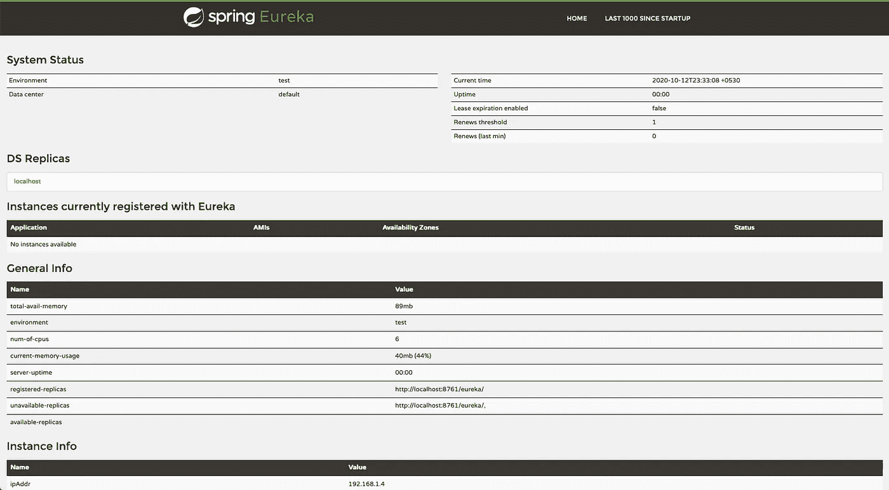

# 在 Spring Cloud 中“发现”微服务

> 原文：<https://medium.com/javarevisited/discovering-microservices-in-spring-cloud-bdb3f1d344c3?source=collection_archive---------0----------------------->

## 寻找，你就会找到

照片由[达拉斯里德](https://unsplash.com/@dallasreedy)在 [Unsplash](https://unsplash.com/photos/F2HTC_CF4Jo) 上拍摄

如果你是一名 java 开发人员，无论时间长短，你都会遇到 [spring boot](/javarevisited/10-advanced-spring-boot-courses-for-experienced-java-developers-5e57606816bd?source=collection_home---4------0-----------------------) ，并且很可能听说过 [spring cloud](/javarevisited/5-best-courses-to-learn-spring-cloud-and-microservices-1ddea1af7012) 。

在 Spring Cloud 的[文档](https://spring.io/projects/spring-cloud)中为我们提供了以下关于 Spring Cloud 的介绍

> Spring Cloud 为开发人员提供了工具来快速构建分布式系统中的一些常见模式(例如，配置管理、服务发现、断路器、智能路由、微代理、控制总线、一次性令牌、全局锁、领导选举、分布式会话、集群状态)。

这一切看起来很棒，听起来甚至更棒。但是你的头几乎开始疼了，“*配置管理、服务发现、断路器、智能路由……”。*什么事？它是如何工作的？人生的意义是什么？

嗯！最后一个我想我回答不了，但是我可以从 spring cloud 的 discovery 服务的基础开始，以及你如何在服务之间进行通信。已经够近了，不是吗？

## 你需要什么

*   尤里卡服务器
*   尤里卡客户
*   耐心(一点点)

## 设置尤里卡服务器

您需要设置一个 [spring boot 应用程序](https://javarevisited.blogspot.com/2018/05/the-springbootapplication-annotation-example-java-spring-boot.html)，因为发现服务是 eureka-server 依赖项，

要用 [@EnableEurekaServer](https://www.java67.com/2018/12/top-5-spring-cloud-annotations-for-java.html) 标记主应用程序类，

并提供尤里卡特有的属性

这里，我们说在默认端口 8761 上运行我们的 eureka 服务器的 spring boot 应用程序。当然，这个端口可以是任何开放端口。在这种情况下，我们必须将所有注册服务指向该端口。在这里，我们保持简单。

当我们说，“registerWithEureka: false”时，我们不希望这个服务注册到 Eureka 服务。

通过“fetchRegistry: false”，我们禁用了本地注册表信息的缓存。相信我，这样可以省去很多麻烦。

启动它…..找到了。！

春季尤里卡仪表板

在上一节中，我们看到了如何设置一个 eureka 服务器。但是，我们的尤里卡服务器的问题是，它没有发现任何东西，因为没有任何东西可以被发现。

让我们创建将被我们的 eureka 服务器发现的客户机。

要创建一个可发现的客户机，我们必须确保用@EnableDiscoveryClient 注释服务的主应用程序。

这允许 eureka 服务器发现您的服务并将其注册到 eureka 服务器。

有趣的部分来了。一旦我们建立了多个这样的客户端，我们就可以在这些服务之间进行通信了。

## 军种间通信

我们可以通过三种方式在服务之间进行通信，并访问在不同服务中编写的 API

*   使用 Spring 云发现客户端
*   使用 ribbon 负载平衡 rest 模板，或者
*   使用假装客户端

## 1.Spring 云发现客户端

这里，我们将使用 DiscoveryClient 首先获取服务的所有注册实例，然后使用我们可信任的 RestTemplate 进行实际的 API 调用，如下所示。

发现客户端

这太不理想了。例如，我们不能自动连接 [RestTemplate](https://javarevisited.blogspot.com/2017/02/how-to-consume-json-from-restful-web-services-Spring-RESTTemplate-Example.html) ，我们必须负责实例化它。这是因为一旦我们用@EnableDiscoveryClient 注释了我们的服务，所有的 RestTemplates 现在都有一个功能区拦截器来修改正在创建的 URL。

另一个主要问题是我们如何获取服务实例，以及如何手动获取服务请求的实例。这剥夺了我们在服务实例间平衡负载的机会。

这就是负载平衡 rest 模板发挥作用的地方。

## 2.负载平衡的 Rest 模板

要使用 Ribbon aware rest 模板，我们需要创建一个带有@LoadBalanced 注释的 RestTemplate bean，这允许我们在客户端代码中“自动连接”rest template。

现在，DiscoveryClient 和它之间的唯一区别是，它允许我们使用在 eureka 服务器上注册的自然服务名与该服务进行通信。

这里“module-two”是被调用方模块的注册名。这干净多了。我们不需要选择需要向哪个服务实例发出请求。[春云](/hackernoon/top-5-spring-boot-and-spring-cloud-books-for-java-developers-75df155dcedc?source=---------23------------------)会以循环的方式处理服务请求。

## 3.假装客户

这是 ribbon 感知负载平衡 rest 模板的替代方案。为了启用 Feign Client，我们需要用@EnableFeignClients 注释来注释我们的应用程序类。

然后用@FeignClient 注释创建一个 java 接口，并提供被调用方的注册服务名。

这为名为“module-two”的服务定义了一个虚拟客户端。在这里，您可以定义需要从调用方服务访问的所有端点。

您可能已经注意到，端点的定义正是您在 spring 控制器中定义端点的方式。这使得我们的客户非常自然，易于阅读和使用。

请随意留下你的想法。我们非常感谢并鼓励任何形式的反馈。