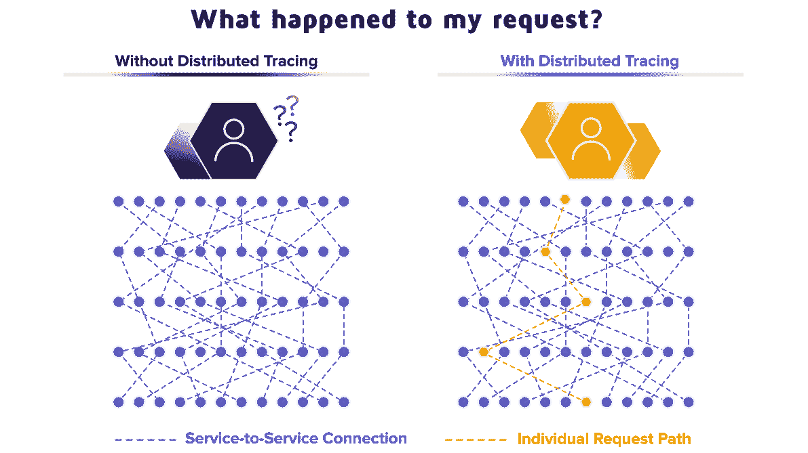

# 微服务/ Spring Boot 中的分布式跟踪

> 原文：<https://medium.com/javarevisited/distributed-tracing-in-microservices-spring-boot-125272b58ad8?source=collection_archive---------0----------------------->

图片来源:[https://epsa gon . com/WP-content/uploads/2019/04/Illustration _ What-happed-1 . png](https://epsagon.com/wp-content/uploads/2019/04/Illustration_What-happend-1.png)

大家好。在本文中，让我们了解一下[微服务](/javarevisited/10-best-java-microservices-courses-with-spring-boot-and-spring-cloud-6d04556bdfed)中的分布式跟踪

## 什么是分布式跟踪？

在[微服务架构](/javarevisited/8-best-online-courses-to-learn-service-oriented-soa-and-microservices-architecture-94c01d6b94e6)中，一个请求可以跨越多个微服务来构建响应并将其发送给用户。如果某个微服务出了问题，极难查明…