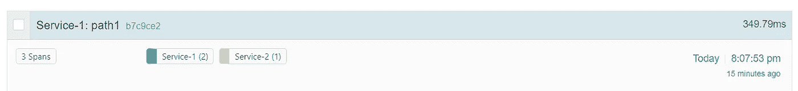
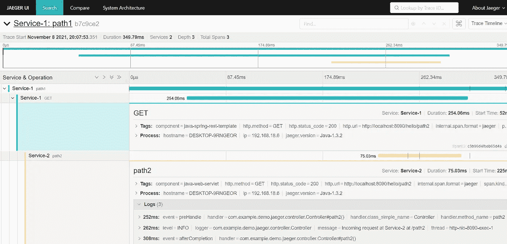

# Spring Boot 和耶格的分布式追踪

> 原文：<https://medium.com/javarevisited/distributed-tracing-with-spring-boot-and-jaeger-619bcc13b0c4?source=collection_archive---------0----------------------->


Spring Boot 和耶格的分布式追踪

# 介绍

分布式跟踪提供了对请求通过系统时的流程和生命周期的洞察。现代平台可能被分割成许多不同的独立服务，所有这些都可能有助于产生最终结果。在微服务风格的架构中，单个客户端请求可能会产生大量后续请求到各种不同的区域组件中，这些组件又可能会执行额外的下游请求。此外，这可能不是通过相同的协议— `HTTP`经由`RESTful`端点，可能是各种类型的队列等。由于每个组件的日志都是独立的，因此当事件流过不同区域时，跟踪一系列事件会非常困难和耗时。

我们已经理解了微服务中对分布式跟踪的需求。但是我们需要一些工具来实现它。Jaeger 是一个分布式追踪平台——最初由优步开发。它用于对基于微服务的架构进行监控和故障排除。它有一个很好的用户界面，清楚地显示了完整的请求细节&处理时间等。

***文章中使用的技术:***

*   春季开机版本:2.5.6
*   贼鸥
*   Java 版本 1.8

# 创建一个弹簧引导应用程序

使用所需的依赖项创建一个 spring boot 应用程序。添加 spring boot starter web 依赖项。此外，将 jaeger 依赖项包含到 spring boot 应用程序的 pom XML 配置文件中。

下面是 pom.xml 文件的完整内容。

***pom.xml***

```
<?xml version="1.0" encoding="UTF-8"?>
<project ae kz" href="http://maven.apache.org/POM/4.0.0" rel="noopener ugc nofollow" target="_blank">http://maven.apache.org/POM/4.0.0"
 xmlns:xsi="[http://www.w3.org/2001/XMLSchema-instance](http://www.w3.org/2001/XMLSchema-instance)"
 xsi:schemaLocation="[http://maven.apache.org/POM/4.0.0](http://maven.apache.org/POM/4.0.0) [https://maven.apache.org/xsd/maven-4.0.0.xsd](https://maven.apache.org/xsd/maven-4.0.0.xsd)">
 <modelVersion>4.0.0</modelVersion>
 <parent>
  <groupId>org.springframework.boot</groupId>
  <artifactId>spring-boot-starter-parent</artifactId>
  <version>2.5.6</version>
  <relativePath /> <!-- lookup parent from repository -->
 </parent>
 <groupId>com.example.demo.jaeger</groupId>
 <artifactId>spring-boot-distributed-trace-jaeger</artifactId>
 <version>0.0.1-SNAPSHOT</version>
 <name>spring-boot-distributed-trace-jaeger</name>
 <description>Demo project for Spring Boot</description>
 <properties>
  <java.version>1.8</java.version>
 </properties>
 <dependencies>
  <dependency>
   <groupId>org.springframework.boot</groupId>
   <artifactId>spring-boot-starter</artifactId>
  </dependency>
  <dependency>
   <groupId>io.opentracing.contrib</groupId>
   <artifactId>opentracing-spring-jaeger-cloud-starter</artifactId>
   <version>3.3.1</version>
  </dependency>
  <dependency>
   <groupId>org.springframework.boot</groupId>
   <artifactId>spring-boot-starter-web</artifactId>
  </dependency>
  <dependency>
   <groupId>org.springframework.boot</groupId>
   <artifactId>spring-boot-starter-test</artifactId>
   <scope>test</scope>
  </dependency>
 </dependencies><build>
  <plugins>
   <plugin>
    <groupId>org.springframework.boot</groupId>
    <artifactId>spring-boot-maven-plugin</artifactId>
   </plugin>
  </plugins>
 </build></project>
```

# 添加控制器类

创建一个名为**控制器**的 REST API 类，并添加以下内容。

```
@RestController
@RequestMapping("/hello")
public class Controller {private static final Logger logger = LoggerFactory.getLogger(Controller.class);

private RestTemplate restTemplate;@Value("${spring.application.name}")
    private String applicationName;public Controller(RestTemplate restTemplate) {
        this.restTemplate = restTemplate;
    }@GetMapping("/path1")
    public ResponseEntity<String>  path1() {logger.info("Incoming request at {} for request /path1 ", applicationName);
        String response = restTemplate.getForObject("http://localhost:8090/hello/path2", String.class);
        return ResponseEntity.ok("response from /path1 + " + response);
    }@GetMapping("/path2")
    public ResponseEntity<String>  path2() {
        logger.info("Incoming request at {} at /path2", applicationName);
        return ResponseEntity.ok("response from /path2 ");
    }
}
```

控制器公开一个带有端点 **/hello/path1** 的 GET API，并返回计算出的 path1 响应。类似地，另一个 GET API 使用端点 **/hello/path2** 并返回计算出的 path2 响应。

这里，我们有两个端点`/path1`和`/path2`。这里的想法是使用同一个应用程序的两个实例，这样`/path1`在固定端口 8090 调用另一个服务的`/path2`。

为了让 spans 连接到同一个 trace id，我们需要创建一个 RestTemplate bean 来允许 Jaeger 包含一个拦截器。这有助于向传出请求添加跟踪，这将有助于跟踪整个请求。

```
@Bean
   public RestTemplate restTemplate(RestTemplateBuilder builder) {
      return builder.build();
   }
```

# Docker 撰写

让我们使用 docker 在本地启动一个 Jaeger 服务器。为此，我用端口映射创建了一个 docker-compose 文件。

```
version: "3.3"
services:
  jaeger-allinone:
    image: jaegertracing/all-in-one:1.25
    ports:
      - 6831:6831/udp
      - 6832:6832/udp
      - 16686:16686
      - 14268:14268
```

我们可以通过 UDP 或 TCP 与 Jaeger 通信。使用`docker-compose up`启动 docker 映像后，我们可以使用 URL[http://localhost:16686/](http://localhost:16686/)访问 UI

现在，让我们添加一些属性，允许应用程序将跟踪发送到 Jaeger 服务器。我们将通过 TCP 进行通信，所以请确保我们将跟踪发送到另一个 TCP 端口。即 14268

```
opentracing:
  jaeger:
    http-sender:
      url: http://localhost:14268/api/traces
```

# 正在启动服务 1

让我们用下面的命令启动“服务器 1”。

```
java -jar target/spring-boot-distributed-trace-jaeger-0.0.1-SNAPSHOT.jar --spring.application.name=Service-1 --server.port=8080
```

# 启动服务 2

在不同的终端上，运行与“服务 2”相同的应用程序的新实例，如下所示

```
java -jar target/spring-boot-distributed-trace-jaeger-0.0.1-SNAPSHOT.jar --spring.application.name=Service-2 --server.port=8090
```

一旦应用程序启动，在`/path1`调用“服务 1”，如下所示

```
curl -i [http://localhost:8080/hello/path1](http://localhost:8080/service/path1)
```

我们来看看“服务 1”的日志。

```
INFO 16636 --- [nio-8080-exec-2] i.j.internal.reporters.LoggingReporter   : Span reported: b7c9ce2661df9d7c:c3b96d4fbeb65d4a:b7c9ce2661df9d7c:1 - GET
```

跟踪的格式为[ ***、根跨度 Id、当前跨度 Id、父跨度 Id*** ]。在这种情况下，由于“服务 1”是源服务，父 span Id“b 7 c 9 ce 2661 df 9d 7 c”也是根 span Id。

现在，我们来看看“服务 2”的日志。

```
INFO 22732 --- [nio-8090-exec-1] i.j.internal.reporters.LoggingReporter   : Span reported: b7c9ce2661df9d7c:bf420c75d1105309:c3b96d4fbeb65d4a:1 - path2
```

这里我们看到中间值是当前 span id 和父 span id(即第三个值“C3 b 96d 4 FBE 65d 4 a”)是“服务 1”的 span id。

# Jaeger UI

现在，如果您打开 UI，您将看到以下内容。



当我们深入挖掘时，我们会看到每个跨度的更多细节。



这里，根跨度 id“b 7 c 9 ce 2661 df 9d 7 c”跨越整个请求。另外两个 span ids 指的是单独的服务。

# 结论

我们探索了如何将基于 OpenTracing 的 Jaeger 与 spring boot 应用程序集成。

这篇文章的代码可以在[这里](https://github.com/reachansari/spring-boot-distributed-trace-jaeger)找到。

快乐编码..