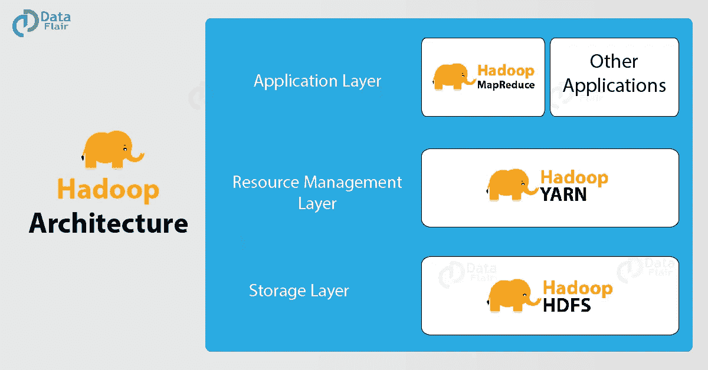
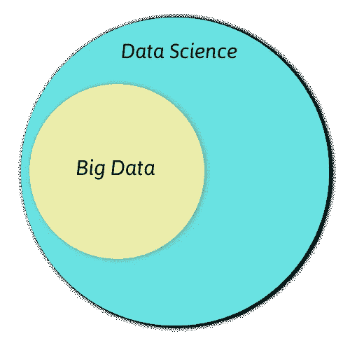

# 我需要 Hadoop 才能成为优秀的数据科学家吗？

> 原文：<https://medium.com/javarevisited/do-i-need-hadoop-to-be-a-good-data-scientist-a98a4f3fc7da?source=collection_archive---------0----------------------->

图片来源—[Hadoop 的终极实践](https://www.udemy.com/the-ultimate-hands-on-hadoop-tame-your-big-data/?ranMID=39197&ranEAID=JVFxdTr9V80&ranSiteID=JVFxdTr9V80-RIUh3XEhhnWoYk7f.rVCJw&LSNPUBID=JVFxdTr9V80)

寻找为什么数据科学需要学习 Hadoop 的答案？你在正确的页面登陆。

在这里，您会发现为什么 [Hadoop](https://hadoop.apache.org/) 对于数据科学家来说是必须的。在本文的最后，我将分享一个案例研究，您将从中了解到马克斯&斯潘塞公司如何使用 Hadoop 来满足其数据科学需求。所以，不浪费时间，让我们进入主题-

目前，数据正以指数速度增长。对处理大量数据的需求很大。负责处理大量数据的一种技术是 Hadoop。以下是 Hadoop 的确切含义

# Hadoop 是什么？

Apache Hadoop 是一种开源软件，它有助于计算机网络解决需要大量数据集和计算能力的问题。Hadoop 是高度可扩展的，旨在适应从单个服务器到数千台机器的集群的计算。虽然 Hadoop 是用 [Java](https://javarevisited.blogspot.com/2018/05/top-5-java-courses-for-beginners-to-learn-online.html) 编写的，但是你可以使用多种语言在 Hadoop 中编程，比如 [Python](https://hackernoon.com/top-5-courses-to-learn-python-in-2018-best-of-lot-26644a99e7ec) 、 [C++](https://hackernoon.com/top-5-free-c-courses-to-learn-programming-in-2019-d27352277da0) 、Perl、 [Ruby](http://www.java67.com/2018/02/5-free-ruby-and-rails-courses-to-learn-online.html) 等。

在谷歌发表了描述其谷歌文件系统的研究论文后，像 MapReduce 这样的大数据概念成为了一种普遍现象。

**Hadoop 有三个主要组件—**

**Hadoop 分布式文件系统** —它是 Hadoop 的存储组件。Hadoop 是主从网络的集合。在 HDFS 中有两个守护进程——NameNode 和 datanode，它们分别运行在主节点和从节点上。

**Map-Reduce** —这部分 Hadoop 负责高层数据处理。它有助于在节点集群上处理大量数据。你可以在[的终极实践 Hadoop](https://www.udemy.com/the-ultimate-hands-on-hadoop-tame-your-big-data/?ranMID=39197&ranEAID=JVFxdTr9V80&ranSiteID=JVFxdTr9V80-lI3PNRK2.VUtcWLY0IekWw&LSNPUBID=JVFxdTr9V80) 上阅读更多关于 Map Reduce 和 Hadoop 的内容。

**YARN** —用于资源管理和作业调度。在多节点集群中，很难管理、分配和释放资源。Hadoop Yarn 允许非常高效地管理和控制这些资源。

要了解 Hadoop 的一切，你必须查看最新的 [Hadoop 教程系列](https://data-flair.training/blogs/hadoop-tutorials-home/)。

# 面向数据科学的 Hadoop

*数据科学家需要 Hadoop 吗？*

*这个问题的答案是一个大大的是！Hadoop 是数据科学家的必备工具*。

[数据科学](https://dev.to/javinpaul/10-data-science-and-machine-learning-courses-for-programmers-looking-to-switch-career-57kd)是一个广阔的领域。它源于多个跨学科领域，如数学、统计学和编程。它是关于在数据中寻找模式。数据科学家接受从数据中提取、分析和生成预测的培训。*它是一个总括术语* *，包含了几乎所有涉及数据使用的技术*。

Hadoop 的主要功能是[大数据](https://javarevisited.blogspot.com/2017/12/top-5-courses-to-learn-big-data-and.html#axzz5bKDxWpoU)的存储。它还允许用户存储所有形式的数据，即结构化数据和非结构化数据。Hadoop 还提供了 Pig 和 Hive 等模块来分析大规模数据。

然而，数据科学和大数据的[区别在于，前者是一门涉及所有数据操作的学科。因此，大数据是数据科学的一部分。](https://data-flair.training/blogs/big-data-vs-data-science/)

既然[数据科学](https://hackernoon.com/10-machine-learning-data-science-and-deep-learning-courses-for-programmers-7edc56078cde)包含了信息的海洋，那就没必要去了解大数据。然而，Hadoop 的知识肯定会增加你的专业知识，使你在处理大量数据时变得多才多艺。这也将增加你在市场上的价值，让你比其他人更有竞争力。

再者，作为数据科学家， [**机器学习的知识是必须的**](https://data-flair.training/blogs/machine-learning-tutorial/) 。机器学习算法在更大的数据集上表现得更好。因此，大数据成为训练机器学习算法的理想选择。因此，为了理解数据科学的错综复杂，大数据知识是必须的。

# Hadoop —迈向数据科学的第一步

如上图清楚地显示了成为数据科学家的步骤，其中 [Hadoop](https://dzone.com/articles/top-5-hadoop-courses-to-learn-online) 是必须的，也是非常重要的第一步。

Hadoop 是流行的大数据平台之一，最广泛地用于涉及大规模数据的数据操作。为了向成为一名成熟的数据科学家迈出第一步，您必须具备处理大量数据和非结构化数据的知识。

为此，Hadoop 被证明是一个理想的平台，允许其用户解决涉及大量数据的问题。

此外， [Hadoop](https://javarevisited.blogspot.com/2018/04/top-5-hadoop-courses-to-learn-online.html) 是一个理想的数据平台，它不仅能够处理大规模数据，还能使用各种扩展(如 Mahout 和 Hive)对其进行分析。

因此，全面了解 Hadoop 将为您提供处理各种数据操作的能力，这是数据科学家的主要任务。因为它构成了[数据科学](https://javarevisited.blogspot.com/2018/10/data-science-and-machine-learning-courses-using-python-and-R-programming.html)的主要部分，学习 Hadoop 作为初始工具将为您提供所有必要的知识。

在别人抓住机会之前，现在正是[开始您的大数据 Hadoop 培训的好时机](https://data-flair.training/hadoop-spark-developer-course/)

在 Hadoop 生态系统中，在 map-reduce 上用 Java 写机器学习代码变成了一个非常复杂的过程。执行机器学习操作，如分类、回归、聚类到一个 [MapReduce](http://www.java67.com/2016/09/map-reduce-example-java8.html) 框架成为一项困难的任务。

为了便于分析数据，Apache 在 Hadoop 中发布了两个主要组件，称为 Pig 和 Hive。此外，为了对数据执行机器学习操作，Apache software foundation 发布了 Apache Mahout。Apache Mahout 运行在 Hadoop 之上，Hadoop 使用 MapReduce 作为其主要范例。

数据科学家需要包容所有与数据相关的操作。因此，拥有大数据和 T2 Hadoop 的专业知识将允许你开发一个全面的架构来分析海量数据。

# 为什么选择 Hadoop？

Hadoop:大数据的可扩展解决方案

Hadoop 生态系统因其可靠性和可扩展性而备受赞誉。随着信息的大量增加，数据库系统越来越难以容纳不断增长的信息。Hadoop 提供了一个可扩展的容错架构，允许无任何损失地存储大量信息。Hadoop 促进了两种类型的可扩展性:

**垂直可扩展性** —在垂直扩展中，我们向单个节点添加更多资源(如 CPU)。通过这种方式，我们增加了 Hadoop 系统的硬件容量。我们可以进一步添加更多的 RAM 和 CPU，以增强其功能，使其更加强大。

**水平扩展** —在水平扩展中，我们向分布式软件系统添加更多的节点或系统。与垂直可伸缩性增加容量的方法不同，我们可以在不停止系统的情况下添加更多的机器。这消除了停机问题，并在横向扩展时提供了最高的效率。这也使得多台机器并行工作。

# Hadoop 剖析

Hadoop 的一些主要组件是

*   Hadoop 分布式文件系统(HDFS)
*   MapReduce
*   故事
*   储备
*   猪
*   HBase

要深入了解 Hadoop，请参考 DataFlair 的 [Hadoop 生态系统](https://data-flair.training/blogs/hadoop-ecosystem/)博客。

# Hadoop 的使用对数据科学家的影响

在过去几年中，Hadoop 越来越多地被用于在行业中实施数据科学工具。随着大数据和数据科学的吸收，行业已经能够充分利用数据科学。Hadoop 对数据科学家的影响主要体现在四个方面

## 1.使用大规模数据集探索数据

数据科学家需要处理大量数据。以前，数据科学家只能在本地机器上存储他们的数据集。然而，随着数据的增加和分析大数据的海量需求，Hadoop 提供了一个探索性数据分析的环境。

使用 Hadoop，您可以编写 MapReduce 作业、HIVE 或 PIG 脚本，并在 Hadoop 上直接启动它，以获取完整数据集的结果。

## 2.预处理大规模数据

数据科学角色需要大部分数据预处理，包括数据获取、转换、清理和特征提取。这个步骤是将原始数据转换成标准化特征向量所必需的。

Hadoop 使大规模数据预处理成为数据科学家的一项简单任务。它提供了像 MapReduce、 [PIG](https://data-flair.training/blogs/apache-pig-tutorial-introduction-guide/) 和 Hive 这样的工具来高效地处理大规模数据。

## 3.增强数据灵活性

与需要严格模式结构的传统数据库系统相反，Hadoop 为其用户提供了灵活的模式。这种灵活的模式或“读取模式”消除了每当需要新字段时重新设计模式的需要。

## 4.促进大规模数据挖掘

事实证明，使用更大的数据集，机器学习算法可以训练得更好，并提供更好的结果。像聚类、异常值检测、产品推荐器这样的技术提供了广泛的统计技术。

传统上，机器学习工程师必须处理有限的数据量，这最终导致他们的模型性能低下。然而，在提供线性可扩展存储的 Hadoop 生态系统的帮助下，您可以以原始格式存储所有数据。

# 马克斯&斯潘塞案例研究

# 马克&斯潘塞—使用大数据分析客户行为

马克&斯潘塞是一家大型跨国零售公司。它采用 Hadoop 来深入了解客户行为。它仔细检查来自多个来源的数据，从而全面了解消费者行为。M&S 管理数据的有效使用，以掌握客户的见解。

它采用 360 度视角，全面了解客户购买模式和多渠道购物。它充分利用了 Hadoop，不仅存储了大量信息，还对其进行了分析，以深入了解客户。

在像圣诞节这样的旺季，库存往往会耗尽，*马克&斯潘塞正在使用大数据分析*来跟踪客户的购买模式，以避免这种情况发生。它利用有效的数据可视化工具来分析信息。因此，创建 Hadoop 和预测分析的结合。因此，我们认识到大数据是数据科学和分析的核心组成部分之一。

此外，马克斯潘塞已经成为首批拥有懂数据的员工的行业之一。在首批举措中，M&S 正在对其员工进行机器学习和数据科学方面的教育。

是时候开始向行业专家学习 Hadoop 了。选择[最佳 Hadoop 培训](https://data-flair.training/big-data-hadoop/)并为数据科学多升级一项技能。

# 摘要

最后，我们得出结论，对于数据科学，Hadoop 是必不可少的。由于其可扩展性和容错性，它被广泛用于存储海量数据。它还通过 Pig 和 Hive 等工具促进了全面的分析平台。此外，Hadoop 已经发展成为一个全面的数据科学平台。马克&斯潘塞这样的公司正在使用 Hadoop 来分析客户购买模式和库存管理，这也是一个补充。

这篇文章有用吗？请通过评论分享您的反馈。这将有助于我们为您发布更多这样有趣的内容。

**进修:** [R for Data Science](https://data-flair.training/blogs/using-r-for-data-science/)
[SAS for Data Science](https://data-flair.training/blogs/sas-for-data-science/)
[Data Science—Master SQL](https://data-flair.training/blogs/master-sql-for-data-science/)
[终极动手 Hadoop](https://www.udemy.com/the-ultimate-hands-on-hadoop-tame-your-big-data/?ranMID=39197&ranEAID=JVFxdTr9V80&ranSiteID=JVFxdTr9V80-lI3PNRK2.VUtcWLY0IekWw&LSNPUBID=JVFxdTr9V80)
[前 5 名课程学习 Hadoop](https://hackernoon.com/top-5-hadoop-courses-for-big-data-professionals-best-of-lot-7998f593d138?source=extreme_sidebar---------0-2--------------------)
[前 5 名免费课程学习大数据、Spark、Hadoop](http://www.java67.com/2018/05/top-5-free-big-data-courses-to-learn-Hadoop-Apache-Spark.html)