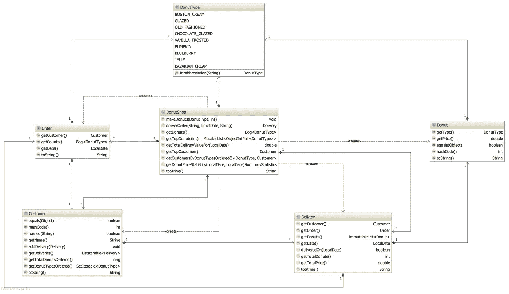

# Do 或甜甜圈。没有尝试。

> 原文：<https://medium.com/javarevisited/do-or-donut-there-is-no-try-2bdce3678506?source=collection_archive---------2----------------------->

使用 Java 和 Kotlin 与 Eclipse 集合解决甜甜圈形


[阿里·塔希尼](https://unsplash.com/@slashiotarhini?utm_source=medium&utm_medium=referral)在 [Unsplash](https://unsplash.com?utm_source=medium&utm_medium=referral) 上的照片

# 甜甜圈形

为了庆祝 Kotlin 编程语言 10 周年，我想我会分享使用 [Java](https://github.com/BNYMellon/CodeKatas/tree/master/donut-kata-solutions/src/main/java/bnymellon/codekatas/donutkata) 16 和 [Kotlin](https://github.com/BNYMellon/CodeKatas/tree/master/donut-kata-solutions/src/main/kotlin/bnymellon/codekatas/donutkatakotlin) 1.5.0 和[Eclipse Collections](https://github.com/eclipse/eclipse-collections)11 . 0 . 0 . m2 的[甜甜圈代码 Kata](https://github.com/BNYMellon/CodeKatas/tree/master/donut-kata) 的解决方案。Eclipse Collections 是一个 Java 库，所以它在 Java 和 Kotlin 中都可以很好地工作。

# 甜甜圈形领域

甜甜圈形的领域是甜甜圈店。你做甜甜圈，接甜甜圈订单，送甜甜圈。该域在 Java 16 和 Kotlin 中都有实现。



甜甜圈店域类

# Donut 是一个记录或数据类

差不多四年前我写了甜甜圈形，这些年来它已经从 Java 8 升级到 Java 10、14、15，现在是 16。在 Java 16 中，我们终于有了记录作为第一类特性。我今天把 Kotlin stdlib 版本升级到了 1.5.0，把`Donut`类改成了数据类。

**Java 16:**

```
public record Donut(DonutType type, double price) {}
```

**科特林 1.5.0:**

```
data class Donut(val **type**: DonutType, val **price**: Double)
```

`DonutType`在 [Java](https://github.com/BNYMellon/CodeKatas/blob/master/donut-kata-solutions/src/main/java/bnymellon/codekatas/donutkata/DonutType.java) 和 [Kotlin](https://github.com/BNYMellon/CodeKatas/blob/master/donut-kata-solutions/src/main/kotlin/bnymellon/codekatas/donutkatakotlin/DonutType.kt) 中都是枚举。单击链接查看不同之处。

# 没有尝试

在这篇博客中，我不会教你 Java 16、Kotlin 1.5.0 或 Eclipse Collections 11.0.0.M2。学习和比较这些的最好方法是自己完成形。如果你喜欢，可以尝试不同的功能。使用 Java 流或 Kotlin 的集合解决形。甜甜圈形是一个非常重要的领域，它可以帮助您学习 Java 和 Kotlin 编程语言的不同特性。

***Do 或 Donut。***

[README.md](https://github.com/BNYMellon/CodeKatas/blob/master/donut-kata/README.md) 将帮助你开始。你会想要检查出[代码 Katas](https://github.com/BNYMellon/CodeKatas) 并在 IntelliJ IDEA 的最新版本中处理它们。Java 和 Kotlin 版本的 Kata 都存在单元测试失败的情况。您通过在当前缺少代码的域类中使用来自 Eclipse 集合 API 的方法来完成 kata。

祝你好运，尽情享受吧！

*我是*[*Eclipse Foundation*](https://projects.eclipse.org/projects/technology.collections)*的*[*Eclipse Collections*](https://github.com/eclipse/eclipse-collections)*OSS 项目的项目负责人。* [*月食收藏*](https://github.com/eclipse/eclipse-collections) *开作* [*投稿*](https://github.com/eclipse/eclipse-collections/blob/master/CONTRIBUTING.md) *。如果你喜欢这个库，你可以在 GitHub 上让我们知道。*