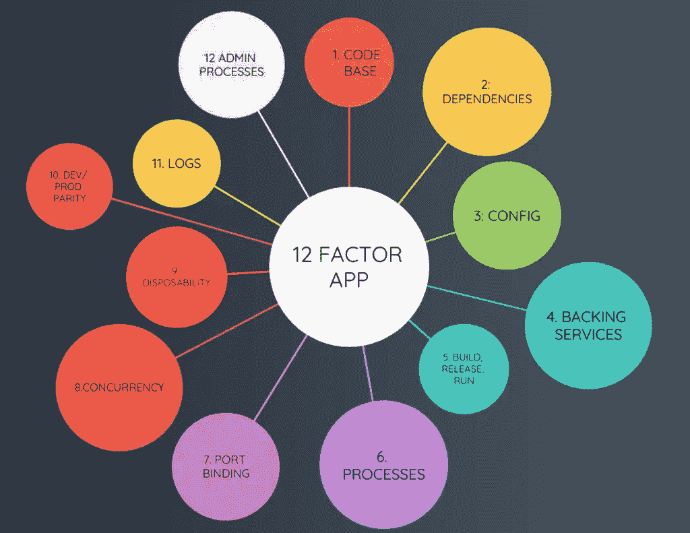

# 你知道微服务架构中的 12 因素应用吗？

> 原文：<https://medium.com/javarevisited/do-you-know-about-the-12-factor-app-in-microservices-architecture-50bd34551bd8?source=collection_archive---------0----------------------->

大家好。在本文中，我们将看到一种有趣的方法，称为 th **e 12 因素应用程序，它在微服务架构中被广泛使用。**这是构建云原生应用的 12 个最佳实践，理解它们对于任何开发人员设计和构建云原生/ [微服务](/javarevisited/7-free-microservices-courses-for-java-programmers-c9b2f3a2ea7d)应用都至关重要。让我们深入进去。

图片来源:[https://www . code motion . com/magazine/WP-content/uploads/2022/05/12-factor-app-process-1024 x791 . png](https://www.codemotion.com/magazine/wp-content/uploads/2022/05/12-factor-app-process-1024x791.png)