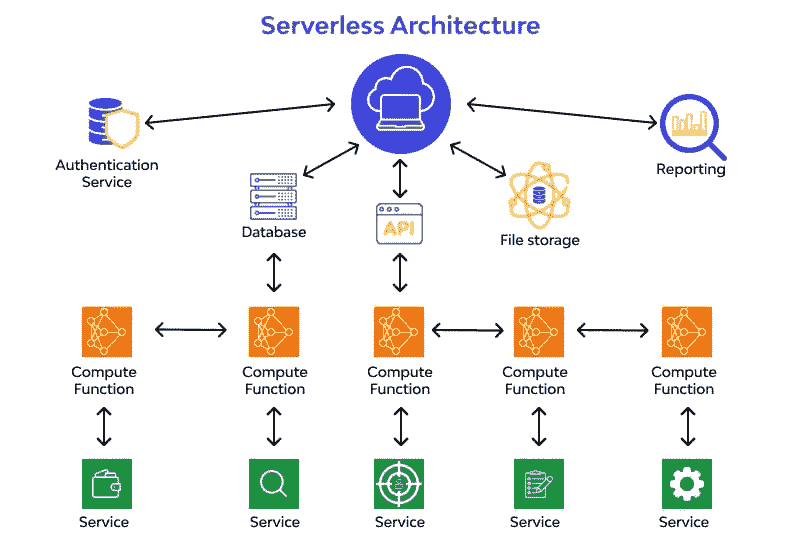

# 你了解无服务器架构的一切吗？

> 原文：<https://medium.com/javarevisited/do-you-know-everything-about-serverless-architecture-f0cd06c81329?source=collection_archive---------0----------------------->

大家好。在本文中，我们将了解 FaaS(功能即服务)，然后我们将探索 [AWS](/javarevisited/6-best-courses-for-aws-certified-solution-architect-professional-exam-in-2020-df5850a9279a) 中的各种无服务器产品，然后我们将了解这些现代架构的使用案例、优势和缺点。我也清楚地解释了[无服务器](/javarevisited/7-best-serverless-and-aws-lambda-courses-to-learn-in-2021-de1820111c85)和其他云模型如 PaaS、BaaS、IaaS 和 SaaS 的区别。

图片来源:[https://assets . website-files . com/5ff 66329429d 880392 F6 CBA 2/620 f 58 b 8082341 e 93418 f 683 _ Examples % 20 server less % 20 architecture . jpg](https://assets.website-files.com/5ff66329429d880392f6cba2/620f58b8082341e93418f683_Examples%20Serverless%20Architecture.jpg)