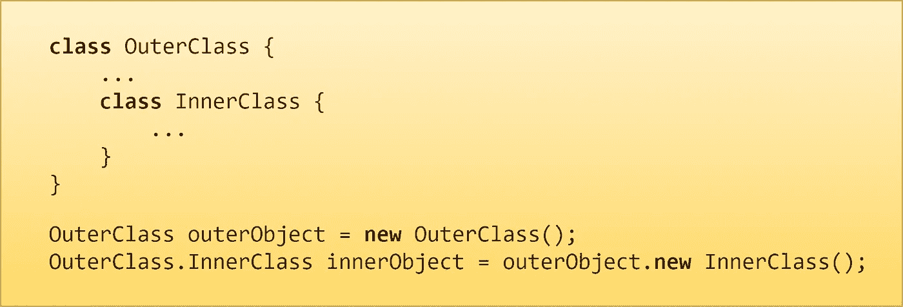

# 你知道 Java 中的嵌套类和内部类吗？

> 原文：<https://medium.com/javarevisited/do-you-know-nested-and-inner-classes-in-java-latest-b270e0988091?source=collection_archive---------5----------------------->

## 面向对象编程

## 什么，为什么，如何:你需要知道的一切。

[](https://javarevisited.blogspot.com/2012/12/inner-class-and-nested-static-class-in-java-difference.html)

内部类示例

你可能从你的同行/高级开发人员那里听说过[嵌套类和内部类](http://www.java67.com/2012/10/nested-class-java-static-vs-non-static-inner.html)，或者你可能在网上读到过。这篇文章将涵盖你下次面试需要知道的关于嵌套类和内部类的一切。

# 什么是嵌套类？

Java 语言允许你在另一个类中定义一个类。例如:

```
class OuterClass {
    ...
    class NestedClass {
        ...
    }
}
```

现在请注意，嵌套类分为两类:

1.  [**静态嵌套类。**](https://javarevisited.blogspot.com/2017/04/can-we-declare-class-static-in-java.html)
2.  [**内部类**](http://javarevisited.blogspot.sg/2012/12/inner-class-and-nested-static-class-in-java-difference.html) **(非静态嵌套类)。**

使用`***static***`关键字声明的嵌套类称为 ***静态*** ***嵌套类*。**而非静态嵌套类被称为 ***内部类*。**

# 1.静态嵌套类:

1.  *静态嵌套类* ***不能直接引用其封闭类*** *(即外部类)中定义的实例字段或方法，只能通过封闭类的对象引用来使用。*
2.  静态嵌套类与其外部类(和其他类)的实例成员交互，就像任何其他顶级类一样。

# 创建静态嵌套类实例的语法:

```
class OuterClass {
    ...
    static class StaticNestedClass {
        ...
    }
}
```

```
OuterClass.StaticNestedClass nestedObject = 
new OuterClass.StaticNestedClass();
```

# 如何使用静态嵌套类？

下面的示例解释了静态嵌套类的语法和用法。

静态嵌套类示例

## 输出:

```
Node 10 added successfully!
LinkedList is : [10] → null
Node 20 added successfully!
LinkedList is : [10] → [20] → null
Node 30 added successfully!
LinkedList is : [10] → [20] → [30] → null
```

# 2.内部类:

1.  *内部类(非静态嵌套类)* ***只是其封闭类(即外部类)的另一个成员。*** *所有内部类都可以访问封闭类的变量(字段)和方法，即使内部类声明为* `***private***` *。*
2.  *作为外层类的成员，一个内部类可以声明为* `***private***` *、* `***public***` *、* `***protected***` *，或者* `***package-private***` *。*

> 在 java 编程中，外部类只能声明为`public`或`package-private(default)`。

# 创建内部类实例的语法:

1.  创建外部类的实例。
2.  然后在外部类的实例中创建一个内部类的实例。

```
class OuterClass {
    ...
    class InnerClass {
        ...
    }
}
```

```
OuterClass outerObject = new OuterClass();
OuterClass.InnerClass innerObject = outerObject.new InnerClass();
```

# 如何使用内部类？

下面的示例解释了静态嵌套类的语法和用法。

内部类示例

输出:

```
arr{0}=0 arr{1}=10 arr{2}=20 arr{3}=30 arr{4}=40 arr{5}=50 arr{6}=60 arr{7}=70 arr{8}=80 arr{9}=90
```

# 为什么我们使用嵌套/内部类？

使用嵌套/内部类的主要原因是:

## **1。这是一种对只在一个地方使用的类进行逻辑分组的方法**:

如果一个类只对另一个类有用，那么将它嵌入到那个类中并把两个类放在一起是合乎逻辑的。嵌套这样的"**助手类"**使得它们的包更加精简。

## **2。它增加了封装性**:

考虑两个顶级类 A 和 B，其中 B 需要访问 A 的成员，否则这些成员将被声明为`**private**`。通过在类 A 中隐藏类 B(B 作为内部类，A 作为外部类)，可以声明 A 的成员`**private**`，B 可以访问它们。*另外，B 本身可以对外界隐藏(即 B 的成员声明为* `***private***` *或者 B 本身可以声明为* `***private***` *)。*

## **3。它可以使代码更具可读性和可维护性:**

将小类嵌套在顶级类中使代码更接近使用它的地方。

# 内部类进一步分为:

1.  **局部类:**当内部类在方法体中声明时，这些类被称为**局部类。**
2.  **匿名类**:当内部类在没有命名类的情况下在方法体中声明时。这些类被称为**匿名类。**

*本文到此为止。希望你喜欢这篇文章。*

# 类似内容可以关注[维克拉姆古普塔](https://medium.com/u/2c3b611409dc?source=post_page-----b270e0988091--------------------------------)。