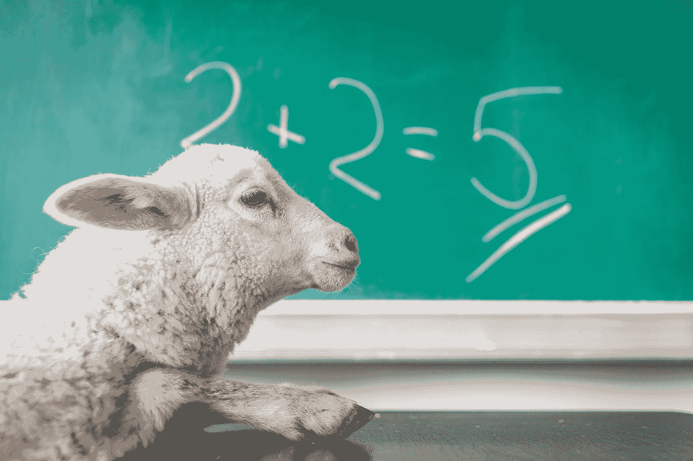

# 为什么你需要数学来编码

> 原文：<https://medium.com/javarevisited/do-you-need-math-to-code-us%CA%8D%C7%9D%C9%B9-%C7%9Ds-%C9%90up-no-dd0685444b42?source=collection_archive---------0----------------------->

## 数学=编程

米歇尔·玛特隆在 [Unsplash](https://unsplash.com?utm_source=medium&utm_medium=referral) 上的照片

数学和编程一直有着相似的氛围。

## 这是为什么呢？

当我思考这个问题时，我发现这很奇怪。

巧合的是，我见过的精通编程的人，大多也擅长数学。