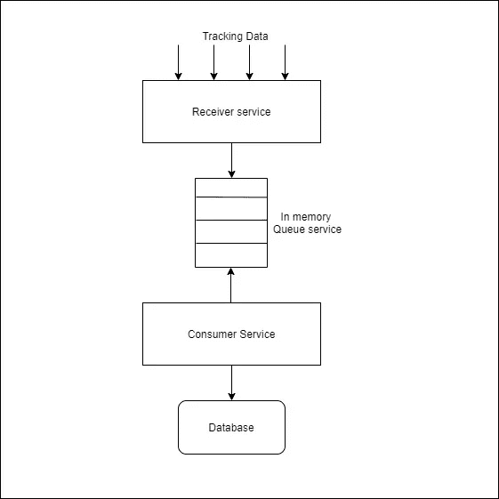
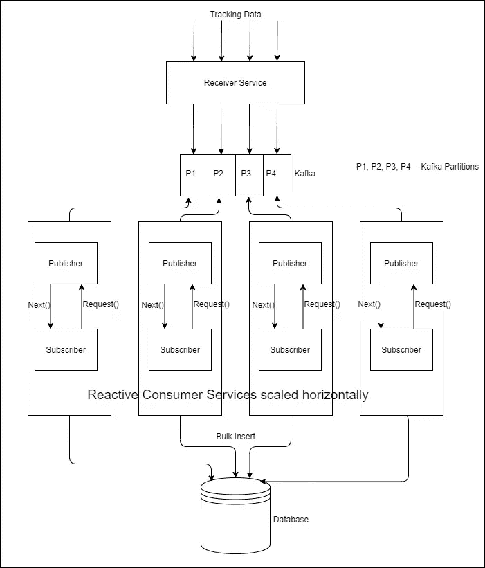

# 你的项目需要反应式编程吗？

> 原文：<https://medium.com/javarevisited/do-you-need-reactive-programming-for-your-project-5d55bf1e7b07?source=collection_archive---------1----------------------->

通过案例研究为 Java 工程师提供简单的解释

随着每天都有新的技术和框架进入软件工程栈，对于开发人员来说，跳跃和适应任何引起轰动的新技术确实已经成为一种诅咒。但是除非你的项目需要，否则我们完全没有必要去适应它。

亚采克·迪拉格在 [Unsplash](https://unsplash.com/s/photos/tap-water?utm_source=unsplash&utm_medium=referral&utm_content=creditCopyText) 上的照片

好好看看上面的图片。

那里发生了什么事？

*   自来水在流动
*   一个玻璃杯被用来收集水流并储存起来
*   玻璃杯是满的，水溢出
*   这个人对溢出的反应是关上水龙头，从而停止水流

现在想象一个软件系统有大量的输入数据。假设我们正在开发一个包含实时数据的数据分析平台。

首先，我们将需要一个服务来接收和转换来自用户系统的跟踪数据，以便数据分析人员可以使用这些数据进行分析工作。

我们的简单系统看起来像这样:

*   一个[微服务](/javarevisited/10-best-java-microservices-courses-with-spring-boot-and-spring-cloud-6d04556bdfed)接收跟踪数据
*   用于添加跟踪数据的简单内存队列
*   另一个消费者服务是获取数据、聚合数据、转换数据，然后插入数据库

让我们以一个电子商务网站为最终用户系统。为了简单起见，让我们假设我们只跟踪一个网站，并且我们的客户端脚本不汇总用户点击。电子商务网站的每次点击都会收到一条新消息。

一切都很顺利。网站做得还不错，所以我们收到了大量的数据，我们的系统也做得很好。

现在假设电子商务网站所有者决定推动大规模营销，他也将开始[黑色星期五交易](/javarevisited/15-best-udemy-courses-programmers-can-buy-on-black-friday-and-cyber-monday-2020-a803874f41d9)。他预计用户点击数将达到每分钟数百万次。

让我们想想我们的服务会受到怎样的影响？

*   我们的消费者服务，每次点击插入数据库，可能会表现不佳
*   队列大小可能会达到极限。

如何准备我们的系统来管理增加的负载？

我们为后者带来了威震天卡夫卡。只要每条消息的大小在几千字节以内，[卡夫卡](/javarevisited/top-10-apache-kafka-online-training-courses-and-certifications-621f3c13b38c)就是王道。

我们的消费者服务怎么样？它需要做得非常好。

当我们的数据超出我们的处理能力时会发生什么？我们要甩掉他们吗？我们缓冲他们吗？我们处理它们的方式不同吗？

就我们目前的消费者服务而言，没有决定上述内容的选项。它必须工作得非常好。

让我们首先考虑一下如何改善消费者服务。我们仍然只为一个客户工作(我们的电子商务网站)。

*   使服务水平可伸缩，增加几个服务并行处理。我们可以通过用[卡夫卡](https://javarevisited.blogspot.com/2018/04/top-5-apache-kafka-course-to-learn.html)分割密钥来实现。例如，网站中一个产品区域的一个服务。
*   不要对每条消息进行一次 db 调用，而是进行批量插入。

我们还可以在客户端脚本中进行改进，以聚集用户点击(可能基于时间或基于计数)并发送它们，而不是每次都发送。

即使完成了上述工作(还可以做更多的改进，但这不是我们这里关注的重点)，如果我们仍然有服务无法处理的突发传入数据，该怎么办呢？

这就是反应式模型发挥作用的时候。

有了像我们这样的事件驱动系统，即使优化了我们的服务，有时我们得到的还是超出了我们所能处理的。

> 如果消费者能够交流/反应出他被淹没了，生产者可以像我们的自来水场景一样调整他的数据流。

让我们以 Project Reactor 作为我们的案例研究。Project reactor 是最好的文档框架之一。

我们的系统现在看起来如下。

在我们的例子中，让我们想象我们已经写了一个类，它将从 Kafka 主题消费并创建一个数据流，我们可以把这个类叫做 *TrackingEventPublisher。*

下面是一个简单的测试类来模拟我们的数据流管道。我创建了两个简单的数据类， *TrackingData* 和 *TransformedData* 来展示数据转换是如何在这个管道中发生的。

项目反应堆给[通量](https://projectreactor.io/docs/core/release/reference/index.html#flux)产生一系列物品。我只是从一个简单的列表中创建两个项目的序列，在这里是为了学习。

简单的反应处理流水线

在上面的代码中，我们将数据持久层拆分为一个订阅者。我们这样做是因为我们认为数据库持久性可能是我们的瓶颈。

在发布服务器端，接收数据，然后对其进行转换并将其推送到订阅服务器。在我们的例子中，只有几个数据转换步骤，但是在真实世界的转换中，数据流中会有多个 db 调用或多个 rest 调用。我们需要找到瓶颈，并相应地进行管理。

当订阅服务器比发布服务器慢时，也就是说，当数据库持久化比转换步骤慢时，数据将在发布服务器端累积。

有了**反应式编程**，我们可以处理这种情况，并通知发布者如何处理这种情况。这称为背压。

在我们的例子中，reactor 发布者不会将数据推送到订阅者，直到订阅者发出请求。如果订阅方忙于处理，并且没有向发布方请求新数据，则意味着发布方遇到了背压信号。

在我们的例子中，我提供了这个 *onBackpressureBuffer* 操作符来缓冲那些数据流，直到它达到 1000。在那之后它会丢弃任何东西。

例如，如果订阅者每秒只能将 10，000 个数据对象写入数据库，但如果发布者试图将 11，000 个数据对象推入数据库，则发布者将遇到背压信号(即订阅者现在落后 1000 个)。现在，发布者将缓冲数据，而不是试图向下游传输。这被称为背压处理。

有许多策略可以处理这样的背压。

反压处理是[反应式编程](https://projectreactor.io/docs/core/release/reference/#_from_imperative_to_reactive_programming)的一个优点，其他包括对数据请求的非阻塞处理等等。

每个[框架](/javarevisited/top-10-frameworks-full-stack-java-developers-can-learn-in-2020-5995021401e5)都像 Project Reactor 为 [Flux](https://projectreactor.io/docs/core/release/api/reactor/core/publisher/Flux.html) 提供的那样提供了许多操作符，来进行数据转换，并使处理变得健壮和有弹性。

使用反应式编程，我们可以更好地转换和处理数据，但我们仍然应该很好地处理服务，如使其可伸缩或改进数据库查询，优化它等等。

> 反应式编程不是解决我们在软件系统中面临的所有问题的灵丹妙药。

从长远来看，持续的监控、重构和改进使我们的系统健康。