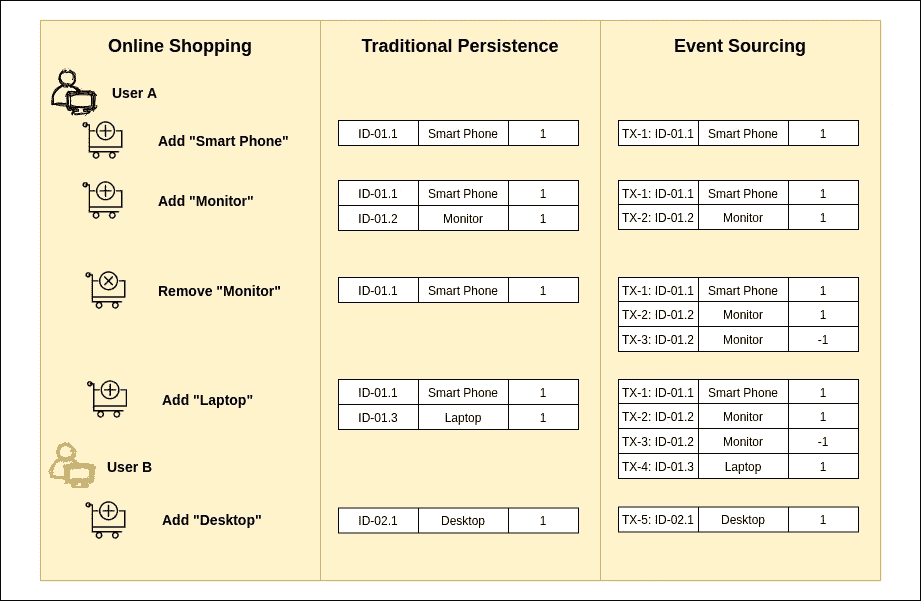
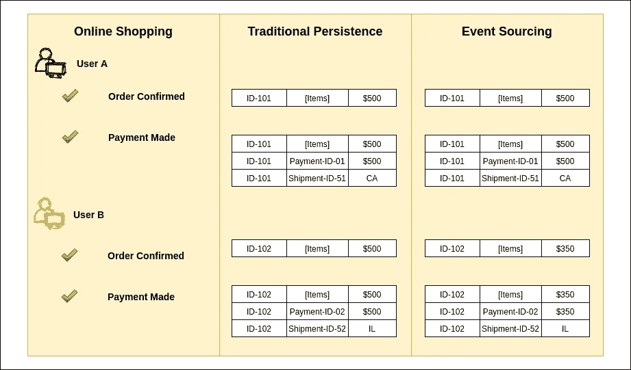

# 你真的需要“事件采购”吗？

> 原文：<https://medium.com/javarevisited/do-you-really-need-event-sourcing-22a53a32a96c?source=collection_archive---------1----------------------->

“事件源指的是基于将一个领域的 ***完整历史作为事件序列*** 持久化，而不仅仅是持久化当前状态的思想的**模式**的集合”——乌迪·达汗

丹尼斯·安德森在 [Unsplash](https://unsplash.com/s/photos/counting?utm_source=unsplash&utm_medium=referral&utm_content=creditCopyText) 上的照片

**剧透警报:**

在常规的企业应用程序开发中，事件源可能不会出现。但是它们在源代码控制系统(如 [Git](/javarevisited/7-best-courses-to-master-git-and-github-for-programmers-d671859a68b2) 、SVN)、数据库内部(如复制、备份和恢复)以及复杂企业应用 的一小部分中有其相关性。

> “只有当你处理复杂且不断变化的领域时，活动外包才是一个很好的选择”——乌迪·达汗
> 
> “使用事件源的企业应用程序很少，但我见过一些使用它的应用程序(或部分应用程序)”Martin Fowler
> 
> “不要把简历放在要求之前”——尼廷·博万卡尔

事件源包括两个关键方面— **应用程序状态和日志**。在任何给定的时间点，应用程序状态都可以通过重放事件(日志)从零重新构建为最新状态。 ***事件日志会是真相的来源。***

与活动采购相关的好处是(请收听 [Martin Fowler 会议](https://www.youtube.com/watch?v=aweV9FLTZkU)了解更多详情)

*   审查跟踪
*   重放或历史状态
*   排除故障
*   变体方案/ CQRS
*   分销支持
*   另类历史

用于解释事件来源的典型例子是订单。让我们考虑“内部事件”的购物车和“外部事件”的销售订单

> *💡订单管理实际上比大多数博客或视频会议解释的更复杂。*

购物车(内部事件)

*注意:删除事件可以用许多不同的方式来捕获。为了简单起见，我在数量上使用了负值😄*(绝对不是真正的用例)。**

事件采购可能不适合这类内部交易(或事件)。 CRUD ( [交易脚本](https://martinfowler.com/eaaCatalog/transactionScript.html))方法就足够了。

获得收益的替代方法

**审计**

*   某些时候，业务需求或法规要求决定了实施。例如，簿记和银行交易—
    a .不要删除任何交易,
    b .根据需要输入冲销分录
    c .根据需要创建汇总报表
    d .根据需要创建快照，如月结或年结
*   在所有其他情况下，根据需要，我们可以跟踪交易/事件，并在达到阈值后清除

**重放或历史状态**

*   Apache Kafka 类的事件流层可以跟踪事务并允许重放。
*   传统的消息传递层可以用于重放，但这将是一个挑战。定制开发将涉及持久化所有事件，并使用事件生成器重新生成事件。

*注:受可用存储空间和重新处理时间的限制*

**调试**

*   使用 ELK stack 或 Splunk 之类的日志管理工具来简化调试。作为事件消费者之一插入堆栈。

**变型方案/ CQRS**

*   报告数据库方法是一种低技术的替代方法，但在行业内长期适用
*   物化视图是一种数据库特性，它允许完全刷新和“增量”刷新
*   变更数据捕获和事件流可用于构建不同的方案

**分销支持**

*   让数据库来处理这些特性，而不是让应用程序来处理。例如，大多数数据库中的写入和读取副本功能

**“备选历史”用例可能非常适合事件采购。**

每当涉及到外部系统时，与业务事件(外部事件)相关的用例实际上会违背事件源。在大多数现实世界的系统中，外部系统或其他部门系统总是存在的。

企业业务

我们不能随意重放事件，除非我们确保禁止向外部系统发送通知和请求。

如果你想知道(像我一样)事件采购非常适合的罕见用例，答案是**双时间**

> Bitemporal 允许您同时沿着两个时间轴跟踪数据库文档。它可以让您**跟踪事件发生的时间**(有效时间)，以及数据输入数据库的时间(系统时间)。
> 
> 在金融服务、保险、医疗保健、智能、执法等一些行业中，记录这些不同的时间非常重要。了解信息何时已知，并能够在审计时重新创建历史记录或在事后执行分析，这一点至关重要。
> 来源:[https://www.marklogic.com/blog/bitemporal/](https://www.marklogic.com/blog/bitemporal/)

这个博客是基于这些来源分享的观点

*   [活动采购— 2016](https://www.youtube.com/watch?v=aweV9FLTZkU) 📺马丁·福勒
*   【2020 年欧洲 DDD 展会采购活动📺乌迪·达汗
    *旁注:我希望开发人员观看、学习和欣赏建筑讨论——乌迪·达汗的精彩演讲在 YouTube 上仅获得了 4k 的浏览量*😞
*   [Axon 事件源](https://axoniq.io/resources/event-sourcing)📕

> **免责声明:** Axon 框架简化了微服务的开发，有助于采用领域驱动设计和命令查询责任分离(CQRS)。唯一需要澄清的争议或疑问是“活动采购”。到目前为止，我还没有动手操作过 Axon。