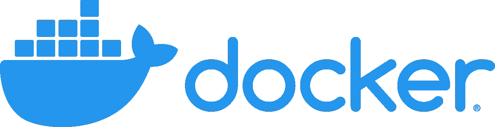

# Kubernetes (K8s#2)的停靠步骤

> 原文：<https://medium.com/javarevisited/docker-steps-for-kubernetes-k8s-2-a1ed00acdeba?source=collection_archive---------3----------------------->

## Kubernetes 最常用的 Docker 零件

在开始学习 Kubernetes 概念并尝试创建本地集群来实践一些概念验证之前，您需要知道如何定义容器的映像，因为这是在 Kubernetes 集群上拥有可部署应用程序的起点。记住这个目标，让我们看看如何…