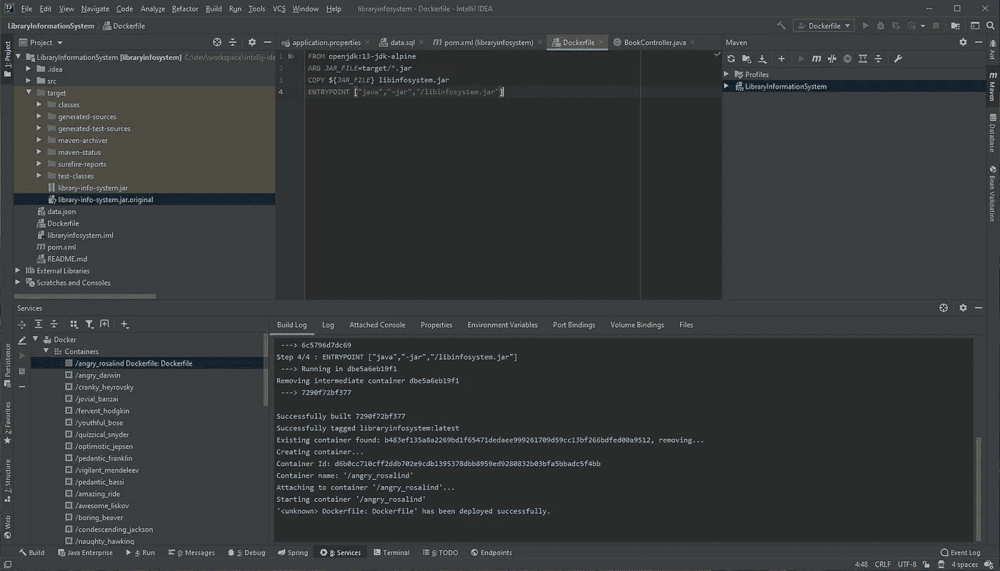
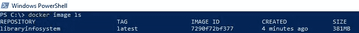
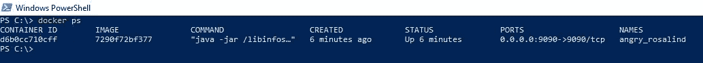
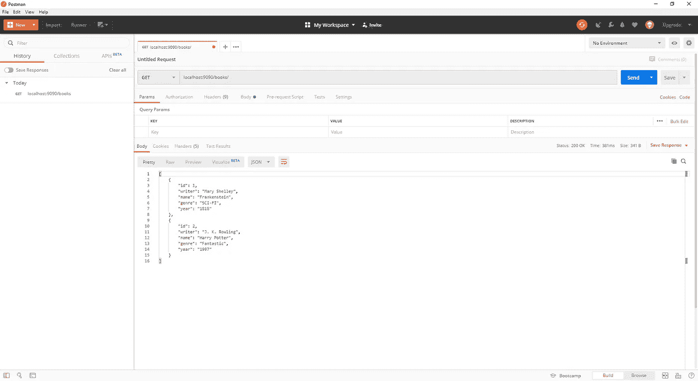
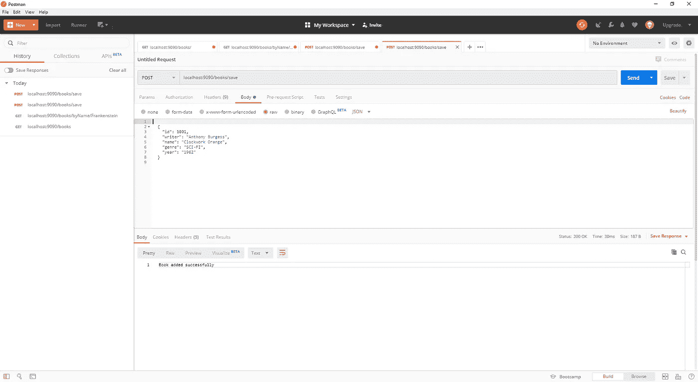
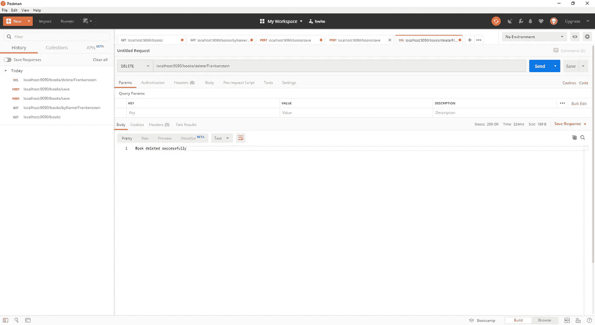

# 将 Spring Boot 的申请归档

> 原文：<https://medium.com/javarevisited/dockerizing-a-spring-boot-application-47842f7142b1?source=collection_archive---------0----------------------->

久别之后的问候😄，我终于有时间解释如何对 Spring Boot 的申请进行归档。

如你所知，我先写了这篇文章: [***《码头工人简介》***](/quick-code/a-brief-information-about-docker-3b34446590cd) 。最好先阅读这篇文章，因为它包含了每个开发人员都应该知道的简要信息💻。


帕特里克·布林克斯马在 [Unsplash](https://unsplash.com?utm_source=medium&utm_medium=referral) 上拍摄的照片

一旦你读了前一篇文章，你就准备好学习使用 Docker 和 Spring Boot。

从现在开始，我将假设您已经在自己的计算机上安装了 Docker。

在本教程中，我将告诉你如何使用 [Docker](/javarevisited/top-15-online-courses-to-learn-docker-kubernetes-and-aws-for-fullstack-developers-and-devops-d8cc4f16e773) 和 [Spring Boot](/javarevisited/10-advanced-spring-boot-courses-for-experienced-java-developers-5e57606816bd?source=collection_home---4------0-----------------------) ，并给出一个使用 Spring Boot 和 Docker 的例子。

*   这里使用了用于开发 REST APIs 的 Spring Boot 和 Spring 数据项目。
*   Maven 用于自动化构建过程。
*   使用典型的领域驱动开发方法，分离模型、存储库、服务和控制器类。

你可以从这个 [**GitHub 链接**](https://github.com/ragcrix/LibraryInformationSystem) **下载项目源代码。**

# 技术和工具

**在[本教程](/javarevisited/how-to-use-project-lombok-with-spring-boot-ac84bd6047d1) 中开发的图书馆信息系统**在本帖中有详细说明。关于这个项目的更多细节，你可以点击[这个链接](/javarevisited/how-to-use-project-lombok-with-spring-boot-ac84bd6047d1)。

这里的教程使用了 [IntelliJ IDEA](https://www.jetbrains.com/idea/) 、 [Maven](https://maven.apache.org/) 和 [Docker](/javarevisited/top-5-free-courses-to-learn-docker-for-beginners-best-of-lot-b2b1ad2b98ad) 。我正在使用 PowerShell 运行 Windows 10。

所有软件都是用 Java 写的，用的是 Spring 5.2 和 Spring Boot 2.2.2，内存 H2 数据库用于持久化。

从这里开始，我假设你已经安装了 JDK 13.0、 [IntelliJ](https://itnext.io/top-5-intellijidea-and-android-studio-courses-for-java-and-android-programmers-afcc27309b60) 、 [Maven](/javarevisited/top-10-free-courses-to-learn-maven-jenkins-and-docker-for-java-developers-51fa7a1e66f6?source=collection_home---4------3-----------------------) 和 [Docker](/@javinpaul/10-free-courses-to-learn-docker-and-devops-for-frontend-developers-691ac7652cee) 。

我在这里的目标是展示如何在不打乱业务逻辑的情况下以简单的方式使用 Docker。

一个 Spring Boot 应用程序可以用两种最常用的方法来分类。

*   **Dockerfile:** 它包含构建映像的本地 Docker 命令。
*   它有一个插件来构建图像。

# 使用 Dockerfile 归档

“一个`Dockerfile`是一个文本文档，它包含用户可以在命令行上调用的所有命令来组合一个图像”。用户可以编写命令在 Dockerfile 上构建映像。

我们的示例`Dockerfile`如下所示。

Dockerfile 文件

我们的`Dockerfile`有四个命令。4️⃣

*   `FROM`命令用于设置基础图像。在我们的`Dockerfile`，是`openjdk:13-jdk-alpine`。
*   `ARG`命令用于在构建时将已定义的变量传递给构建器。这种情况下，就是我们的`.jar`文件。
*   `COPY`命令将指定文件复制到图像中。这种情况下。我们创建的`.jar`文件将被复制到基础映像。
*   `ENTRYPOINT`用于如何执行容器内部的应用程序。

准备好`Dockerfile`之后，应该运行`maven package`命令来创建`.jar`文件。因为`Dockerfile`运行时需要这个`.jar`文件。💻



构建结果

完成所有工作后，您可以使用 IntelliJ 中的`Dockerfile`运行或调试应用程序。我使用了 IntelliJ，但是如果你愿意，你可以手动完成这些步骤。为此，应使用`docker build`和`docker run`命令。您可以点击[此链接](https://docs.docker.com/engine/reference/builder/)了解更多信息。

您可以看到我们的应用程序的运行映像和容器。😃



Docker 图像



码头集装箱

# 与 Maven 对接

Spring Boot 应用程序也可以使用 Maven 进行 dockerized。有几个插件用于将应用程序归档。

其中之一就是 **Spotify** 插件。🎵在这篇文章中，使用了这个插件。你可以在下面看到我们 Maven 插件的配置。这个插件应该加在`<build> </build>`标签之间。

pom.xml

如你所见，使用了`<baseImage>`和`<entryPoint>`标签。这些标签分别具有与 Dockerfile 的`FROM`和`ENTRYPOINT`命令相同的用途。

配置完成后，我们可以运行下面的命令来创建应用程序的映像。

```
mvn clean package docker:build
```

现在，创建的 docker 图像可以用下面的命令显示。


Docker 图像

之后，您应该使用`docker run ...`命令来运行该映像。🏃

为此应用程序创建的容器如下所示。


码头集装箱

# 邮递员测试

你可以很容易地运行这个项目来测试 [REST 服务](/javarevisited/why-spring-is-the-best-framework-for-developing-rest-apis-in-java-784590e484a4)。

当然，您应该运行创建的 docker 映像来测试 REST 服务。😃

如果你想把这本书添加到图书馆信息系统中，你可以使用项目根目录下的 *data.json* 。

运行项目后，您可以测试 REST 服务。为此，打开 [Postman](https://javarevisited.blogspot.com/2020/02/top-5-postman-tutorials-and-courses-for-web-developers.html) ，输入 URL，选择 **GET** 方法，如下图。



书单

同样，在数据库中输入带有图书名称的链接。


弗兰肯斯坦

你可以在 Postman 中用 **POST** 方法给系统添加一本书。首先要输入***Content-Type:application/JSON***header 键值对。其次，在 body 选项卡中，您必须输入想要以 JSON 格式保存数据库的图书信息。



添加图书

如果要删除一本书，要在 Postman 中选择 **DELETE** 方法，在链接末尾添加一个想要删除的书名。



删除图书

# 资源

*   [https://spring.io/](https://spring.io/)
*   [https://docs.docker.com/](https://docs.docker.com/)
*   [面向初学者的免费 Spring Boot 课程](/javarevisited/10-free-spring-boot-tutorials-and-courses-for-java-developers-53dfe084587e)
*   [面向初学者的免费 Docker 课程](/javarevisited/top-5-free-courses-to-learn-docker-for-beginners-best-of-lot-b2b1ad2b98ad)

**注意:**本教程主要讲述如何以一种简单的方式对 Spring Boot 应用程序进行 dockerize。