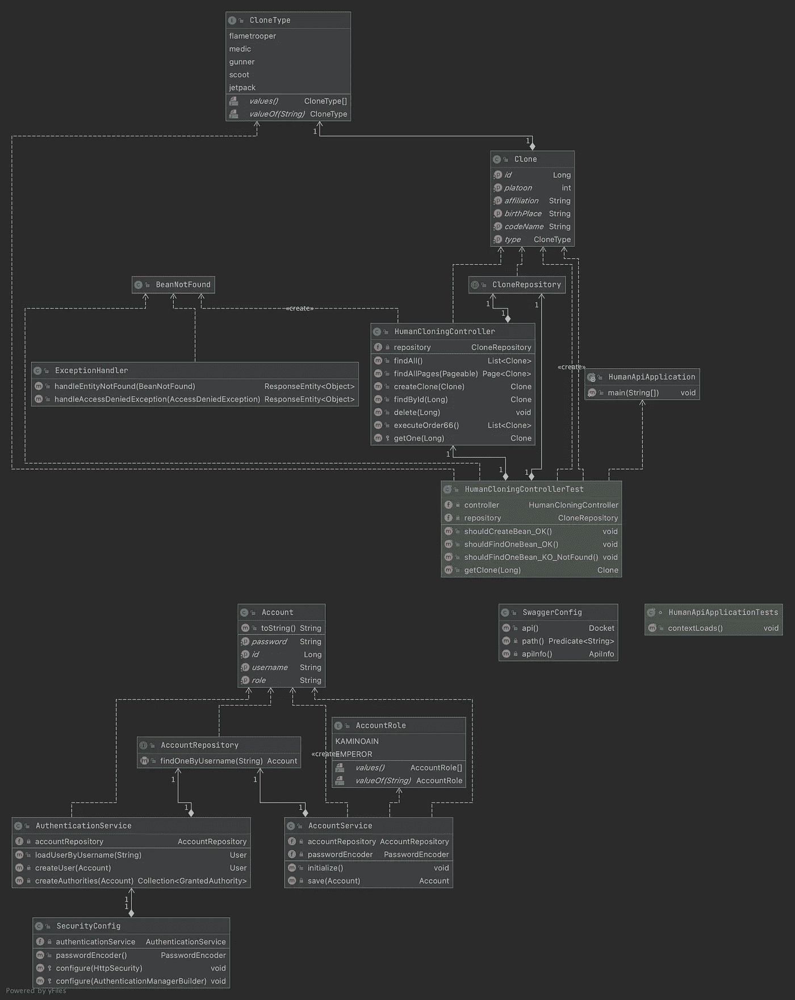
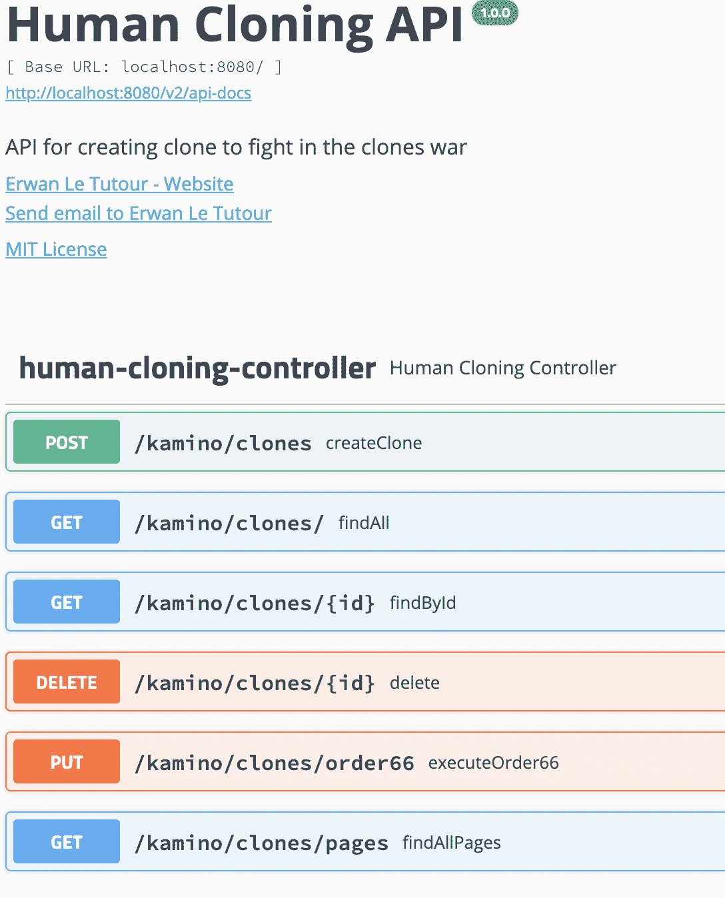
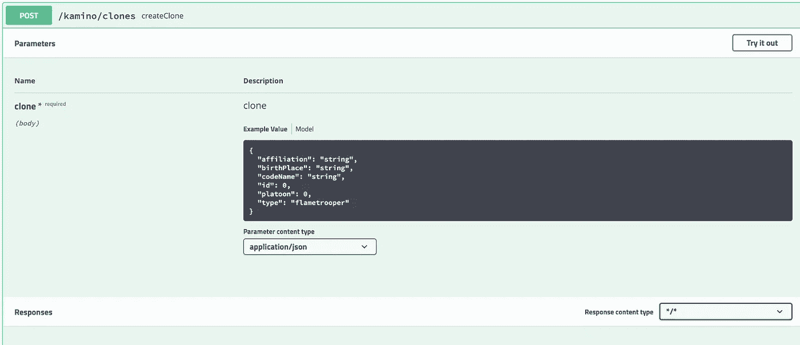
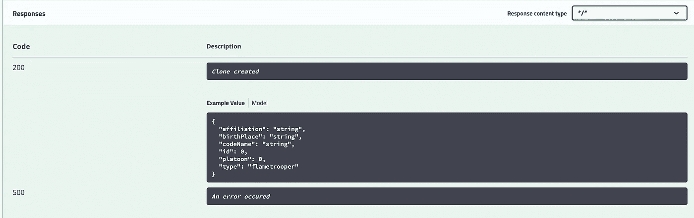
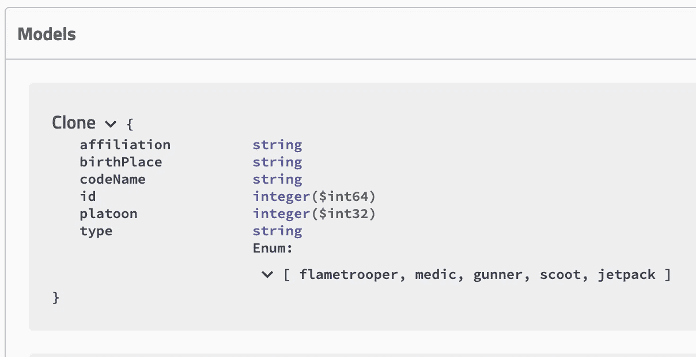
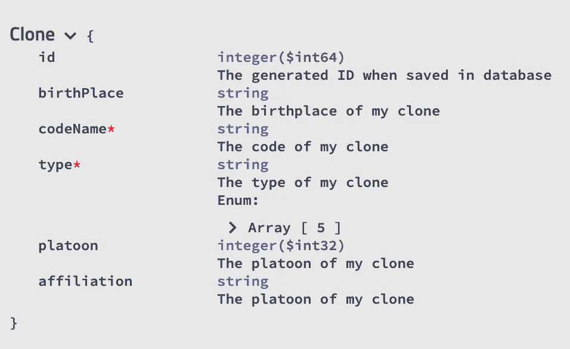
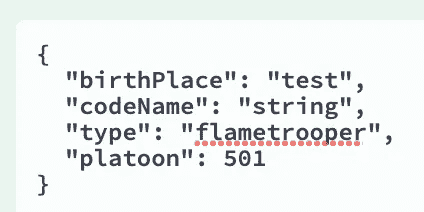
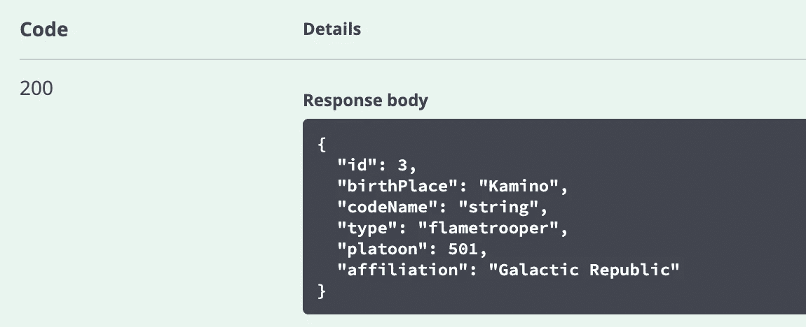

# 用 Swagger 记录您的 API

> 原文：<https://medium.com/javarevisited/documenting-your-api-with-swagger-c27a94104135?source=collection_archive---------2----------------------->

## 在绝地档案馆中搜寻


绝地档案馆

所以在[构建了我们的 API](/javarevisited/building-a-simple-rest-api-with-springboot-3f2e4b123ebb) 并且[保护了它](/javarevisited/securing-your-rest-api-with-springsecurity-8ba440fe7b58)之后，我们现在将对它进行文档化，以允许其他人更容易地使用它。为此，我们将实施[霸气](https://swagger.io/)。

# 你需要什么

为了遵循本教程，您将需要一个 REST API，因此您可以:

*   按照[教程来构建你的 API](/javarevisited/building-a-simple-rest-api-with-springboot-3f2e4b123ebb)
*   克隆这个库的[主分支](https://github.com/ErwanLT/HumanCloningFacilities)
*   准备好自己的 API

# 它会是什么样子

[](https://www.java67.com/2015/09/top-10-restful-web-service-interview-questions-answers.html)

UML 表示

# 我记录，你记录，我们记录

## 第一个依赖

因此，如果我们想将 swagger 用于我们的 API，我们首先需要添加一个 maven 依赖项

```
<dependency>
    <groupId>io.springfox</groupId>
    <artifactId>springfox-swagger2</artifactId>
    <version>2.9.2</version>
</dependency>
```

## java 配置

要启用 Swagger，我们需要配置它，所以让我们创建一个配置类。

如您所见，在 apiInfo 方法中，我描述了我的 API 的一般信息:

*   标题
*   描述
*   版本
*   服务条款(url)
*   加入 API 所有者的联系人
*   许可证
*   许可证 url
*   API 供应商的扩展

所有这些信息将在后面显示。

## JSON 生成的

因此，如果我启动我的应用程序并转到[http://localhost:8080/v2/API-docs](http://localhost:8080/v2/api-docs)，我将看到我的文档的 JSON 表示

[](https://javarevisited.blogspot.com/2017/02/how-to-consume-json-from-restful-web-services-Spring-RESTTemplate-Example.html)

如你所见，我找到了我在配置课上填写的所有信息。
但是说实话，json 文件不错，但是 IHM 会更好。
那么让我们来实现这个 IHM。

## 大摇大摆的 IHM

要启用 IHM，我们不需要做这么多工作，只需添加一个 maven 依赖项就足够了

```
<dependency>
    <groupId>io.springfox</groupId>
    <artifactId>springfox-swagger-ui</artifactId>
    <version>2.9.2</version>
</dependency>
```

然后，如果我重新启动我的应用程序并转到[http://localhost:8080/swagger-ui . html](http://localhost:8080/swagger-ui.html)，我可以看到一个漂亮的(完全相对的)IHM，它显示了我的 API 信息。

[](https://javarevisited.blogspot.com/2016/04/what-is-purpose-of-http-request-types-in-RESTful-web-service.html#axzz6pAutpw4L)

所以现在我们有了我们的狂妄的 IHM，但是没有关于它的真正的文档，我们有了我们的终点，如果我们扩展它，我们有一些信息，但是没有什么很好的文档。
现在让我们添加我们的文档。

## 记录我们的控制器

完成前面的步骤后，如果我扩展 POST 端点，应该会看到类似这样的内容

[](https://www.java67.com/2017/10/how-to-test-restful-web-services-using.html)

所以让我们在我的[控制器](https://javarevisited.blogspot.com/2017/08/difference-between-restcontroller-and-controller-annotations-spring-mvc-rest.html#ixzz6OYNB9oii)上添加一些文档。

随着

*   **@ApiOperation** :我可以添加我的端点(值)的更详细的描述，并指定它消费和生产什么。
*   **@ApiResponses** :我描述了我的 API 的返回代码，这里是 200 和 500。

因此，如果我(再次)重启应用程序，我应该能够看到变化

[](https://javarevisited.blogspot.com/2018/02/top-20-spring-rest-interview-questions-answers-java.html)[](https://javarevisited.blogspot.com/2017/04/how-to-convert-map-to-json-to-hashmap-in-java.html?fbclid=IwAR1R88ss_YXYcwn4CGDTMeJdSV30YUv60e6CrGRjqA0m_QVMwWn6606JlV4#ixzz61TA9Eun9)

那更好。
我们已经看到，在我的 API 文档中，记录了我的端点，但我也有一个关于我的模型的部分(我的 API 生产或消费什么)，这些模型也可以被记录。
因此，让我们添加一些文档。

**记录我们的模型**

所以我有我的克隆类作为我的模型，在这里我有一些没有记录的属性，它在我的大摇大摆中表现出来，就像这样

[](https://javarevisited.blogspot.com/2018/02/top-5-restful-web-services-with-spring-courses-for-experienced-java-programmers.html)

除了我的财产类型，我没有太多的信息。
为了添加它，我们将在类上使用 **@ApiModel** 注释，在属性上使用 **@ApiModelProperty** 注释，这将允许我们添加定义，如描述(值)、名称、数据类型、示例值和允许值。

所以现在我的克隆类将是这样的:

在我的 Swagger-ui 中，现在模型将是这样的:

[](https://www.java67.com/2018/02/3-books-and-courses-to-learn-restful-web-services-with-spring.html)

如您所见，我描述的必填字段有一个 ***。**

# 用 Swagger 测试我们的 API

那么现在我们有了我们的昂首阔步的奔跑和良好的记录，我们能用它做什么呢？我们可以测试我们的端点！
滚动 swagger-ui 页面，您应该已经注意到我们每个端点中的这个按钮。


如果您单击它，它会稍微改变您的页面，以便您可以编写请求的正文，或者编辑一些参数。



然后，您可以对本地主机执行查询，并查看下面的结果。



感谢您的阅读时间，如前所述，本教程中使用的代码可在 Github 知识库分支 swagger 中找到。