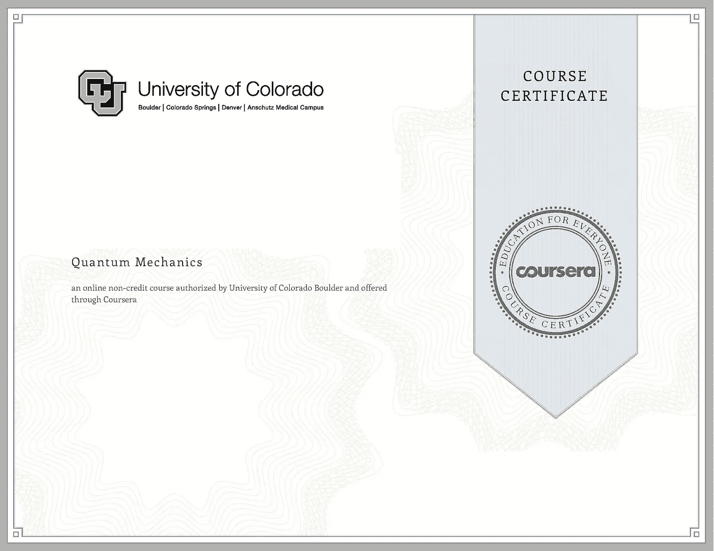

# Coursera，edX，Udemy 的课程证书对工作和事业有帮助吗？

> 原文：<https://medium.com/javarevisited/does-coursera-edx-and-udemy-course-certificate-help-in-jobs-and-careers-416cfb422d0f?source=collection_archive---------0----------------------->

## 像 Coursera，edX，Udemy，Educative 这些在线学习平台的课程完成证书值得吗？

大家好，如果你正在网上学习，并且想知道你在像<https://click.linksynergy.com/fs-bin/click?id=JVFxdTr9V80&offerid=323058.9409&type=3&subid=0>**[**Coursera**](https://coursera.pxf.io/c/3294490/1164545/14726?u=https%3A%2F%2Fwww.coursera.org%2F)[edX](https://www.awin1.com/cread.php?awinmid=6798&awinaffid=631878&clickref=&p=)[**Educative**](https://www.educative.io/?affiliate_id=5073518643380224)[**LinkedIn Learning**](http://linkedin-learning.pxf.io/c/1193463/449670/8005)[uda city](https://imp.i115008.net/c/1193463/786224/11298?u=https%3A%2F%2Fwww.udacity.com%2F)这样的网站上获得的课程完成证书是否值得，那么你来对地方了。在本文中，我将根据自己作为求职者、面试官和招聘经理的经历来回答这个问题。**

**虽然在线课程提供了一个低成本、按照你的时间表和你自己的进度学习的极好平台，但我经常收到我的读者关于他们提供的证书的价值的问题。**

**很多人问我，[**【Udemy】**](https://click.linksynergy.com/fs-bin/click?id=JVFxdTr9V80&offerid=323058.9409&type=3&subid=0)[**Coursera**](https://coursera.pxf.io/c/3294490/1164545/14726?u=https%3A%2F%2Fwww.coursera.org%2F)[edX](https://www.awin1.com/cread.php?awinmid=6798&awinaffid=631878&clickref=&p=)[Educative](https://www.educative.io/?affiliate_id=5073518643380224)， [Udacity](https://www.udacity.com/) 或任何此类在线平台提供的课程完成证书是否有价值？**

**这个问题的答案是既肯定又否定，因为这完全取决于价值对你意味着什么？如果你认为仅仅在 Coursera 上完成一门计算机科学或[数据科学课程](https://dev.to/javinpaul/10-data-science-and-machine-learning-courses-for-programmers-looking-to-switch-career-57kd)并在你的简历或 LinkedIn 上展示一份证书就能让你得到一份工作，那肯定是不值得的，但同时，这些证书可以让你的简历被许多寻找数据科学家的招聘人员看中。

一个课程完成证书并不能让你成为专家，但它确实表明你已经完成了某一特定主题的课程，这意味着你了解它，并且你是一个不断的学习者，这是招聘程序员、工程师、开发人员和数据科学家时必不可少的属性。可悲的事实是，几乎 90%参加在线课程的人都没有完成课程。是的，这个数字可能看起来令人惊讶，但这是事实。我知道我的许多朋友在 Udemy<https://click.linksynergy.com/fs-bin/click?id=JVFxdTr9V80&offerid=323058.9409&type=3&subid=0>**上上课，有成千上万的学习者报名参加，但他们中很少有人完成课程，所以课程完成证书肯定会给你提个醒。

但与此同时，你需要记住，课程完成认证与甲骨文的 [Java 认证](https://javarevisited.blogspot.com/2019/12/how-to-crack-java-se-11-certification.html)或亚马逊的 [AWS 认证](https://dev.to/javinpaul/top-5-courses-to-pass-amazon-aws-certified-solutions-architect-associate-exam-saa-c01-in-2020-56g7)或微软的 [Azure 认证](https://javarevisited.blogspot.com/2019/07/top-5-courses-to-crack-azure-architecture-technologies-certification-az-300-exam.html)非常不同，后者真正测试你的技能，然后授予你证书。****

****它们绝对比来自 Udemy、T2、Coursera、T4、edX、T7 和 Udacity 的标准课程结业证书更有价值。****

****<https://coursera.pxf.io/c/3294490/1164545/14726?u=https%3A%2F%2Fwww.coursera.org%2F>  

# Coursera 和 Udemy 的课程认证值得吗？它们会提升你的简历吗？

在编程面试中，我两边都参加过。作为一名候选人，我看到招聘人员对我的简历感兴趣，谈论我的证书，而作为一名面试官和招聘经理，我也重视简历上有证书的人，而不是没有证书的人，前提是他们在经验等其他方面相似。

我还看到招聘人员在添加了 [Java](https://javarevisited.blogspot.com/2019/10/top-5-books-courses-to-crack-oracles-java-se-11-certification-OCAJP11.html) 、 [Spring](https://javarevisited.blogspot.com/2018/08/how-to-crack-spring-core-professional-certification-exam-java-latest.html#axzz5j90KOik7) 和 [AWS 认证](/javarevisited/top-5-aws-training-courses-to-crack-amazon-web-service-solutions-architect-associate-certification-3f4affa8f660)之后，对开发人员的个人资料进行了狂轰滥炸，因此这肯定是有价值的，但仅仅拥有认证并不能保证你获得任何东西，除了初次曝光。
这些绝对是我在考虑潜在雇员时的一些重要特征。但是，在这里你需要非常小心。在你的简历上不放证书或课程完成证明是可以的，但是如果你的证据，你必须准备好证明你已经获得了它们。

例如，如果有人说他是一名 [Oracle 认证的 Java 开发人员](https://javarevisited.blogspot.com/2018/01/top-5-java-8-certifications-courses-training-online-OCAJP.html)，却不能回答几个关于 Java 中运算符优先级的棘手问题，我会怀疑他是否真的值得认证。

同样，如果你说你在 Coursera 上完成了**T**[he Google Cloud 认证](https://coursera.pxf.io/c/3294490/1164545/14726?u=https%3A%2F%2Fwww.coursera.org%2Flearn%2Fgcp-fundamentals) 但不知道什么是计算引擎、BigQueury 或 BigTable，那么我认为你没有诚意，你只是关心论文而不是学习技能，这是这些在线课程的首要目标。

这意味着在你的简历或 LinkedIn Monster 或 Naukri.com 个人资料上放上课程完成证书绝对是值得的，但你必须准备好展示你有足够的知识来证明这些证书。

> 如果你不能在面试中证明你的知识和经验，这是一个很大的负面影响，对他们中的许多人来说，这只是面试的结束。

# 开始职业生涯的 10 个最佳 Coursera 认证

在所有这些平台中，当谈到认证时，Coursera 是我最喜欢的，如果你正在寻找有价值的综合认证，那么这里是开始你职业生涯的最佳 Coursera 认证:

*   [**谷歌数据分析专业证书**](https://coursera.pxf.io/c/3294490/1164545/14726?u=https%3A%2F%2Fwww.coursera.org%2Fprofessional-certificates%2Fgoogle-data-analytics)**(675846**已报名)
*   [**深度学习**](https://coursera.pxf.io/c/3294490/1164545/14726?u=https%3A%2F%2Fwww.coursera.org%2Fspecializations%2Fdeep-learning) **来自 deeplearning.ai**
*   [**谷歌 UX 设计专业证书**](https://coursera.pxf.io/c/3294490/1164545/14726?u=https%3A%2F%2Fwww.coursera.org%2Fprofessional-certificates%2Fgoogle-ux-design) ( **370，353** 已报名)
*   [**谷歌 IT 支持**](https://coursera.pxf.io/c/3294490/1164545/14726?u=https%3A%2F%2Fwww.coursera.org%2Fprofessional-certificates%2Fgoogle-it-support) **来自谷歌**
*   [**IBM 数据科学**](https://coursera.pxf.io/c/3294490/1164545/14726?u=https%3A%2F%2Fwww.coursera.org%2Fprofessional-certificates%2Fibm-data-science) 出自 ***IBM***
*   [**Google IT 自动化与 Python**](https://coursera.pxf.io/c/3294490/1164545/14726?u=https%3A%2F%2Fwww.coursera.org%2Fprofessional-certificates%2Fgoogle-it-automation) **来自 Google**
*   [**AWS 基础**](https://coursera.pxf.io/c/3294490/1164545/14726?u=https%3A%2F%2Fwww.coursera.org%2Fspecializations%2Faws-fundamentals) **来自亚马逊网络服务**
*   [**谷歌项目管理:专业证书**](https://coursera.pxf.io/c/3294490/1164545/14726?u=https%3A%2F%2Fwww.coursera.org%2Fprofessional-certificates%2Fgoogle-project-management) (已报名 464064)
*   [**AI For every one**](https://coursera.pxf.io/c/3294490/1164545/14726?u=https%3A%2F%2Fwww.coursera.org%2Flearn%2Fai-for-everyone)**来自 deeplearning.ai**
*   [**云架构**](https://coursera.pxf.io/c/3294490/1164545/14726?u=https%3A%2F%2Fwww.coursera.org%2Fprofessional-certificates%2Fgcp-cloud-architect) **用谷歌云从谷歌云**

顺便说一下，除了单独加入这些课程和专业，你还可以加入 [**Coursera Plus**](https://coursera.pxf.io/c/3294490/1164545/14726?u=https%3A%2F%2Fwww.coursera.org%2Fcourseraplus) ，这是 Coursera 的一个订阅计划，让你无限制地访问他们最受欢迎的课程、专业、专业证书和指导项目。

<https://coursera.pxf.io/c/3294490/1164545/14726?u=https%3A%2F%2Fwww.coursera.org%2Fcourseraplus>  

那都是关于【Udemy，Coursera，edX，Udacity 的课程证书到底有没有价值。它们在提供认可、在你的简历中添加关键词以及提供初步指导方面肯定是有价值的，但是你不能通过使用它们找到工作或开始职业生涯。你需要有扎实的技能来支持这些证书。

关于课程认证的*价值，我想提及的另一个微妙之处是感知*。例如，一般来说，由[谷歌](https://javarevisited.blogspot.com/2019/07/top-5-google-cloud-platform-gcp-courses-certifications-online.html)、[微软](https://javarevisited.blogspot.com/2019/09/top-5-courses-to-learn-microsoft-excel-macros-vba-and-data-visualization.html)、 [AWS](https://hackernoon.com/top-5-online-courses-to-crack-amazon-web-service-aws-solutions-architect-associate-exam-saa-c01-c667514ca72) 、 [IBM](https://becominghuman.ai/9-data-science-and-machine-learning-courses-by-harvard-ibm-udemy-and-others-12a0c7c23ec1) 或[斯坦福大学](https://hackernoon.com/10-machine-learning-data-science-and-deep-learning-courses-for-programmers-7edc56078cde)提供的 Coursera 或 Udacity 证书要比某个不知名作者提供的随机证书有价值得多。不要误解我的意思，你也许可以在其他课程上学得更好，这应该是首要目标，但像谷歌、AWS、微软、IBM、SalesForce 这样的公司，以及斯坦福、密歇根和香港大学这样的大学，享有人们的高度信任。每当他们说你与这些大公司有联系时，他们都会注意，这就相当于对你的简历投了赞成票。话虽如此，千万不要仅仅为了证书而参加在线课程，你的主要目标应该是学习技能和提高自己，文档只是一个副产品。我总有一天会雇佣一个精通编码、算法、Java 的 Java 程序员，然后雇佣一个完成了几门在线课程的人，这些课程是关于 Udemy、Coursera、edX、Udacity 或任何其他在线平台的，但是他不会写一个包含几门课程的程序。

<https://click.linksynergy.com/fs-bin/click?id=JVFxdTr9V80&offerid=323058.9409&type=3&subid=0>  

您可能喜欢的其他**编程和开发文章**

*   【Java 开发人员十大 IT 认证
*   [2022 年 Java 开发者路线图](https://javarevisited.blogspot.com/2019/10/the-java-developer-roadmap.html)
*   [2022 年 10 大最佳 Coursera 认证目标](/javarevisited/11-best-coursera-certifications-and-courses-for-data-science-and-analysis-in-2021-65ce1ac810a5)
*   [每个程序员都应该学习的 11 个基本技能](https://dev.to/javinpaul/11-essential-skills-software-developers-should-learn-in-2020-1bio)
*   [IT 专业人员的 5 个最佳 Coursera 认证](/javarevisited/top-10-coursera-certificates-to-start-your-career-in-cloud-data-science-ai-mainframe-and-it-558690c83587)
*   [2022 年你可以学习的 10 种编程语言](http://www.java67.com/2017/12/10-programming-languages-to-learn-in.html)
*   [每个 Java 开发人员都应该知道的 10 个工具](http://www.java67.com/2018/04/10-tools-java-developers-should-learn.html)
*   [顶级科技公司提供的 18 项 Coursera 认证](/javarevisited/18-coursera-courses-you-can-join-in-2020-to-learn-from-the-worlds-top-tech-companies-google-74af46967d1e?source=collection_home---4------0-----------------------)
*   [学习 Java 编程语言的 10 个理由](http://javarevisited.blogspot.sg/2013/04/10-reasons-to-learn-java-programming.html)
*   [10 门编码面试的系统设计课程](/javarevisited/10-best-system-design-courses-for-coding-interviews-949fd029ce65)
*   [2022 年 aim 将获得 10 项 AWS 和云认证](https://javarevisited.blogspot.com/2020/09/top-10-aws-certifications-for-cloud-professionals.html)
*   每个 Java 开发人员都应该知道的 10 个测试库

感谢您阅读本文。如果你喜欢这篇文章，认为 Coursera、edX、Udacity、Udemy 课程完成认证值得，那么请分享给你的朋友和同事。如果您有任何问题或反馈，请留言。

**P. S.** —如果你正在寻找 IT 认证，我强烈建议你去参加云认证，因为云是当今世界最受欢迎的技能。在云中，AWS 最受欢迎，因此 **AWS 解决方案架构师**是 2022 年获得的最佳云认证。去吧，如果你需要资源，在 Udemy 上查看夏羽·马瑞克的 [**AWS 解决方案架构师指南**](https://click.linksynergy.com/deeplink?id=JVFxdTr9V80&mid=39197&murl=https%3A%2F%2Fwww.udemy.com%2Faws-certified-solutions-architect-associate-saa-c01%2F) 。

<https://click.linksynergy.com/deeplink?id=JVFxdTr9V80&mid=39197&murl=https%3A%2F%2Fwww.udemy.com%2Faws-certified-solutions-architect-associate-saa-c01%2F> ****