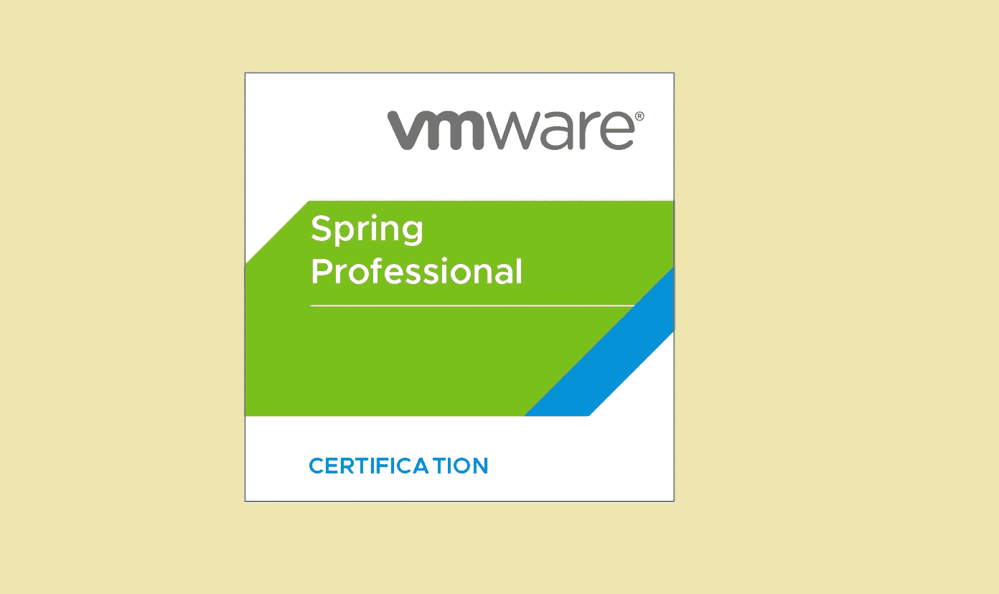
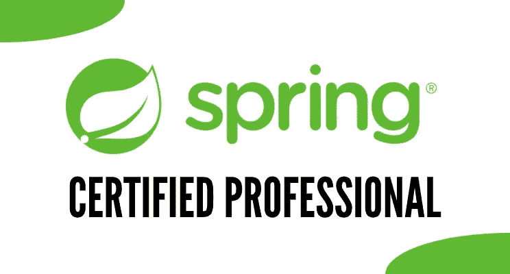
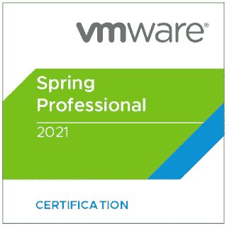
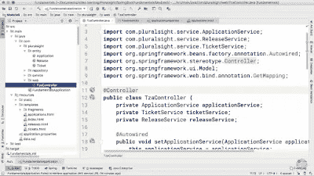
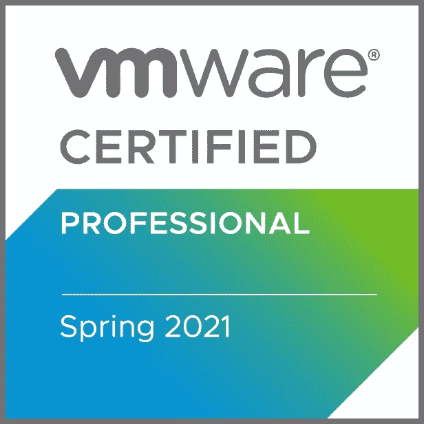
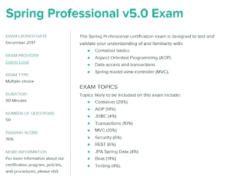
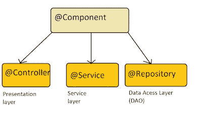
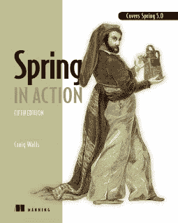
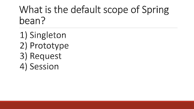

# 2023 年 VmWare 的 Spring Professional 认证值得吗？

> 原文：<https://medium.com/javarevisited/does-vmware-spring-professional-certification-worth-it-183d7b770df2?source=collection_archive---------0----------------------->

## 是的，成为一名认证的 Spring 开发者是值得的，因为你不仅深入地学习了 Spring，而且得到了认可，为 Spring 开发者面试做了更好的准备。

大家好，作为 Java 开发人员的作者，我经常收到 Java 和 Spring 开发人员的问题，即 VMware Spring Professional 认证是否有价值？或者**Spring 认证对你的工作和职业生涯有帮助吗？**这些问题与 Java 开发人员询问甲骨文的 Java 认证没有太大区别(见[这里](http://javarevisited.blogspot.sg/2017/07/ocajp-8-faq-oracle-certified-associate-certification-1z0-808-exam.html))。

**对这些问题的简短回答是肯定的，Spring Professional 认证(VMware EDU-1202 非常有价值，**)它不仅为您的知识、经验和技能提供了行业认可，还将您与数百万未经认证的 Java 和 Spring 开发人员区分开来。

当然，与任何认证一样，除了认可之外，最有价值的部分是**学习过程，**对于 [Spring 认证](/javarevisited/3-best-spring-professionals-certification-books-and-courses-for-java-developers-935296c3709)也是如此。

你将深入学习 [Spring 框架](https://javarevisited.blogspot.com/2018/06/top-6-spring-framework-online-courses-Java-programmers.html)和 [Spring MVC](https://www.java67.com/2017/11/top-5-free-core-spring-mvc-courses-learn-online.html) ，这将在你转换工作或在当前工作上执行日常工作时对你的职业生涯大有帮助。越来越多的公司对认证程序员表现出更多的信任。由于 Spring 几乎在任何地方都被使用，Java 被使用，所以成为一个认证的 Spring 开发者是值得的。

您不仅有资格获得市场上大量面向 Java 和 Spring 开发人员的工作，而且有资格获得需要认证开发人员的工作，如 [Oracle 认证 Java 开发人员](http://javarevisited.blogspot.sg/2014/09/latest-OCPJP-exam-java-8-certification-oracle-java-se-8.html)或 Pivotal 认证 Spring 开发人员。

这一认证在获得 Infosys、CTS、Wipro 或 TCS 等服务型公司的现场机会方面也发挥了巨大作用。因为许多大的投资客户几乎总是喜欢认证程序员，所以资源经理向客户提供 Spring 认证开发人员的资料变得更加容易。因此，如果你还在等待你的第一次现场机会，或者想为你的下一次求职给你的简历一个巨大的助力，我建议你去参加春季认证。这是除了传统的 [Oracle 的 Java 认证](http://www.java67.com/2017/03/top-10-ocajp-and-ocpjp-exam-simulators.html)之外，每个 Java 开发人员都应该向往的唯一认证。顺便说一下，如果你是 Spring 框架的新手，那么我也建议你参加一个全面的、最新的课程来深入学习 Spring。如果你需要推荐，我强烈建议你看一下 [**Spring Framework 5:初学者到 Guru**](https://click.linksynergy.com/fs-bin/click?id=JVFxdTr9V80&subid=0&offerid=323058.1&type=10&tmpid=14538&RD_PARM1=https%3A%2F%2Fwww.udemy.com%2Fspring-framework-5-beginner-to-guru%2F) ，学习现代 Spring 的综合和动手课程之一。它也是最新的，涵盖了春季 5。

# 成为 Spring 认证专家的 5 个理由

以下是申请 Spring 认证并成为 Vmware 认证 Spring 开发人员(VMware EDU-1202)的一些实际原因。

## 1.行业认可

做任何认证最重要的好处是行业的认可，Spring 认证也不例外。Spring 是最受欢迎的 Java 框架，从初创公司这样的小公司到投资银行这样的大机构，它几乎无处不在。

类似于[甲骨文的 Java 认证](/javarevisited/java-certifications-how-to-crack-it-practical-tips-to-prepare-ocajp-and-ocpjp-exams-538f6fe36b37)，业界也认可 Vmware 的 Spring 认证。你一看简历上的认证标识，马上就获得了雇主对你的知识和技能的信任。

由于昂贵的强制培训和高通过率(约 76%)，没有多少经过认证的 Spring 开发人员，这意味着这是一个通过 Spring Professional 认证(也称为 [Core Spring V5.0 认证](https://javarevisited.blogspot.com/2018/08/how-to-crack-spring-core-professional-certification-exam-java-latest.html#axzz5j90KOik7))来提升自己形象的绝佳机会。

## 2.深入学习的春天

当然，任何认证，最有价值的部分，除了认可，就是学习过程。我在关于 Java 认证的文章中多次强调过这一点，Spring 认证在这里也不例外。

通过自学或参加公司培训来准备 Spring 认证，您将保证学习和提高您的 [Spring 框架](http://javarevisited.blogspot.sg/2017/06/how-spring-mvc-framework-works-web-flow.html)知识。这些知识将对你的日常工作、职业发展以及在任何工作面试中取得好成绩大有帮助。

一旦你获得了足够的知识[通过 Spring 认证](https://www.java67.com/2019/06/core-spring-professional-50-topics-guide-java-developers.html)，你就已经为下一个需要 Spring 框架技能的工作面试做好了充分的准备。

信不信由你，我在准备认证时学得更好，就像我在准备 [SCJP](http://javarevisited.blogspot.sg/2013/07/2-books-to-prepare-oracle-java-7-certification-OCA-OCP-OCPJP.html) 时深入学习了核心 Java，在准备微软 SQL Server 培训时深入学习了 [SQL Server](https://javarevisited.blogspot.com/2020/02/top-5-courses-to-learn-microsoft-sql-server-mssql.html) 。

## 3.更多职业机会

一个苦涩的事实是，拥有 Spring 认证的专业人员更受雇主青睐，他们在晋升和现场机会方面也更受青睐。

虽然我并不热衷于仅仅根据证书来判断一个人的技能和经验，但从我的个人经验来看，我可以说，一个有证书的人，比如一个获得 OCAJP 8 级证书的 Java 开发人员，比一个普通的 Java 开发人员懂得更多。

他们也倾向于比非认证专业人员更了解 API，因此知道如何通过使用更新更合适的 API 来编写更好的代码。

越来越多的财富 500 强公司倾向于让认证开发人员维护和支持他们的关键任务应用程序，因此针对春季认证人员的工作机会每天都在增加。

简而言之，**成为认证 Spring 开发者** :
1)你的简历会变得更有选择性，因此你会接到更多的面试电话。
2)由于更有信心和知识，你将能够轻松通过电话和面对面的面试。你会收到比以前更多的工作邀请。

## 4.官方认证和标志

一旦您通过 [Spring 专业认证](https://www.java67.com/2019/06/core-spring-professional-50-topics-guide-java-developers.html)，您将获得 Pivotal 的官方证书和徽标。你可以把这个标志放在你的简历上，让它比其他 Java 开发人员的简历更有优势。

您还将获得证书的软拷贝和硬拷贝，您可以在简历、LinkedIn 个人资料、网站或个人博客中再次使用它们。

## 5.认证费用

对于许多开发者来说，Spring 认证的成本也是决定是否申请 Spring 认证的一个重要因素。在 2017 年 5 月 10 日之前，你需要参加一次昂贵的强制性春季训练，然后才能参加[春季认证](/javarevisited/spring-professional-certification-vmware-edu-1202-the-ultimate-guide-to-pass-spring-11dab8d311c3)。

Spring 培训的费用，在美国大约 3200 美元，在印度大约 50000 印度卢比，阻止了许多有经验的 Java 开发人员成为 Pivotal 认证的 Spring 开发人员。

Pivotal 现在已经取消了这一限制，[spring 认证之前不强制参加培训](http://www.java67.com/2017/06/is-it-possible-to-take-spring-certification-without-training.html)，这实际上为许多有经验的 Java 和 Spring 开发人员打开了一扇门，让他们的技能得到认可。

Spring 认证的费用现在降低到 200 美元，这只是您在任何 PersonVEU 中心注册 Spring 认证所需的考试优惠券的费用。

这意味着许多程序员，尤其是来自成本敏感国家如印度的程序员，现在可以负担各种 Spring 认证，如 [Spring Professional Core](http://javarevisited.blogspot.sg/2017/06/2-books-to-prepare-for-spring-certification-exam.html) 认证。如果你的雇主支付费用，费用不成问题，如果是这样的话，我甚至建议你参加 Pivotal 及其培训合作伙伴(如印度的 SpringPeople)提供的专业春季培训。

# Spring 专业认证资源

如果您认为春季认证(VMware EDU-1202)值得花费金钱和精力，并准备好参加春季认证，以下是一些有用的资源，将对您的旅程有所帮助:

## 1.在线课程和笔记

虽然课堂培训是学习任何东西的最佳方式，但在线课程是你可以自己学习的另一种方式，只需花费很少的费用。如果你想准备春季专业认证，这里有一些免费和付费的课程，你可以看看。

*   [弹簧专业认证模块 01 至 08](https://click.linksynergy.com/deeplink?id=JVFxdTr9V80&mid=39197&murl=https%3A%2F%2Fwww.udemy.com%2Fcourse%2Fspring-certified-tutorial%2F)
*   [Spring 框架 5:初学者到大师](https://click.linksynergy.com/fs-bin/click?id=JVFxdTr9V80&subid=0&offerid=323058.1&type=10&tmpid=14538&RD_PARM1=https%3A%2F%2Fwww.udemy.com%2Fspring-framework-5-beginner-to-guru%2F)
*   [沃伊泰克鲁齐卡春季核心训练笔记](https://github.com/vojtechruz/spring-core-cert-notes-4.2/blob/master/Spring%20Core%20Certification%20Notes%204.2.md)
*   [Vojtech Ruzicka 的春季网络培训笔记](https://github.com/vojtechruz/spring-web-cert-notes-4.2/blob/master/Spring%20Web%20Certification%20Notes%204.2.md)
*   珍妮·博亚尔斯基的春天 3。x 认证研究笔记— PDF
*   [我的 250+题春季认证考试](https://dev.to/javinpaul/250-spring-certification-practice-questions-my-first-udemy-course-32ga)

## 2.书

虽然网上课程是一个很好的开始，你只需要 20%的时间就可以学到 80%的重要知识，但是你需要一本[书](/javarevisited/5-advanced-spring-framework-books-experienced-java-developers-should-read-in-2020-best-of-lot-2a786fc5ad31?source=collection_home---4------4-----------------------)来进行更深入和全面的学习。书籍通常由课程方面的权威撰写，它们涵盖了最深入的内容。

这里有几本书可以让你在准备春季专业认证考试时阅读

*   [春天在行动第五版](https://www.amazon.com/Spring-Action-Craig-Walls/dp/1617294942?tag=javamysqlanta-20)
*   [弹簧专业认证指南](https://www.amazon.com/Pivotal-Certified-Professional-Spring-Developer/dp/1484208129?tag=javamysqlanta-20)
*   [Spring Boot 在行动中被克雷格·沃尔斯](https://www.amazon.com/Spring-Boot-Action-Craig-Walls/dp/1617292540?tag=javamysqlanta-20)

## 3.模拟测试

这是 Spring 专业认证成功的另一个重要因素。您需要尽可能多地练习模拟测试，以建立解决所有问题所需的速度和准确性，并在第一次尝试时通过春季认证考试。

这里有几个免费和付费的练习题，你可以在准备春季认证考试时解答:

*   我的 Udemy 春季认证模拟考试( [250 题](https://www.udemy.com/course/spring-professional-practice-test-questions-vmware-edu-certification/?referralCode=7419B0A2C8AB79F0520E)
*   Java 和 Moies Spring 认证转储( [50 题](http://javaetmoi.com/wp-content/uploads/2016/01/spring-certification-4_2-mock-exam-antoine.pdf)
*   Vojtech Ruzicka 的春季问题集( [200 个问题](https://github.com/vojtechruz/spring-web-cert-notes-4.2/raw/master/Spring%20Web%20Certification.apkg))
*   大卫·梅耶尔的 [**在线春季模拟考试**](https://www.certification-questions.com/practice-exam/vmware/edu-1202?affiliateCode=fcff36fd-557a-4713-abf6-973e9924770f&utm_source=Javin&utm_medium=affiliate&utm_campaign=affiliate) ，以及转储

<https://www.certification-questions.com/practice-exam/vmware/edu-1202?affiliateCode=fcff36fd-557a-4713-abf6-973e9924770f&utm_source=Javin&utm_medium=affiliate&utm_campaign=affiliate>  

## 4.春季认证学习指南

如果你真的想要高分，那么你也应该花些时间阅读春季认证学习指南。

它们包含许多关于考试模式、主题和题型的有用信息。在开始准备之前，你必须好好阅读它们，并定期检查你是否在正确的轨道上。

*   官方春季认证专业学习指南([下载](https://tanzu.vmware.com/training/certification/spring-professional-certification))
*   官方春季专业认证考试简章([下载](https://pivotalcontent.s3.amazonaws.com/training/exam-briefs/Pivotal_ExamBrief_SpringProfessional.pdf))

如果你需要更多这样的问题，你也可以在我的博客 Javarevisited 上查看我的 Spring certification Udemy 课程中的 50 个免费的 Spring Certification 练习问题。

<https://javarevisited.blogspot.com/2022/05/50-free-spring-professional-certification-questions.html>  

以上就是成为 Spring 认证专家的一些实用理由。由于 Spring 是开发 Java 应用程序最流行的框架，几乎每个人都在使用它，所以通过 Spring 认证(VMware EDU-1202)会为你打开更多机会的大门。

它不仅让你从所有竞争 Java 开发工作的竞争者中脱颖而出，这些工作需要 [Spring 框架经验](/javarevisited/12-advanced-spring-framework-courses-for-java-programmers-a273f6e4448c)，而且给你一个更好的机会，因为许多雇主更喜欢 Spring 认证专家，而不是有一些经验和技能的开发人员。

简而言之，如果 Java 世界中有一个认证值得追求的话(传统的 [Oracle Java 认证](/javarevisited/top-7-practice-tests-and-mock-exams-to-prepare-for-oracles-java-certifications-ocajp-and-ocpjp-36502d4ca061)除外)，那么它肯定是 Spring 认证。

其他**你可能喜欢的 Java 和 Spring 文章**

*   5 面向全栈 Java 开发人员的 Spring Boot 注释([教程](https://www.java67.com/2019/01/top-5-spring-boot-annotations-java-programmers-should-know.html))
*   学习 Spring 云和微服务的 5 门课程([门课程](/javarevisited/5-best-courses-to-learn-spring-cloud-and-microservices-1ddea1af7012))
*   Java 开发者应该学习的 10 个 Spring MVC 注解([注解](https://www.java67.com/2019/04/top-10-spring-mvc-and-rest-annotations-examples-java.html))
*   学习 Java 微服务的 Top 5 课程？([课程](/javarevisited/top-5-courses-to-learn-microservices-in-java-and-spring-framework-e9fed1ba804d))
*   每个 Java 开发者都应该知道的 5 个 Spring Boot 特性([特性](https://javarevisited.blogspot.com/2018/11/top-5-spring-boot-features-java.html#axzz5YFjHrt5j))
*   使用 OAuth 2 学习 Spring 安全性的 10 门课程([门课程](/javarevisited/top-10-courses-to-learn-spring-security-and-oauth2-with-spring-boot-for-java-developers-8f0222d6066d))
*   深入学习春天的 10 门 Pluralsight 课程([课程](/javarevisited/top-10-pluralsight-courses-to-learn-spring-framework-for-java-developers-3d35c4a1dc2))
*   改变 Spring Boot Tomcat 端口的 3 种方法([教程](https://www.java67.com/2019/07/spring-boot-3-ways-to-change-port-of-tomcat.html))
*   学习 RESTful Web 服务的前 5 本书和课程([本书](/javarevisited/top-5-books-and-courses-to-learn-restful-web-services-in-java-using-spring-mvc-and-spring-boot-79ec4b351d12)
*   Java 开发人员在日常生活中使用的 10 个工具([工具](http://javarevisited.blogspot.sg/2017/03/10-tools-used-by-java-programming-Developers.html#axzz55lrMRnNC)
*   学习春天和 Spring Boot 的五大免费课程([课程](http://www.java67.com/2017/11/top-5-free-core-spring-mvc-courses-learn-online.html))
*   Java 程序员的 10 门高级 Spring Boot 课程([课程](/javarevisited/10-advanced-spring-boot-courses-for-experienced-java-developers-5e57606816bd))
*   5 掌握 Spring Boot 在线课程([课程](https://javarevisited.blogspot.com/2018/05/top-5-courses-to-learn-spring-boot-in.html))
*   Java 程序员可以从 Spring 学习的 3 个最佳实践([最佳实践](https://javarevisited.blogspot.com/2018/06/3-best-practices-java-programmers-can-learn-from-spring-framework.html#axzz5K0PIOpHD))
*   学习 Spring Boot 和春云的 5 门课程([门课程](https://javarevisited.blogspot.com/2018/07/top-5-books-to-learn-spring-boot-and-spring-cloud-java.html))
*   Java 程序员的 15 个 Spring Boot 面试问题([问题](https://www.java67.com/2018/06/top-15-spring-boot-interview-questions-answers-java-jee-programmers.html))

感谢您阅读本文。如果你觉得这篇 *Spring 专业认证文章很有用，并且你同意 Spring 认证是绝对有价值的，那么请与你的朋友和同事分享。如果您有任何问题或反馈，请留言。

**附:** —如果你是一名经验丰富的 Spring Java 开发人员，并且想要获得技能认证，我建议你去参加大卫·梅尔的 [**在线 Spring 模拟测试**](https://www.certification-questions.com/practice-exam/vmware/edu-1202?affiliateCode=fcff36fd-557a-4713-abf6-973e9924770f&utm_source=Javin&utm_medium=affiliate&utm_campaign=affiliate) ，这是一个付费测试，如果你能获得 80%以上的分数，那么你就准备好参加真正的考试了。*

<https://www.certification-questions.com/practice-exam/vmware/edu-1202?affiliateCode=fcff36fd-557a-4713-abf6-973e9924770f&utm_source=Javin&utm_medium=affiliate&utm_campaign=affiliate> 