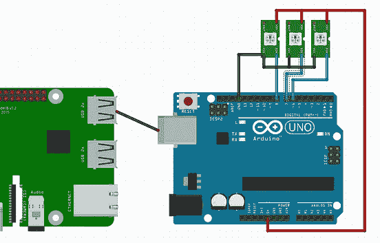
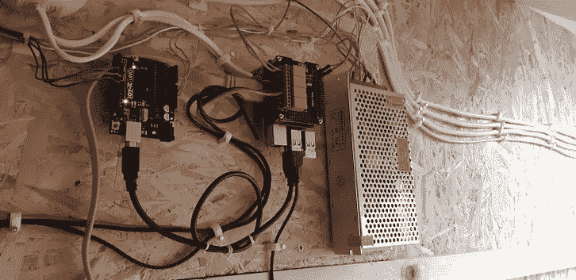
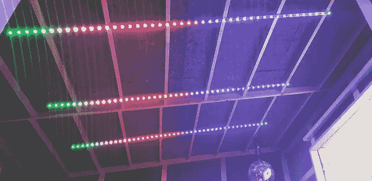
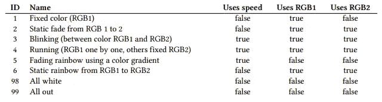
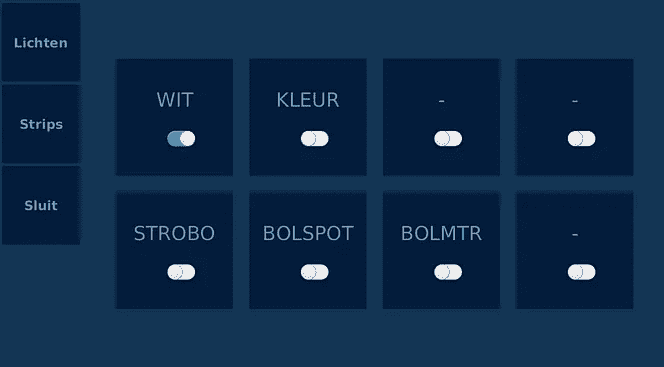
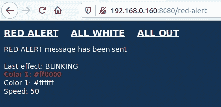
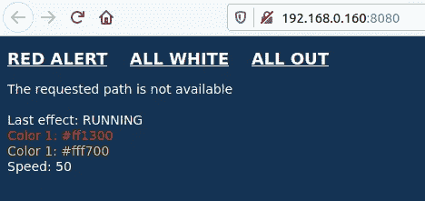

# Drumbooth 触摸屏控制器，带 Raspberry Pi 和 JavaFX

> 原文：<https://medium.com/javarevisited/drumbooth-touchscreen-controller-with-raspberry-pi-and-javafx-f42583bfe14f?source=collection_archive---------0----------------------->

基于我的书[“Raspberry Pi Java 入门”](https://webtechie.be/books/)中的多个例子，我为我儿子的架子鼓创建了一个触摸屏控制器。结合继电器板和 Arduino，这允许通过触摸屏界面控制 LED 灯条和不同的灯。

还有一个网络服务器，所以我们可以通过网页在房子的任何地方触发一些事件，这样当食物摆在桌子上时，我们就不再需要在楼下大喊大叫了；-)

整个装置连接在 220V 电源开关之后，以便在展台不使用时关闭所有设备。Pi 通电时，Java 应用程序自动启动。其中一个 220 伏的灯连接到继电器的开路端，所以当 220 伏的开关打开时，灯立即亮了。

# 材料表

*   树莓派 3B+
*   触摸屏，对我来说是[7 英寸型号](https://www.kiwi-electronics.nl/raspberry-pi/hdmi-7-inch-800x480-display-backpack-met-touchscreen)
*   2 * SPI [可堆叠中继板](https://www.amazon.com/gp/product/B07Q2P9D7K/ref=ppx_yo_dt_b_asin_title_o00_s00?ie=UTF8&psc=1)
*   Arduino Uno
*   WS2812B LED 灯条
*   5V 电源，取决于灯条上 led 的数量，在我的情况下[这是 20A 型号](https://www.dx.com/p/5v-20a-led-monitoring-constant-voltage-power-supply-switch-ac-90-264v-2055437)
*   Pi 和 Arduino 之间的 USB 电缆
*   安装材料，大量电缆，连接继电器的不同灯

# 接线



布线方案、安装的组件、为 led 灯条选择的彩虹效果

*   两块板之间的 USB 电缆(用于串行通信)
*   从电源到 Pi、Arduino 和 LED 灯条的 5V 和接地
*   引脚 6、7 和 8 与三个 LED 灯条之间的控制电缆

# 源代码

这个项目是我的书《[树莓 Pi](https://webtechie.be/books/) 上的 Java 入门》的多个例子的组合，这些例子都在[这个 GitHub 项目“JavaOnRaspberryPi”](https://github.com/FDelporte/JavaOnRaspberryPi)中分享。这个项目本身也作为“DrumBoothController”在 GitHub 上分享[。](https://github.com/FDelporte/DrumBoothController)

因为它同时使用了 Raspberry Pi 和 Arduino，所以您会在源代码中找到两个目录。

两个板之间共享的命令是“COMMAND _ ID:SPEED:R1:G1:B1:R2:G2:B2”结构中的字符串，其中命令 ID 是以下选项之一:



一些例子

*   1:20:255:0:0 =所有 led 固定为全红色
*   3:2500:255:0:0:0:0:255 =每隔 2.5 秒将所有 led 从全红变为全蓝
*   5:50:255:0:0:0:0:255 =所有 led 为蓝色，一个运行中的 led 为红色并持续 50 毫秒

# Arduino 控制 LED 灯条

因为我使用了三个平行的 LED 灯条，所以我想在这三个灯条上产生相同的效果。所以代码从条带的初始化开始。

```
Adafruit_NeoPixel strip1 = Adafruit_NeoPixel(NUMBER_OF_LEDS, PIN1, NEO_GRB + NEO_KHZ800);
Adafruit_NeoPixel strip2 = Adafruit_NeoPixel(NUMBER_OF_LEDS, PIN2, NEO_GRB + NEO_KHZ800);
Adafruit_NeoPixel strip3 = Adafruit_NeoPixel(NUMBER_OF_LEDS, PIN3, NEO_GRB + NEO_KHZ800);
```

两个电路板之间的通信是通过串行链路完成的(不是书中的 Mosquitto，因为在这种情况下我只想使用一个控制器)。因此，在循环方法中，串行数据被读取和处理。

```
void loop() {  
  checkSerial();
  handleMessage();

  currentLoop++; // Only do LED effect when loop exceeds the defined animationSpeed
  if (currentLoop >= animationSpeed) {
    // Depending on the commandId, call the correct LED effect
    if (commandId == 1) {
      setStaticColor();
    } else if (commandId == 2) {
      setStaticFade();
    } else if (commandId == 3) {
      ...
    } currentLoop = 0;
  } delay(5);
}
```

查看每个被调用方法的 GitHub 源代码，了解更多细节。

# 树莓 Pi 的 Java 和 JavaFX

Java 应用程序包含三个不同的屏幕

*   继电器控制器，带有用于 2 * 4 继电器的切换按钮
*   LED 条形控制器选择颜色和 LED 效果，使用[这个颜色选择器组件](https://harmoniccode.blogspot.com/2016/03/friday-fun-xxiv.html)来自 [Gerrit 格伦瓦德](https://twitter.com/hansolo_)。
*   在切断电源之前，退出屏幕以安全关闭 Pi 电源



退出屏幕、LED 灯条控制器、继电器控制器的屏幕截图

事件管理器在所有 UI 组件和 Undertow web 服务器之间共享，以将 UI 与通过网页触发的事件对齐。该事件管理器也是执行命令的地方，以便:

*   用集成电路控制继电器
*   使用 Pi4J 通过串行通信发送 LED 命令

以下截图显示了在网页上选择“红色警报”后的状态，以及在 LED 条 UI 上选择运行灯时的初始状态。



选择“红色警报”和其他选定的 LED 效果后显示页面的网页

# 最终结果

网页和触摸屏用户界面并排。正如您所看到的(从 37 英寸开始)，通过 web 页面进行的更改会立即在 JavaFX UI 中可视化。

> 您可能喜欢的其他文章:

[](/javarevisited/what-java-programmers-should-learn-in-2020-648050533c83) [## 2020 年 Java 程序员该学什么？

### 2020 年 Java 程序员可以学习的有用工具、技术、框架和库

medium.com](/javarevisited/what-java-programmers-should-learn-in-2020-648050533c83) [](/javarevisited/top-5-java-online-courses-for-beginners-best-of-lot-1e1e240a758) [## 2020 年学习 Java 的 10 大课程

### 如果你是计算机科学专业的毕业生，或者想学习 Java 并且正在寻找一些很棒的资源，比如…

medium.com](/javarevisited/top-5-java-online-courses-for-beginners-best-of-lot-1e1e240a758) [](/free-code-camp/these-are-the-best-free-courses-to-learn-data-structures-and-algorithms-in-depth-4d52f0d6b35a) [## 我最喜欢的免费课程&深入学习数据结构和算法的认证

### 为程序员学习数据结构和算法的一些最好的免费在线课程的精选列表。

medium.com](/free-code-camp/these-are-the-best-free-courses-to-learn-data-structures-and-algorithms-in-depth-4d52f0d6b35a)