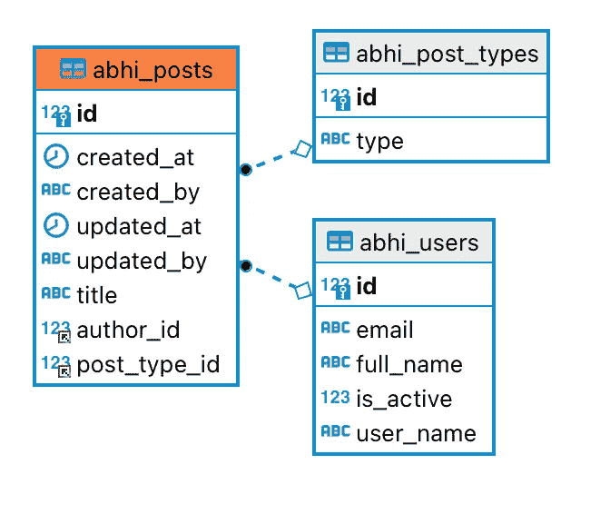
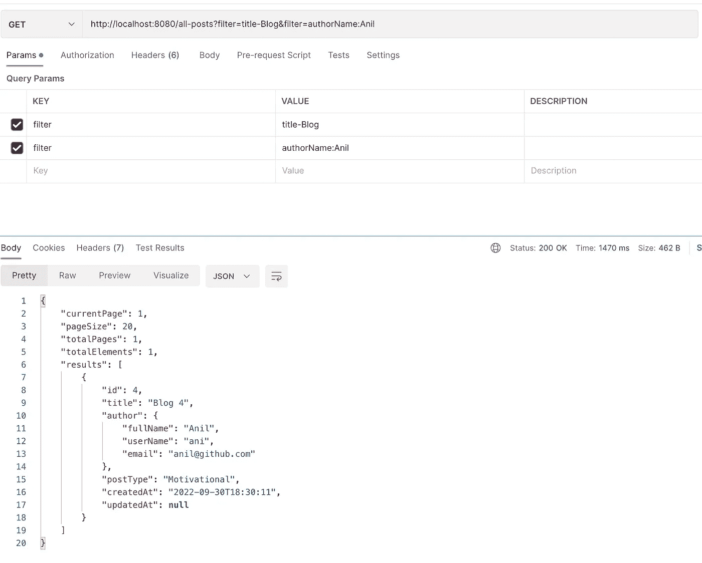

# 使用 SpringBoot 和 QueryDSL 生成生产级动态过滤器

> 原文：<https://medium.com/javarevisited/dynamic-query-predicate-generation-using-springboot-and-querydsl-fdb0d5d3555b?source=collection_archive---------0----------------------->

由 [Austin Distel](https://unsplash.com/@austindistel?utm_source=medium&utm_medium=referral) 在 [Unsplash](https://unsplash.com?utm_source=medium&utm_medium=referral) 上拍摄的照片

我厌倦了为前端应用程序编写多个 API 端点来向用户显示过滤后的信息，所以我想出了一个通用的解决方案，它可以使用 Spring Boot、QueryDSL 和 [JPA](/javarevisited/5-best-spring-data-jpa-courses-for-java-developers-45e6438be3c9) 为任何表和任何数据库工作。使用这种方法，前端只需要调用一个端点，并传入列名、想要对该列执行的操作类型和值。

完整的工作代码可以在我的 [GitHub repo](https://github.com/Abhi-Codes/querydsl-dynamic-query) 上找到。

# 属国

您需要将以下内容添加到 pom 文件中。

# 实体

ER 图

有一张`Posts`表。一个帖子使用一对一映射与一个`Post Type` 表相关联。一个`Post`由作者编写，并使用多对一映射与`Users`表相关联。实体映射可以在[这里](https://github.com/Abhi-Codes/querydsl-dynamic-query/tree/master/src/main/java/com/abhicodes/querydsldynamicquery/entity)找到。一旦创建了实体，运行`mvn clean install`来生成 Q 类。

# **储存库**

`QueryDslPredicateExecutor`接口为我们的集合公开了一些非常有用的方法。我们今天要关注的是`Iterable<T> findAll(Predicate var1)`方法。

我们今天的代码本质上将归结为允许我们的用户创建一个`Predicate`，这样他们就可以自己搜索整个表。

# 创建谓词

现在我们有了这个[库](https://javarevisited.blogspot.com/2021/10/what-is-spring-data-repository.html)，我们真正需要做的就是允许我们的用户构建他们自己的`Predicate`类来搜索他们想要的任何东西。

这个想法可以归结为允许用户创建自己的查询字符串，定义他们希望在表上执行的一系列`AND`操作。我们的工作是解析这个查询并为它们创建`[Predicate](https://javarevisited.blogspot.com/2021/05/java-8-stream-lambda-expression-d.html)`。以下是查询的格式:

> **<键> <操作符> <值>，<键> <操作符> <值>**

**Key —** 它基本上是来自实体类的字段名，对于嵌套字段，这是一种稍微不同的方法。在 Post 实体中，有一个`postType`字段。为了在谓词中使用`PostType`实体的`Id`字段，我们需要在谓词中使用`postType.id`，但是点会影响来自控制器的解析，所以我们通过创建映射到`postType.id`的自定义键`postType`来创建自定义映射。

**操作员—**

**值—** 它可以是字符串、日期、整数或双精度类型的任何值。

> **用法**

过滤以显示包含标题 **xyz —** `title-xyz`的博客

过滤以提供动机博客— `postType:2`(动机类型 id 为 2)

过滤以显示在两个日期之间创建的博客— `createdAt()2022–09–01,2022–09–10`

# **创建搜索标准**

我们将如下定义单个搜索标准

# 公共谓词类

先来了解一下上面的类。如您所见，它有一个方法`getPredicate`，该方法将基于传递的 SearchCriteria 生成一个新的`BooleanExpression`谓词。

为此，我使用了 QueryDSL `Path`类的实现。这些类包含对您要查询的对象的属性的引用，并且可以给它们比较运算符来构建一个`Predicate`。

如你所见，我使用反射来确定被传递的`Key`的类。

继续，现在我们需要的是将整个查询字符串解析成一串`SearchCriteria`，然后从整个查询构建一个组合谓词。该类可能如下所示

目前，重要的方法是`from(String search)`方法。该方法使用 regex 从查询字符串创建 SearchCriteria。然后构建采用每个标准，使用`CommonPredicate`创建谓词，然后将它们组合在一起作为`AND`操作，返回最终的谓词。这个谓词可以直接发送到我们的存储库！

# 与服务和控制器类挂钩

服务类本质上是将过滤器格式化为搜索标准，从自动生成的谓词中获取 BooleanExpression，并将其传递给存储库。

[控制器](https://javarevisited.blogspot.com/2022/05/how-to-return-json-xml-or-thymeleaf-.html)类获取从客户端传递来的过滤器，并将它们传递给服务。正如您在下面看到的，我们可以传递多个查询参数来构建查询，客户端需要在该表及其相关表上过滤该查询。

> 如果你喜欢这篇文章，请花点时间给我鼓掌👏(可以多次鼓掌)，关注我，甚至给我买杯咖啡[https://www.buymeacoffee.com/abhiandy](https://www.buymeacoffee.com/abhiandy)