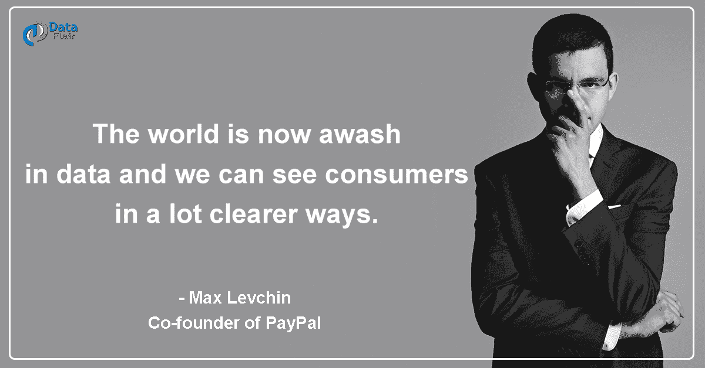
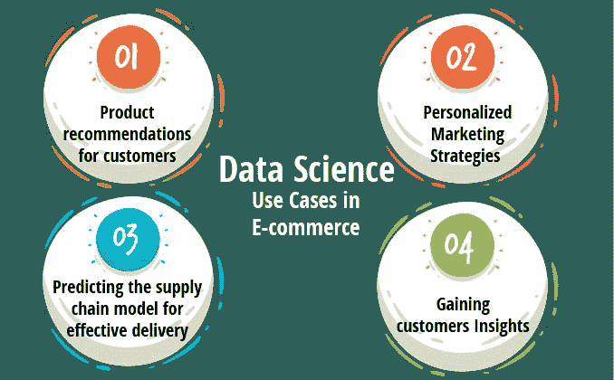
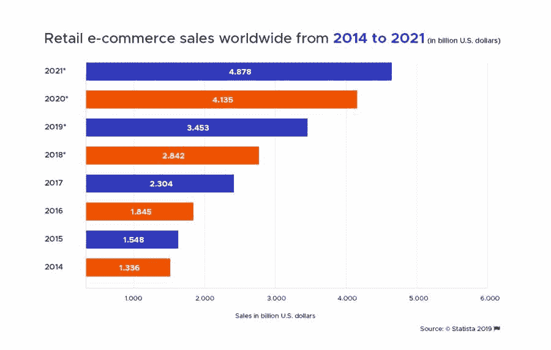
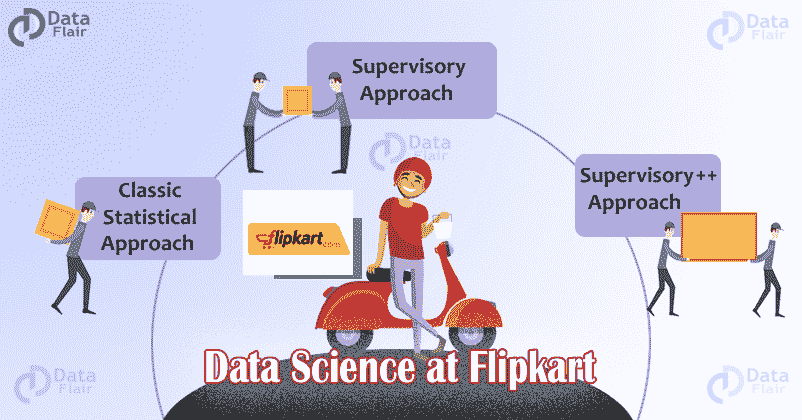
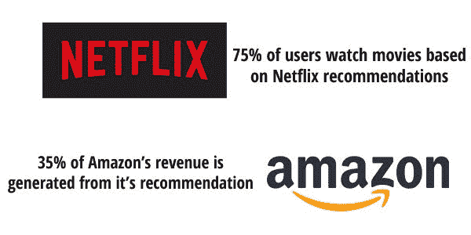

# “具有数据科学魔力的电子商务”

> 原文：<https://medium.com/javarevisited/e-commerce-embellishment-with-the-magic-of-data-science-48b2374b60fe?source=collection_archive---------0----------------------->

你知道当今数字世界中数据的力量吗？作为人类，我们正在创建数量惊人的数据“每两天，我们创建的数据就比从时间的开端到 2003 年之间创建的数据还要多！”这些数据是所有数据驱动的组织的石油。

每个组织都意识到，在[数据科学](https://dev.to/javinpaul/10-data-science-and-machine-learning-courses-for-programmers-looking-to-switch-career-57kd)的帮助下，他们可以通过锁定正确的受众来实现利益最大化。电子商务和零售业从[数据科学](https://data-flair.training/blogs/what-is-data-science/)中受益匪浅。

## **数据科学的定义:**

如今，数据科学已经成为一个几乎人人都在谈论的时髦词汇。它是一门借助各种科学方法和算法从数据源中识别和提取有意义信息的学科。详细说明- [***什么是数据科学*** ？](https://bit.ly/2z9XUWB)

## **电子商务如何利用数据科学？**

数据科学是电子商务的支柱，你有没有注意到，当你从任何在线网站购买一部新手机时，该网站会在几分之一秒内为你推荐一个封底，或者你会在搜索引擎、网站、YouTube、应用程序甚至电子邮件等其他平台上看到你的手机的封底相关广告。这就是[数据科学](https://javarevisited.blogspot.com/2018/10/data-science-and-machine-learning-courses-using-python-and-R-programming.html)的神奇之处，每个电子商务都需要数据科学来提高锁定目标受众的能力。

数据科学改变电子商务行业的一些方式是-

*   为了识别潜在客户群，[数据科学](https://javarevisited.blogspot.com/2018/10/top-8-python-libraries-for-data-science-machine-learning.html)正被大量使用。
*   使用预测分析来预测商品和服务。
*   数据科学也用于识别流行产品的风格并预测其趋势。
*   借助数据科学，企业正在为消费者优化定价结构。

该图显示了电子商务销售额的惊人增长，数据科学在这一增长中发挥了重要作用。

## Flipkart 的数据科学

Flipkart 是印度最大的电子商务市场。它拥有超过 1 亿的注册客户群。从智能手机、书籍、媒体、消费电子产品、家具到时尚和生活方式，只需一次点击，它就能提供 70 多个类别的 8000 多万种产品。Flipkart 没有[数据科学](https://dzone.com/articles/top-5-data-science-and-machine-learning-course-for)，推荐系统，排名系统，检查产品的受欢迎程度&质量，客户反馈，几乎所有的事情都依赖于数据科学来提高性能和提供更好的服务。

有关数据科学如何成为 Flipkart 王牌的完整案例研究，您可以查看-*[***Flipkart 上的数据科学***](https://data-flair.training/blogs/data-science-at-flipkart/)*

**

***想知道网飞是怎么用数据科学的:** - [**网飞数据科学**](https://data-flair.training/blogs/data-science-at-netflix/)*

*因此，我们可以说数据科学是电子商务行业的支柱。从识别消费者、推荐产品和分析评论开始，每一项任务都需要数据科学。因此，借助数据科学的魔力，电子商务行业正经历着令人印象深刻的扩张。*

*如果您有兴趣了解更多关于数据科学的知识，这里还有一些文章和资源可供您探索:*

*   *[**机器学习**](https://www.coursera.org/learn/machine-learning?ranMID=40328&ranEAID=JVFxdTr9V80&ranSiteID=JVFxdTr9V80-AleGc9fDXZIyel0GrRHMng&siteID=JVFxdTr9V80-AleGc9fDXZIyel0GrRHMng&utm_content=10&utm_medium=partners&utm_source=linkshare&utm_campaign=JVFxdTr9V80) **通过** [**吴恩达**](https://medium.com/u/592ce2a67248?source=post_page-----48b2374b60fe--------------------------------)*
*   *[**IBM 数据科学专业证书上 Coursera**](https://www.coursera.org/specializations/ibm-data-science-professional-certificate?ranMID=40328&ranEAID=JVFxdTr9V80&ranSiteID=JVFxdTr9V80-3C.U2SjAyBrQ3Rw27NIFWw&siteID=JVFxdTr9V80-3C.U2SjAyBrQ3Rw27NIFWw&utm_content=10&utm_medium=partners&utm_source=linkshare&utm_campaign=JVFxdTr9V80)*
*   *[**数据科学 A-Z:真实数据科学练习包括**](https://www.udemy.com/datascience/?ranMID=39197&ranEAID=JVFxdTr9V80&ranSiteID=JVFxdTr9V80-AleGc9fDXZKkD9ReLp6VEA&LSNPUBID=JVFxdTr9V80)*
*   *[**前 5 名 TensorFlow 和机器学习课程**](https://hackernoon.com/top-5-tensorflow-and-ml-courses-for-programmers-8b30111cad2c?source=post_page---------------------------)*
*   *[**学习 Python 最好的 5 门课程**](http://javarevisited.blogspot.sg/2018/03/top-5-courses-to-learn-python-in-2018.html?source=post_page---------------------------)*
*   *[**一个日本黄瓜农如何使用深度学习和 TensorFlow**](https://cloud.google.com/blog/products/gcp/how-a-japanese-cucumber-farmer-is-using-deep-learning-and-tensorflow?source=post_page---------------------------)*

*祝您的数据科学之旅一切顺利。*