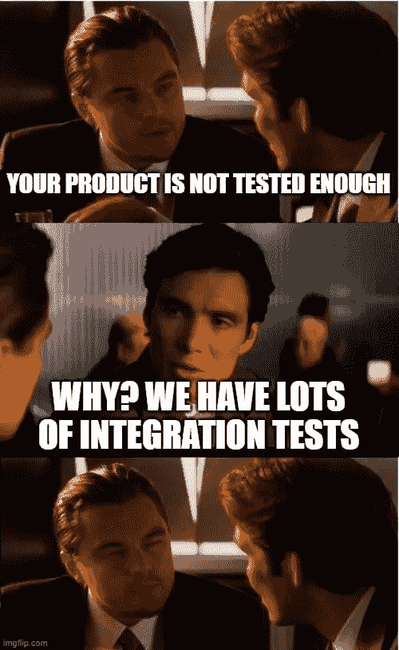
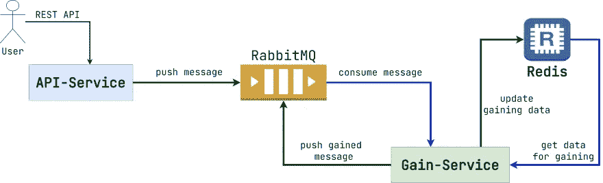
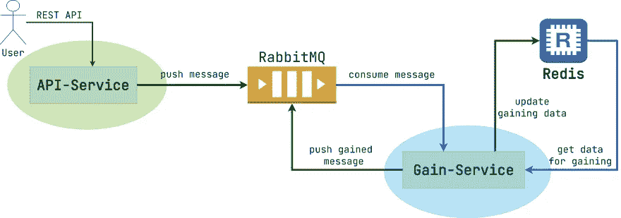
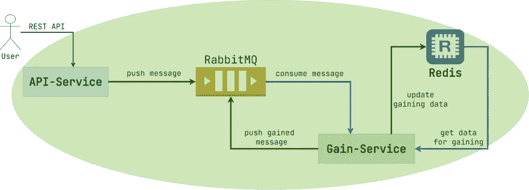
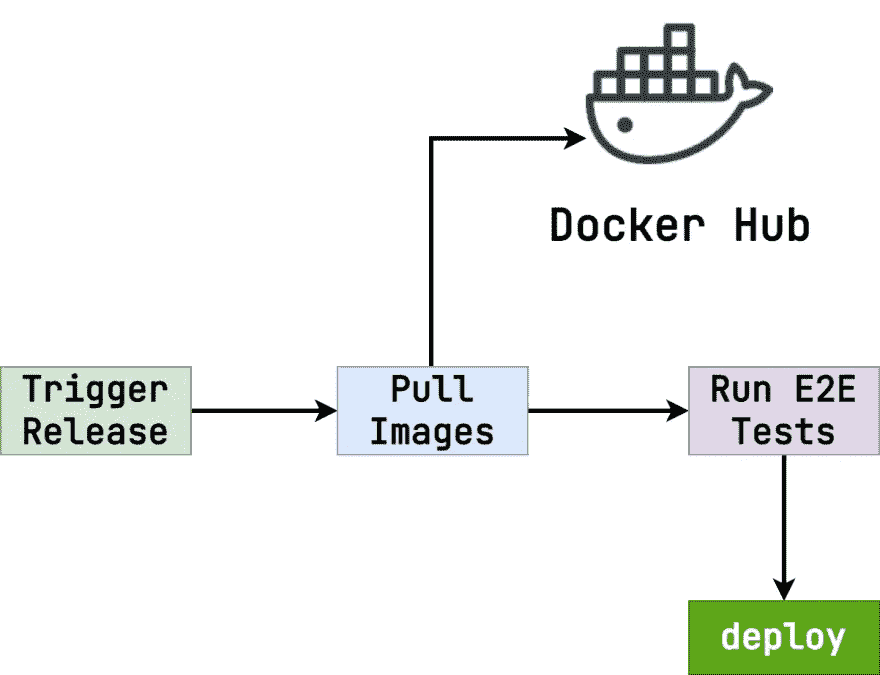
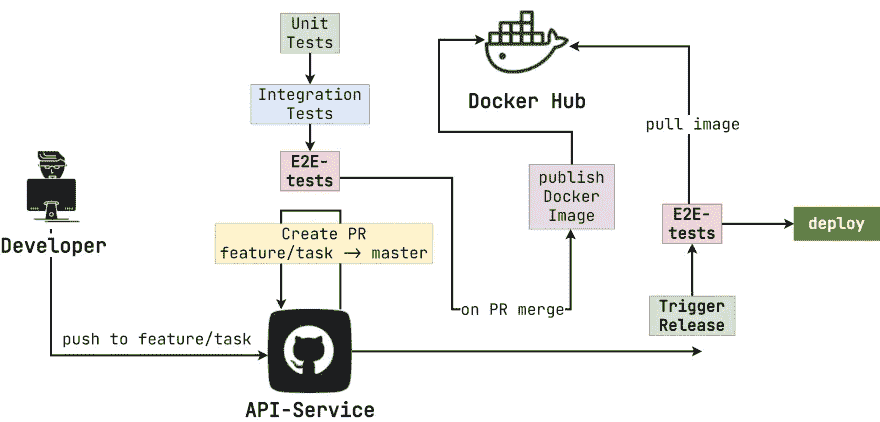
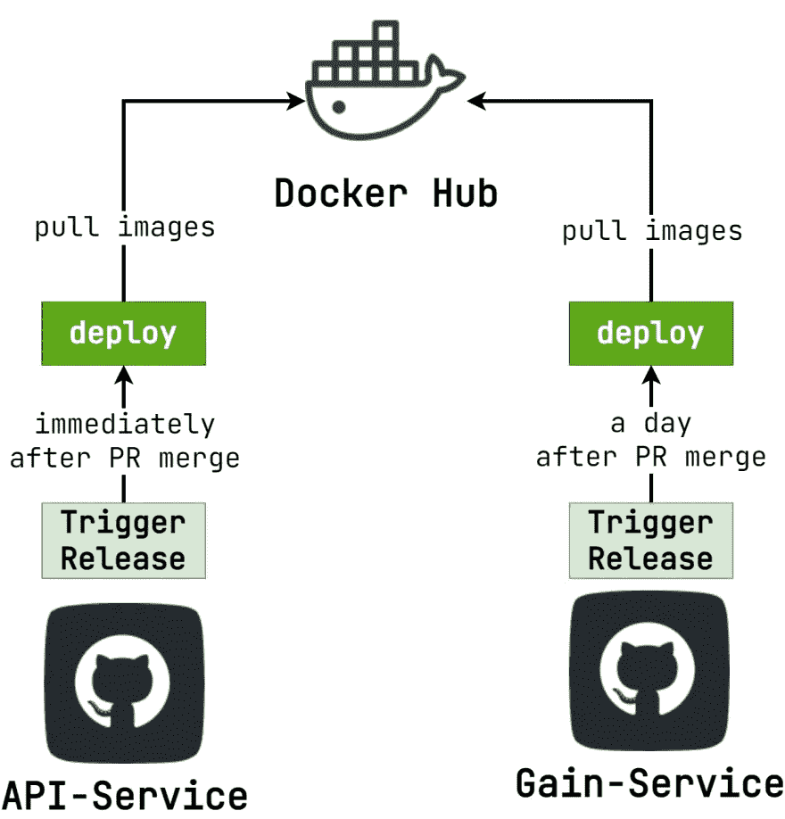
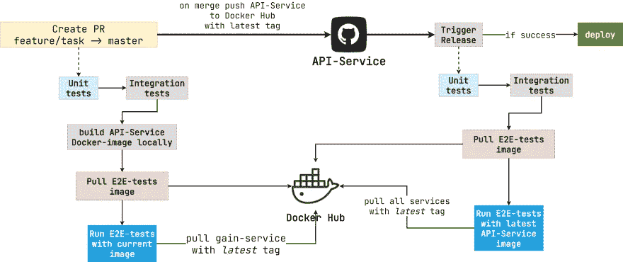
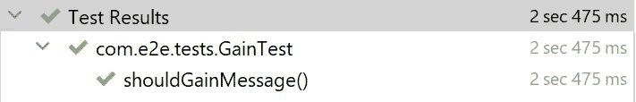

# e2e-在 CI 环境中使用 Testcontainers 进行测试

> 原文：<https://medium.com/javarevisited/e2e-testing-in-ci-environment-with-testcontainers-ea7537697bd9?source=collection_archive---------2----------------------->

我写过很多关于[单元](https://dev.to/kirekov/apache-spark-hive-and-spring-boot-testing-guide-mdp) [和](https://dev.to/kirekov/spring-boot-testing-testcontainers-and-flyway-2jpd) [集成](https://dev.to/kirekov/spring-boot-testing-data-and-services-288f) [测试](https://dev.to/kirekov/spring-boot-jpa-clear-tests-45he)的博文。但是今天我想告诉你一些超越它的事情。这是 E2E 测试。尽管清楚地测试每个服务的行为很重要。但是在整个运行的系统上验证业务场景的有效性也是至关重要的。在这篇文章中，我将告诉你什么是 E2E 测试，为什么它如此重要，以及你如何在你的发布管道中实现它。您将学习如何在将变更合并到`master`分支之前，对每个新的拉请求运行 E2E 测试。

代码示例是用 Java 编写的，但是所提出的解决方案适用于任何编程语言。你可以在[这个链接](https://github.com/SimonHarmonicMinor/e2e-tests-example)找到整个项目的源代码。

[](https://javarevisited.blogspot.com/2020/11/why-devops-engineer-learn-docker-kubernetes.html#axzz6dXsEfLvJ)

文章模因封面

# 领域

我们将开发一个系统来获取即将到来的信息和额外的数据。看看下面的模式。

[](https://javarevisited.blogspot.com/2019/03/5-courses-programmers-can-join-to-learn.html#axzz6U9Y03ecl)

领域设计

消息处理算法很简单:

1.  用户通过 [REST API](/javarevisited/10-best-java-web-services-rest-soap-and-api-courses-for-beginners-724a8f51298d) 发送消息。
2.  `API-Service`转移到 RabbitMQ。
3.  `Gain-Service`在 [Redis](https://javarevisited.blogspot.com/2022/02/top-5-courses-to-learn-redis.html) 中更新数据，如果消息包含有价值的东西。然后将附加数据添加到消息本身中，然后再次将其传输到 RabbitMQ。

# 测试

# 单元测试

我们如何验证系统的行为？有几种选择。最简单的是单元测试。看看下面的图表。我用淡绿色和蓝色的椭圆形指出了测试区域。

[](https://javarevisited.blogspot.com/2022/03/how-to-prepare-for-system-design.html)

单元测试区域

单元测试有几个优点:

1.  他们跑得很快。
2.  轻松集成到 [CI/CD 管道](/javarevisited/7-best-courses-to-learn-jenkins-and-ci-cd-for-devops-engineers-and-software-developers-df2de8fe38f3)。
3.  可以并行运行(如果写的合适的话)。

尽管他们也有一个问题。单元测试不检查与真实外部服务的交互(例如 Redis、RabbitMQ)。它是关于验证业务逻辑，而不是实际的生产场景。

> *我写了一篇关于单元测试模式和最佳实践的*[*longread*](https://semaphoreci.com/blog/unit-testing)*。去看看吧，真的很牛逼。*

# 集成测试

我们需要扩展视角。因此，集成测试可以派上用场，对不对？请看下图。

[](https://javarevisited.blogspot.com/2021/04/top-5-tools-to-test-rest-apis-in-java.html#axzz7CGBoUS1n)

集成测试区域

在这种情况下，我们检查与外部服务的交互。尽管还有一个问题。商业运作涉及几个沟通的组成部分。即使每个模块都经过了适当的测试，我们如何验证多服务请求(即业务场景)的正确性呢？例如，如果`API-service`对输出消息的格式进行了重大更改，那么`gain-service`将不能成功地继续进行浓缩。尽管`API-service`集成和[单元测试](https://javarevisited.blogspot.com/2018/01/10-unit-testing-and-integration-tools-for-java-programmers.html#axzz6j8KhisSX)会通过。

为了克服这个问题，我们需要集成测试之外的东西。

> *我写了一篇* [*的文章*](https://semaphoreci.com/blog/integration-tests) *深入讲解了集成测试。你应该去看看。*

# E2E 测试

E2E 测试的想法很简单。我们将整个系统视为一个黑盒，它接受一些数据并返回计算结果(同步或异步)。看看下面的模式。

[](https://javarevisited.blogspot.com/2021/02/-spring-boot-testing-interview-questions-answers-java.html)

E2E 测试区

嗯，听起来合理可信。但是怎么才能实现呢？我们从哪里开始？让我们开始一步步解构这个问题。

# 发布策略

首先，让我们弄清楚单个服务的发布管道。这将有助于我们理解整个 E2E 测试方法。看看下面的模式。

[](https://www.java67.com/2012/08/10-java-coding-interview-questions-and.html)

通用发布策略

下面是一步一步的流程:

1.  开发人员将变更推送到`feature/task`分支。
2.  然后从`feature/task`向`master`分支发出拉取请求。
3.  在 CI 管道中，构建拉请求(即单元测试和集成测试的执行)。
4.  如果管道是绿色的，变更将被合并到`master`分支。
5.  当拉请求被合并时，产生的工件被发布到 Docker Hub。
6.  当发布被触发时(例如在预定的基础上)，`deploy`阶段提取所需的 Docker 映像(默认为最新的)并在指定的环境中运行它。

那么，我们如何将 E2E 测试放在规定的过程中呢？其实有几种方法。

# 同步发布策略

这是最容易理解的方法。无论我们有多少个服务，发布管道都将它们部署在一个单独的作业中。在这种情况下，我们只需要在将工件部署到生产之前运行 E2E 测试。看看下面描述这个过程的模式。

[](https://www.java67.com/2021/04/top-5-courses-to-learn-docker-for-java.html)

同步发布策略

算法是:

1.  触发释放
2.  从 Docker Hub 中提取所有服务的图像(默认为最新)。
3.  用提取的图像运行 E2E 测试(我将在本文后面向您解释这种方法)。
4.  如果测试成功，部署提取的映像。

尽管这种方法很简单，但它有一个很大的障碍。不能更新单个[微服务](/javarevisited/10-best-java-microservices-courses-with-spring-boot-and-spring-cloud-6d04556bdfed)
隔离。这意味着不同的模块必须同时发布。尽管在现实中，一些[微服务](/javarevisited/7-free-microservices-courses-for-java-programmers-c9b2f3a2ea7d)必须比其他的更频繁地更新。但是这里您必须选择一个满足(至少部分满足)每个服务需求的发布触发器。

# 异步释放策略

这意味着像更新独立的功能一样更新每个服务。每个模块都可以根据自己的规则进行部署。

下面是一个异步发布策略的例子。看看下面的模式。

[](https://www.java67.com/2021/02/microservices-interview-questions-answers-java-spring.html)

异步释放策略

如您所见，该图类似于我们之前看到的单一模块发布管道。虽然有细微的差别。现在有了`E2E-tests`阶段，它既在拉式请求构建期间运行，也在部署到生产之前运行。
如果它们已经在拉请求管道上完成，为什么我们还需要再次运行`E2E-tests`？看看下图就明白问题了。

[](https://www.java67.com/2018/02/5-free-docker-courses-for-java-and-DevOps-engineers.html)

同时释放问题

我们在 PR 合并后立即部署了`API-Service`。但是我们将`Gain-Service`的发布推迟了一天。因此，如果 E2E 测试只在拉请求构建期间运行，那么其他一些服务可能已经被更新了。但是我们只验证了以前版本的正确性，因为在拉式请求构建期间，最新的版本还没有被提升。

如果您坚持异步发布策略，您必须在部署到生产之前以及在拉请求构建期间运行 E2E 测试。

> *在本文中，我们将异步发布策略视为* [*微服务*](/javarevisited/top-5-frameworks-java-developers-can-learn-for-microservices-development-in-2022-848da66d6651) *的首选。*

# 建立流程

嗯，这听起来很有希望。但是我们如何建立这个场景呢？我可以说这并没有看起来那么复杂。看看下面为`API-Service`运行 E2E 测试的例子。

[](https://javarevisited.blogspot.com/2018/02/top-5-spring-microservices-courses-with-spring-boot-and-spring-cloud.html)

建立流程

有两部分。在拉式请求构建期间以及将产品部署到生产之前运行 E2E 测试。让我们一步一步地浏览每个场景。

# 拉式请求构建

1.  首先，运行单元测试和集成测试。这两个步骤通常与建筑制品本身相结合。
2.  那么当前版本的`API-Service`将被构建并作为 Docker 映像保存在本地。我们没有把它推到中心，因为提议的更改可能不正确(我们还没有运行 E2E 测试来检查它)。尽管有些 CI 提供者不允许在本地构建 Docker 映像以便以后重用。在这种情况下，您可以指定一个不会在生产中使用的标签。例如，`dev-CI_BUILD_ID`。
3.  然后我们拉一个包含 E2E 测试本身的 Docker 图像。正如我们稍后看到的，这是一个简单的应用程序。所以，在 Docker Hub 中保存也很方便。
4.  最后，是时候进行 E2E 测试了。包含测试的应用程序应该是可配置的，可以运行不同的 Docker 服务映像(在本例中，`API-Service`和`Gain-Service`)。这里我们将`API_SERVICE_IMAGE`变量值作为我们在步骤 2 中本地构建的值。

> 所有其他服务应该将默认的 Docker 图像作为最新的标签。这将使我们有机会通过覆盖当前的服务映像版本，在任何存储库中运行 E2E 测试。

如果所有验证都通过，请购单将被合并。合并后，新版本的`API-Service`被推送到带有`latest`标签的 [Docker Hub](https://javarevisited.blogspot.com/2022/05/docker-interview-questions-answers-for.html) 。

# e2e-在部署阶段之前运行的测试

1.  单元测试和集成测试以同样的方式运行。
2.  最新版本的`E2E-tests`图片来自 Docker Hub。
3.  e2e——所有服务都使用标签`latest`进行测试。

`API-Service`已经被推送到 Docker Hub，pull 请求 merge 上的标签为`latest`。因此，不需要在 E2E 测试运行时指定特定的映像版本。

# 代码实现

让我们开始实施 E2E 测试。你可以通过[这个链接](https://github.com/SimonHarmonicMinor/e2e-tests-example)查看源代码。
我使用 [Spring Boot 测试](https://javarevisited.blogspot.com/2021/02/-spring-boot-testing-interview-questions-answers-java.html)作为 E2E 测试的框架。但是你可以应用任何你喜欢的技术。

> 为了简单起见，我将所有模块(包括 `*e2e-tests*` *)放在一个单一的仓库中。无论如何，我向你描述的方法是全面的。因此，您也可以将它应用到多存储库微服务中。*

先从`E2ESuite`说起吧。这个将包含所有的配置，并作为所有测试用例的超类。看看下面的代码示例。

E2ESuite 基本配置

首先，我们必须声明 [Docker](/javarevisited/top-10-free-courses-to-learn-jenkins-docker-and-kubernetes-for-devops-in-2020-best-of-lot-62a0541ffeb3) 容器在 Testcontainers 环境中运行。这里我们有 Redis 和 RabbitMQ，它们是基础架构的一部分。而`API_SERVICE`和`GAIN_SERVICE`是实现业务逻辑的定制服务。

> *`*@Import*`*注释用于将自定义类添加到 Spring 上下文中，用于测试目的。它们的实现很简单。因此，您可以通过上面的存储库链接找到它。虽然* `[*@ContextConfiguration*](https://javarevisited.blogspot.com/2019/02/difference-between-contextconfiguration-and-springapplicationConfiguration-annotations-in-spring-boot-testing.html#axzz7BnOZ1wuB)` *很重要。我们很快就会谈到这一点。**

*还有，`SHARED_NETWORK`至关重要。你看，容器应该相互通信，因为这是 E2E 场景的目的。但是我们还必须能够向`API-Service`发送 HTTP 请求来调用业务逻辑。为了实现这两个目标，我们将所有的容器绑定在一个网络上，并将`API-Service` HTTP 端口转发给客户端。看看下面描述这个过程的模式。*

*[](https://www.java67.com/2018/05/top-20-system-design-interview-questions-answers-programming.html)

Docker 网络通信* 

*现在我们需要以某种方式初始化和启动容器。此外，我们还必须指定正确的属性来将我们的`E2E-tests`应用程序连接到最近启动的 [Docker 容器](/javarevisited/top-5-free-courses-to-learn-docker-for-beginners-best-of-lot-b2b1ad2b98ad)。在这种情况下，`@ContextConfiguration`注解就可以派上用场了。它提供了代表在 Spring 上下文初始化阶段调用的回调的参数`initializers`。这里我们放了内部类`Initializer`。看看下面的代码示例。*

*E2ESuite 初始值设定项*

*让我们一步一步地解构这个功能。首先创建 Redis 容器。看看下面的代码片段。*

*Redis 容器配置*

*在撰写本文时，Testcontainers 库中没有 Redis 的明确容器。所以，我用的是一般的。最重要的属性是`network`和`network aliases`。它们的存在使得一个容器对于同一网络中的其他容器是可到达的。我们还公开了`6379`端口(默认的 Redis 端口),因为 E2E 测试用例将在执行过程中连接到 Redis。*

*还有，我想请你注意一下`log consumer`。你看，当 E2E 方案失败时，原因并不总是显而易见的。有时，为了理解问题的根源，您必须深入研究容器的日志。幸运的是，`log consumer`允许我们将容器的日志转发给任何 [SLF4J](https://www.slf4j.org/) 日志记录器实例。在这个项目中，容器的日志被转发到常规的文本文件中(你可以在[资源库](https://github.com/SimonHarmonicMinor/e2e-tests-example/blob/master/e2e-tests/src/test/resources/logback.xml)中找到 [Logback](https://logback.qos.ch/) 配置)。尽管将日志转移到外部测井设施(例如 [Kibana](https://www.elastic.co/kibana/) )要好得多。*

*接下来是 RabbitMQ。看看下面的容器初始化。*

*RabbitMQ 容器初始化*

*这个想法类似于 Redis 容器实例化。但是这里我们也调用了`withQueue`方法(它是`RabbitMQContainer`类的一部分)来指定 RabbitMQ start 上的默认主题。`API-Service`向`queue.api`主题发送消息，`Gain-Service`向`queue.gain`主题发送消息(这些属性是可配置的)。因此，在应用程序启动时创建所需的主题很方便。*

*然后是一行有趣的代码。*

```
*Startables.deepStart(REDIS, RABBIT).join();*
```

*`deepStart`方法接受容器的*变量*开始并返回`CompletableFuture`。我们需要那些容器在`API-Service`和`Gain-Service`之前开始。因此，我们调用`join`方法等待，直到容器准备好接受请求。*

> **您也可以使用单个* `*deepStart*` *方法调用来启动所有容器，并通过调用容器本身的* `*dependsOn*` *方法来指定顺序。它更有表现力，但更难通读。所以，我留下一个更简单的例子。**

*现在我们可以开始定制容器了。*

```
*var apiExposedPort = environment.getProperty("api.exposed-port", Integer.class);
API_SERVICE = createApiServiceContainer(environment, apiExposedPort);*
```

*首先，让我们深入探讨一下`createApiServiceContainer`方法。看看下面截取的代码。*

*API-服务容器初始化*

*有些事情我想指出来。*

*`withEnv`方法只是设置了一个常规的环境变量。那些是用来配置`API-Service`的。你可能已经注意到`RabbitMQ`的网址是`amqp://rabbit:5672`。因为`rabbit`是内部网络中相应容器的名称(我们在容器的实例化上将它指定为网络别名)。这就是为什么`RabbitMQ`可以被`API-Service`到达。*

*`waitingFor`条款更有意思。Testcontainers 必须知道容器已经准备好接受连接。`API-Service`公开了返回`200`代码的`/actuator/health` HTTP 路径，如果准备好了实例的话。*

*结合了`withCreateContainerCmdModifier`和`withExposedPorts`方法的`withCreateContainerCmdModifier`将内部容器的端口`8080`绑定到`apiExposedPort`(在 E2E 测试开始之前由环境变量指定)。*

*`withImagePullPolicy`定义了直接从 Docker Hub 检索图像的规则。默认情况下，Testcontainers 在本地检查图像是否存在。如果它找到一个，它不会从远程服务器获取任何东西。该行为适合于测试特定的图像。但是如果你指定了一个带有`latest`标签的版本，那么这个库就有可能不会拉出最相关的版本。在这种情况下，Testcontainers 总是从远程 Docker Hub 获取图像。*

*看看下面的`Gain-Service`容器声明。*

*增益-服务容器初始化*

*如你所见，初始化类似于`API-Service`。所以，让我们更进一步。*

*当`API-Service`和`Gain-Service`集装箱准备好时，我们可以启动它们。看看下面的代码片段。*

```
*Startables.deepStart(API_SERVICE, GAIN_SERVICE).join();
setPropertiesForConnections(environment);*
```

*我们已经讨论过`Startables.deepStart`的想法。尽管`setPropertiesForConnections`需要一些解释。该方法将启动容器的 URL 设置为 E2E 测试用例的属性。因此，测试套件可以验证结果。看看下面的过程实现。*

*这里我们为 RabbitMQ 和 Redis 指定了连接。此外，我们存储了用于发送 HTTP 请求的`API-Service`主机。*

*好，让我们做测试用例。我们正在写一个单一的 E2E 场景。看看下面的列表。*

1.  *客户端向`API-Service`发送包含`msisdn`和`cookie`值的消息*
2.  *没有修改的消息最终应该被传输到 RabbitMQ。*
3.  *客户端向`API-Service`发送仅包含`cookie`值的消息。*
4.  *具有确定的`msisdn`值的丰富消息应该最终被传输到 RabbitMQ。*

*看看下面的测试套件。*

*增益测试套件*

*首先，我们用`cookie`和`msisdn`发送一条消息。然后，我们检查消息是否按原样进一步传输。下一步是发送另一条省略了`msisdn`但显示了`cookie`值的消息。最后，具有丰富的`msisdn`值的消息最终应该由`Gain-Service`推送到 RabbitMQ。*

*如果在本地运行测试，可能需要一段时间。反正下载需要的图片和启动相应的容器都是需要时间的。但是测试应该会成功通过。*

**

*增益测试结果*

# *在 CI 环境中运行*

*嗯，听起来不错。但是我们如何在 CI 流程中运行 E2E 测试呢？*

*首先，我们应该把 E2E 试卷包装成码头工人的形象。看看下面的 docker 文件。*

*因此，测试是在容器的起点编译和运行的。*

> **测试不是编译后的工件的一部分(在本例中，* `*.jar*` *文件)。这就是为什么我们复制整个目录和代码本身。**

*接下来是 GitHub 动作管道的 YAML 配置。结果剧本[很长](https://github.com/SimonHarmonicMinor/e2e-tests-example/blob/master/.github/workflows/build.yml)。所以，我把它分成小部分展示给你们。*

*我们将对每个拉请求和每个到`master`分支的合并运行测试用例。*

*GitHub Actions build.yml*

*整个流水线由 3 项工作组成:*

1.  *`build`编译所有服务(`API-Service`和`Gain-Service`)，并运行单元和集成测试。*
2.  *`build-dev-images`将所有组件(包括`E2E-tests`在内)打包成 Docker 镜像，并将其推送到带有`dev-$CI_BUILD_NUM`标签的 Docker Hub。*
3.  *`e2e-tests`对推送到`build-dev-images`任务的图像运行 E2E 测试。*
4.  *`build-prod-images`将所有组件打包成 Docker 映像，并将其推送到带有`latest`标签的 Docker Hub。成功通过`e2e-tests`作业后，仅在`master`分部运行。*

*让我们清楚地看看每项工作。*

## *建设*

*那是最琐碎的一个。而且，GitHub 可以为你生成这个。*

*GitHub Actions build.yml*

## *构建-开发-映像*

*这个比较棘手。首先，我们必须将`DOCKERHUB_USERNAME`和`DOCKERHUB_TOKEN`存储为存储库机密，以推送 Docker 构建的图像。那我们应该推动人工制品。最后，我们必须将计算出的`dev`标签转发给下一个作业。看看下面的实现。*

*GitHub Actions build.yml*

*我希望你们注意这几行代码。*

*GitHub Actions build.yml*

*`export IMAGE_TAG_ENV=dev-${{ github.run_number }}`行将带有生成的编译号的`dev`标记设置为`IMAGE_TAG_ENV`环境变量。*

*`echo "IMAGE_TAG=$IMAGE_TAG_ENV" >> "$GITHUB_ENV"`线使`${{ env.IMAGE_TAG }}`变量可用。它用于在后续步骤中指定图像发布的 Docker 标签。*

*`echo "::set-output name=image_tag::$IMAGE_TAG_ENV"`保存`image_tag`变量作为输出。因此，下一个作业可以引用它来运行指定版本的 E2E 测试。*

*推送到 Docker Hub 本身是通过`docker/build-push-action`实现的。看看下面的代码片段。*

*GitHub Actions build.yml*

*建推`API-Service`与`Gain-Service`相似。*

## *e2e 测试*

*现在是时候进行 E2E 测试了。看看下面的配置。*

*GitHub Actions build.yml*

*`container.image`指定要运行的 E2E 测试的版本。`${{needs.build-dev-images.outputs.image_tag}}`变量引用了上一步中由`build-dev-images`作业公开的变量。*

*`volumes: /var/run/docker.sock:/var/run/docker.sock`至关重要。因为`e2e-tests` images 使用 Testcontainers 库来运行另一个 Docker 容器。安装`docker.sock`作为卷实现 Docker 虫洞模式。你可以通过[这个链接](https://www.testcontainers.org/supported_docker_environment/continuous_integration/dind_patterns/)了解更多。*

## *构建-产品-图像*

*这个步骤和`build-dev-images`差不多。你可以在[库](https://github.com/SimonHarmonicMinor/e2e-tests-example/blob/master/.github/workflows/build.yml)里找到。*

# *结论*

*因此，我们配置了 CI 环境来运行多个业务组件(即`Gain-Service`和`API-Service`)和外部服务(即 RabbitMQ、Redis)的单元测试、集成测试和 E2E 测试。Testcontainers 允许我们构建全面和可靠的管道。更令人兴奋的是，您不必拥有专用的服务器来进行 E2E 测试。纯 CI 管道就够了！*

*我希望你喜欢我提出的 E2E 测试方法。如果您有任何问题或建议，请在下面留下您的评论。另外，你可以直接给我发短信。我很乐意讨论这个话题。感谢阅读！*

# *资源*

1.  *[储存库与源代码](https://github.com/SimonHarmonicMinor/e2e-tests-example)*
2.  *[阿帕奇 Spark、Hive 和 Spring Boot 测试指南](https://dev.to/kirekov/apache-spark-hive-and-spring-boot-testing-guide-mdp)*
3.  *[Spring Boot 测试—测试容器和飞行路线](https://dev.to/kirekov/spring-boot-testing-testcontainers-and-flyway-2jpd)*
4.  *[Spring Boot 测试—数据和服务](https://dev.to/kirekov/spring-boot-testing-data-and-services-288f)*
5.  *[春季数据 JPA —清除测试](https://dev.to/kirekov/spring-boot-jpa-clear-tests-45he)*
6.  *[深入单元测试](https://semaphoreci.com/blog/unit-testing)*
7.  *[正确进行集成测试](https://semaphoreci.com/blog/integration-tests)*
8.  *[SLF4J](https://www.slf4j.org/)*
9.  *[回退](https://logback.qos.ch/)*
10.  *基巴纳*
11.  *[在 Docker 容器中运行测试的模式](https://www.testcontainers.org/supported_docker_environment/continuous_integration/dind_patterns/)*