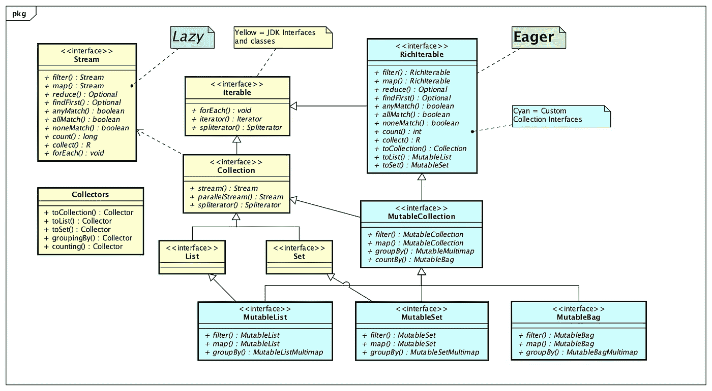
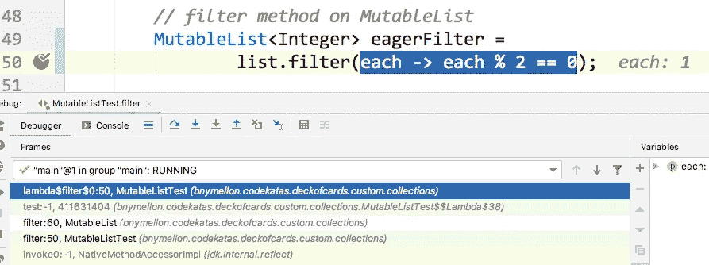
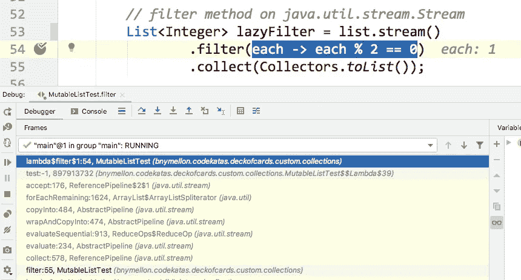
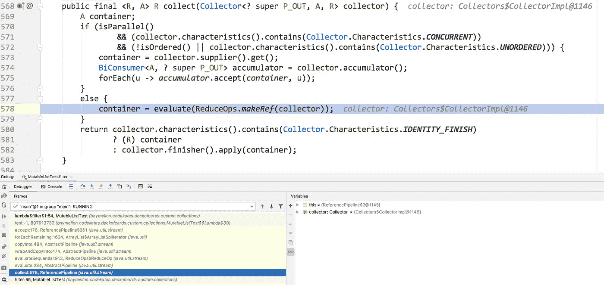
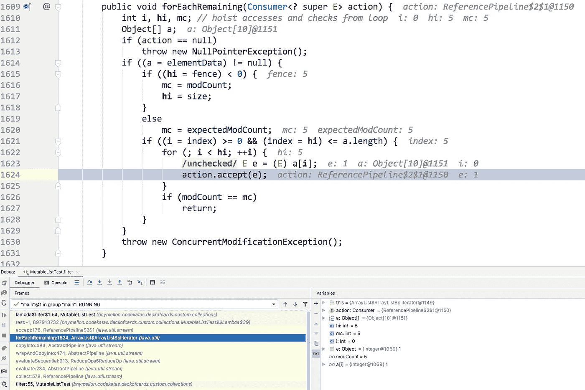
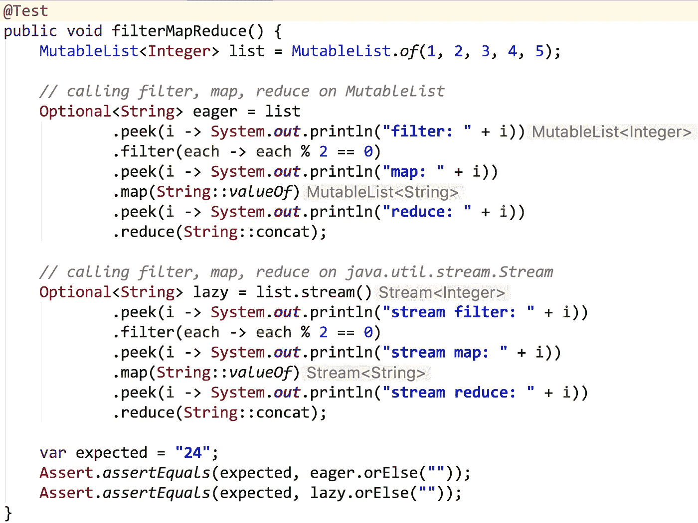
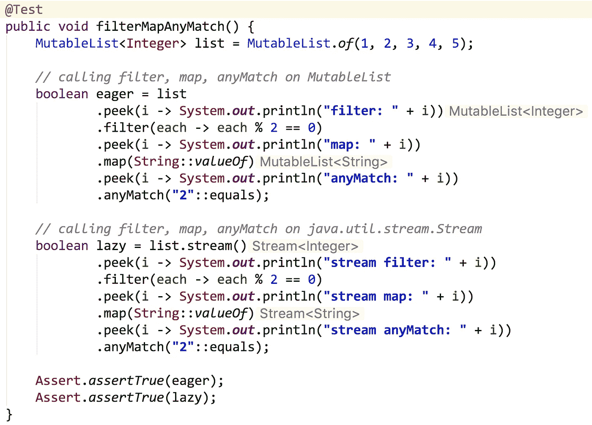

# 渴望是容易的，懒惰是迷宫

> 原文：<https://medium.com/javarevisited/eager-is-easy-lazy-is-labyrinthine-b12605f13048?source=collection_archive---------2----------------------->

从初始化到迭代，学渴望比学懒惰容易。



java.util.*接口和类(黄色)以及带有急切迭代方法的自定义集合接口(青色)

# 渴望和懒惰的区别

eager 算法立即执行并返回结果。惰性算法将计算推迟到必须执行时再产生结果。

急切算法和懒惰算法各有利弊。Eager 算法更容易理解和调试。它们也可以针对单个用例进行高度优化(例如`filter`)。懒惰算法有时导致较少的计算，并且如果在计算中有多个步骤(例如，`filter`、`map`、`reduce`)，将会有较少的临时垃圾被创建。

默认情况下，我通常更喜欢使用急切算法，当我看到优化的机会时，我更喜欢使用懒惰算法。急切算法和懒惰算法都很有用，所以我总是希望我的工具箱里有这两种算法。

这里有一个简单的例子，展示了急切初始化和懒惰初始化。

## 急切初始化

```
class Someclass
{
    private final List<String> strings = new ArrayList<>();

    public List<String> getStrings()
    {
        return this.strings;
    }
}
```

在急切的情况下，当`SomeClass`的实例被创建时，名为`strings`的`List`被立即初始化。这允许将变量字符串定义为`final`，因为它只会在创建类的实例时被初始化。

## 惰性初始化

```
class Someclass
{
    private List<String> strings;

    public List<String> getStrings()
    {
        if (this.strings == null)
        {
            this.strings = new ArrayList<>();
        }
        return this.strings;
    }
}
```

在惰性情况下，只有当方法`getStrings`被调用时，名为`strings`的`List`才会被初始化。所需的计算将推迟到调用方法时进行。如果从未调用该方法，则从不需要额外的计算。

# 懒惰是一项艰苦的工作

初始化的急切实现比上面显示的懒惰实现稍微简单一些。在急切迭代和懒惰迭代的情况下，复杂度的差异要明显得多。

下面的代码示例展示了如何使用急切和懒惰实现将`filter`应用于集合。惰性实现使用 Java 流。eager 的实现使用了一个概念证明集合框架，它的类型叫做`MutableList`，如上图所示。`MutableList`上的`filter`方法将`Predicate`应用于列表的每个元素，并返回一个`MutableList`。POC 集合框架的代码链接在这个博客的底部。

```
@Test
public void filter()
{
    MutableList<Integer> list = MutableList.*of*(1, 2, 3, 4, 5);

    *// eager filter method on MutableList* MutableList<Integer> eagerFilter = 
            list.filter(each -> each % 2 == 0);

    *// lazy filter method on java.util.stream.Stream* List<Integer> lazyFilter = list.stream()
            .filter(each -> each % 2 == 0)
            .collect(Collectors.*toList*());

    var expected = List.*of*(2, 4);
    Assert.*assertEquals*(expected, eagerFilter);
    Assert.*assertEquals*(expected, lazyFilter);
}
```

这两个例子应该足够容易阅读，并且具有与测试代码所示相同的结果。这两个例子都采用了一个从 1 到 5 的整数列表，并对这些整数进行平均，得到一个包含 2 和 4 的列表。急切实现只需要一个方法调用(`filter`)，相比之下，迟缓实现需要四个方法调用(`stream`、`filter`、`collect`、`toList`)。

真正的复杂性隐藏在这里的实现代码之下，如果我们在`Predicate`中放置一个断点，就可以在调试期间看到。

我将从调试 eager `filter`方法开始。我将在 lambda 上放置一个断点，测试整数是否为偶数，这会暂停列表中每个整数的执行。

## 调试紧急过滤器


急切过滤器谓词上的断点

当我调试代码时，这是我看到的堆栈跟踪。



Lambda 代码位于堆栈跟踪的顶部

如果我在`MutableList`上单步执行`filter`方法，这就是我看到的代码。


在`MutableList`上调试`filter`方法的实现

这很容易推理，我只有一种方法来理解`MutableList`上的`filter`方法如何工作。我可以看到 lambda 被转换成了一个`Predicate`并且`Predicate`接口的`test`方法在遍历列表的 for 循环内部的 if 语句中被调用。

## 调试惰性过滤器

现在让我们在`Stream`上调试`lazy`过滤方法。


惰性过滤器谓词上的断点

当我调试代码时，这是我看到的堆栈跟踪。



Lambda 代码位于堆栈跟踪的顶部

类似于我调试 eager 代码时，lambda 代码在堆栈跟踪的顶部。但是，我在堆栈跟踪中没有看到`Stream`上的`filter`方法。这是因为`filter`返回一个新的`Stream`，但不执行 lambda 中的代码。执行发生在`collect`方法中，因为它是一个终端操作。如果我进入`collect`方法，这就是我所看到的。



在`Stream`上调试`collect`方法的实现

如果我想找到遍历列表元素的循环，我需要进入堆栈跟踪中的`forEachRemaining`方法，该方法在`ArrayList`类的`ArrayListSpliterator`中。



调试 ArrayList 中 ArrayListSpliterator 上的 forEachRemaining

懒惰迭代比急切迭代更难理解。您将需要在错综复杂的方法中导航，以遵循 Java 流的执行路径。希望理解算法如何工作的开发人员很可能会发现，首先理解一个热切的实现会更容易。

# 理解事物的顺序

如果我们将几个操作堆叠在一起，并使用`peek`方法输出某个东西的当前值，我们就可以跟踪急切执行和懒惰执行完成事情的顺序。



使用 eager 和 lazy 算法跟踪 filter、map、reduce 的执行顺序

## 渴望的输出

`filter`:1
`filter`:2
`filter`:3
`filter`:4
`filter`:5
`map`:2
`map`:4
`reduce`:2
`reduce`:4

## 懒惰的输出

流`filter` : 1
流`filter` : 2
流`map` : 2
流`reduce` : 2
流`filter` : 3
流`filter` : 4
流`map` : 4
流`reduce` : 4
流`filter` : 5

请注意，eager 的顺序与方法调用的顺序是如何匹配的。接着是`filter`，接着是`map`，然后是`reduce`。在惰性的情况下，方法的顺序是由数据决定的。对于在`filter`中匹配的每个元素，然后对该元素执行`map`和`reduce`。

急切和懒惰的执行总数在这里是相同的:9。急切方法虽然更容易理解和推理，但它生成两个临时的`MutableList`实例(一个用于`filter`，一个用于`map`)，而懒惰方法不生成任何临时集合。这是一个使用惰性方法可能会提高性能的地方，特别是如果源`MutableList`很大的话。

lazy 真正闪耀的地方是短路可能发生的时候，减少了必要的工作总量。

# 了解短路的影响

如果我们使用类似`anyMatch`的短路方法，我们可以看到使用惰性迭代的一些真正的潜在性能优势。



## 渴望的输出

`filter`:1
`filter`:2
`filter`:3
`filter`:4
`filter`:5
`map`:2
`map`:4
`anyMatch`:2
`anyMatch`:4

## 懒惰的输出

流`filter` : 1
流`filter` : 2
流`map` : 2
流`anyMatch` : 2

这很好地说明了懒惰迭代的优势。惰性迭代不必访问整个集合。在所有实现和理解的艰苦工作之后，我们可以通过使用懒惰迭代来减少必要的工作总量。

# 渴望还是懒惰？为什么不两者都要？

直接在集合接口上实现算法的急切实现以及在流上实现对称的懒惰实现是有意义的。直接在集合上使用 eager 迭代方法将使代码更容易学习、教授和调试。这降低了开发人员理解迭代模式实现的成本。流上的惰性实现是一个很好的性能优化，并且很容易转移到集合接口上的对称 API，如`filter`、`map`、`reduce`等。与所有性能优化一样，lazy 的代码可能更难理解和调试。

# 进一步的信息

下面的博客更深入地解释了 eager、lazy、serial 和 parallel，并比较了针对大型数据集的不同算法的性能。

[](/javarevisited/the-4am-jamestown-scotland-ferry-and-other-optimization-strategies-66365ac415ef) [## 凌晨 4 点詹姆斯敦-苏格兰渡轮和其他优化策略

### 当性能很重要时，了解您的可用选项也很重要。

medium.com](/javarevisited/the-4am-jamestown-scotland-ferry-and-other-optimization-strategies-66365ac415ef) 

如果你想看我在[定制收藏](https://github.com/BNYMellon/CodeKatas/tree/master/deck-of-cards-kata/src/main/java/bnymellon/codekatas/deckofcards/custom/collections)中使用的代码，请点击这里查看 GitHub 回购[中的卡牌卡塔。](https://github.com/BNYMellon/CodeKatas)

如果你想了解更多关于在 Java 集合中使用 eager 方法的潜在好处，那么看看下面的博客。

[](/javarevisited/java-streams-are-great-but-its-time-for-better-java-collections-42d2c04235d1) [## Java 流很棒，但现在是更好的 Java 集合的时候了

### 25 年后，Java 是时候进行集合升级了。

medium.com](/javarevisited/java-streams-are-great-but-its-time-for-better-java-collections-42d2c04235d1) 

祝编程愉快！

*我是*[*Eclipse Collections*](https://github.com/eclipse/eclipse-collections)*OSS 项目在*[*Eclipse Foundation*](https://projects.eclipse.org/projects/technology.collections)*的项目负责人。* [*月食收藏*](https://github.com/eclipse/eclipse-collections) *开作* [*投稿*](https://github.com/eclipse/eclipse-collections/blob/master/CONTRIBUTING.md) *。如果你喜欢这个库，你可以在 GitHub 上让我们知道。*