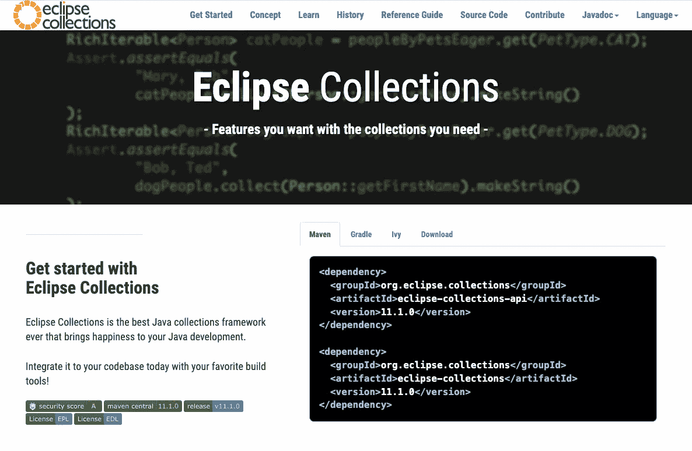

# 发布了 Eclipse 集合 11.1

> 原文：<https://medium.com/javarevisited/eclipse-collections-11-1-released-acca6905585a?source=collection_archive---------3----------------------->

我们在 GitHub 上通过了 2000 颗星！感谢我们所有的支持者！

[https://github.com/eclipse/eclipse-collections](https://github.com/eclipse/eclipse-collections)

# Eclipse Collections 11.1 来了！

【https://www.eclipse.org/collections/ 号

我很高兴地告诉大家， [Eclipse Collections 11.1 版本](https://github.com/eclipse/eclipse-collections/releases/tag/11.1.0)现在已经可以在 Maven Central 上使用了。自从我们在 2021 年 11 月发布 [Eclipse Collections 11.0](https://donraab.medium.com/eclipse-collections-11-0-released-d14df63f5d1d?source=friends_link&sk=74bad1fcf0f384fba241041c8383502b) 已经过去了 8 个月。Eclipse Collections 继续参与 OpenJDK 质量拓展计划，并在 JDK 的最新版本发布时对其进行测试。我们目前正在积极构建和测试 JDK 8、11、17 和 18。

来自 [Sirisha Pratha](https://medium.com/u/8fe7c47c374f?source=post_page-----acca6905585a--------------------------------) 的 Twitter 发布公告

# 感谢 Sirisha Pratha

如果没有 Eclipse Collections committer[Siri sha Pratha](https://medium.com/u/8fe7c47c374f?source=post_page-----acca6905585a--------------------------------)的广泛努力，Eclipse Collections 11.1 发行版是不可能的。Sirisha 完成了许多重要的背景工作，并与其他 Eclipse 集合提交者和 Java 社区的专家进行了讨论，比如 Nicolai Parlog。Sirisha 对迁移到 Java 11 的好处以及我们如何能够在 Eclipse Collections 12.0 及更高版本中利用 JPMS 做了大量研究。Eclipse Collections 11.1 中完成了大量工作，这将有助于在后 Java 8 时代实现 Eclipse 集合的发展。

谢谢你，Sirisha，谢谢你为规划 Eclipse 集合的未来所做的努力，谢谢你为发布这个版本所做的努力！

# 感谢社区

11.1 版本有许多由我们杰出的贡献者社区提交的新特性。非常感谢所有贡献者，他们贡献了宝贵的时间，让 Eclipse 集合的功能更加丰富，质量更高。非常感谢你的努力。

# 贡献者博客的新功能

我继续鼓励 Eclipse Collections 贡献者撰写博客，介绍他们为项目贡献的特性。我尽最大努力树立一个好榜样，并尝试定期在博客上记录我添加到 Eclipse 集合中的任何特性，或者我添加到 Eclipse 集合的 Kata 存储库中的新的 Kata。

以下是一些由贡献者撰写的博客，讲述了他们为 Eclipse Collections 11.1 版本贡献的特性。

*   已将 injectIntoKeyValue 添加到 MapIterable。
    向 objectPrimitiveMap 添加了 injectIntoKeyValue。
    在 primitiveObjectMap 中增加了 injectIntoKeyValue。
    给 primitivePrimitiveMap 增加了 injectIntoKeyValue。

 [## Eclipse 集合中的 InjectIntoKeyValue

### 在 Eclipse Collections 11.1.0 版本中，引入了一个新的 API！最近，我致力于这个问题，以实现…

emilie-robichaud.medium.com](https://emilie-robichaud.medium.com/injectintokeyvalue-in-eclipse-collections-8b29c9a4830d) 

*博客作者* [*艾米莉·罗比查*](https://medium.com/u/b220de0951d0?source=post_page-----acca6905585a--------------------------------)

*   为 objectprimitivehashmapwithshashingstrategy 添加了工厂。

 [## Eclipse 集合中带有散列策略的原始映射的工厂

### 在 Eclipse Collections 11.1.0 版本中，我们将有一个新的工厂，ObjectPrimitiveHashingStrategyMaps，它具有方法…

medium.com](/@aqsamalik70/factories-for-a-primitive-map-with-hashing-strategies-in-eclipse-collections-f4613ef2446c) 

*博客作者* [*阿克萨马利克*](https://medium.com/u/aa39c8c851a0?source=post_page-----acca6905585a--------------------------------)

*   向 mutableObjectPrimitiveMap 添加了 getAndPut，以检索与键关联的值(如果存在)。

 [## EC 示例:在原始 Map API 中获取和放置值。

### 我最近参与了 Eclipse Collections 项目，为原始 Map API 添加了一个 getAndPut 方法。

medium.com](/@goldbal/ec-by-examples-getting-and-putting-values-in-the-primitive-map-api-d18cabbc67d3) 

*博客作者* [*亚历克斯·戈德堡*](https://medium.com/u/da10a7c5350?source=post_page-----acca6905585a--------------------------------)

# 其他博客和视频

自从 11.0 发布以来，有一些额外的 Eclipse 集合博客。

## Eclipse Collections JSON 序列化支持

如果你想了解 Jackson 对 Eclipse 集合的支持，可以看看下面来自 [Alex Goldberg](https://medium.com/u/da10a7c5350?source=post_page-----acca6905585a--------------------------------) 的博客和 kata。

 [## Eclipse Collections JSON 序列化支持

### 如果您将 Eclipse 集合用于 REST 服务或任何其他需要 JSON 序列化的项目，您可能会…

medium.com](/@goldbal/eclipse-collections-json-serialization-support-cd3c791d2046) 

## 使用文本块的 Java 俳句

在下面的博客中，我将展示 Eclipse Collections 解决方案与使用 Java 文本块的 Java Streams 解决方案的比较。

 [## 使用文本块的 Java 俳句

### 创意写作遇到 Java 文本块和 Eclipse 集合

medium.com](/javarevisited/haiku-for-java-using-text-blocks-6b7862ccd067) 

还有 José Paumard 为 Java YouTube 频道录制的《JEP 咖啡馆》第 9 集，它比较了基于该博客的解决方案，并展示了利用 Java 记录的好方法。

## 一个世界性的形挑战

有时候，小小的竞争会带来学习不同解决问题方法的最佳机会。JLDD 是一个缩写，代表时差驱动开发。我在下面的博客中描述了 JLDD，并回应了来自 [José Paumard](https://medium.com/u/18673d5e2e01?source=post_page-----acca6905585a--------------------------------) 的 JLDD 挑战，使用 Eclipse 集合解决了一个 Wordle Kata。

 [## 一个世界性的形挑战

### 了解如何使用 Eclipse 集合来解决单词猜形

medium.com](/oracledevs/a-wordle-jldd-kata-challenge-b6fb1c89d8eb) 

José为 Wordle JLDD Kata Challenge 录制了另一集 JEP 咖啡馆。看他边喝咖啡边现场编写解决方案，解释记录和模式匹配等 Java 新特性，是一件非常有趣的事情。

# 还有更多！

请参考 [11.1 版本说明](https://github.com/eclipse/eclipse-collections/releases/tag/11.1.0)，了解 11.1 版本中更全面的变化。在那里，你会发现优化的细节，技术债务减少，删除的功能，并建立变化。

# 谢谢你

从整个 Eclipse 集合社区的所有贡献者和提交者…感谢您使用 Eclipse 集合！我们希望您喜欢 11.1 版本中的所有新特性和改进！

# 展望未来

Eclipse Collections 12.0 将是该框架的一个重大变化。我们将在 Java 11 上为 12.0 版本建立库开发的基线。11.1 版本将是最后一个提供 Java 8 到 Java 10 支持的版本。11.x 版本的特性非常丰富，因此仍然运行在 Java 8 上的应用程序将能够长期使用这些版本和旧版本。

*我是*[*Eclipse Collections*](https://github.com/eclipse/eclipse-collections)*OSS 项目在*[*Eclipse Foundation*](https://projects.eclipse.org/projects/technology.collections)*的项目负责人。* [*月食收藏*](https://github.com/eclipse/eclipse-collections) *是开投* [*投稿*](https://github.com/eclipse/eclipse-collections/blob/master/CONTRIBUTING.md) *。如果你喜欢这个库，你可以在 GitHub 上让我们知道。*

你可能喜欢的其他 Java 文章

 [## 2022 年 Java 程序员路线图

### 2022 年成为 Java 开发人员的图解指南，包含相关课程的链接

medium.com](/javarevisited/the-java-programmer-roadmap-f9db163ef2c2)  [## 如何在 2022 年成为一名 Java 程序员？您需要的所有工具、技能、框架和库

### Java 开发人员可以在 2022 年学习的 22 项基本技术技能，以进一步改善他们的形象，并成为…

medium.com](/javarevisited/top-22-skills-professional-java-programmers-can-learn-in-2022-to-upgrade-themselves-bc3da73d7491)  [## 2022 年每个程序员都应该学习的前 22 个 Java 库和 API

### 成为更好的 Java 开发人员可以学习的最基本的 Java 库。它包括用于日志记录的 Java 库…

medium.com](/javarevisited/20-essential-java-libraries-and-apis-every-programmer-should-learn-5ccd41812fc7)