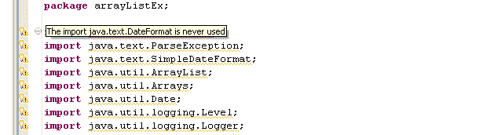
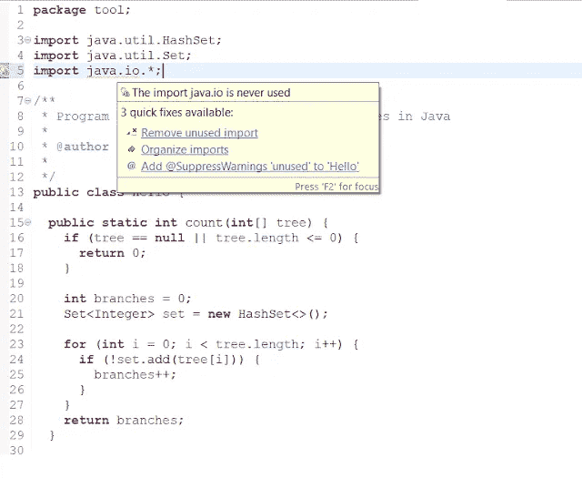

# 删除 Java 文件中所有未使用的导入的 Eclipse 快捷方式

> 原文：<https://medium.com/javarevisited/eclipse-shortcut-to-get-rid-of-all-unused-imports-in-a-java-file-86b9ca0085b2?source=collection_archive---------0----------------------->

大家好，当你在一个遗留项目中工作时，你可能已经注意到你的 Java 文件中有许多未使用的导入。 [Eclipse IDE](http://www.java67.com/2018/02/5-free-eclipse-and-junit-online-courses-java-developers.html) 每当在 Java 源文件中检测到*未使用的导入*并显示黄色下划线时，就会给出警告**“导入 XXX 从未使用过”**。

尽管 Java 文件**中未使用的导入不会造成任何伤害**，但是没有必要增加 Java 源文件的长度和大小，如果 Java 源文件中有太多未使用的导入，那些黄色下划线和 Eclipse 警告会影响代码的可读性，至少会分散您的注意力。

在我关于 Eclipse 的上一篇文章中，我们查看了 Eclipse 上的一些 [Java 调试技巧。在本文中，您将学习一些有用的快捷方式，在 Eclipse 中从 Java 代码中删除所有未使用的导入。](https://javarevisited.blogspot.com/2011/07/java-debugging-tutorial-example-tips.html)

有许多方法可以解决这个问题，比如您可以在 Eclipse 中折叠代码的导入部分，或者您可以从 Java 文件中完全删除所有未使用的导入，我们将在这个简短的教程中看到它们。

如果你对 Eclipse IDE 完全陌生，那么我建议你先学习一门综合课程，比如[**Eclipse Guided Tour:Part 1 and 2**](https://pluralsight.pxf.io/c/1193463/424552/7490?u=https%3A%2F%2Fwww.pluralsight.com%2Fcourses%2Feclipse-guided-tour-part1)from[plural sight](https://javarevisited.blogspot.com/2017/12/top-10-pluralsight-courses-java-and-web-developers.html)，它将从 Java 开发的角度教你所有你需要知道的关于 Eclipse 的知识。

<https://pluralsight.pxf.io/c/1193463/424552/7490?u=https%3A%2F%2Fwww.pluralsight.com%2Fcourses%2Feclipse-java-developers>  

无论如何，让我们看看如何在 Eclipse IDE 中从 Java 文件中移除所有未使用的导入。

# 如何在 Eclipse 中从 Java 文件中移除所有未使用的导入

*上图中的黄色下划线表示 Java 源文件中所有未使用的导入*

下面是从 Java Eclipse IDE 中移除所有未使用的导入的几种方法:

1.转到未使用的导入行，按 Ctrl + 1，这是一个快速修复的 Eclipse 快捷方式。这将显示一个下拉菜单来修复这个错误，其中之一将是“删除未使用的导入。”它将从 Java 文件中删除导入语句。

2.如果您想一次单击删除多个未使用的导入，上述选项不是很有效，因为它会逐个删除它们。最好使用 [Eclipse IDE](/javarevisited/6-free-best-eclipse-ide-courses-for-java-programmers-1229ee9e5d87) 的**“组织导入**”特性来删除多个或所有未使用的导入语句。

要使用此 from 菜单，请选择源→组织导入。这将从 Java 文件中删除所有未使用的导入。

3.第三个也是我的首选选项是 Ctrl + Shift + O，这是 Eclipse 中有组织导入的**快捷方式，您可以说 [*Eclipse 快捷方式*](https://javarevisited.blogspot.com/2018/07/top-30-eclipse-keyboard-shortcuts-java-programming.html) *来从 Java 文件中删除所有未使用的导入语句*。**

这也适用于前面的选项，并从源文件中删除所有未使用的导入行。

## 额外小费

你想要一个**额外的月食提示吗？**如果是，那么就这样:您可以通过使用 **Eclipse 保存动作**来保存从 Java 源文件中删除所有未使用的导入所需的所有击键，这些动作是 Eclipse 在保存 Java 文件时自动执行的。

只需在*窗口→首选项- > Java →编辑器→保存动作*下勾选保存动作中的组织导入选项即可。这节省了在 Eclipse 中工作的大量时间，也是我喜欢 Eclipse IDE 用于 Java 编程的原因之一。

您还可以配置格式和其他一些操作，每当您保存文件时，Eclipse 都会自动执行这些操作。如果你想了解更多这样的特性，我也建议你看看 Udemy 上的[**Eclipse Java IDE 初学者培训班**](https://click.linksynergy.com/fs-bin/click?id=JVFxdTr9V80&subid=0&offerid=323058.1&type=10&tmpid=14538&RD_PARM1=https%3A%2F%2Fwww.udemy.com%2Fbeginners-eclipse-java-ide-training-course%2F) 。学习 Eclipse IDE 的较好课程之一。

<https://click.linksynergy.com/fs-bin/click?id=JVFxdTr9V80&subid=0&offerid=323058.1&type=10&tmpid=14538&RD_PARM1=https%3A%2F%2Fwww.udemy.com%2Fbeginners-eclipse-java-ide-training-course%2F>  

使用**组织导入**或快捷键 **Ctrl + Shift +O** 的另一个好处是，它会导入代码需要的所有包。

因此，它不仅在删除 import 语句时节省了时间，而且还有助于在 Java 中导入所需的包。

这意味着，如果你复制并粘贴代码，并看到许多红线，这是一个错误，由于非导入包。要解决这个问题，使用这个 Eclipse 快捷方式或者保存您的源文件，如果您已经配置了 *Eclipse save action* 来组织导入。

这就是在 Eclipse IDE 中从 Java 源文件中删除所有未使用的导入语句的 **Eclipse 快捷方式。学习更多关于你正在使用的 IDE 的知识总是好的，比如 [IntelliJ IDEA](https://itnext.io/top-5-intellijidea-and-android-studio-courses-for-java-and-android-programmers-afcc27309b60) ，Netbeans，或者 [Eclipse](/javarevisited/6-free-best-eclipse-ide-courses-for-java-programmers-1229ee9e5d87) ，以提高生产力。**

# 进一步学习

1.  【Eclipse Java IDE 初学者培训课程
2.  [Eclipse 调试技巧和窍门](https://click.linksynergy.com/fs-bin/click?id=JVFxdTr9V80&subid=0&offerid=323058.1&type=10&tmpid=14538&RD_PARM1=https%3A%2F%2Fwww.udemy.com%2Feclipse-debugging-techniques-and-tricks%2F)
3.  [日食导游:第一部分和第二部分](https://pluralsight.pxf.io/c/1193463/424552/7490?u=https%3A%2F%2Fwww.pluralsight.com%2Fcourses%2Feclipse-guided-tour-part1)

您可能想了解的其他 **Java Eclipse 文章**:

*   30 个对 Java 开发人员有用的 Eclipse 快捷方式([列表](http://javarevisited.blogspot.com/2010/10/eclipse-tutorial-most-useful-eclipse.html))
*   如何在 Eclipse 中远程调试 Java 应用？([教程](http://javarevisited.blogspot.sg/2011/02/how-to-setup-remote-debugging-in.html))
*   Java 开发人员应该知道的 10 个 Eclipse 调试技巧？([见此处](http://javarevisited.blogspot.com/2011/07/java-debugging-tutorial-example-tips.html))
*   如何在 Eclipse 中附加 JAR 文件的源代码？([导轨](http://javarevisited.blogspot.com/2012/12/how-to-attach-source-in-eclipse-Jar-JDK-debugging.html))
*   Eclipse 打印 System.out.println 语句的快捷方式？([快捷键](http://javarevisited.blogspot.com/2012/10/eclipse-shortcut-to-systemoutprintln-in-java.html))
*   如何在 Eclipse 中增加控制台缓冲区大小？([步骤](http://javarevisited.blogspot.com/2013/03/how-to-increase-console-buffer-size-in.html)
*   Eclipse 中如何用空格代替制表符？([导游](http://javarevisited.blogspot.com/2016/06/how-to-make-eclipse-use-spaces-instead.html)
*   如何从 Eclipse 创建一个可执行的 JAR 文件？([举例](http://java67.com/2014/04/how-to-make-executable-jar-file-in-Java-Eclipse.html))
*   Java 开发人员学习 Eclipse IDE 的 3 本书([列表](http://javarevisited.blogspot.com/2016/03/3-books-to-learn-eclipse-ide-for-java-jee-programmers.html))
*   如何增加运行在 Eclipse 中的 Java 程序的堆大小？([导轨](http://www.java67.com/2016/02/how-to-increase-heap-size-of-java-program-eclipse-command-line.html))

因为 Eclipse 是流行的 Java IDE 之一，许多喜欢快速做事的 Java 程序员喜欢学习新的快捷方式。如果你也喜欢学习新的快捷键，那么我建议你查看一下[**Java 程序员 30 大 Eclipse 键盘快捷键**](https://javarevisited.blogspot.com/2018/07/top-30-eclipse-keyboard-shortcuts-java-programming.html) 。这是我在那里分享的许多 Eclipse 快捷方式之一。

再次感谢您阅读这篇文章！。如果你喜欢这篇文章，请分享给你的朋友和同事。如果您有任何问题或反馈，请在下面留言。

</javarevisited/top-10-free-courses-to-learn-spring-framework-for-java-developers-639db9348d25>  </javarevisited/8-best-spring-and-hibernate-training-courses-for-java-developers-acf09aa0e244> 