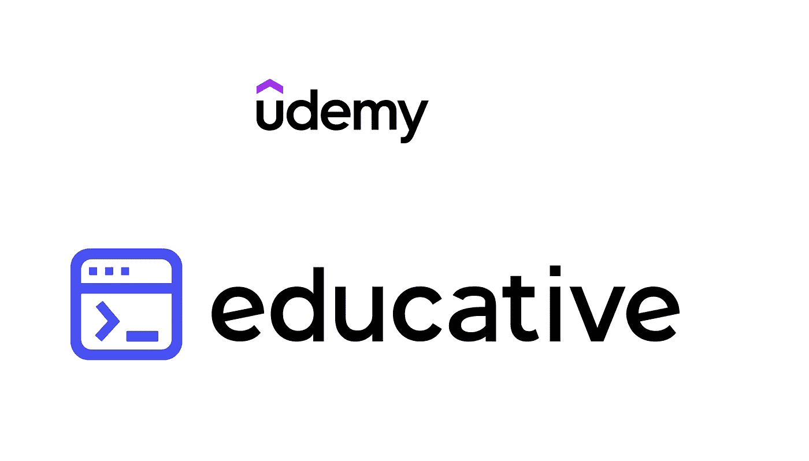
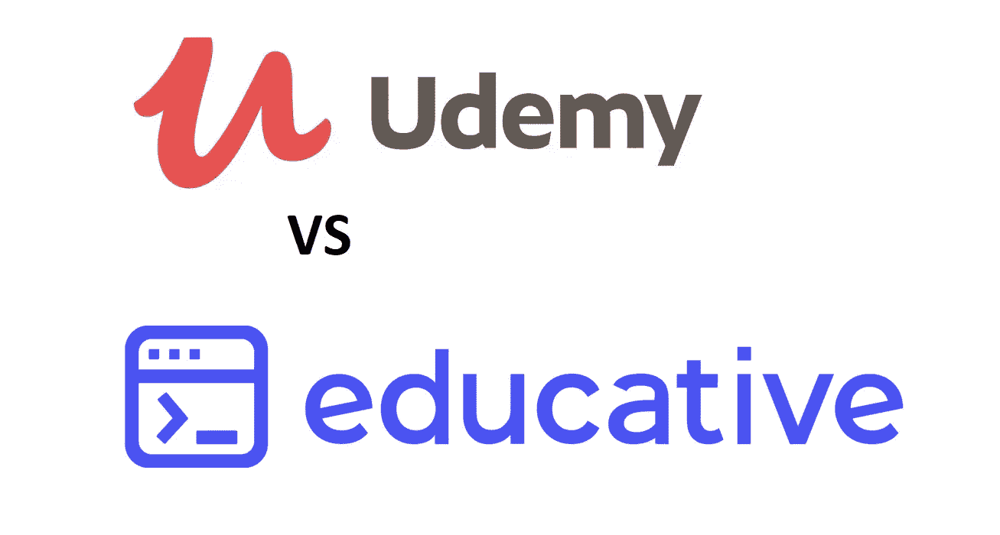
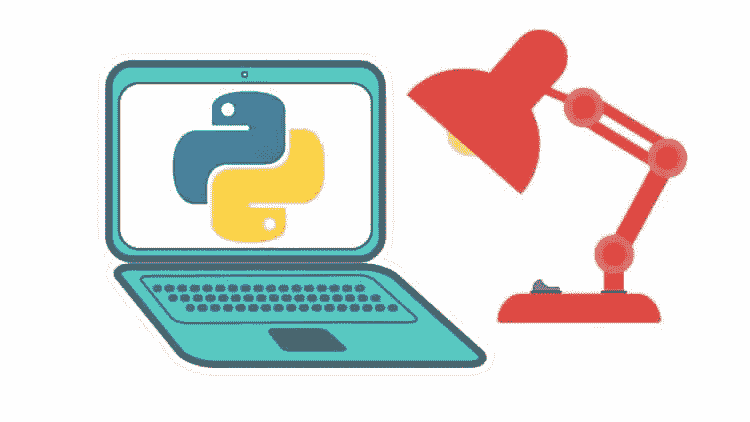
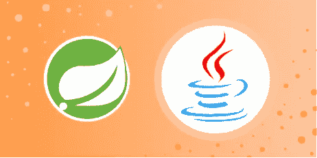
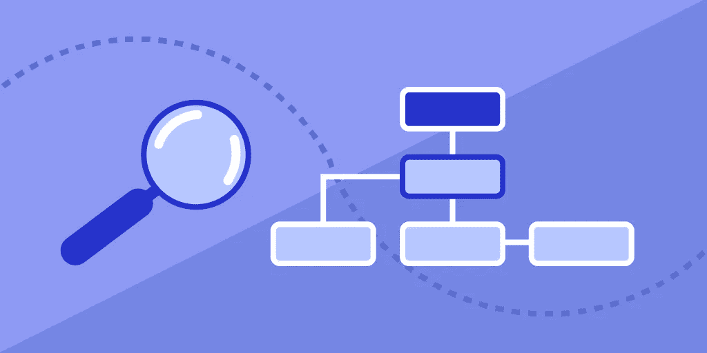

# Udemy 和教育评论——2023 年，哪个是学习技术技能的更好平台？

> 原文：<https://medium.com/javarevisited/educative-vs-udemy-which-is-better-to-learn-programming-skills-b6887006b7ba?source=collection_archive---------0----------------------->

## 虽然 Udemy 和 Educative 都是很好的在线学习平台，但如果你喜欢看视频，Udemy 会更好，如果你喜欢通过运行代码来学习，Educative 会更好。

大家好，如果你想学习编程、数据科学、机器学习等技术技能，并且不知道是否应该参加 Udemy 课程或加入教育平台来学习新的技术技能，但不确定，那么你来对地方了。

早些时候，我分享了一个关于 [**Pluralsight 和 Udemy**](https://javarevisited.blogspot.com/2019/10/udemy-vs-pluralsight-review-which-is-better-to-learn-code.html) 以及[**CodeCademy vs plural sight**](https://javarevisited.blogspot.com/2019/10/pluralsight-vs-codecademy-which-is-best-online-learning-platform.html)的比较，在这篇文章中，我将比较 Udemy 和 Educative，一个新的基于文本的交互式学习平台。

虽然我经常说 Udemy 是我最喜欢的平台，因为你可以只花 9.9 美元从顶级讲师那里获得高质量和全面的课程，这是惊人的。

[**Udemy**](https://click.linksynergy.com/deeplink?id=CuIbQrBnhiw&mid=39197&murl=https%3A%2F%2Fwww.udemy.com%2F) 让全世界所有人都能负担得起学习，但当我发现 Educative.io 时，我对它使用其尖端互动平台提供的教师和学习体验印象深刻。

在当今世界，学习新技能已经成为你职业和生活中至关重要的事情，它让你有能力和智慧更快地理解并轻松解决许多生活问题，并帮助你的大脑获得分析思维技能等。

正因如此，许多平台如**[**plural sight**](https://pluralsight.pxf.io/c/1193463/424552/7490?u=https%3A%2F%2Fwww.pluralsight.com%2Flearn)[**Coursera**](https://click.linksynergy.com/deeplink?id=JVFxdTr9V80&mid=40328&murl=https%3A%2F%2Fwww.coursera.org%2F)[**edX**](https://www.awin1.com/cread.php?awinmid=6798&awinaffid=631878&clickref=&p=)[CodeCademy](https://www.gopjn.com/t/TUJGR0lLR0JHRklJSkhCR0ZISk1N?url=https%3A%2F%2Fwww.codecademy.com%2Fcatalog)[Linkedin Learning](http://linkedin-learning.pxf.io/c/1193463/449670/8005)等应运而生，帮助学生每天在网上与导师联系并获得新技能。**

**这真的很重要，因为你不需要浪费那么多时间和金钱去上大学，并让每个人都可以访问它，我将在今天的文章中与你讨论的一些最好的平台是 Udemy 和教育。io**

**在今天的文章中，您将看到这两个平台在许多方面的差异，从而决定哪个平台最适合您花时间学习新技能的要求。**

****

# **回顾—2023 年 Udemy vs Educative？学技术技能哪个好**

**虽然这两个平台都有很好的技术相关课程，但我们将在学习体验、价格和性价比等方面对这两个平台进行比较，以便您能够做出明智的决定，选择适合您学习需求的课程。**

## **1.乌代米**

**Udemy 是最大的市场之一，世界各地的教师可以以在线课程的形式与你能想到的每个行业的数百万学生分享他们的知识，如 web 开发之类的编程，构建商业移动应用程序，以及如何开展成功的营销活动。该平台允许任何人成为讲师，并以他想要的价格与人们分享他的激情，但有时 Udemy 在特定时间和假期运营 [Udemy sales](https://click.linksynergy.com/deeplink?id=CuIbQrBnhiw&mid=39197&murl=https%3A%2F%2Fwww.udemy.com%2F) ，让学生以实惠的价格购买课程，如在某些时间打九折。

在每门课程中，教师可以放视频和文字来解释科目和测验，这样学生就可以在课程进行的同时检查他们的知识，这是这个平台上的一件好事。由于该平台允许任何人创建课程并向其他人教授新技能，有时你会陷入寻找最适合你开始学习的课程或教师的困境，因为一些教师专注于赚钱而不是他们课程的质量，所以你需要小心选择适合你的课程。

如果你有兴趣了解 Udemy 中最好的导师，这里有一些他们在这个平台上的导师，比如软件开发的 John Purcell，web 开发的 Rob Percival，以及许多成功课程的创造者何塞·波尔蒂利亚，比如学习用的[**Python boot camp**](https://click.linksynergy.com/deeplink?id=CuIbQrBnhiw&mid=39197&murl=https%3A%2F%2Fwww.udemy.com%2Fcourse%2Fcomplete-python-bootcamp%2F)课程**

****

## **2.[教育性 io](https://www.educative.io?affiliate_id=5073518643380224)**

**Educative.io 也是一个平台和市场，成立于 2015 年，用于学习新技能，但与信息技术相关，如 python 编程语言、web 开发、移动应用程序、机器学习、安全性、测试自动化，以及更多您可以在平台中探索的内容。**

**该平台有许多著名的课程可以学习，如 [**探索系统设计面试**](https://www.educative.io/collection/5668639101419520/5649050225344512?affiliate_id=5073518643380224) ，这是为你参加数据库和微服务等系统设计面试做准备的最佳课程之一。**

** [## 探索系统设计面试——互动学习

### 这个由设计大师们开设的课程已经帮助了 6 万多名用户破解了他们的系统设计面试(SDI)。系统设计…

www.educative.io](https://www.educative.io/courses/grokking-the-system-design-interview?affiliate_id=5073518643380224) 

除此之外，还有另一门课程叫做 [**探索编码面试**](https://www.educative.io/collection/5668639101419520/5671464854355968?affiliate_id=5073518643380224) 帮助你解决编码面试中的问题，比如在代码中找到模式并修复它们，以及你将在平台中探索的许多其他课程。

 [## 探索编码面试:编码问题的模式——互动学习

### 更新:这个课程已经帮助 3 万多名用户在顶级公司找到了工作，包括谷歌、脸书、亚马逊和…

www.educative.io](https://www.educative.io/collection/5668639101419520/5671464854355968?affiliate_id=5073518643380224) 

与为学生提供视频课程的 [Udemy](https://click.linksynergy.com/deeplink?id=CuIbQrBnhiw&mid=39197&murl=https%3A%2F%2Fwww.udemy.com%2F) 不同，educative.io 只允许**基于文本的课程**，因为他们认为阅读比观看视频要快得多，好的一点是该平台还允许在在线环境中运行代码，这样你就不必下载任何额外的软件来开始学习。

Educative.io 也允许人们在他们的平台上教学，但只有有经验的合格教师才能在他们的平台上提交课程，而不是任何人。

此外，它还提供了两种注册他们课程的方式，一种是通过 [**教育订阅**](https://www.educative.io/subscription?affiliate_id=5073518643380224) ，目前是 **$14.99** ，在我写这篇文章的时候，你可以观看无限的课程，或者购买像 Udemy 这样的单一课程，享受学习新技能的乐趣。

# 回顾 Udemy 和 Educative 学习技术技能平台的比较

既然你已经知道了 Udemy 和 Educative 的优势和 USP，让我们来修正一下这两个平台之间的区别。

## **1。课程数量**

Udemy 课程数量比 Educative 多，超过 12 万门课程，而 Educative 有 250 多门课程。这意味着，你有更多的选择，但这个选择并不容易，因为 Udemy 也有很多低质量的课程。

但是，如果你能做一些研究并找到正确的课程，那么 Udemy 真的很棒。我通常在他们的[**【9.9 美元】优惠价**](https://click.linksynergy.com/deeplink?id=CuIbQrBnhiw&mid=39197&murl=https%3A%2F%2Fwww.udemy.com%2F) 期间买很多很棒的课程，在那里你可以只花 9.9 美元买到 200 美元的特价。'

顺便说一下，我在 Udemy 上花了相当多的时间研究伟大的课程，下面是我最喜欢和推荐的 2023 年加入的 Udemy 课程

1.  [**《巨蟒完整训练营》**](https://click.linksynergy.com/deeplink?id=JVFxdTr9V80&mid=39197&murl=https%3A%2F%2Fwww.udemy.com%2Fcomplete-python-bootcamp%2F) **作者何塞·波尔蒂利亚**
2.  [**Java 大师班**](https://click.linksynergy.com/deeplink?id=JVFxdTr9V80&mid=39197&murl=https%3A%2F%2Fwww.udemy.com%2Fjava-the-complete-java-developer-course%2F) **作者 Tim Buchalaka**
3.  [**JavaScript boot camp 课程**](https://click.linksynergy.com/deeplink?id=JVFxdTr9V80&mid=39197&murl=https%3A%2F%2Fwww.udemy.com%2Fthe-complete-javascript-course%2F) **作者 Jonas Schmedtmann**
4.  [**Web 开发者训练营课程**](https://click.linksynergy.com/deeplink?id=JVFxdTr9V80&mid=39197&murl=https%3A%2F%2Fwww.udemy.com%2Fcourse%2Fthe-complete-web-development-bootcamp%2F) **作者 Angela Yu**
5.  [**《React》完全指南**](https://click.linksynergy.com/deeplink?id=JVFxdTr9V80&mid=39197&murl=https%3A%2F%2Fwww.udemy.com%2Freact-the-complete-guide-incl-redux%2F)**acad mind 课程**
6.  [**春天&冬眠适合初学者(包括 Spring Boot)**](https://click.linksynergy.com/deeplink?id=CuIbQrBnhiw&mid=39197&murl=https%3A%2F%2Fwww.udemy.com%2Fcourse%2Fspring-hibernate-tutorial%2F)

如果你想学习 Python、Java、Web 开发、React 或 Spring Framework，你可以随时查看这些课程。如果你需要更多选择，我在这里分享了更多 [best Udemy 课程](/javarevisited/15-best-udemy-courses-programmers-can-buy-on-black-friday-and-cyber-monday-2020-a803874f41d9)。

 [## 2023 年 Python 和 Web 开发的 10 大 Udemy 课程——最好的

### 大家好，Udemy 是最受欢迎的在线学习平台之一，它以销售而闻名，你可以花 200 美元买一个…

javarevisited.blogspot.com](https://javarevisited.blogspot.com/2020/11/top-10-udemy-courses-you-can-buy-in.html#axzz6fMfranXP) 

## **2。文字 vs 视频**

Udemy 是关于视频课程的，他们也有练习测试，就像我在 Udemy 上创建了一个 Java 11 认证测试，但他们主要是一个视频课程平台。

另一方面，Educative 是一个基于文本的互动平台。这意味着你可以在不下载任何软件的情况下执行代码。阅读也比看视频快，这就是为什么教育性课程提供更快的学习体验。

教育性也有学习途径，使他们能够学习关键技能和相关技能的细节。

以下是 2023 年加入的一些受欢迎的教育途径

1.  [面向开发者的 DevOps】](https://www.educative.io/path/devops-for-developers?affiliate_id=5073518643380224)
2.  [成为 React 开发者](https://www.educative.io/path/become-a-react-developer?affiliate_id=5073518643380224)
3.  [成为 Spring Boot 开发商](https://www.educative.io/path/become-a-spring-boot-developer?affiliate_id=5073518643380224)
4.  [王牌 Java 编码面试](https://www.educative.io/path/ace-java-coding-interview?affiliate_id=5073518643380224)

## **3。课程质量**

正如我所说，Udemy 是一个市场，有如此多的课程，其中既有高质量的，也有低质量的，所以你需要在加入任何 Udemy 课程之前做一些研究。

例如，你可以观看预告片，如果你觉得预告片很有趣，而且看的时候不会觉得无聊，那么加入这个课程就是一个好的迹象。

另一方面，教育性的课程更加打磨，尤其是他们的 [*Grokking 面试课程*](https://www.educative.io/collection/5668639101419520/5649050225344512?affiliate_id=5073518643380224) ，是准备编码面试的最佳资源。

 [## 探索高级系统设计面试——互动学习

### 系统设计问题越来越成为软件工程面试中不可或缺的一部分。对于学长…

www.educative.io](https://www.educative.io/courses/grokking-adv-system-design-intvw?affiliate_id=5073518643380224) 

## **4。学习经历**

Udemy 提供了一种视觉化的学习体验，这很棒，许多初学者都会喜欢，但他们没有提供一个在线编码平台，让你可以编写代码并立即获得反馈。

由于初学者经常努力建立自己的开发环境，并在跟随指导者时犯错误，我认为在你的浏览器上运行代码的能力使[教育性](https://www.educative.io/courses/machine-learning-system-design?affiliate_id=5073518643380224)成为初学者更好的学习平台。

 [## 系统设计面试:免门槛互动课程

### 本课程通过对 DoorDash(一个准备好的食物递送系统)的案例研究，为你的系统设计面试做准备

www.educative.io](https://www.educative.io/courses/system-design-interview-doordash?affiliate_id=5073518643380224) 

## **5。定价**

Udemy 遵循每个课程模型。我的意思是，你可以购买个人课程，他们也有商业计划，他们正在考虑个人计划，但目前都是购买个人课程。

Udemy 的 USP 是你可以花 9.9 美元买到 200 美元的课程，这在其他地方是不可能的。

另一方面，Educative 允许你购买单一课程或通过 [**Educative 订阅**](https://www.educative.io/subscription?affiliate_id=5073518643380224) 获得所有课程，每月 14.99 美元即可获得 250 多门课程，非常实惠。我强烈建议初学者加入 Educative 来学习新的技术技能。

这是我在 **learning Udemy 和 educative** 这两个最好的平台之间的比较，现在你可以根据你的需要选择哪一个最适合你，如果你打算学习编程相关的东西，那么我强烈建议 educative.io，如果你准备参加软件工程师的面试。除此之外，Udemy 还适用于商业、营销、自我发展等课程。

您可能喜欢的其他**在线学习和发展文章**:

*   [10 门最佳领英初学者学习课程](https://javarevisited.blogspot.com/2021/01/top-10-linkedin-learning-courses-for-java-spring-developers.html#axzz6jtCYjOiK)
*   [开始职业生涯的五大 Coursera 证书](https://javarevisited.blogspot.com/2019/10/top-5-coursera-professional-certificates-for-programmers-IT-professionals.html)
*   [我最喜欢的学习数据结构和算法的免费课程](https://www.freecodecamp.org/news/these-are-the-best-free-courses-to-learn-data-structures-and-algorithms-in-depth-4d52f0d6b35a/?gi=a41bf34d0c99)
*   [Udemy vs Coursera？哪个对开发者更好](https://javarevisited.blogspot.com/2020/01/coursera-vs-udemy-which-is-better-for-programming-tech.html#axzz6v6xLSPvq)
*   [Udemy vs . CodeCademy vs . one month](https://javarevisited.blogspot.com/2019/09/codecademy-vs-udemy-vs-onemonth-which-is-better-for-learning-code.html)
*   [Coursera 和 edX 证书值得吗](https://javarevisited.blogspot.com/2020/02/does-udemy-coursera-edx-educative-or.html)
*   [2023 年前端和后端开发者路线图](https://hackernoon.com/the-2019-web-developer-roadmap-ab89ac3c380e)
*   [10 个最适合开发者参加的 edX 课程](https://javarevisited.blogspot.com/2021/05/top-10-edx-courses-and-certificates-for.html)
*   [20 多个网站免费学习编码](https://dev.to/javinpaul/top-20-websites-to-learn-coding-with-java-python-sql-algorithms-and-git-for-free-in-2019-best-of-lot-l2l)
*   [学习 Python 的 10 大 Coursera 专业](https://javarevisited.blogspot.com/2020/02/10-best-coursera-courses--for-python.html)
*   [devo PS 程序员路线图](https://javarevisited.blogspot.com/2018/09/the-2018-devops-roadmap-your-guide-to-become-DevOps-Engineer.html)
*   【Java 和 Web 开发人员应该学习的 10 个框架
*   [面向程序员的 100+免费 Udemy 课程](/javarevisited/100-free-programming-and-web-development-courses-on-udemy-free-resource-center-3f8415eb5e6f?source=collection_home---4------3-----------------------)
*   [在线学习 10 门免费 Python 编程课程](https://javarevisited.blogspot.com/2018/12/10-free-python-courses-for-programmers.html)

感谢您阅读本文。如果你喜欢这个【Pluralsight 和 CodeCademy 或者其他任何在线学习平台的对比，那么请分享给你的朋友和同事；他们会感激的。如果您有任何问题或反馈，请留言。

**附言——**如果你正在寻找免费的在线课程来学习新的技术技能，那么你也可以看看这个 [**免费教育课程**](https://javarevisited.blogspot.com/2020/01/top-10-free-interactive-online-courses.html) 的列表，你可以用它们来学习 Python、Java、JavaScript、Ruby、PHP 和其他热门编程语言。

 [## 2023 年为程序员和软件工程师提供 20 多门免费教育课程

### 我最喜欢的免费的基于文本的编程和软件开发课程

medium.com](/javarevisited/20-free-educative-courses-for-programmers-and-software-engineers-a7135028350c)**