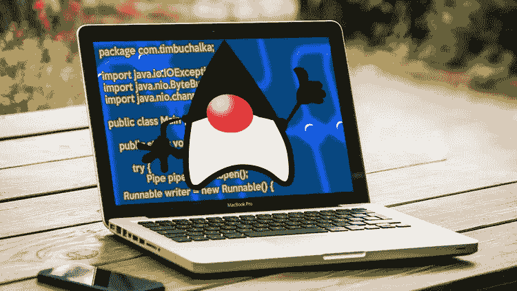
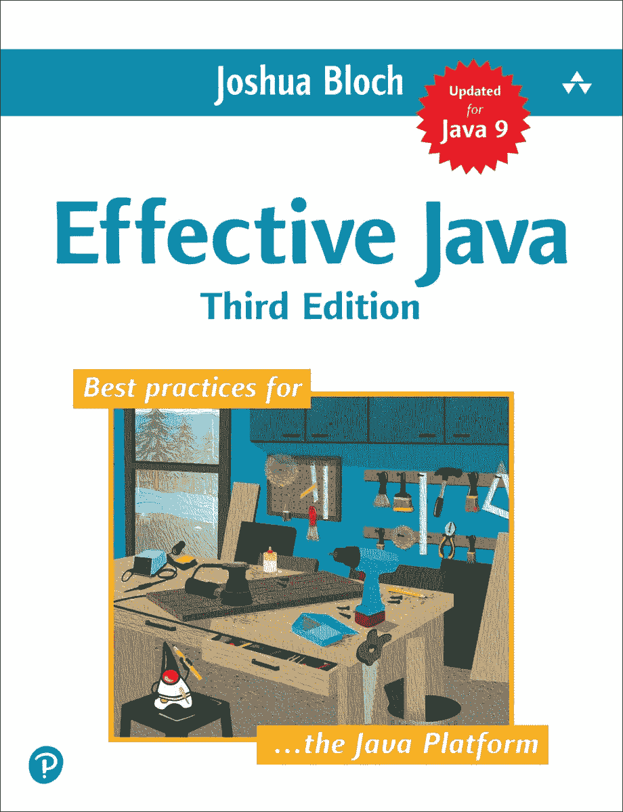

# Joshua Bloch 的《有效的 Java》——Java 开发人员的必读之书

> 原文：<https://medium.com/javarevisited/effective-java-by-joshua-bloch-a-must-read-book-for-java-developers-5292197a279e?source=collection_archive---------0----------------------->

## 想成为更优秀的 Java 程序员？立即阅读有效的 Java。

大家好，如果你学过 Java 编程，那么你可能听说过 **Effective Java** ，这是一本最值得推荐给 Java 程序员的书。

这是我认为每个 Java 开发人员都想读的书之一，因为它不会教你语法，而是教你如何以及何时使用一个特定的特性。

在 Effective Java 第一版和第二版取得巨大成功之后，几年前发布了第三版。经过来自世界各地的 Java 程序员 10 年的漫长等待，可能是这个星球上最受欢迎的 Java 书籍的更新版本终于发布了，我要谈谈这个新版本的有效 Java，我指的是 [**有效 Java 第三版**](https://www.amazon.com/Effective-Java-3rd-Joshua-Bloch/dp/0134685997/?tag=javamysqlanta-20)

并分享我的想法，为什么它是全世界每个 Java 开发人员的必读之书。这个新版本涵盖了 JDK 7、8 和 9 中引入的特性和范例。Joshua Bloch 也做了很好的工作，更新了大部分项目，使它们与新版本相关。除此之外，还有一个全新的章节来解释 Java 8 特性的最佳实践。我知道你不需要任何理由来阅读这本书，因为它非常受欢迎，被广泛接受。*许多使用 Java 的初创公司，尤其是在印度*，也向新的 Java 开发人员分发这本书，通过避免错误和低质量的 Java 代码节省了大量资金。正如我之前告诉你的，我已经在 10 月份预订了这本书，并在几天前收到了我的副本。不过，我已经读完了大部分内容，主要是我的 Kindle 上较新的内容，电子书([Effective Java Kindle Edition](https://www.amazon.com/Effective-Java-3rd-Joshua-Bloch/dp/0134685997/?tag=javamysqlanta-20))自出版以来就可以在 Kindle 上看到。

 [## 有效的 Java

### 有效的 Java [Bloch，Joshua]对 Amazon.com。*符合条件的优惠可享受免费*运输。有效的 Java

www.amazon.com](https://www.amazon.com/Effective-Java-3rd-Joshua-Bloch/dp/0134685997/?tag=javamysqlanta-20) 

我非常喜欢它，尽管我确实了解 Java 8 lambdas、streams，以及它们在多大程度上帮助你用 Java 编写干净的代码，但 Josh 的建议帮助我填补了一些空白。

他关于 Java 9 模块的章节(第 15 项)也很好地介绍了这个 JDK 9 的基本特性，但并没有涵盖所有的内容。如果你想学习 JDK 9 特性，我建议你最好去 Udemy 上看看 Tim Buchalaka 的 [**完整 Java 大师班**](https://click.linksynergy.com/fs-bin/click?id=JVFxdTr9V80&subid=0&offerid=323058.1&type=10&tmpid=14538&RD_PARM1=https%3A%2F%2Fwww.udemy.com%2Fjava-the-complete-java-developer-course%2F) 课程。

 [## 完整的 Java 软件开发人员大师班(针对 Java 17)

### 你刚刚在网上偶然发现了最完整、最深入的 Java 编程课程。拥有超过 480，000 名学生…

udemy.com](https://click.linksynergy.com/fs-bin/click?id=JVFxdTr9V80&subid=0&offerid=323058.1&type=10&tmpid=14538&RD_PARM1=https%3A%2F%2Fwww.udemy.com%2Fjava-the-complete-java-developer-course%2F) 

# 有效 Java 第三版的新特性

正如我告诉你的，这本书的新版本涵盖了 JDK 7，8 和 9 的变化和特点，这就是为什么它也有一些全新的项目。下面是一些来自 [Effective Java 3](https://www.amazon.com/Effective-Java-3rd-Joshua-Bloch/dp/0134685997/?tag=javamysqlanta-20) 的新条目，值得一提:

*   函数接口、lambda 表达式、方法引用和流
*   try-with 资源语句
*   接口中的默认和静态方法
*   类型推断，包括泛型类型的菱形运算符
*   `@SafeVarargs`注解
*   新的库特性，比如可选的接口、java.time 和集合的便利工厂方法
*   Java 9 模块上的第 15 项

在有效的 Java 第二版中，条目的数量也从 70+增加到了 90。如果你读过以前的版本，并且有点着急，我建议你从新的项目开始。

在书的开头有一个漂亮的表格，它会给你一个不错的新条目列表，以及它们涵盖的 Java 7、8 或 9 的特性。

顺便说一句，如果你想知道 Java 10、11、12 和 13 中发布的新特性，那么你也可以查看这个[简短 Java 课程](/javarevisited/top-5-courses-to-learn-new-features-of-java-8-to-java-13-107eb51d2a13)的列表，你可以学习这些特性。

而且，如果你刚刚开始学习 Java，需要一个更全面的资源来从头开始学习 Java，那么我建议你参加 Udemy 上的 [**完整的 Java 大师班**](https://click.linksynergy.com/fs-bin/click?id=JVFxdTr9V80&subid=0&offerid=323058.1&type=10&tmpid=14538&RD_PARM1=https%3A%2F%2Fwww.udemy.com%2Fjava-the-complete-java-developer-course%2F) 课程。它价格实惠，并且是最新的，您可以在每月举行的 Udemy flash 销售活动中以不到 10 美元的价格加入。

# 如何阅读有效的 Java 第三版

这本书最好的部分是，每一项本身就是一整章，这意味着要么你可以从头到尾读完这本书，要么你也可以逐项阅读。

我通常是逐项阅读，而且大多是在上下班途中。我从较新的项目开始，然后查看了第一页上建议的几个项目，它们对应于 JDK 7、8 和 9 中的新功能。

与以前的版本一样，项目按以下主题分组:

1.  创建和销毁对象
2.  所有对象通用的方法
3.  类和接口
4.  [仿制药](https://www.java67.com/2019/07/top-50-java-generics-and-collection-interview-questions.html)
5.  [列举和注释](http://www.java67.com/2012/10/java-enum-concepts-and-fundamentals.html)
6.  [兰姆达斯和溪流](/javarevisited/8-best-lambdas-stream-and-functional-programming-courses-for-java-developers-3d1836a97a1d)(项目 42–48)
7.  方法
8.  通用编程
9.  [异常情况](https://javarevisited.blogspot.com/2013/06/10-java-exception-and-error-interview-questions-answers-programming.html#axzz5zeL8gFVC)
10.  [并发](/javarevisited/8-best-multithreading-and-concurrency-courses-for-experienced-java-developers-8acfd3b25094)
11.  [连载](https://www.java67.com/2020/05/15-java-serialization-interview-questions-answers.html)

[Lambdas 和 Streams](/javarevisited/7-best-java-tutorials-and-books-to-learn-lambda-expression-and-stream-api-and-other-features-3083e6038e14?source=---------14------------------) 是一个新主题，涵盖了使用 Java 8 的 lambda 表达式和流 API 的最佳实践。他还在接口上加入了可选的默认方法，并尝试使用 JDK 7 的资源。

如果你读过《有效的 Java》的[前几版](http://javarevisited.blogspot.sg/2017/06/is-joshua-blochs-effective-java-still-valid-in-the-era-of-java-8.html)，那么你就知道这本书对 Java 程序员来说有多有价值。我总是在办公桌上放一本；它不仅看起来很好，给游客留下深刻印象，还帮助我经常参考它。这对我正确使用 Java 帮助很大。它还帮助我提高了代码质量和代码结构。

正如我告诉你的，你可能不需要任何有效的 Java 第三版的审查来阅读这本书。标题本身就足够开始了，如果你像我一样是一个热情的 Java 程序员，我打赌你现在已经读过了。但是，如果你还没有读过，那么现在就开始读吧，在今年成为一名更好的 Java 程序员。

**进一步学习**
[完整的 Java Masterclass](https://click.linksynergy.com/fs-bin/click?id=JVFxdTr9V80&subid=0&offerid=323058.1&type=10&tmpid=14538&RD_PARM1=https%3A%2F%2Fwww.udemy.com%2Fjava-the-complete-java-developer-course%2F)
[数据结构和算法:深度学习使用 Java](https://click.linksynergy.com/fs-bin/click?id=JVFxdTr9V80&subid=0&offerid=323058.1&type=10&tmpid=14538&RD_PARM1=https%3A%2F%2Fwww.udemy.com%2Fdata-structures-and-algorithms-deep-dive-using-java%2F)
[Java 基础知识:Java 语言](https://pluralsight.pxf.io/c/1193463/424552/7490?u=https%3A%2F%2Fwww.pluralsight.com%2Fcourses%2Fjava-fundamentals-language)

其他 **Java 文章**你可能喜欢探究

*   [2020 年 Java 开发者路线图](https://javarevisited.blogspot.com/2019/10/the-java-developer-roadmap.html#123)
*   [Java 开发人员应该深入学习的 10 件事](http://javarevisited.blogspot.sg/2017/12/10-things-java-programmers-should-learn.html#axzz53JaDYLsP)
*   [深入学习 Spring 框架的 5 门课程](https://javarevisited.blogspot.com/2018/06/top-6-spring-framework-online-courses-Java-programmers.html)
*   Java 和 Web 开发人员应该深入学习的 10 个框架
*   [成为更好的 Java 程序员的 10 个技巧](https://javarevisited.blogspot.com/2018/05/10-tips-to-become-better-java-developer.html#axzz61Tq0rRG1)
*   [20 本你可以深入阅读的 Java 书籍](http://javarevisited.blogspot.sg/2017/12/top-20-java-books-of-2017-which-you-can-read-in-2018.html)
*   [软件开发需要学习的 10 种编程语言](http://www.java67.com/2017/12/10-programming-languages-to-learn-in.html)
*   [Java 并发在实践中还有效吗？](http://javarevisited.blogspot.sg/2016/12/is-java-concurrency-in-practice-still-relevant-in-era-of-java8.html)
*   [每个 Java 程序员都应该学习的 10 个工具](https://www.java67.com/2018/04/10-tools-java-developers-should-learn.html)
*   [跟 Spring Boot 学微服务的 10 门课程](https://dev.to/javinpaul/top-10-courses-to-learn-spring-boot-and-microservices-for-java-programmers-3hjg)

感谢你阅读这篇文章，如果你喜欢这本书，那么请分享给你的朋友和同事。如果您有任何问题或反馈，请留言。

**P. S.** —如果找不到平装版，就不要等了。只需购买 [**有效的 Java 电子书**](https://www.amazon.com/Effective-Java-3rd-Joshua-Bloch/dp/0134685997/?tag=javamysqlanta-20) ，在手机或平板上阅读即可。这本书的格式非常好，你会得到和阅读平装书一样的体验

 [## 有效的 Java

### 有效的 Java [Bloch，Joshua]对 Amazon.com。*符合条件的优惠可享受免费*运输。有效的 Java

www.amazon.com](https://www.amazon.com/Effective-Java-3rd-Joshua-Bloch/dp/0134685997/?tag=javamysqlanta-20)