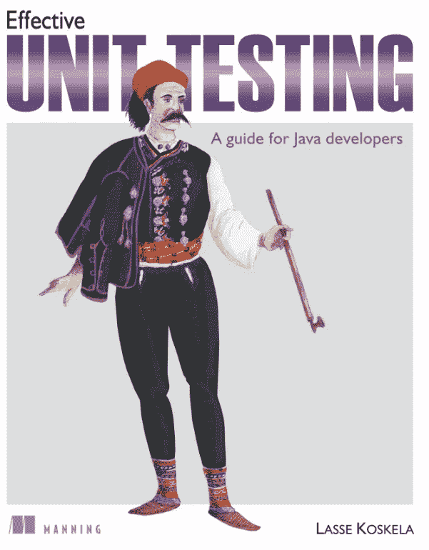
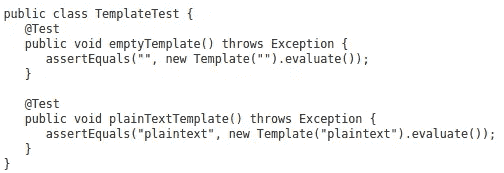

# 有效的单元测试——程序员必读的书

> 原文：<https://medium.com/javarevisited/effective-unit-testing-a-must-read-book-for-programmers-a6da83f0b23b?source=collection_archive---------4----------------------->

# 想了解单元测试的艺术，为什么它如此重要，以及构建优秀的单元测试需要哪些工具？这本书会有所帮助

image_credit —有效单元测试书

T 何**有效单元测试**书并不新。几年前就出版了。我认为这是我职业生涯中非常重要的一本书。在我看来，单元测试是现代软件开发的基石。许多作者和软件界有影响力的大人物总是承认单元测试的重要性。我不久前读了这本书，我想做一点回顾，并解释为什么我认为这是一本对所有级别的程序员都很重要的书。

> 直到你开始工作并调试一个大型的未经测试的遗留代码库，你才会意识到单元测试的重要性。[单元测试](https://javarevisited.blogspot.com/2014/08/top-5-books-to-learn-unit-testing-junit-tdd-Java-programmers.html)是一个非常棒的工具，它可以帮助程序员降低遇到错误的风险，并且通过提高整体生产率和所写代码的质量来获得回报。

这本书将告诉你对你写的代码进行测试的巨大重要性。你还会学到很多时候被忽视的东西，那就是不仅要编写好的单元测试，还要以一种可读的方式编写它们，更重要的是可维护的。

> 这是一本美丽、简洁、解释清楚的书，不会让你无动于衷。

在我的职业生涯中，我见过非常难以理解和测试的代码库。我从这本书中学到的许多工具和技术都帮助了我。你曾经处理过间歇性/不稳定的测试吗？你曾经不得不模拟一个反应缓慢的系统吗？或者你有没有想过你看的代码真的很难测试？通过学习 [**有效单元测试**](https://javarevisited.blogspot.com/2014/08/top-5-books-to-learn-unit-testing-junit-tdd-Java-programmers.html) **，你将能够回答这些问题。**

这本书里我最喜欢的一章是第四章。在单元测试中，它完全致力于可读性。你不会相信有多少程序员不知道如何编写可读的单元测试。不仅仅是结构和被测试的是什么，还包括它是如何被表达重构的，以及如何利用测试结构来提高可读性。

这本书的所有章节都很好，但我特别喜欢第四章和第五章。第五章对可维护性主题的深入探究是任何 java 程序员的必读之作。

来源:有效单元测试第 5 章

你能发现上面两个测试的质量不足吗？他们确实有不同的重复。重构不仅适用于生产代码，也适用于测试代码。学习维护你的测试是很重要的，因为你添加到你的代码库的特性越多，维护性的主题就越重要。

> 写得不好的单元测试会花费你几个小时的工作，仅仅是为了给你的软件增加新的琐碎的功能。精心制作的单元测试和精心制作的产品代码一样重要。

这本书可能是同类书中的一本。你会发现许多伟大的书籍都在谈论单元测试，但是他们中的大部分都把单元测试作为小菜**来谈论，它总是在重构或者干净编码或者 TDD 的背景下。这很好，但是**有效的单元测试**非常关注质量的各个方面，并且深入单元测试的细节，这使得它成为每个程序员书架上的一本好书。**

曼宁是一篇伟大的社论，在我看来，这本书的定价非常适中。它很容易阅读，例子非常清楚和深刻。这是一本简短的书，因为它包含了大量的细节，你从书中学到的东西几乎可以立即应用到你的日常工作中。当我几年前读这本书时，我记得我总是带着它去工作，并把它作为参考，因为它上面有很多我日常使用的有用的东西。

你读过有效的单元测试吗？你觉得怎么样？请在评论区告诉我你的想法。