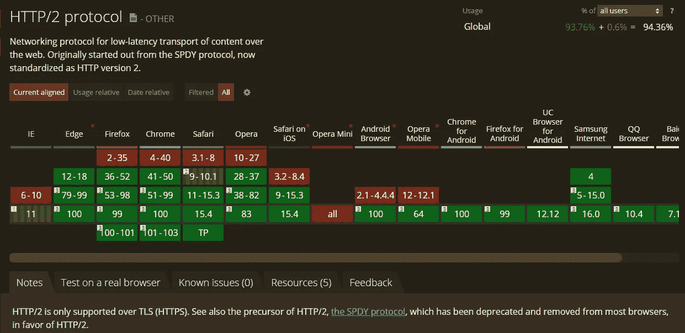
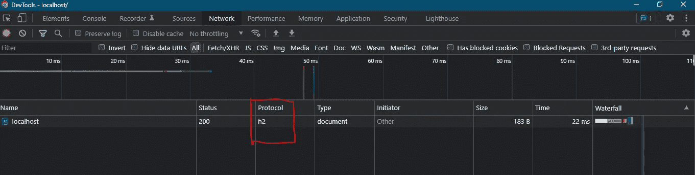

# 在 Apache 服务器上启用 HTTP/2 和 HTTPS

> 原文：<https://medium.com/javarevisited/enable-http-2-and-https-on-apache-server-d963b43aa6d?source=collection_archive---------4----------------------->

## 我们将讨论使 Apache 服务器能够通过 HTTP/2 提供资源所需的配置。我们还在 Apache 服务器上启用了 HTTPS，因为浏览器只支持通过加密连接(SSL/TLS)的 HTTP/2。


图片来源: [HTTP/2 —大卫·阿塔尔德](https://css-tricks.com/http2-real-world-performance-test-analysis/)的真实性能测试和分析

HTTP/2 是 HTTP 协议的第二个版本，是为了解决 HTTP/1.1 的缺点而发布的。HTTP/2 版本已经过优化，使网站加载速度明显加快。

而在本文中，我们主要关注如何设置 Apache 服务器来使用 HTTP/2。在靠近末尾的**参考**部分有一些链接，帮助你理解 HTTP/2 和 HTTP/1.1 之间的技术差异，以及它如何解决 HTTP/1.1 的缺点。

默认情况下，Apache 被设置为使用 HTTP/1.1，但是加载了 HTTP/2 支持。但是在我们开始配置之前，让我们先来看看支持 HTTP/2 的浏览器。

# 浏览器支持

几乎所有现代浏览器都支持 HTTP/2。如果托管网站的服务器也支持 HTTP/2，则可以利用 HTTP/2 的优势。如果浏览器或 web 服务器不支持 HTTP/2，它将退回到使用 HTTP/1.1。

[](https://javarevisited.blogspot.com/2016/05/what-are-idempotent-and-safe-methods-of-HTTP-and-REST.html)

来源:[我能用](https://caniuse.com/?search=HTTP2)吗

# 启用 SSL 作为先决条件

但是，只有加密连接才支持 HTTP/2。该网站必须通过安全的 SSL/TLS 连接提供服务，并在浏览器中作为`https://`访问。因此，在使用 HTTP/2 之前，服务器应该启用 [SSL/TLS](https://javarevisited.blogspot.com/2022/02/top-5-courses-to-learn-ssl-and-tls-in.html) 。

启用 SSL 需要安全证书。出于本文的目的，我们将使用自签名证书，但是在生产中，您将使用由可信证书颁发机构(CA)颁发和签名的有效证书。

为了创建[自签名证书](https://www.java67.com/2012/09/keytool-command-examples-java-add-view-certificate-ssl.html)，我们将使用 OpenSSL 工具。在 unix shell 中运行以下命令(对于 Windows，您可以使用作为 Git 安装的一部分提供的`git-bash.exe`，它包括 OpenSSL 工具或 [CYGWIN 工具](https://www.ssl.com/how-to/install-openssl-on-windows-with-cygwin/)来模拟 unix 命令。另外， [Cmder](https://cmder.net/) 是传统 Windows CMD 提示符的一个很好的替代选项，它允许您在运行 Windows shell 的同时运行 unix shell。

```
openssl req -x509 -nodes -days 365 -newkey rsa:2048 -keyout <location>/certs/server.key -out <location>/certs/server.crt
```

`<location>`这里是在`httpd.conf`文件中配置的 apache 服务器的根目录`${SRVROOT}`。

执行`openssl`命令会提示你输入一些细节，适当地填充它们。理想情况下,`Common Name (e.g. server FQDN or YOUR name)`是您访问网页时使用的域名/IP，但出于开发目的，您可以将其保留为`localhost`

```
Country Name (2 letter code) [AU]:**CN**
State or Province Name (full name) [Some-State]:**Some State**
Locality Name (eg, city) []:**Some City**
Organization Name (eg, company) [Internet Widgits Pty Ltd]: **Some Org**
Organizational Unit Name (eg, section) []: **Some OU**
Common Name (e.g. server FQDN or YOUR name) []:**localhost**
Email Address []:**example@example.org**
```

这将在`<location>/certs`目录中创建`server.key`和`server.crt`文件。

在`httpd.conf`文件中，取消下面 3 行的注释，

```
LoadModule ssl_module modules/mod_ssl.so
LoadModule socache_shmcb_module modules/mod_socache_shmcb.so
Include conf/extra/httpd-ssl.conf
```

在`conf/extra/httpd-ssl.conf`文件中，您会发现已经在`<VirtualHost>`中映射的证书，它使用我们在上面的步骤中创建的相同文件`server.key`和`server.crt`。

```
SSLCertificateFile "${SRVROOT}/conf/server.crt"
SSLCertificateKeyFile "${SRVROOT}/conf/server.key"
SSLEngine on
```

重启服务器，在浏览器中打开 [https://localhost:443](https://localhost/) 。检查链接是否有效，默认页面是否可访问。您将看到一个访问页面的安全错误，但这没关系，因为我们使用自签名证书。在`conf/extra/httpd-ssl.conf`中配置的默认 SSL 端口是 443。

**注意**:虽然通过 HTTPS 访问，但是请求直到此时仍然使用 HTTP/1.1

# 启用 HTTP/2

要启用 HTTP/2，在`httpd.conf`中取消对下面一行的注释

```
LoadModule http2_module modules/mod_http2.so
```

在`conf/extra/httpd-ssl.conf`中，在接近结尾和结尾`</VirtualHost>`之前添加下面一行

```
Protocols h2 h2c http/1.1
```

现在，启用 HTTP/2 的配置已经完成，重新启动服务器并验证 HTTP 请求使用 HTTP/2。

*   使用`[curl](https://javarevisited.blogspot.com/2017/03/10-examples-of-curl-command-in-unix-and-Linux.html)`命令应输出以下内容

```
$ curl -Iks --http2 [https://localhost:443](https://localhost:443)
**HTTP/2** 200
last-modified: Mon, 11 Jun 2007 18:53:14 GMT
etag: "2e-432a5e4a73a80"
accept-ranges: bytes
content-length: 46
content-type: text/html
date: Thu, 14 Apr 2022 22:02:56 GMT
server: Apache/2.4.53 (Win64) OpenSSL/1.1.1n
```

*   确认可以使用的 HTTP 变体

```
$  curl -vso /dev/null --http2 [https://localhost:443](https://localhost:443)
*   Trying 127.0.0.1:443...
* Connected to localhost (127.0.0.1) port 443 (#0)
* ALPN, offering **h2**
* ALPN, offering **http/1.1**
```

*   此外，您还可以检查浏览器的开发人员工具，以确认在访问位于 [https://localhost:443](https://localhost/) 的网站时使用 HTTP/2 作为协议。下图是使用 Chrome 开发者工具

[](http://www.java67.com/2017/10/how-to-test-restful-web-services-using.html)

如何在 Chrome 开发工具中看到协议:[https://stackoverflow.com/a/54164719](https://stackoverflow.com/a/54164719)

# 参考

*   [创建 SSL 证书](https://www.digitalocean.com/community/tutorials/how-to-create-an-ssl-certificate-on-apache-for-centos-7#step-2-creating-a-new-certificate)
*   [在 Apache 上配置 SSL](https://www.digitalocean.com/community/tutorials/how-to-create-an-ssl-certificate-on-apache-for-centos-7#step-3-setting-up-the-certificate)
*   [在 Apache 上启用 HTTP/2](/tech-learnings/how-to-configure-apache-reverse-proxy-with-http-2-ebc87c1c7bcb)
*   [HTTP/1.1 vs HTTP/2:有什么区别？](https://www.digitalocean.com/community/tutorials/http-1-1-vs-http-2-what-s-the-difference)
*   [什么是 HTTP2？](https://www.collectiveray.com/what-is-http2)