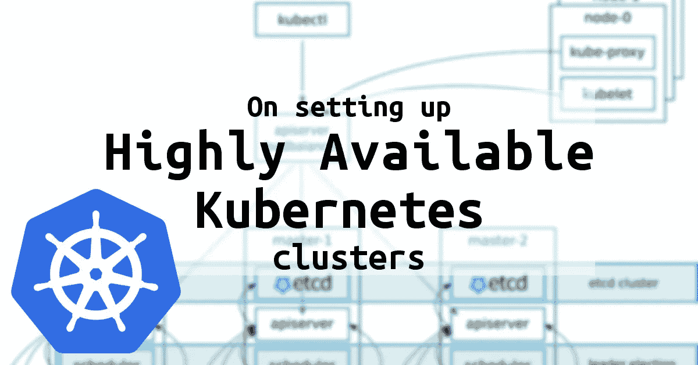

# 在基于 Kubernetes 的部署中实现高可用性

> 原文：<https://medium.com/javarevisited/enabling-ha-in-kubernetes-based-deployments-ef2cf9c49676?source=collection_archive---------2----------------------->

部署在云中的任何应用程序的一个常见要求是支持高可用性(HA ),因此，如果在一个区域或数据中心运行应用程序的容器出现故障，不会影响最终用户，因为请求将由在其他区域/数据中心运行的容器提供

这可以在 [kubernetes](/javarevisited/7-free-online-courses-to-learn-kubernetes-in-2020-3b8a68ec7abc) 中通过设置“ **podAntiAffinity** ”规则来调度 pods