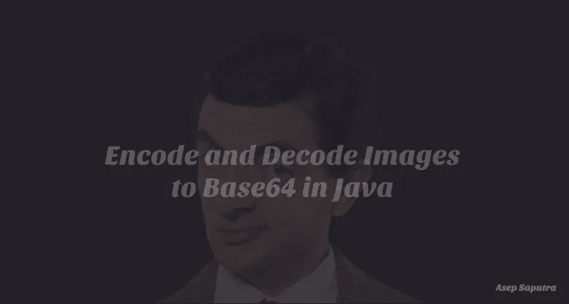

# 在 Java 中将图像编码和解码为 Base64

> 原文：<https://medium.com/javarevisited/encode-and-decode-images-to-base64-in-java-c0b1cd3055b8?source=collection_archive---------1----------------------->

## 需要用 Java 把图像编码解码到 base64？如果是这样，你会看到完整的步骤。

## 介绍

如文章标题所附，这里我将试着向你展示如何用 Java 编码和解码图像到 Base64。但首先我建议你先阅读一下基本编码…