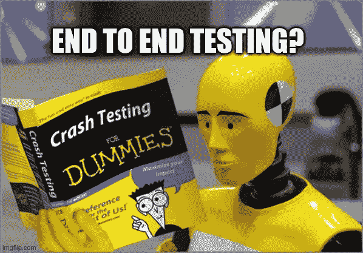
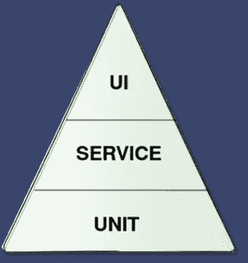
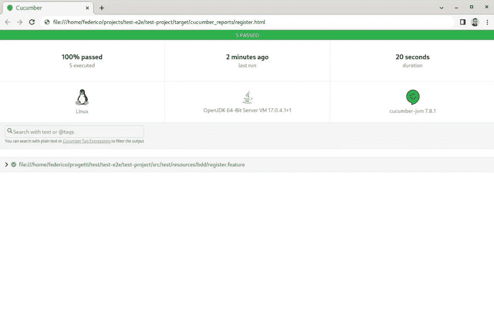
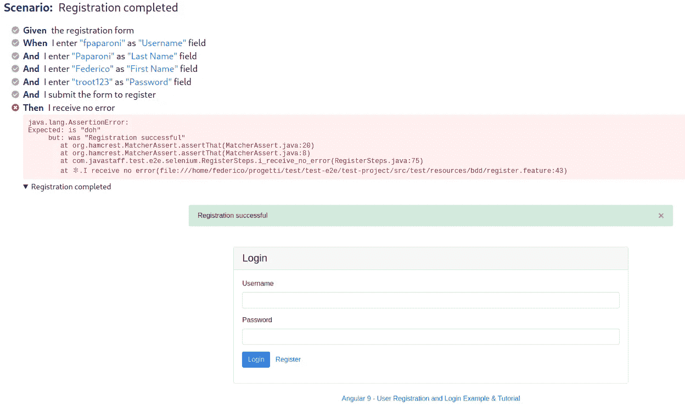

# 黄瓜、剧作家和硒的端到端测试

> 原文：<https://medium.com/javarevisited/end-to-end-testing-with-cucumber-playwright-and-selenium-928af278e789?source=collection_archive---------3----------------------->

对于应用程序来说，有几种有用的测试，但是当然，端到端测试( **e2e** )是最重要的。

如果我们看一看[迈克·科恩的概念](https://www.mountaingoatsoftware.com/blog/the-forgotten-layer-of-the-test-automation-pyramid)，被称为**测试金字塔**，很明显，e2e 测试是我们可以为我们的应用程序产生的最高级别的测试形式，考虑到软件是一个黑匣子，我们的主要关注点与行为和功能有关。

当引入新功能/开发时，我们的系统必须如何工作的知识以及以“自动方式”注册和检查它的可能性可能是有用的，我们希望确保避免回归问题。除此之外，如果我们想要模拟一个负载测试，自动化测试也会很有用。

一种有趣的方法是定义应用程序行为，描述用户和浏览器之间的交互。我们可以使用许多框架和库来进行这些测试，而带有**小黄瓜**语法的 **BDD** ，[就像这里看到的](/javarevisited/cucumber-testcontainer-a-bdd-perfect-match-956cf62cdf47)一样，是描述功能的一个很好的解决方案。

# 小黄瓜和范例项目

假设我们的系统有一个前端 **Angular** 应用程序，它可以从几个后端端点调用服务(我们不关心这个)。我们将使用来自[本文](https://jasonwatmore.com/post/2020/04/28/angular-9-user-registration-and-login-example-tutorial)的一个示例登录/注册项目，它可以在[Github 资源库](https://github.com/fpaparoni/test-e2e)中找到，其中包含与本文相关的所有源代码。

我们想描述一些与用户注册功能相关的场景

描述这种场景所需的小黄瓜语法非常简单，您可以从下一个特性文件中找到，在这里我们创建了 4 个注册失败的场景和 1 个一切正常的场景

# 硒&黄瓜测试实施

正如我们所说，有很多工具可以创建 e2e 测试，在本文中，我们将使用 [Selenium](https://www.selenium.dev/) 和[cumber](https://cucumber.io/)。诞生于 2004 年的开源项目 [**Selenium**](/javarevisited/my-favorite-free-courses-to-learn-selenium-web-drive-for-automation-testing-2f248c8fe6aa) ，如今通常被认为是端到端 web 测试事实上的标准框架。

我们可以找到许多与 Selenium 相关的项目和扩展，尽管它年代久远，但它仍然是一个非常有用和完整的工具。

我们的测试项目将使用 [Selenium](/javarevisited/top-7-courses-to-learn-selenium-for-java-and-c-developers-to-learn-automation-testing-free-and-e91637cd9622?source=---------19------------------) 来驱动浏览器，遵循使用 Gherkin 描述并由[cumber](/javarevisited/top-7-courses-to-learn-selenium-for-java-and-c-developers-to-learn-automation-testing-free-and-e91637cd9622?source=---------19------------------)执行的场景。让我们给 pom.xml 添加一些 **Maven** 依赖项

先前定义的小黄瓜场景将保存在一个特征文件中，Cucumber 使用它来驱动测试的执行。

现在我们可以设置 Selenium 引擎，使用一个简单的实用程序类创建一个 **WebDriver** 类实例。如果我们想选择一个特定的浏览器，我们必须将它的驱动程序下载到我们的环境中。在下面的列表中，您可以找到这个项目中使用的浏览器以及您必须设置的相关 env 属性(也可以在启动最终测试程序时从命令行设置)

*   **Chrome**:[Chrome driver](http://chromedriver.chromium.org)(web driver . Chrome . driver = path/to/the/driver)
*   **火狐**:[GeckoDriver](https://github.com/mozilla/geckodriver/releases)(web driver . gecko . driver = path/to/the/driver)

使用**测试浏览器**环境变量你可以选择使用哪个浏览器，默认选择将是 Chrome

在注释之后添加 [**JUnit** **我们可以选择在单个测试执行结束时要做的事情。如果我们的场景失败了，我们使用 Selenium 从浏览器中保存一个截图，这样我们可以稍后进行调查。**](https://javarevisited.blogspot.com/2021/04/junit-interview-questions-with-answers.html#axzz6w2HbPhVo)

我们实现的最后一步是使用 Selenium API 来描述与前端应用程序的交互。你可以从头开始写，也可以使用浏览器插件 [**Selenium IDE**](https://www.selenium.dev/selenium-ide/) 。

我最喜欢的方法是使用 Selenium IDE 创建一个草案版本，然后我可以重构它

如您所见，我们的测试实现试图复制用户与浏览器的交互。例如，当我想确认注册时，我会检查页面上的文本“注册成功”。

# 剧作家&黄瓜测试实现

使用相同的特征文件我们可以使用另一个有趣的工具: [**剧作家**](https://playwright.dev/) 。

这是一个**微软**开源项目，提供了一个完整的 API 来创建端到端测试。这个项目有多个绑定，这里我们将使用 [Java 实现](https://github.com/microsoft/playwright-java)。

与 [Selenium](https://javarevisited.blogspot.com/2020/08/top-5-courses-to-learn-selenium-for.html#axzz6oau61e3Q) 相比，它是一个更新的项目，具有有趣的特性，并且可能与现代 web 应用程序更加“兼容”,但是我们必须在一些实际实现中使用它来评估这个项目的成熟度。

让我们将依赖项添加到 pom.xml 中

测试用例实现将遵循我们用于 Selenium 的相同“模式”。所以我们必须定义一个测试类来匹配黄瓜和剧作家

还有 Setup 类的定义，在这里我们选择浏览器并设置一些参数

剧作家没有浏览器驱动程序安装作为先决条件，因为如果它不可用，剧作家将在第一次测试执行时自动下载它。

除此之外，我们还有一个非常有趣的特性(Selenium 中没有):**视频**注册我们的测试。

最后，我们必须使用剧作家 API 来实现测试用例(与 Selenium 相比，它看起来有点可读性，但这是个人观点)

我们现在可以使用剧作家特性来记录视频，从而管理失败的测试执行。如果场景失败，我们可以将这个 **WebM** 视频添加到 Cucumber 报告中

# 让我们开始测试

我们必须开始角度应用。您可以进入**angular-9-registration-log in-example**文件夹，使用以下命令创建一个[T21Docker](/javarevisited/5-best-docker-courses-for-java-and-spring-boot-developers-bbf01c5e6542)图像

`docker build --no-cache -t bddfe .`

然后你就可以开始了

`docker run -p 80:80 -t bddfe`

如果你将浏览器指向 [http://localhost](http://localhost) ，你应该会看到应用程序正在运行。现在您可以启动测试了(记得在您的 env 中定义 **webdriver.gecko.driver** 或 **webdriver.chrome.driver** ，否则您必须只为 Selenium 传递这个附加参数)

`mvn install`

您将在您的计算机上看到一些"*浏览器窗口在跳舞*，在执行测试之后，您可以使用**cumber**报告来控制结果，该报告位于**target/cumber _ reports/**文件夹中

我们使用了两个不同的端到端测试引擎(Selenium 和剧作家)和相同的特性文件，所以我们将有两个不同的 cumber 报告。

如果我们想模拟一个错误，我们可以将字符串“注册成功”上的复选标记改为“doh”以再次启动测试。在 Selenium 报告中，我们将看到一个截图

在《剧作家》中，我们会有一个关于我们问题的视频

# 结论

本文中使用的测试项目实现展示了使用一个库来描述端到端测试(Cucumber)和其他工具来使用一个真实的浏览器驱动程序模拟这些测试(Selenium 和剧作家)的可能性。

这些库还提供了不同的语言实现，所以你也可以使用 [Typescript](/javarevisited/top-10-free-typescript-courses-to-learn-online-best-of-lot-44bce9da41d1) 、 [Python](/javarevisited/7-best-python-online-courses-for-beginners-to-learn-programming-abe12cecb1ad) 或 [C#](/javarevisited/5-best-c-c-sharp-programming-courses-for-beginners-in-2020-494f7afc7a5c) 来重新创建这个混搭。

在这个[仓库](https://github.com/fpaparoni/test-e2e)中，您可以找到与本文相关的源代码。