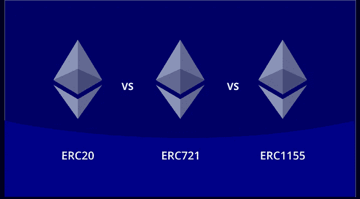

# ERC20 vs ERC721 vs ERC 1155

> 原文：<https://medium.com/javarevisited/erc20-vs-erc721-vs-erc-1155-77d13dad97e8?source=collection_archive---------1----------------------->

以太坊是一个开源的、去中心化的区块链，具有 EVM 兼容性和智能合约功能，允许任何人在其生态系统上构建和运行去中心化的应用程序。[以太坊](https://javarevisited.blogspot.com/2021/11/top-5-courses-to-learn-ethereum-for.html)以其丰富的生态系统和支持各种代币(如可替代代币、半可替代代币和[不可替代代币](https://javarevisited.blogspot.com/2021/12/top-5-courses-to-learn-about-nfts-non.html) (NFTs)的能力，进一步赋能全球贸易和金融行业。

在以太坊上，代币可以代表虚拟货币(持有真实世界的价值)、数字物品、彩票、美元等法定货币，甚至是集成在[以太坊区块链](https://www.java67.com/2021/12/top-5-courses-to-learn-blockchain.html)上用于各种目的的公司股份。一个健壮的标准必须支持以太坊令牌如此强大的功能，这就是为什么 [ERC 令牌标准](https://www.leewayhertz.com/erc-20-vs-erc-721-vs-erc-1155/)被开发出来的原因。

以太坊社区见证了变革的需要，推出了新的令牌标准，以帮助企业在以太坊生态系统中简化业务运营。在本指南中，我们将讨论三个主要的令牌标准——ERC 20 vs ERC 721 vs ERC 1155。

# ERC 令牌标准是什么？

ERC 代表以太币标准。这些标准展示了每个以太坊令牌必须遵守的某些规则，这些是适用于每个试图在以太坊生态系统中创建令牌的人的技术指南。

ERC-21、ERC-721 和 ERC-1155 是三种流行的 ERC 令牌标准，大多数行业都利用它们来创建令牌。在某种程度上，ERC 标准定义了智能合约标准，用于编写管理以太坊上令牌活动的智能合约。

以太坊提供了更加完善的基础设施，以支持创新用例，通过每一个新的 ERC 标准实现更高的增长。
注意，企业也可以在以太坊上创建不遵守任何令牌标准的令牌。尽管如此，这些令牌缺乏与以太坊重要组件的兼容性，如 DeFi exchange 和去中心化钱包。

# ERC20 vs ERC721 vs ERC 1155:解说

从 ERC-20 到 ERC-3475，ERC 代币的演变一直是保持以太坊高势头的巨大努力，并通过许多新颖的用例使其成为更主流的区块链。让我们集中讨论三种主要的令牌标准——ERC 20 vs ERC 721 vs ERC 1155。

# ERC 20:可替换的代币

ERC-20 代币是区块链[以太坊](https://www.leewayhertz.com/ethereum/app-consulting/)推出的第一个代币标准，用于创建可替换的代币。每个 ERC20 令牌都可以互换。例如，可替代代币代表的资产的价值可以被等价的东西替代，如法定货币、一盎司和 ico。

*   实际上，ERC-20 令牌可以代表以下数字资产:
*   在线竞赛或计划的门票。
*   现实世界中的金融资产，如公司股票、股息等。
*   信誉分来自网络游戏。
*   其他可兑换积分。

XRC-20 代币是以太坊的解决方案，用于简化代币集成及其监管的流程。这个令牌标准进一步帮助开发人员创建一个智能契约来令牌化任何“可替换”的资产。最终，智能合约规范了一个建立在以太坊上的去中心化应用。

# ERC-721:不可替换的令牌

使用[不可替代代币或 NFT](https://www.coursesrank.com/2022/02/10-best-courses-to-learn-nft-in-2022.html)越来越受欢迎。从标记数字内容到现实世界的资产，NFT 为人们带来了许多好处。

在以太坊上，代表独一无二的数字资产的令牌必须符合 ERC-721 令牌标准。一个广为人知的 NFT——Cryptokitties，是在[以太坊区块链](https://javarevisited.blogspot.com/2022/01/5-best-blockchain-certifications-and.html)建造的。

为了容易理解 ERC-721 的作用，参考下面的陈述:

ERC-20 对发现新的[加密货币](https://www.coursesrank.com/2022/03/top-10-courses-to-learn-trade.html)很重要。同样，ERC-721 对于创建新的、有趣的表示不可变所有权证明的 NFT 是必不可少的。让我们了解一下 ERC-721 能代表什么:

*   独一无二的数字内容。
*   社交媒体内容，包括视频、推文和图片。
*   游戏资产和收藏品。
*   游戏角色。

NFTs 的用途非常广泛，每一项新技术都利用 NFTs 或 NFT 技术在虚拟商业世界中发现惊人的可能性。由于以太坊允许创建 NFT，NFT 集成过程的快速增长开始给这个[区块链](/javarevisited/best-blockchain-courses-and-certification-in-2020-63729f8f04d0)带来挑战，比如可追溯性和所有权问题。

ERC-721 令牌标准解决了所有这些挑战，用户向某人提供独特数字资产的所有权，可通过以太坊的公共账本进行跟踪。

# ERC-1155:多标准令牌

ERC-1155 是一种多令牌标准，结合了 ERC-20 和 ERC-721 令牌标准的属性。它可以更好地解释为各种以太坊令牌的通用令牌智能合约接口:可替代、半可替代和[不可替代令牌](https://www.java67.com/2020/07/top-5-websites-to-learn-blockchain-in.html)。

愿意创建和发行多个令牌的企业可以利用 ERC-1155。它消除了为每个令牌标准(即 ERC-20、ERC-721 或更多)编写单独智能合同的麻烦，并帮助他们无缝管理所有令牌。

**ERC-1155 令牌可以表示以下内容:**

*   密码。
*   NFTs。
*   可兑现的购物券
*   ICOs 等。

# 结论

[ERC-21、ERC-721 和 ERC-1155](https://www.leewayhertz.com/erc-20-vs-erc-721-vs-erc-1155/) 是目前流行的令牌标准。然而，以太坊定义了一个路线图来引入新的令牌标准，以保持令牌的变化。例如，ERC-3475 是令牌标准列表中的最新成员，它支持创建令牌来管理可赎回债券，也称为可赎回债券。同样，新的和改进的令牌标准将帮助企业启动更多成功的[区块链](https://www.leewayhertz.com/blockchain-development-company/)项目。