# 评估 Python 中的逻辑回归

> 原文：<https://medium.com/javarevisited/evaluating-the-logistic-regression-ae2decf42d61?source=collection_archive---------0----------------------->

## 所有你需要知道的关于逻辑回归的通用评估指标和 Python 中的代码示例。完整的代码是[这里是](https://github.com/vicky-playground/Sunnybrook/blob/main/HitPain.py)。

逻辑回归是线性回归的一种变体。它为具有两种可能结果的**分类问题**的概率建模——即，成功/是/真/1 的概率 *p* 和失败/否/假/零的概率 *q (1-p)* 。因此，输出符合如下 pic 所示的伯努利分布。因变量介于 0 和 1 之间。

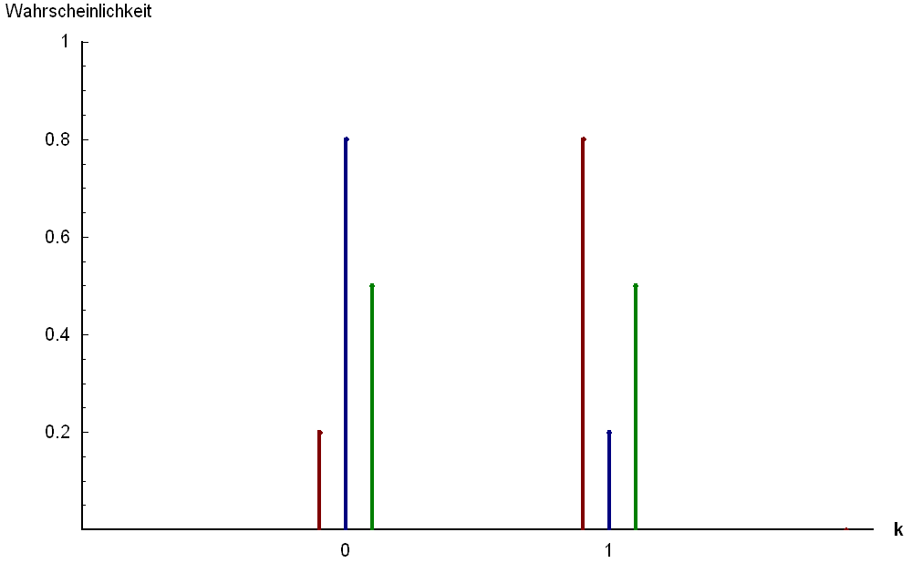

来自维基百科的伯努利分布

# 逻辑回归的用例

#1:欺诈检测

#2:医疗诊断

#3:流失预测

# 逻辑回归的假设

## #1:响应变量是二进制的

如女性或男性，赢或输，成功或失败，恶性或良性。

## #2:控制变量是独立的，不相关

多重共线性将导致**过度拟合**，其中**模型**可能在已知的训练集上有良好的性能，但在未知的测试集上将会失败。在运行模型时，我们应该确保不存在多重共线性。也就是说，**我们可以舍弃高度相关的变量，以免违背这个假设。**

**要检查多重共线性，**我们可以使用方差膨胀因子( **VIF** )，它测量回归模型中预测变量之间的相关性。VIF 值等于或小于 5 表示没有多重共线性；VIF 表示高度相关。查看这个 [Python 教程](https://www.geeksforgeeks.org/detecting-multicollinearity-with-vif-python/)来实现 VIF 价值观。

## #3:没有极端异常值

评估轮廓最常见的方法之一是计算库克距离。关于库克距离理论的深入解释可以在[这里](https://ethanweed.github.io/pythonbook/05.04-regression.html)找到。如果确实存在异常值，我们可以选择(1)消除它们，(2)用平均值或中值等值替换它们，或者(3)将它们保留在模型中，但在回归结果中报告它们。

## #4:适度大样本量

作为一个经验法则，我们应该有一个最小样本量[*n*= 100+50*I*](https://www.ncbi.nlm.nih.gov/pmc/articles/PMC6422534/#:~:text=In%20conclusion%2C%20for%20observational%20studies,parameters%20in%20the%20targeted%20population.)其中 *i* 是指最终模型中自变量的数量。

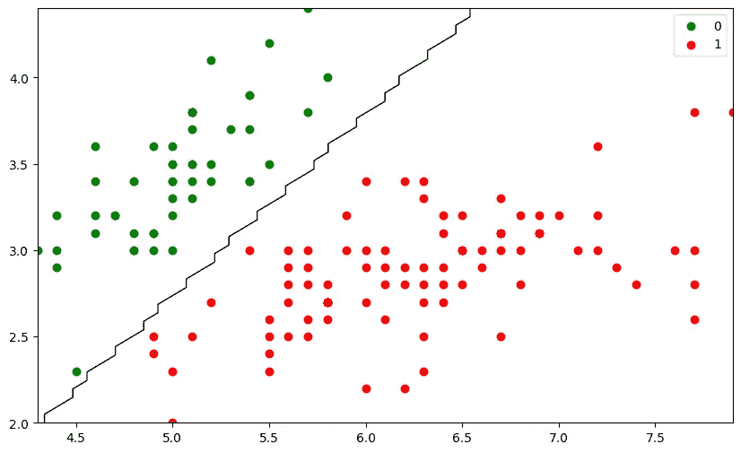

分类问题

# 培训和测试数据

在机器学习中，数据集分为两组:训练数据和测试数据。第一个子集称为**训练数据—** 这是输入机器学习以训练(构建)模型的实际数据集。另一个子集被称为**测试数据** —它用以前看不到的数据测试模型的准确性。

# 分层抽样

**当存在严重的类别不平衡时，进行标准的随机训练/测试分割是有风险的。**这是因为您可能最终得到具有非常不同的类分布的训练集和测试集，因此您的测试集中可能几乎没有阳性结果。在这种情况下，通常选择**分层抽样**以**确保样本数据与原始数据具有相同的各目标类百分比。**

代码示例:


# 评估二元分类模型的通用性能指标

这些性能指标包括**混淆矩阵、准确度、精密度、灵敏度** ( **召回)、特异性和 F1 分数**。Python 文档可以参考[这里的](https://scikit-learn.org/stable/modules/classes.html#module-sklearn.metrics)。一般来说，**任何大于 70%** 的精度都可以被认为是一个很好的模型性能。

1。 **混淆矩阵**:真/假和正/负预测率的表格汇总。它允许您计算各种**性能指标。**

代码示例:

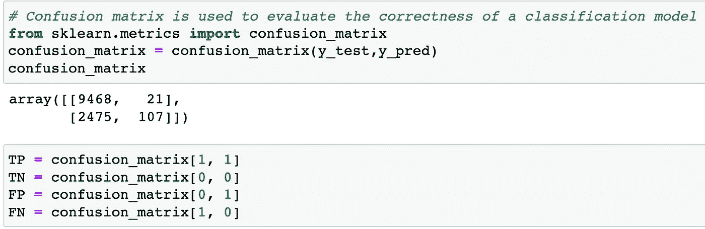

2。 **准确度分数**:测量所有预测结果中正确预测的比例。

```
**Accuracy = Number of correct predictions/Number of predictions**Note: 
False Positives = **Type I Error** 
False Negatives = **Type II Error**
```

与不平衡数据集相反，它仅适用于分类中类的平均分布，因为错误预测的百分比可能较低，但同时，该模型在类的比例较低时表现不佳。因此，应用不平衡数据和需要正确预测少数类的情况是不实际的。这就是为什么在电子商务、信用卡欺诈检测和癌症预测等情况下，它可能会产生误导。

代码示例:

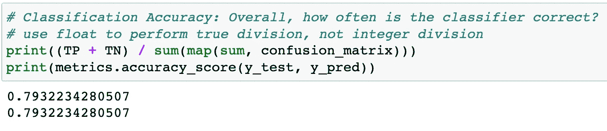

3。 **精度**:测量**正面预测**实际为正面的比例。

```
**Precision = Number of true positives/(Number of true positives *+* Number of *false positives*).**
```

当类别非常不平衡，并且在没有任何假阳性的情况下识别所有阳性示例非常经济高效时，精度分数对于**成功预测尤其有用。**

使用回忆分数的真实场景👉在信用卡欺诈检测问题中，分类模型使用精度分数来监控模型性能，以降低误报率。

代码示例:

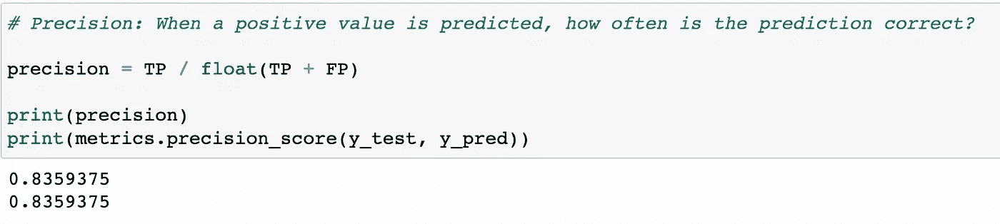

4。 **灵敏度** ( **召回)**:表示模型在**实际阳性**中正确预测阳性的能力。回忆分数越高，机器学习模型在**识别阳性越好。**

```
**Recall = Number of true positives / (Number of true positives + Number of *false negatives*).**
```

使用回忆分数的真实场景👉在医学诊断中，任何不能解释假阴性的事情都是严重的，因此在这种情况下， **recall** score 是比 precision 更好的衡量标准。另一方面，垃圾邮件过滤器不太关心假阴性，所以这里的**精度**更好。

代码示例:

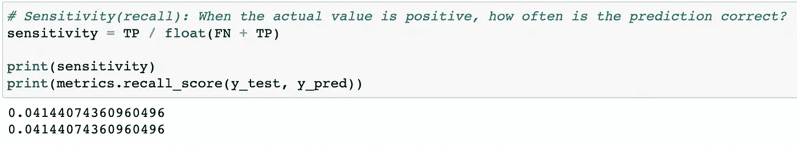

5。 **特异性**:代表模型从**实际否定**中正确预测否定的能力。特异性得分越高，机器学习模型在**识别否定时就越好。**

代码示例:

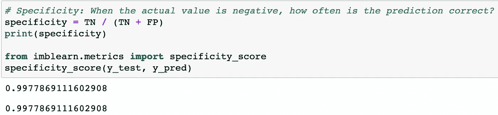

> 它经常被比作灵敏度，因为灵敏度和特异性成反比:**灵敏度越高，特异性越低，反之亦然。换句话说，不可能同时优化这两个指标。一般来说，**当你想最大化正确阳性的预测时，灵敏度比特异性更重要。**另一方面，**当你想最小化错误否定的预测时，特异性比敏感性更重要。****
> 
> 需要注意的一点是 [**阈值化**](https://analyticsindiamag.com/beginners-guide-to-understanding-roc-curve-how-to-find-the-perfect-probability-threshold/) 可以同时影响灵敏度和特异性。这意味着改变阴性预测和阳性预测的分界点会影响灵敏度和特异性。
> 
> 代码示例:

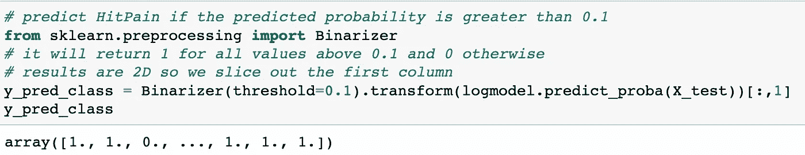

降低正面预测的阈值

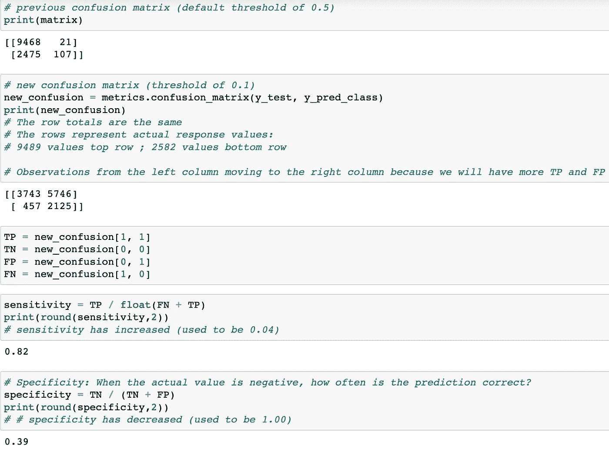

6。**F-score(F1-score)**:**结合模型的精度和召回率**，是精度和召回率的**调和平均值**。当数据不平衡时经常使用**。**

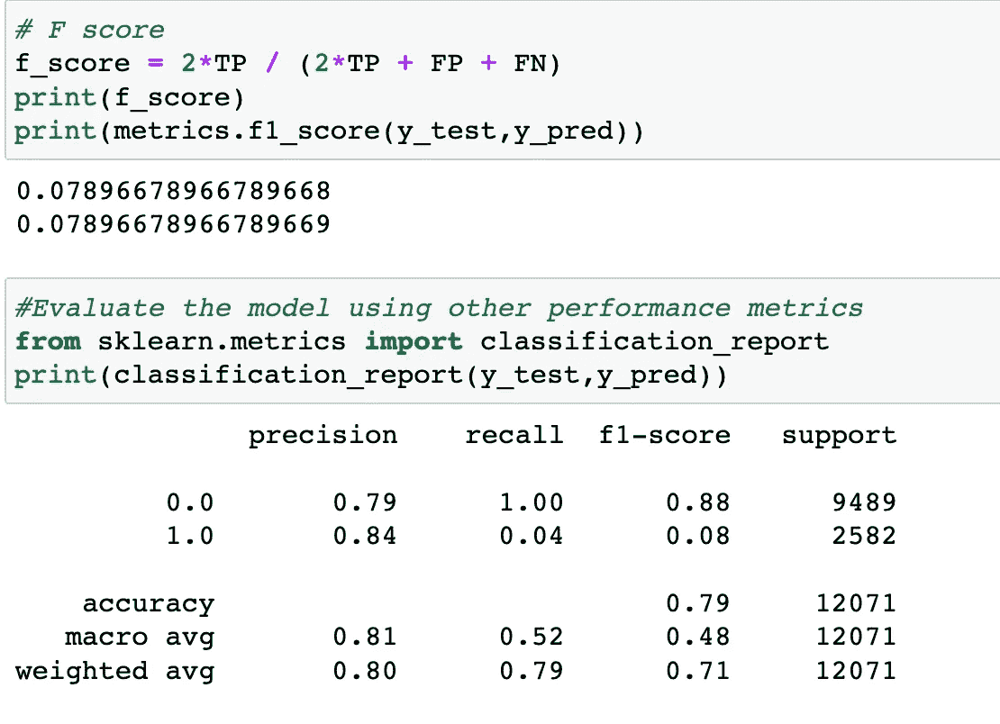

# 用 ROC 确定最佳概率临界值(阈值)

接收器操作特性( [ROC 曲线](https://en.wikipedia.org/wiki/Receiver_operating_characteristic))通常用于获得最佳概率阈值，以提高机器学习模型的预测能力。

有两种方法可以获得正类的最佳阈值:

1.  [尤登氏 J 统计](https://en.wikipedia.org/wiki/Youden%27s_J_statistic)
2.  [欧几里德距离](https://en.wikipedia.org/wiki/Euclidean_distance)

我将使用 Youden 的 J 统计量来获得代码示例中的最佳概率阈值:

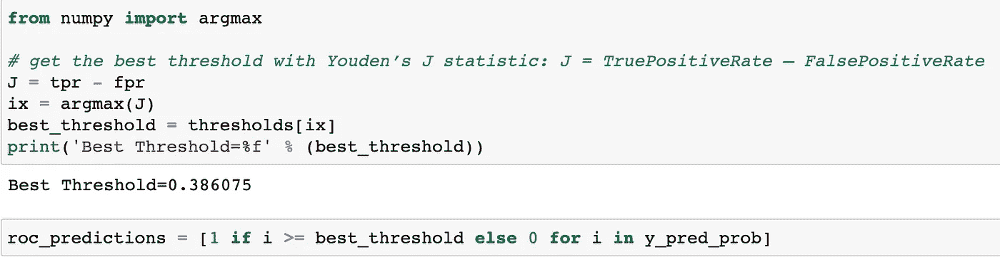

尤登 J 统计量


# 结论

哪个指标应该优化取决于**业务目标。**例如，在医疗诊断或欺诈交易检测器的情况下，灵敏度(召回)分数更重要，因为假阴性的成本比假阳性更不可接受。然而，当涉及到客户流失或 YouTube 推荐时，精确度或特异性更重要，因为假阴性比假阳性更容易接受。

希望有所帮助。感谢阅读！