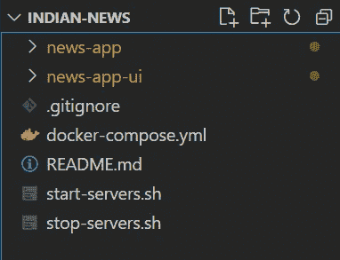
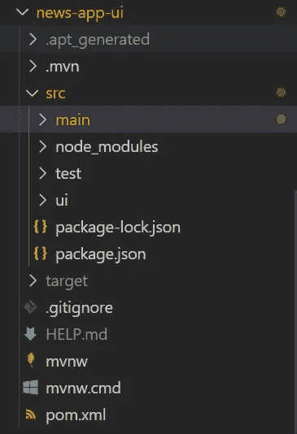
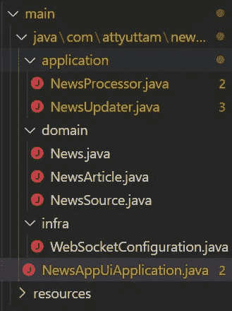
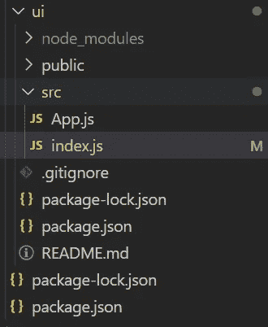
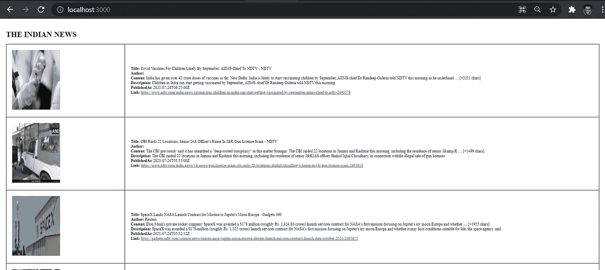

# 使用 Spring Cloud Stream 和 Web Sockets 的事件驱动微服务

> 原文：<https://medium.com/javarevisited/event-driven-microservices-using-spring-cloud-stream-and-web-sockets-e93fe5fbe7d4?source=collection_archive---------1----------------------->

第 2 部分:实现

[***转到第 1 部分***](https://attyuttam.medium.com/event-driven-microservices-using-spring-cloud-stream-and-web-sockets-ee7c8921aa4f)

我相信您已经有时间仔细阅读了我在这两篇文章的第 1 部分中谈到的概念，如果没有，请查看一下！所以，事不宜迟，让我们直接进入正题。

应用 ***Indian-news*** 有两个相互交互的微服务。其中一个是 ***news-app*** 微服务，作为后端，负责与第三方[*Google news API*](https://newsapi.org/s/india-news-api)对话，获取直播新闻并发送给前端微服务，即 ***news-app-ui*** 微服务。

此外，由于这是一个高级的 spring 主题，我假设您已经熟悉了 [Spring](/javarevisited/10-best-online-courses-to-learn-spring-framework-in-2020-f7f73599c2fd) 和 [Spring Boot](/javarevisited/10-free-spring-boot-tutorials-and-courses-for-java-developers-53dfe084587e) ，所以我将只讨论***Spring Cloud Stream***和 ***Web Sockets*** 的概念，以及它们如何使我们能够构建一个 ***事件驱动架构*** 。

让我们来看看微服务的工作原理。

# **开始前**

请确保您的系统中安装了以下应用程序:

1.  [Java 8](https://adoptopenjdk.net/)
2.  [Docker](https://docs.docker.com/docker-for-mac/install/) (我们将在本地运行 RabbitMQ 和 Kafka)
3.  [Git](https://git-scm.com/book/en/v2/Getting-Started-Installing-Git) (可选)
4.  [Bash](/javarevisited/6-free-courses-to-learn-bash-shell-scripting-in-linux-and-unix-a50461ecd4fe?source=---------6------------------) (假设，尽管替代方案也可行)
5.  [npm](https://javarevisited.blogspot.com/2018/01/top-5-nodejs-and-express-js-online-courses-for-web-developers.html) 运行 React 应用程序

# 项目结构

让我们检查一下项目结构



根项目结构

[](https://javarevisited.blogspot.com/2018/08/top-5-react-js-and-redux-courses-to-learn-online.html#axzz5r06B3egD)

新闻应用程序项目结构



新闻-应用程序-用户界面项目结构

现在，news-app-ui 微服务有了一个使用 [spring boot](/javarevisited/10-advanced-spring-boot-courses-for-experienced-java-developers-5e57606816bd?source=collection_home---4------0-----------------------) 构建的后端和一个提供简单用户界面的[前端](/javarevisited/6-best-frontend-development-courses-for-beginners-to-learn-in-2021-f2772157864)，为用户提供实时新闻更新。

让我们也看看这两个部分的项目结构。



新闻应用程序用户界面的后端项目结构



新闻应用用户界面的前端项目结构

是的，在用户界面方面没有什么，我只是想显示新闻，没有什么花哨的东西，但是你可以展开你的翅膀！

# 运行应用程序

## 1.首先，从 GitHub 克隆代码库。

```
git clone [https://github.com/Attyuttam/indian-news.git](https://github.com/Attyuttam/indian-news.git)
```

## 2.启动消息服务器

转到文件夹 ***印度新闻*** 并运行以下命令:

```
./start-servers.sh
```

## 3.获取 API 密钥并粘贴到 news-app 的 application.properties 文件中

使用您的 Gmail id 登录后，您可以从[谷歌新闻 API](https://newsapi.org/s/india-news-api) 获取您的 API 密钥。

获得 API 密钥后，只需用获得的 API 密钥替换下面提到的代码中的文本*您的 GOOGLE 新闻 API 密钥*。

## 4.运行新闻应用程序获取新闻更新

转到 ***news-app*** 文件夹，运行以下命令:

```
mvn clean package spring-boot:run -DskipTests=true
```

## 5.启动前端新闻-应用程序-用户界面

转到 ***news-app-ui*** 文件夹，运行以下命令:

```
mvn clean package spring-boot:run -DskipTests=true
```

然后进入***news-app-ui/main/ui***内部，运行以下命令:

```
npm start
```

请注意，如果您是第一次运行，我们必须确保安装所有必要的 npm 软件包。所以，在文件夹***news-app-ui/main/ui***中运行以下命令:

```
npm install
```

为了确保安装 stomp 包，使用以下命令:

```
npm i @stomp/stompjs
```

一旦你的应用程序开始运行，在你的网络浏览器中进入 [http://localhost:3000](http://localhost:3000) ，你可以看到这样的新闻:



印度新闻应用程序显示

## 6.停止应用程序

要停止服务器，仅仅关闭 bash 或键入 Ctrl+C 不起作用，您更愿意在根文件夹 ***indian-news*** 中运行以下命令:

```
./stop-servers.sh
```

# 新闻应用程序

这个微服务是使用 spring boot 构建的，并作为应用程序的后端，该应用程序负责从第三方[*Google news API*](https://newsapi.org/s/india-news-api)*获取实时新闻，然后将它们放在由[*Spring Cloud Stream*](https://spring.io/projects/spring-cloud-stream)促成的 [Kafka topic](/javarevisited/top-10-apache-kafka-online-training-courses-and-certifications-621f3c13b38c) 上。*

*新闻应用程序从第三方 API 读取实时新闻，通过点击他们的服务器每小时获取最新新闻，这确保了该应用程序的用户可以全天阅读实时新闻。*

*作为一名程序员，如果你认为 1 个小时太长了，你也可以把它改成秒数。*

# *新闻 app 是如何运作的？*

*让我们检查一下 pom.xml 文件中需要的依赖项*

*正如您所看到的，我们正在导入 *spring-cloud-stream* 依赖项，并且由于我们将只使用 [Kafka](https://javarevisited.blogspot.com/2018/04/top-5-apache-kafka-course-to-learn.html#axzz6kZHuJeAZ) 进行通信，我们将配置文件默认设置为 Kafka，因此导入*spring-cloud-stream-binder-Kafka*依赖项来执行 Kafka 主题上的所有操作。*

*对于 ***新闻-app*** [微服务](/javarevisited/7-free-microservices-courses-for-java-programmers-c9b2f3a2ea7d)，我们使用的是春云流 v2.1 — [春云功能支持](https://cloud.spring.io/spring-cloud-stream/reference/html/spring-cloud-stream.html#spring_cloud_function)。有了这个特性，让`NewsAppApplication`微服务充当`News`消息的来源所需要的就是声明一个`@Bean`，这个方法生成并返回一个`Supplier<>`。在这种情况下，它是一个`News`类型的`Supplier`。函数方法代码如下所示(您可以在`NewsProducer`组件中找到)*

*`Supplier<>`是 Java 函数数据类型。因为返回这个类型的`@Bean`方法只有一个， [***春云流***](/javarevisited/5-best-courses-to-learn-spring-cloud-and-microservices-1ddea1af7012) 完全知道下一步该怎么做。默认情况下，每秒触发一次该功能，并将结果发送到默认的`MessageChannel`名为 ***的输出。****

*我们可以显式地提到这个 bean 和`MessageChannel`(这里是它的`news_output`)，也可以像下面这样设置属性(我们的方法名是`supplyNews`):*

```
*spring.cloud.stream.function.bindings.supplyNews-out-0=news_output*
```

*您在`Supplier<>` 中看到的`googleNewsService`是负责调用第三方 [***Google 新闻 API 服务***](https://newsapi.org/s/india-news-api) 的*假扮客户端。**

**这种方法的好处在于它只包含业务逻辑，因此您可以使用常规的单元测试来测试它。同样，在这种方法中，你可以在把消息放到 Kafka 主题之前应用你的逻辑来玩消息，因此它也在把消息放到 Kafka 主题之前充当中介。**

**我们可以使用`application.properties`文件中的`spring.cloud.function.definition`属性来明确声明我们希望将哪个功能 bean 绑定到绑定目的地——但是对于只定义了单个`@Bean`的情况，这是没有必要的。**

**另外，由于默认的轮询间隔是一秒钟，但是我决定每小时轮询一次，所以我通过设置`application.properties`文件中的`spring.integration.poller.fixed-delay`属性将间隔设置为 1 小时。**

**这就是[***Spring Cloud Stream***](/hackernoon/top-5-spring-boot-and-spring-cloud-books-for-java-developers-75df155dcedc?source=---------23------------------)的神奇之处，它基本上从你那里提取了设置消息传递环境的考虑，现在你所关心的只是业务逻辑。**

**这里 可以看到 ***新闻 app*** 微服务 [*的完整代码。*](https://github.com/Attyuttam/indian-news/tree/master/news-app)**

# **新闻-应用程序-界面**

**该微服务的主要任务可分为两部分:**

*   **接收来自卡夫卡主题的数据**
*   **在用户界面上实时显示**

**在我们开始理解第一个任务之前，请确保 pom.xml 文件中也有相同的依赖项(版本可能不同):**

**让我们试着理解第一项任务。**

**现在，我们在第一个任务中需要关心的是确保我们正确地从 ***新闻应用*** 接收事件。为此，我们设立了一个`SubscribableChannel`，负责从源头接收事件。我们是这样做的:**

**但是现在你想到的一个相关问题是，应用程序如何知道这个组件负责提供通道来监听即将发生的事件。好了，注解***@ enable binding***来帮我们了。**

**这个`NewsProcessor`接口首先在`@SpringBootApplication`类(`NewsAppUiApplication.java`)中被引用，作为`@EnableBinding()`注释的参数，如下所示。**

**现在，一旦设置了通道，我们还设置了另一个名为`NewsUpdater`的组件，它包含方法`updateNews()`，每当有`News`事件出现在主题上时，就会自动调用该方法。它之所以能够做到这一点，是因为在方法的顶部为`NewsProcessor.NEWS_OUTPUT`添加了`@StreamListener`注释。让我们在代码中看到它:**

**现在，为了理解`updateNews()`做什么，我们将不得不跳到 ***news-app-ui*** 微服务做的下一个任务，即将新闻数据实时呈现到 ui 上。为了理解这一点，我们必须理解股票，所以查看这个两部分系列的第 1 部分和第 34 部分**来更好地了解什么是 web 套接字。****

**让我们看看，我们如何在 [Spring Boot](/javarevisited/7-best-webflux-and-reactive-spring-boot-courses-for-java-programmers-33b7c6fa8995) 和 [ReactJS](/javarevisited/top-10-free-courses-to-learn-react-js-c14edbd3b35f) 中设置 Web Socket。**

**因为您已经确保了 news-app-ui 的 pom.xml 文件对您来说也是相同的，所以我将不深究细节，只是为了再次检查，请确保您有以下两个依赖项:**

**现在，让我们创建 Web 套接字配置。**

**在上面的类中，通过扩展`WebSocketMessageBrokerConfigurer`，我们确保在类`WebSocketConfiguration`中有两个可用的方法`configureMessageBroker()`和`registerStompEndpoints()`。**

**`configureMessageBroker()`首先调用`enableSimpleBroker()` 方法，该方法创建一个基于内存的消息代理，将消息数据传送到以 ***/topic*** 为前缀的目的地。它的另一个任务是使用`setApplicationDestinationPrefixes()`添加前缀 ***/app*** ，以便服务器可以从客户端接收消息，但是在我们的例子中，我们可以删除它，因为我们不会从客户端接收任何数据。**

**在方法`registerStompEndpoints()`中，`addEndpoint()`负责在给定映射路径的 WebSocket 端点上注册 STOMP 端点 ***/ws-message*** 。**

**那么，这就完成了后端部分，现在我们将配置前端，使其具有 web 套接字，以确保接收到新闻更新并将其显示在屏幕上，而无需任何刷新。**

**这就是创建的基本 UI。**

# **使用 Docker 设置消息服务器**

**好了，现在消息服务器已经准备好了，我们需要做的就是设置消息服务器，这样消息就可以在两个[微服务](/javarevisited/10-best-java-microservices-courses-with-spring-boot-and-spring-cloud-6d04556bdfed?source=rss-bb36d8439904------2&utm_source=dlvr.it&utm_medium=linkedin)之间通过 Kafka 主题很好地交换了。这是***docker-compose . yml***文件，一旦运行 ***就会被执行。/start-servers.sh*****

**如您所见，创建了三个服务:**

1.  *****Kafdrop***:Kafdrop 是一个用于查看 Kafka 话题和浏览消费群体的 web UI*。*该工具显示代理、主题、分区、消费者等信息，并允许您查看消息。**
2.  *****Zookeeper*** : Kafka 使用 Zookeeper 为组成集群的 Kafka 代理管理服务发现。Zookeeper 基本上管理集群中的整体控制器状态。它充当配置存储库，维护集群元数据，还实现集群的实际机制。**
3.  *****卡夫卡*** :这实质上是卡夫卡集群被创建。Kafka 集群包含 Kafka 经纪人，他们负责 Kafka 生产者和消费者之间的数据交换。**

**因此，当所有这些都设置好后，我们就有了一个 Kafka 集群，它将侦听消息并将它们传输到各自的客户端。**

**因此，当您启动服务器时，Kafdrop 会显示所有已注册主题的图片。而且你已经启动了 ***新闻-app*** 微服务就可以看到题目`news_output`。**

**嗯，这就是 ***春云流水*** 发挥的魔力。在任一微服务的代码中，没有一行特定于消息代理的代码(Apache Kafka/ Rabbit MQ/ Active MQ 等),但是由于`spring-cloud-stream-binder-kafka`的依赖性，微服务已经能够与消息代理无缝交互，这使得对服务进行单元测试变得更加容易，并且如果需要，还可以在不对代码进行任何更改的情况下更改消息代理。**

**只需转到`http://localhost:9000`，您将能够看到这个 UI 显示注册了主题的 Apache Kafka 集群。**

****

# **结论**

**至此，我们完成了两部分系列的第二部分，我希望您能够成功地创建事件驱动的微服务并运行它们。您可以做的另一件事是使用 SockJs 注册 STOMP 端点，这可能是一个有趣的实践。如果您有任何问题，或者您有更好的实现方法，请发表评论！感谢阅读！**