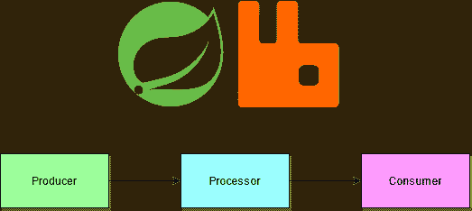
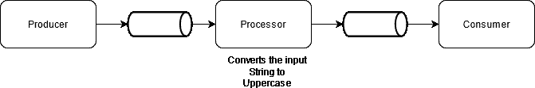

# 使用 Spring Cloud Stream 和 RabbitMQ 的事件驱动微服务

> 原文：<https://medium.com/javarevisited/event-driven-microservices-with-spring-cloud-stream-and-rabbitmq-add4166fe223?source=collection_archive---------0----------------------->

基于 REST 的应用程序主宰了微服务的世界。当我们谈论微服务时，一个自然的假设是一组单独的服务通过 HTTP(S) REST 相互通信。但是事件驱动的微服务在任何基于云的现代架构中都扮演着重要而关键的角色。

使用事件来传递应用程序状态或数据并不是一个新概念。几十年来，组织一直在使用像 IBM MQ 这样的消息传递系统。但是这些都是重量级的、商业的，并且需要专门的基础设施来维护。

随着 AMQP 协议和它的几个开源实现的引入，事件的使用变得容易采用了。

在事件驱动架构中，应用程序通过发送和/或接收事件或消息来相互通信。这些可以只包含关于状态/状态变化的元数据或主体中的实际内容本身。通信可以是点对点或发布-订阅。

## 春云流

[春云流](https://spring.io/projects/spring-cloud-stream)是春云生态系统内的一个项目。它是一个框架，提供了一个基于 Spring 的编程模型，并在消息中间件之上添加了一个抽象层。

它使 Spring 应用程序能够无缝地连接到底层基础设施，而不用担心样板代码。 [Spring](/javarevisited/10-best-spring-framework-books-for-java-developers-360284c37036) (VMWare)维护 RabbitMQ、 [Kafka](/javarevisited/top-10-apache-kafka-online-training-courses-and-certifications-621f3c13b38c) 、Kafka Streams 和 Amazon Kinesis 的绑定器实现，而 Google PubSub、Azure EventHub、Apache RocketMQ 和 Solace PubSub 绑定器由相应的组织维护。

春云流有两种不同的用途

*   使用 [Spring Cloud 数据流](https://spring.io/projects/spring-cloud-dataflow)创建流数据管道
*   使用点对点或发布-订阅模型创建事件驱动的微服务

本文解释了后者——用 RabbitMQ 使用 Spring Cloud Stream 开发[事件驱动的微服务](/javarevisited/10-best-java-microservices-courses-with-spring-boot-and-spring-cloud-6d04556bdfed)。

[](https://www.java67.com/2021/04/5-free-microservice-courses-for-java.html)

春天的云流和兔子

## 兔子 q

RabbitMQ 是一个广受欢迎的消息平台。它有开源版和商业版。它是轻量级的，可以很容易地部署在笔记本电脑上；直接或使用 Docker

**使用 Docker 图像:**

RabbitMQ 可以使用下面的 docker 命令安装。它将从 [docker hub](https://hub.docker.com/_/rabbitmq) 安装最新版本，前提是你已经登录了 docker hub。

```
docker pull rabbitmq
```

*运行容器时，不要运行 rabbitmq 容器，因为它不提供任何 GUI 来浏览交换和队列*

使用下面的命令运行管理插件。它将启动一个带有管理 GUI 的 rabbitmq 容器。

```
docker run -d --hostname my-rabbit --name some-rabbit rabbitmq:3-management
```

可以使用默认凭证为`guest`的[http://localhost:15672/](http://localhost:15672/)来访问 UI。

## 微服务

让我们来看看 3 种简单的微服务——生产者、处理器和消费者。生产者将通过一个 [REST 端点](https://javarevisited.blogspot.com/2018/02/top-20-spring-rest-interview-questions-answers-java.html)接受一个字符串，并向 RabbitMQ 主题发布一条消息。处理器将订阅主题，将字符串转换为大写并发布到输出主题。消费者将订阅主题并在控制台中打印值。这 3 个服务将展示 Spring Cloud Stream 中的源-处理器-接收器概念。



春天的云流和兔子

随着[功能编程](/javarevisited/6-best-online-courses-to-learn-functional-programming-in-java-for-beginners-1dab627b63ca)的引入，源、处理器和接收器的设置变得更加容易。在本文中，我们将使用函数式编程。

所有 3 个服务的最终代码都可以在 [Git repo](https://github.com/smoothed9/spring-cloud-stream-rabbit) 中找到。

> 由于 RabbitMQ 将一个主题表示为一个交换和一个或多个绑定到该交换的队列，所以本文中可以互换使用 world 主题和交换

## 生产者

所有 3 个服务都需要来自 [start.spring.io](https://start.spring.io/) 的`Cloud Stream`、`Spring for RabbitMQ` 和`lombok`依赖项。因为生产者将通过 REST 端点接受请求，所以它也需要`Web`依赖。这在春云流中被称为`Source` a 服务。

创建一个简单的[控制器](/javarevisited/21-spring-mvc-rest-interview-questions-answers-for-beginners-and-experienced-developers-21ad3d4c9b82)，它接受一个字符串并将其发送给一个主题。

```
import lombok.extern.slf4j.Slf4j;
import org.springframework.cloud.stream.function.StreamBridge;
import org.springframework.http.ResponseEntity;
import org.springframework.web.bind.annotation.GetMapping;
import org.springframework.web.bind.annotation.PathVariable;
import org.springframework.web.bind.annotation.RestController;

@Slf4j
@RestController
public class ValueController {

    private StreamBridge streamBridge;

    public ValueController(StreamBridge streamBridge) {
        this.streamBridge = streamBridge;
    }

    @GetMapping("values/{value}")
    public ResponseEntity<String> values(@PathVariable String value) {
        *log*.info("Sending value {} to topic", value);
        streamBridge.send("values-topic", value);
        return ResponseEntity.*ok*("ok");
    }
}
```

如您所见，Producer 微服务中没有任何代码或配置将其链接到 RabbitMQ。在依赖项中添加 RabbitMQ 绑定器为我们完成了所有的绑定。这使得切换底层消息传递提供者变得非常容易。

## 处理器

处理器是纯[春云流](/javarevisited/5-best-courses-to-learn-spring-cloud-and-microservices-1ddea1af7012)应用。它不断地监听一个主题，并在接收到一条消息后，对其进行处理并发布到一个输出主题。因此，该服务只需要`Cloud Stream`和`Spring for RabbitMQ`依赖项。

添加一个组件类来处理消息。

```
import lombok.extern.slf4j.Slf4j;
import org.springframework.context.annotation.Bean;
import org.springframework.stereotype.Component;

import java.util.function.Function;

@Slf4j
@Component
public class ValueProcessor {

    @Bean
    public Function<String, String> convertToUppercase() {
        return (value) -> {
            *log*.info("Received {}", value);
            String upperCaseValue = value.toUpperCase();
            *log*.info("Sending {}", upperCaseValue);
            return upperCaseValue;
        };
    }
}
```

处理器被表示为一个`java.util.Function`，它接受一个字符串并以一个字符串作为响应。[功能编程](/javarevisited/8-best-lambdas-stream-and-functional-programming-courses-for-java-developers-3d1836a97a1d)无需任何配置。

当应用程序启动时，Spring 会自动创建一个输入主题，并将这个方法注册为一个监听器。收到消息后，代码会将输入转换为大写，并将其发送到输出主题。 [Spring](/javarevisited/3-best-spring-professionals-certification-books-and-courses-for-java-developers-935296c3709) 也会自动创建一个输出主题。

但是这些主题是用默认的命名标准创建的。它们被创建为`javaMethodName-in-<index>`和`javaMethodName-out-<index>`，其中`index`对应于应用实例的索引。

因此，当这个应用程序在本地运行时，交换将被创建为`convertToUppercase-in-0`和`convertToUppercase-out-0`。但是生产者微服务将该事件发布到名为`values-topic`的交易所。因此，除非我们覆盖由 Spring 创建的默认交换名称，否则由生产者发送的消息将不会被处理器读取，因为它们将发送和监听不同的交换。

使用以下配置将处理器映射到`value-topic`

```
spring:
  cloud:
    stream:
      bindings:
        convertToUppercase-in-0:
          destination: values-topic
          group: processor
        convertToUppercase-out-0:
          destination: uppercase-values-topic
```

添加`group`是可选的，但是它将创建一个消费者组和一个持久队列。离开`group`将导致创建一个匿名队列，当应用程序停止时，这个队列将被销毁。消费者组也有助于高可用性和负载平衡，但是由于这是一个只有一个实例的示例应用程序，添加`group`的主要原因是为了避免创建匿名队列。

输出交换/主题名称也在同一个 yml 中定义。下一个服务(消费者)必须侦听这个交换来读取消息。

## 消费者

消费者的依赖关系列表与处理器相同。它是一个终端服务，在[春云流](/hackernoon/top-5-spring-boot-and-spring-cloud-books-for-java-developers-75df155dcedc?source=---------23------------------)中被称为`Sink`。

```
import lombok.extern.slf4j.Slf4j;
import org.springframework.context.annotation.Bean;
import org.springframework.stereotype.Component;

import java.util.function.Consumer;

@Slf4j
@Component
public class ValuesConsumer {

    @Bean
    public Consumer<String> onReceive() {
        return (message) -> {
          *log*.info("Received the value {} in Consumer", message);
        };
    }
}
```

如上所述，`Sink`服务是通过创建一个充当接收者的 bean】来定义的。因为这使用了 [Functional programmin](https://javarevisited.blogspot.com/2020/04/top-5-courses-to-learn-functional-programming-in-java-with-lambda-and-stream.html) g，所以默认绑定是用方法名创建的，如处理器部分所述。为了使用处理器发送给`uppercase-topic`的消息，需要添加一个配置。

```
spring:
  cloud:
    stream:
      bindings:
        onReceive-in-0:
          destination: uppercase-values-topic
          group: consumer
```

这样，我们就创建了一个功能齐全的春季云流。最终代码在 [Git](https://github.com/smoothed9/spring-cloud-stream-rabbit) 中。让我们测试一下，看看它的表现如何。

# 测试

启动所有 3 项服务。通过传递小写字符串来调用生产者。例如，`[http://localhost:8080/values/hello](http://localhost:8080/values/hello)`

由于这些是异步的流应用程序，浏览器中的响应仅指示来自生成器的成功。处理器的日志应该显示以下消息

```
Received hello
Sending HELLO
```

消费者的日志应该显示以下消息

```
Received the value HELLO in Consumer
```

这表明 URL 中给出的输入字符串按预期通过了所有 3 个服务。

# 结论

使用 Spring Cloud Stream 开发事件驱动的微服务简单易行。由于对函数式编程的支持，这可以用非常少的代码和配置来完成。

从上面的微服务中可以明显看出，Spring Cloud Stream 避免了对任何样板代码的需求，并消除了代码或配置中对特定消息中间件实现的任何依赖。

将 RabbitMQ 更改为另一个实现，如 Azure ServiceBus 或 EventHub，就像更改 [Gradle](/javarevisited/5-best-gradle-courses-and-books-to-learn-in-2021-93f49ce8ff8e) 依赖关系一样简单。这有助于团队将其内部事件驱动的微服务迁移到任何公共云中，而无需进行任何代码或配置更改。我将在随后的文章中讨论这个问题。