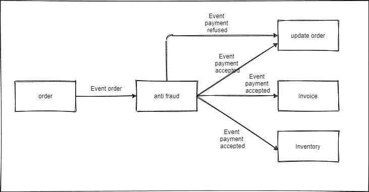

# 事件、咖啡和软件架构

> 原文：<https://medium.com/javarevisited/events-coffee-and-software-architecture-25eb81ac3e68?source=collection_archive---------3----------------------->

你好，我决定写这篇文章是为了整理我在处理微服务事件、队列和主题时学到的一些概念。这些概念帮助我理解了一点我所涉及的背景，并能够实际工作。

如果对某个人有帮助，我会很开心。

## 但首先，什么是事件？

事件可以理解为由于某个实体的状态发生变化而在应用程序内部触发的触发器。

该实体可能已被创建、更改、删除等。如果打开此示例:

"我拿到工资后，就去海滩。"

这里发生了什么事？

如果你问任何人，这件事就是去那个海滩旅行。但是如果你问任何一个开发者，他会说这个事件就是工资收据。

把它带到大多数人都在使用的现有业务类型:网上购物。

假设启动了“付款批准”事件，由于该事件，可以执行其他操作。例如:分类库存商品，生成发票和更新订单状态。

这里的主要任务是通知由 x 个[微服务](/javarevisited/8-best-online-courses-to-learn-service-oriented-soa-and-microservices-architecture-94c01d6b94e6)组成的整个系统，某个事件已经发生，以便可以采取其他行动来响应它。

一旦定义了事件的概念，就该考虑面向事件的架构了。

## 面向事件的架构

> “面向事件的架构是一种用于应用程序设计的[软件架构](/javarevisited/top-5-courses-to-learn-software-architecture-in-2020-best-of-lot-5d34ebc52e9)模型。在事件驱动的系统中，事件捕获、通信、处理和持久性组件构成了解决方案的基本结构。这与传统的请求驱动模式不同。”*[*摘自红帽网站，链接*](https://www.redhat.com/pt-br/topics/integration/what-is-event-driven-architecture)*

**这种类型的架构有一些优点，例如:**

*   **系统组件之间的松散耦合，因为事件的生产者不关心谁在期待该事件。**
*   **它可以在任何[编程语言](/javarevisited/5-best-programming-languages-to-get-a-sofware-developer-job-in-google-3d8c83c444d6?source=---------17------------------)中使用；**
*   **更强的抗破损能力。由于每个组件都有其运行所需的一切，因此即使与外界的通信中断，它也可以继续运行；**
*   **新服务可以添加到解决方案中，而不需要现有服务知道它们，只需要新服务知道正在广播的事件。**

**在有一些[微服务](/javarevisited/7-free-microservices-courses-for-java-programmers-c9b2f3a2ea7d)的环境中，我们可以有一个类似这样的设计:**

****

**这是一个粗略的草案，没有详细说明这些事件的产生和接收在实践中是如何工作的。**

**这个架构的理想是使用中间件，在这个例子中，我将使用[卡夫卡](/javarevisited/top-10-apache-kafka-online-training-courses-and-certifications-621f3c13b38c)。**

**当我放入一个中间件时，这种设计稍有改变，您可以看到耦合度有多低，此外还可以意识到，由于这一特性，可以将新系统放入解决方案中而影响很小，如果您打开:**

****

## **有趣的事情:**

*   **这不是一个完整的流程，只是一部分。但是它已经可以给你一个主题的好主意；**
*   **如果需要执行反欺诈流程之外的一些事情，只需创建[微服务](/javarevisited/10-best-java-microservices-courses-with-spring-boot-and-spring-cloud-6d04556bdfed)并监听事件。没有必要在创建购买事件的服务中做任何事情；**
*   **服务之间的耦合性非常低，能够同时在多个服务中生成维护的少数几件事情之一是表示所创建事件的消息格式；**
*   **如果幂等性使用得好，应该没有重复的风险，因为事件消费者将准备好处理任何重复；**

## **可能发生的问题:**

*   **重复事件处理。想象一下向同一个客户收费两次？幂等性在这方面对我们帮助很大。**
*   **事件级联(更容易谷歌事件级联)。当一系列事件触发其他事件形成连接时，就会发生这种情况，这种连接可以用一种简单的方式来表示:事件 A →生成事件 B →生成事件 C →生成事件 d。理解一个事件可能是另一个事件的结果是可以的，但想象一下，一些程序员只处理事件 C 的消费，这里的大问题是他必须关心事件 A 的生成，这是不好的，因为它可能会生成不可预见的行为。理想的情况是确保服务是独立的，只有当您必须对与某个实体相关的某个事件的发布做出反应时，才更改该实体；**

## **要避免的要点:**

*   **尽可能避免使用通用事件。我们处理的实体必须在业务环境中有明确定义的含义。把解读类型当成消费者的责任，将来会产生很多令人头疼的问题；**
*   **期待消费者的回应；**
*   **停止使用标题。报头携带用于事件处理的宝贵信息，例如事件类型、id、相关 id、时间戳等；
    忘记实现幂等；**
*   **还有其他几点，现在只记得这些了。**